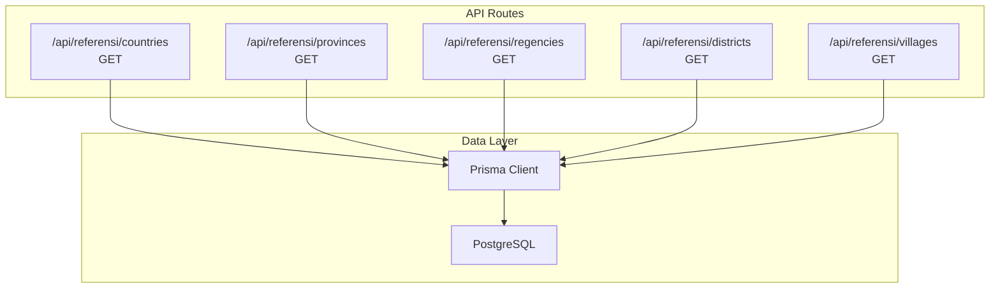
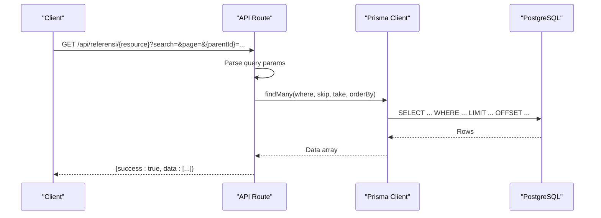
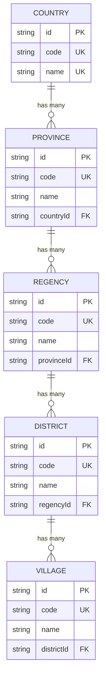
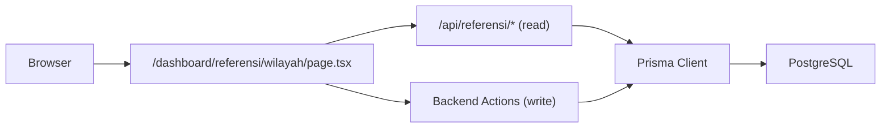

# API Endpoints

<cite>
**Referenced Files in This Document**
- [route.ts](file://src/app/api/referensi/countries/route.ts)
- [route.ts](file://src/app/api/referensi/provinces/route.ts)
- [route.ts](file://src/app/api/referensi/regencies/route.ts)
- [route.ts](file://src/app/api/referensi/districts/route.ts)
- [route.ts](file://src/app/api/referensi/villages/route.ts)
- [schema.prisma](file://prisma/schema.prisma)
- [auth.ts](file://src/lib/auth.ts)
- [permissions.ts](file://src/lib/permissions.ts)
- [seed.ts](file://prisma/seed.ts)
- [page.tsx](file://src/app/dashboard/referensi/wilayah/page.tsx)
- [WilayahClient.tsx](file://src/components/dashboard/referensi/wilayah/WilayahClient.tsx)
- [next.config.ts](file://next.config.ts)
</cite>

## Table of Contents
1. [Introduction](#introduction)
2. [Project Structure](#project-structure)
3. [Core Components](#core-components)
4. [Architecture Overview](#architecture-overview)
5. [Detailed Component Analysis](#detailed-component-analysis)
6. [Dependency Analysis](#dependency-analysis)
7. [Performance Considerations](#performance-considerations)
8. [Troubleshooting Guide](#troubleshooting-guide)
9. [Conclusion](#conclusion)

## Introduction
This document describes the geographic reference endpoints used to fetch hierarchical administrative regions (countries, provinces, regencies, districts, and villages). It covers HTTP methods, URL patterns, query parameters, response formats, authentication and permissions, error handling, and operational considerations such as pagination and caching.

## Project Structure
The geographic reference endpoints are implemented as Next.js App Router API routes under the namespace `/api/referensi/{resource}`. Each resource endpoint supports server-side search and pagination and returns a standardized JSON envelope.

**Diagram sources**
- [route.ts:1-29](file://src/app/api/referensi/countries/route.ts#L1-L29)
- [route.ts:1-32](file://src/app/api/referensi/provinces/route.ts#L1-L32)
- [route.ts:1-32](file://src/app/api/referensi/regencies/route.ts#L1-L32)
- [route.ts:1-32](file://src/app/api/referensi/districts/route.ts#L1-L32)
- [route.ts:1-32](file://src/app/api/referensi/villages/route.ts#L1-L32)

**Section sources**
- [route.ts:1-29](file://src/app/api/referensi/countries/route.ts#L1-L29)
- [route.ts:1-32](file://src/app/api/referensi/provinces/route.ts#L1-L32)
- [route.ts:1-32](file://src/app/api/referensi/regencies/route.ts#L1-L32)
- [route.ts:1-32](file://src/app/api/referensi/districts/route.ts#L1-L32)
- [route.ts:1-32](file://src/app/api/referensi/villages/route.ts#L1-L32)

## Core Components
- Countries endpoint: retrieves countries with optional search and pagination.
- Provinces endpoint: retrieves provinces optionally filtered by country ID.
- Regencies endpoint: retrieves regencies optionally filtered by province ID.
- Districts endpoint: retrieves districts optionally filtered by regency ID.
- Villages endpoint: retrieves villages optionally filtered by district ID.

All endpoints support:
- Query parameters: search, page, and resource-specific parent filters.
- Standardized JSON response envelope with success flag and data array.
- Consistent error handling returning a JSON object with success=false and error message.

**Section sources**
- [route.ts:5-28](file://src/app/api/referensi/countries/route.ts#L5-L28)
- [route.ts:5-31](file://src/app/api/referensi/provinces/route.ts#L5-L31)
- [route.ts:5-31](file://src/app/api/referensi/regencies/route.ts#L5-L31)
- [route.ts:5-31](file://src/app/api/referensi/districts/route.ts#L5-L31)
- [route.ts:5-31](file://src/app/api/referensi/villages/route.ts#L5-L31)

## Architecture Overview
The endpoints are thin API handlers that translate query parameters into Prisma queries, apply pagination, and return a uniform response envelope. Authentication and permissions are enforced via NextAuth and permission checks.

**Diagram sources**
- [route.ts:5-28](file://src/app/api/referensi/countries/route.ts#L5-L28)
- [route.ts:5-31](file://src/app/api/referensi/provinces/route.ts#L5-L31)
- [route.ts:5-31](file://src/app/api/referensi/regencies/route.ts#L5-L31)
- [route.ts:5-31](file://src/app/api/referensi/districts/route.ts#L5-L31)
- [route.ts:5-31](file://src/app/api/referensi/villages/route.ts#L5-L31)

## Detailed Component Analysis

### Countries Endpoint
- Method: GET
- URL: `/api/referensi/countries`
- Query parameters:
  - search: free-text search across name and code (case-insensitive substring match)
  - page: integer page number (default 1)
- Filtering: none (returns all countries)
- Sorting: ascending by name
- Pagination: fixed page size (not exposed as a parameter)
- Response envelope:
  - success: boolean
  - data: array of country objects
- Country object fields:
  - id: string
  - code: string (unique)
  - name: string (unique)

Example request:
- GET /api/referensi/countries?page=1&search=jawa

Common responses:
- 200 OK with success=true and data array
- 500 Internal Server Error with success=false and error message

Notes:
- No explicit authentication requirement is enforced in the route handler.
- The frontend dashboard enforces permission "wilayah.view" before rendering.

**Section sources**
- [route.ts:5-28](file://src/app/api/referensi/countries/route.ts#L5-L28)
- [schema.prisma:380-390](file://prisma/schema.prisma#L380-L390)

### Provinces Endpoint
- Method: GET
- URL: `/api/referensi/provinces`
- Query parameters:
  - search: free-text search across name and code
  - page: integer page number (default 1)
  - countryId: filter provinces by parent country ID
- Filtering: optional countryId
- Sorting: ascending by name
- Pagination: fixed page size
- Response envelope:
  - success: boolean
  - data: array of province objects
- Province object fields:
  - id: string
  - code: string (unique)
  - name: string
  - countryId: string (parent)
  - country: { name: string } (included when requested by backend actions)

Example request:
- GET /api/referensi/provinces?page=1&search=jabotabek&countryId=123

Common responses:
- 200 OK with success=true and data array
- 500 Internal Server Error with success=false and error message

Notes:
- No explicit authentication requirement is enforced in the route handler.
- The frontend dashboard enforces permission "wilayah.view" before rendering.

**Section sources**
- [route.ts:5-31](file://src/app/api/referensi/provinces/route.ts#L5-L31)
- [schema.prisma:392-406](file://prisma/schema.prisma#L392-L406)

### Regencies Endpoint
- Method: GET
- URL: `/api/referensi/regencies`
- Query parameters:
  - search: free-text search across name and code
  - page: integer page number (default 1)
  - provinceId: filter regencies by parent province ID
- Filtering: optional provinceId
- Sorting: ascending by name
- Pagination: fixed page size
- Response envelope:
  - success: boolean
  - data: array of regency objects
- Regency object fields:
  - id: string
  - code: string (unique)
  - name: string
  - provinceId: string (parent)
  - province: { name: string } (included when requested by backend actions)

Example request:
- GET /api/referensi/regencies?page=1&search=bandung&provinceId=456

Common responses:
- 200 OK with success=true and data array
- 500 Internal Server Error with success=false and error message

Notes:
- No explicit authentication requirement is enforced in the route handler.
- The frontend dashboard enforces permission "wilayah.view" before rendering.

**Section sources**
- [route.ts:5-31](file://src/app/api/referensi/regencies/route.ts#L5-L31)
- [schema.prisma:408-422](file://prisma/schema.prisma#L408-L422)

### Districts Endpoint
- Method: GET
- URL: `/api/referensi/districts`
- Query parameters:
  - search: free-text search across name and code
  - page: integer page number (default 1)
  - regencyId: filter districts by parent regency ID
- Filtering: optional regencyId
- Sorting: ascending by name
- Pagination: fixed page size
- Response envelope:
  - success: boolean
  - data: array of district objects
- District object fields:
  - id: string
  - code: string (unique)
  - name: string
  - regencyId: string (parent)
  - regency: { name: string } (included when requested by backend actions)

Example request:
- GET /api/referensi/districts?page=1&search=pasar%20baru&regencyId=789

Common responses:
- 200 OK with success=true and data array
- 500 Internal Server Error with success=false and error message

Notes:
- No explicit authentication requirement is enforced in the route handler.
- The frontend dashboard enforces permission "wilayah.view" before rendering.

**Section sources**
- [route.ts:5-31](file://src/app/api/referensi/districts/route.ts#L5-L31)
- [schema.prisma:424-438](file://prisma/schema.prisma#L424-L438)

### Villages Endpoint
- Method: GET
- URL: `/api/referensi/villages`
- Query parameters:
  - search: free-text search across name and code
  - page: integer page number (default 1)
  - districtId: filter villages by parent district ID
- Filtering: optional districtId
- Sorting: ascending by name
- Pagination: fixed page size
- Response envelope:
  - success: boolean
  - data: array of village objects
- Village object fields:
  - id: string
  - code: string (unique)
  - name: string
  - districtId: string (parent)
  - district: { name: string } (included when requested by backend actions)

Example request:
- GET /api/referensi/villages?page=1&search=kemayoran&districtId=101

Common responses:
- 200 OK with success=true and data array
- 500 Internal Server Error with success=false and error message

Notes:
- No explicit authentication requirement is enforced in the route handler.
- The frontend dashboard enforces permission "wilayah.view" before rendering.

**Section sources**
- [route.ts:5-31](file://src/app/api/referensi/villages/route.ts#L5-L31)
- [schema.prisma:440-453](file://prisma/schema.prisma#L440-L453)

### Authentication and Permissions
- Authentication: The API routes themselves do not enforce authentication. Authentication and session management are handled by NextAuth.
- Authorization: The frontend dashboard enforces permission "wilayah.view" before accessing the geographic reference UI and data. The backend actions for write operations require "wilayah.create", "wilayah.update", and "wilayah.delete".
- Permission codes are seeded in the database and associated with roles.

Key permission codes:
- "wilayah.view"
- "wilayah.create"
- "wilayah.update"
- "wilayah.delete"

**Section sources**
- [auth.ts:1-81](file://src/lib/auth.ts#L1-L81)
- [permissions.ts:1-21](file://src/lib/permissions.ts#L1-L21)
- [seed.ts:67-70](file://prisma/seed.ts#L67-L70)
- [page.tsx:15-21](file://src/app/dashboard/referensi/wilayah/page.tsx#L15-L21)

### Data Models and Hierarchies
The geographic hierarchy is modeled with foreign keys and unique constraints to ensure referential integrity.

**Diagram sources**
- [schema.prisma:380-453](file://prisma/schema.prisma#L380-L453)

## Dependency Analysis
- API routes depend on Prisma client for database queries.
- Frontend dashboard depends on NextAuth session and permission checks.
- Backend actions enforce stricter permissions for write operations.

**Diagram sources**
- [page.tsx:1-108](file://src/app/dashboard/referensi/wilayah/page.tsx#L1-L108)
- [WilayahClient.tsx:1-533](file://src/components/dashboard/referensi/wilayah/WilayahClient.tsx#L1-L533)
- [route.ts:1-29](file://src/app/api/referensi/countries/route.ts#L1-L29)

**Section sources**
- [page.tsx:1-108](file://src/app/dashboard/referensi/wilayah/page.tsx#L1-L108)
- [WilayahClient.tsx:1-533](file://src/components/dashboard/referensi/wilayah/WilayahClient.tsx#L1-L533)
- [route.ts:1-29](file://src/app/api/referensi/countries/route.ts#L1-L29)

## Performance Considerations
- Pagination: All endpoints use server-side pagination with a fixed page size. Clients should use the page parameter to navigate large datasets.
- Indexing: Prisma schema defines indexes on name and parent foreign keys to optimize lookups.
- Caching: Next.js experimental stale times are configured for dynamic routes, which can help reduce cold starts and improve responsiveness for frequently accessed endpoints.
- Recommendations:
  - Prefer filtering by parent IDs to reduce dataset sizes.
  - Use search parameter judiciously; long searches may still scan indexed columns.
  - Consider client-side caching for repeated queries within a session.

**Section sources**
- [route.ts:8-11](file://src/app/api/referensi/countries/route.ts#L8-L11)
- [schema.prisma:389-452](file://prisma/schema.prisma#L389-L452)
- [next.config.ts:6-11](file://next.config.ts#L6-L11)

## Troubleshooting Guide
Common issues and resolutions:
- Authentication failure:
  - Symptom: 401 Unauthorized or redirect to login.
  - Cause: Missing or invalid NextAuth session.
  - Resolution: Ensure the user is logged in and the session is valid.
- Permission denied:
  - Symptom: 403 Forbidden or redirect to forbidden page.
  - Cause: Missing "wilayah.view" permission for read endpoints or missing write permissions for backend actions.
  - Resolution: Assign appropriate permission codes to the user's role.
- Invalid query parameters:
  - Symptom: Unexpected empty results or errors.
  - Cause: Using non-existent parent IDs or malformed search terms.
  - Resolution: Verify parent IDs exist and use supported filters.
- Database errors:
  - Symptom: 500 Internal Server Error with error message.
  - Cause: Database connectivity or query failures.
  - Resolution: Check server logs and database health.

**Section sources**
- [permissions.ts:11-16](file://src/lib/permissions.ts#L11-L16)
- [seed.ts:67-70](file://prisma/seed.ts#L67-L70)
- [route.ts:24-27](file://src/app/api/referensi/countries/route.ts#L24-L27)

## Conclusion
The geographic reference endpoints provide a consistent, paginated, and filterable interface for hierarchical administrative regions. They are designed for read-heavy workloads with server-side search and rely on NextAuth and permission codes for access control. Proper use of parent filters and pagination ensures efficient queries against the database.