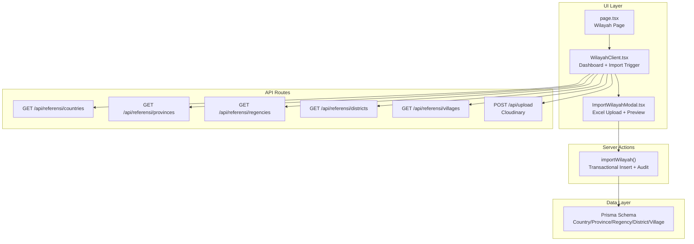
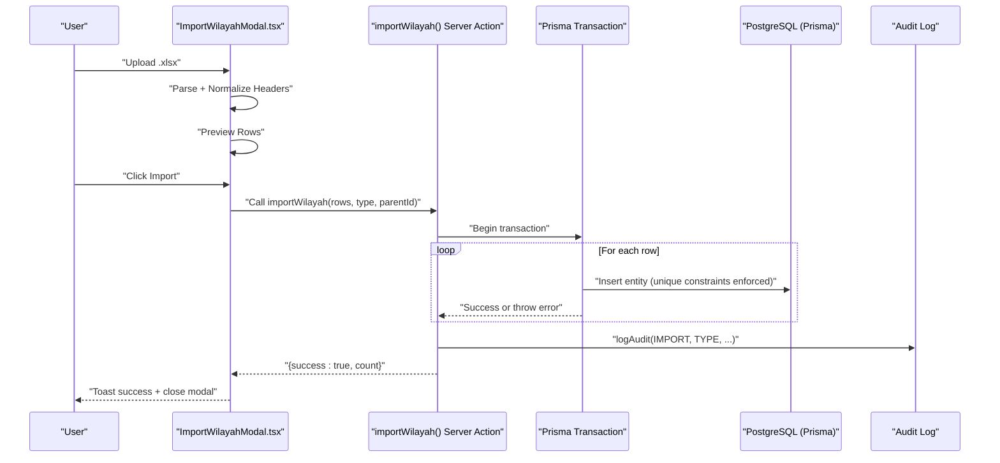
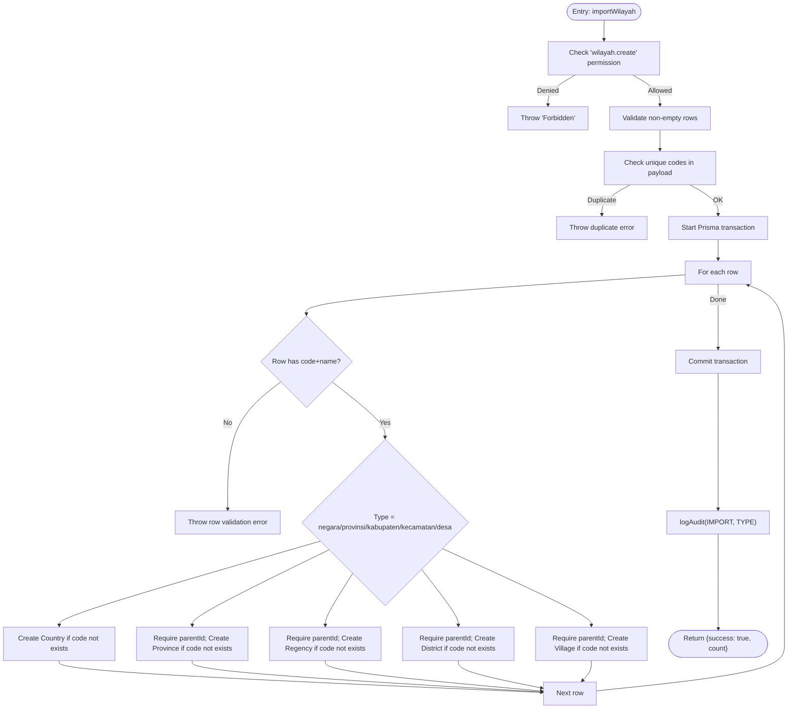
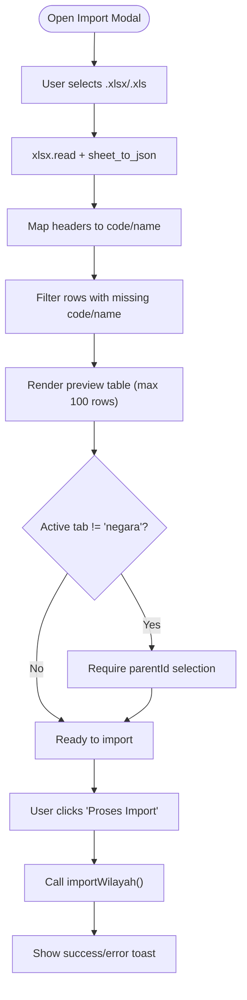
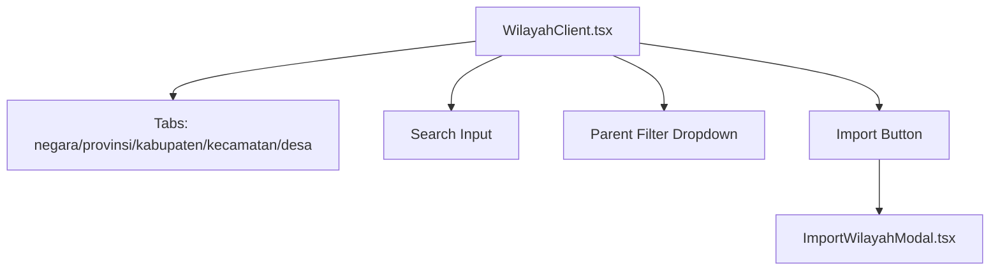
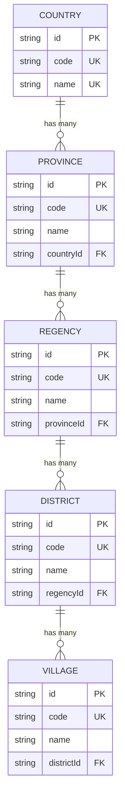
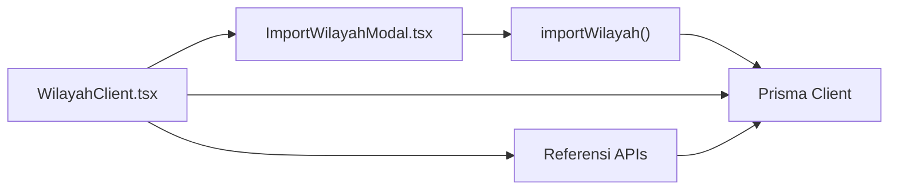

# Data Import & Validation

<cite>
**Referenced Files in This Document**
- [wilayah.ts](file://src/app/actions/wilayah.ts)
- [ImportWilayahModal.tsx](file://src/components/dashboard/referensi/wilayah/ImportWilayahModal.tsx)
- [WilayahClient.tsx](file://src/components/dashboard/referensi/wilayah/WilayahClient.tsx)
- [page.tsx](file://src/app/dashboard/referensi/wilayah/page.tsx)
- [route.ts (countries)](file://src/app/api/referensi/countries/route.ts)
- [route.ts (provinces)](file://src/app/api/referensi/provinces/route.ts)
- [route.ts (regencies)](file://src/app/api/referensi/regencies/route.ts)
- [route.ts (districts)](file://src/app/api/referensi/districts/route.ts)
- [route.ts (villages)](file://src/app/api/referensi/villages/route.ts)
- [route.ts (upload)](file://src/app/api/upload/route.ts)
- [schema.prisma](file://prisma/schema.prisma)
</cite>

## Table of Contents
1. [Introduction](#introduction)
2. [Project Structure](#project-structure)
3. [Core Components](#core-components)
4. [Architecture Overview](#architecture-overview)
5. [Detailed Component Analysis](#detailed-component-analysis)
6. [Dependency Analysis](#dependency-analysis)
7. [Performance Considerations](#performance-considerations)
8. [Troubleshooting Guide](#troubleshooting-guide)
9. [Conclusion](#conclusion)
10. [Appendices](#appendices)

## Introduction
This document explains the geographic data import system for bulk administrative region insertion. It covers the Excel-based import workflow, supported formats, column requirements, validation rules, hierarchical import sequence (countries → provinces → regencies → districts → villages), dependency checks, duplicate detection, error handling, transaction rollback, UI modal and user workflow, progress feedback, and best practices for preparing import files.

## Project Structure
The import system spans UI components, server actions, API routes, and Prisma schema:
- UI: Import modal and dashboard client component orchestrate the user workflow.
- Server Actions: Centralized import logic with transactional writes and audit logging.
- API Routes: Provide lookup endpoints for cascading filters and optional file uploads.
- Prisma Schema: Defines the hierarchical geographic entities and uniqueness constraints.

**Diagram sources**
- [page.tsx:15-107](file://src/app/dashboard/referensi/wilayah/page.tsx#L15-L107)
- [WilayahClient.tsx:65-502](file://src/components/dashboard/referensi/wilayah/WilayahClient.tsx#L65-L502)
- [ImportWilayahModal.tsx:9-221](file://src/components/dashboard/referensi/wilayah/ImportWilayahModal.tsx#L9-L221)
- [wilayah.ts:269-325](file://src/app/actions/wilayah.ts#L269-L325)
- [route.ts (countries):1-29](file://src/app/api/referensi/countries/route.ts#L1-L29)
- [route.ts (provinces):1-32](file://src/app/api/referensi/provinces/route.ts#L1-L32)
- [route.ts (regencies):1-32](file://src/app/api/referensi/regencies/route.ts#L1-L32)
- [route.ts (districts):1-32](file://src/app/api/referensi/districts/route.ts#L1-L32)
- [route.ts (villages):1-32](file://src/app/api/referensi/villages/route.ts#L1-L32)
- [route.ts (upload):1-37](file://src/app/api/upload/route.ts#L1-L37)
- [schema.prisma:380-453](file://prisma/schema.prisma#L380-L453)

**Section sources**
- [page.tsx:15-107](file://src/app/dashboard/referensi/wilayah/page.tsx#L15-L107)
- [WilayahClient.tsx:65-502](file://src/components/dashboard/referensi/wilayah/WilayahClient.tsx#L65-L502)
- [ImportWilayahModal.tsx:9-221](file://src/components/dashboard/referensi/wilayah/ImportWilayahModal.tsx#L9-L221)
- [wilayah.ts:269-325](file://src/app/actions/wilayah.ts#L269-L325)
- [route.ts (countries):1-29](file://src/app/api/referensi/countries/route.ts#L1-L29)
- [route.ts (provinces):1-32](file://src/app/api/referensi/provinces/route.ts#L1-L32)
- [route.ts (regencies):1-32](file://src/app/api/referensi/regencies/route.ts#L1-L32)
- [route.ts (districts):1-32](file://src/app/api/referensi/districts/route.ts#L1-L32)
- [route.ts (villages):1-32](file://src/app/api/referensi/villages/route.ts#L1-L32)
- [route.ts (upload):1-37](file://src/app/api/upload/route.ts#L1-L37)
- [schema.prisma:380-453](file://prisma/schema.prisma#L380-L453)

## Core Components
- Import action: Validates payload, deduplicates codes, performs transactional inserts, logs audit events, and triggers cache revalidation.
- Import modal: Reads Excel via xlsx, normalizes headers, previews data, enforces parent selection for non-country levels, and triggers import.
- Dashboard client: Provides tabbed navigation, search, parent filtering, pagination, and import trigger.
- Lookup APIs: Support cascading dropdowns for parent selection.
- Prisma schema: Enforces uniqueness and foreign keys across the hierarchy.

Key responsibilities:
- Supported file format: .xlsx/.xls (Excel).
- Required columns: code, name (case-insensitive header variants are accepted).
- Validation rules: Non-empty code/name per row; unique codes within the import batch; unique codes per entity type in DB; parent selection required for non-country levels.
- Hierarchical sequence: negara → provinsi → kabupaten → kecamatan → desa.
- Error handling: Throws descriptive errors; transaction ensures atomicity; UI displays toast messages.

**Section sources**
- [ImportWilayahModal.tsx:26-53](file://src/components/dashboard/referensi/wilayah/ImportWilayahModal.tsx#L26-L53)
- [ImportWilayahModal.tsx:55-78](file://src/components/dashboard/referensi/wilayah/ImportWilayahModal.tsx#L55-L78)
- [wilayah.ts:270-325](file://src/app/actions/wilayah.ts#L270-L325)
- [schema.prisma:380-453](file://prisma/schema.prisma#L380-L453)

## Architecture Overview
The import pipeline is client-driven but server-validated and executed via a server action inside a Prisma transaction.

**Diagram sources**
- [ImportWilayahModal.tsx:26-78](file://src/components/dashboard/referensi/wilayah/ImportWilayahModal.tsx#L26-L78)
- [wilayah.ts:270-325](file://src/app/actions/wilayah.ts#L270-L325)
- [schema.prisma:380-453](file://prisma/schema.prisma#L380-L453)

## Detailed Component Analysis

### Import Action: importWilayah
Responsibilities:
- Permission check for creation.
- Payload validation: non-empty rows array.
- Duplicate detection: ensures unique codes within the batch.
- Transactional insertions: iterates rows and creates entities respecting hierarchy.
- Parent validation: requires parentId for non-country levels.
- Audit logging and cache revalidation.

**Diagram sources**
- [wilayah.ts:270-325](file://src/app/actions/wilayah.ts#L270-L325)

**Section sources**
- [wilayah.ts:270-325](file://src/app/actions/wilayah.ts#L270-L325)

### Import Modal: Excel Upload and Preview
Responsibilities:
- Accepts .xlsx/.xls files.
- Uses xlsx library to parse the first sheet and convert to JSON.
- Normalizes headers to code and name (case-insensitive).
- Filters out rows missing either code or name.
- Previews up to 100 rows.
- Enforces parent selection for non-country tabs.
- Triggers import action and handles errors via toast notifications.

**Diagram sources**
- [ImportWilayahModal.tsx:26-78](file://src/components/dashboard/referensi/wilayah/ImportWilayahModal.tsx#L26-L78)

**Section sources**
- [ImportWilayahModal.tsx:26-78](file://src/components/dashboard/referensi/wilayah/ImportWilayahModal.tsx#L26-L78)

### Dashboard Client: Tabs, Filters, and Pagination
Responsibilities:
- Renders tabbed interface for each administrative level.
- Supports search and parent filtering.
- Provides import button and modal trigger.
- Loads dropdowns for parent selection based on current tab.
- Handles pagination and CRUD operations.

**Diagram sources**
- [WilayahClient.tsx:65-502](file://src/components/dashboard/referensi/wilayah/WilayahClient.tsx#L65-L502)

**Section sources**
- [WilayahClient.tsx:65-502](file://src/components/dashboard/referensi/wilayah/WilayahClient.tsx#L65-L502)

### Lookup APIs: Cascading Parent Selection
Responsibilities:
- Provide paginated lists of administrative units filtered by search and parent.
- Used by the dashboard to populate parent dropdowns for each tab.

**Section sources**
- [route.ts (countries):1-29](file://src/app/api/referensi/countries/route.ts#L1-L29)
- [route.ts (provinces):1-32](file://src/app/api/referensi/provinces/route.ts#L1-L32)
- [route.ts (regencies):1-32](file://src/app/api/referensi/regencies/route.ts#L1-L32)
- [route.ts (districts):1-32](file://src/app/api/referensi/districts/route.ts#L1-L32)
- [route.ts (villages):1-32](file://src/app/api/referensi/villages/route.ts#L1-L32)

### Prisma Schema: Entities and Constraints
Entities and relationships:
- Country → Province → Regency → District → Village
- Unique constraints on code per entity and composite name+parent combinations.
- Foreign keys enforce parent-child relationships.

**Diagram sources**
- [schema.prisma:380-453](file://prisma/schema.prisma#L380-L453)

**Section sources**
- [schema.prisma:380-453](file://prisma/schema.prisma#L380-L453)

## Dependency Analysis
- UI depends on server action for import execution.
- Server action depends on Prisma client and audit logging.
- Dashboard client depends on lookup APIs for parent dropdowns.
- Optional file upload API supports external file storage if needed.

**Diagram sources**
- [ImportWilayahModal.tsx](file://src/components/dashboard/referensi/wilayah/ImportWilayahModal.tsx#L7)
- [wilayah.ts](file://src/app/actions/wilayah.ts#L3)
- [WilayahClient.tsx:8-15](file://src/components/dashboard/referensi/wilayah/WilayahClient.tsx#L8-L15)
- [route.ts (countries):1-29](file://src/app/api/referensi/countries/route.ts#L1-L29)
- [route.ts (provinces):1-32](file://src/app/api/referensi/provinces/route.ts#L1-L32)
- [route.ts (regencies):1-32](file://src/app/api/referensi/regencies/route.ts#L1-L32)
- [route.ts (districts):1-32](file://src/app/api/referensi/districts/route.ts#L1-L32)
- [route.ts (villages):1-32](file://src/app/api/referensi/villages/route.ts#L1-L32)

**Section sources**
- [ImportWilayahModal.tsx](file://src/components/dashboard/referensi/wilayah/ImportWilayahModal.tsx#L7)
- [wilayah.ts](file://src/app/actions/wilayah.ts#L3)
- [WilayahClient.tsx:8-15](file://src/components/dashboard/referensi/wilayah/WilayahClient.tsx#L8-L15)
- [route.ts (countries):1-29](file://src/app/api/referensi/countries/route.ts#L1-L29)
- [route.ts (provinces):1-32](file://src/app/api/referensi/provinces/route.ts#L1-L32)
- [route.ts (regencies):1-32](file://src/app/api/referensi/regencies/route.ts#L1-L32)
- [route.ts (districts):1-32](file://src/app/api/referensi/districts/route.ts#L1-L32)
- [route.ts (villages):1-32](file://src/app/api/referensi/villages/route.ts#L1-L32)

## Performance Considerations
- Batch size: The UI limits preview to 100 rows; practical batch sizes should remain reasonable to avoid long-running transactions.
- Transaction atomicity: All inserts are wrapped in a single transaction; failures roll back all changes.
- Indexes: Unique indexes on code and composite name+parent improve insert performance and prevent duplicates.
- Pagination: Lookup APIs use limit and skip to keep queries efficient.

[No sources needed since this section provides general guidance]

## Troubleshooting Guide
Common issues and resolutions:
- Empty or invalid file: Ensure .xlsx/.xls format and presence of code and name columns. The parser accepts common variants (case-insensitive).
- Missing parent selection: For levels after countries, select the appropriate parent before importing.
- Duplicate codes within file: Fix duplicates in the Excel file; the system rejects repeated codes in a single import.
- Existing codes in DB: If a code already exists, the import will fail for that row; adjust codes or remove duplicates.
- Permission denied: Ensure the user has the wilayah.create permission.
- Partial failures: Since the import runs in a transaction, any error aborts the entire batch; fix the problematic rows and retry.

**Section sources**
- [ImportWilayahModal.tsx:48-50](file://src/components/dashboard/referensi/wilayah/ImportWilayahModal.tsx#L48-L50)
- [ImportWilayahModal.tsx:60-63](file://src/components/dashboard/referensi/wilayah/ImportWilayahModal.tsx#L60-L63)
- [wilayah.ts:275-279](file://src/app/actions/wilayah.ts#L275-L279)
- [wilayah.ts:290-314](file://src/app/actions/wilayah.ts#L290-L314)

## Conclusion
The import system provides a robust, user-friendly mechanism to bulk insert geographic administrative regions. It enforces strict validation, maintains data consistency through transactions, and offers clear feedback via the UI. Following the guidelines below ensures successful imports and minimizes errors.

## Appendices

### Supported File Formats and Columns
- File formats: .xlsx, .xls
- Required columns: code, name (case-insensitive variants are normalized)
- Maximum preview rows: 100 (shown in UI)
- Recommended maximum rows per file: up to 10,000 (guideline in UI)

**Section sources**
- [ImportWilayahModal.tsx:102-105](file://src/components/dashboard/referensi/wilayah/ImportWilayahModal.tsx#L102-L105)
- [ImportWilayahModal.tsx:141-152](file://src/components/dashboard/referensi/wilayah/ImportWilayahModal.tsx#L141-L152)

### Hierarchical Import Sequence and Dependencies
- Sequence: negara → provinsi → kabupaten → kecamatan → desa
- Parent requirement: parentId must be selected for non-country levels
- Unique constraints: code must be unique per entity type; name+parent must be unique where applicable

**Section sources**
- [wilayah.ts:294-314](file://src/app/actions/wilayah.ts#L294-L314)
- [schema.prisma:380-453](file://prisma/schema.prisma#L380-L453)

### Validation Rules Summary
- Row validation: code and name must be present for each row
- Batch validation: code uniqueness within the uploaded file
- Database validation: code uniqueness per entity type and parent relationship constraints
- Parent validation: parentId required for levels after countries

**Section sources**
- [wilayah.ts](file://src/app/actions/wilayah.ts#L286)
- [wilayah.ts:275-279](file://src/app/actions/wilayah.ts#L275-L279)
- [wilayah.ts:294-314](file://src/app/actions/wilayah.ts#L294-L314)

### Error Handling and Rollback
- Transaction rollback: All inserts are wrapped in a single transaction; any error cancels the entire batch
- Audit logging: IMPORT actions recorded with entity type and counts
- UI feedback: Toast notifications display success or error messages

**Section sources**
- [wilayah.ts:282-320](file://src/app/actions/wilayah.ts#L282-L320)
- [wilayah.ts:322-324](file://src/app/actions/wilayah.ts#L322-L324)

### Best Practices for Preparing Import Files
- Use clean headers: code and name (case-insensitive variants are acceptable)
- Keep rows minimal and organized
- Verify uniqueness of codes within the file
- Confirm parent relationships align with existing hierarchy
- Test with a small subset before full import

**Section sources**
- [ImportWilayahModal.tsx:102-105](file://src/components/dashboard/referensi/wilayah/ImportWilayahModal.tsx#L102-L105)
- [ImportWilayahModal.tsx:42-45](file://src/components/dashboard/referensi/wilayah/ImportWilayahModal.tsx#L42-L45)