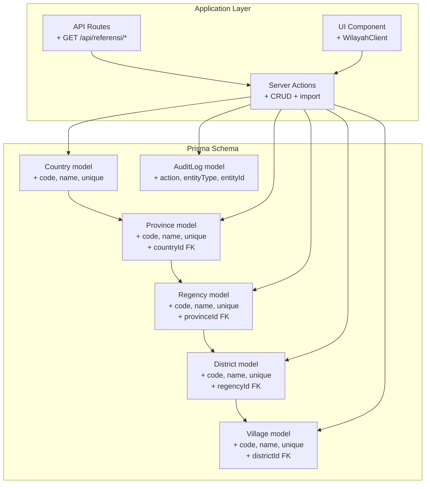
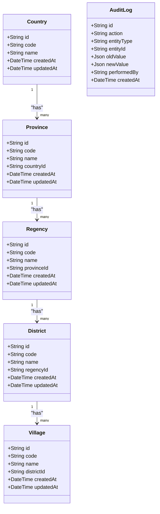
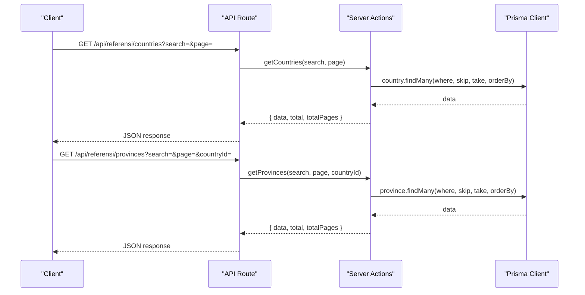
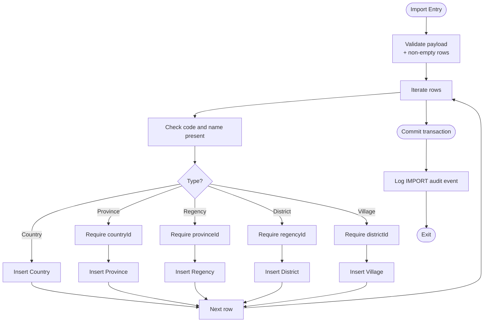
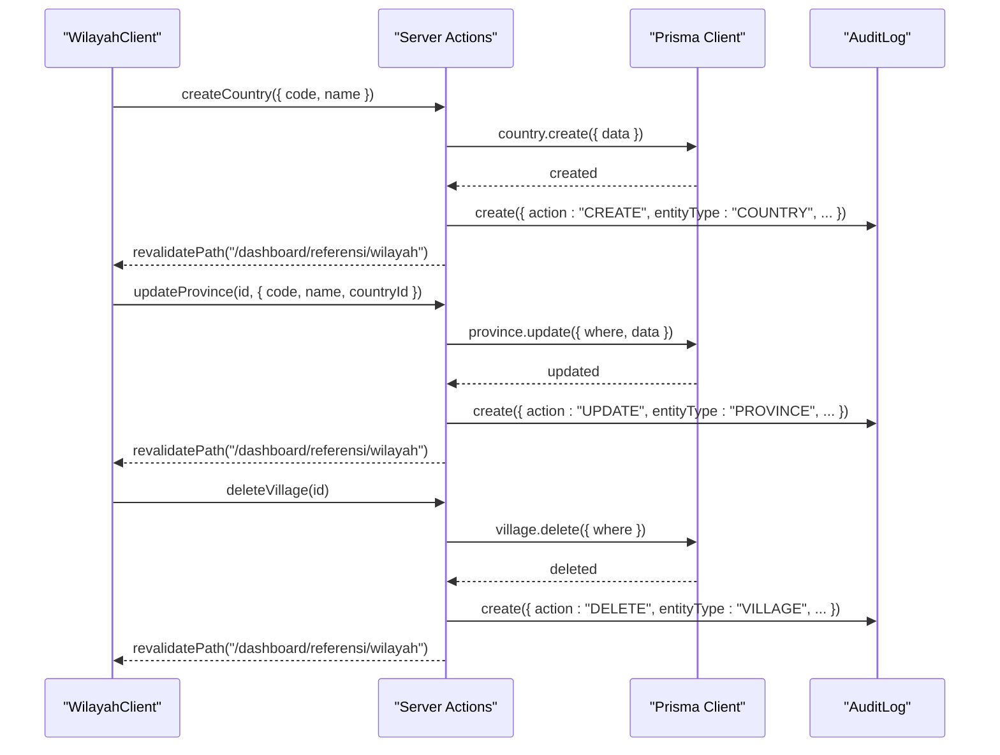
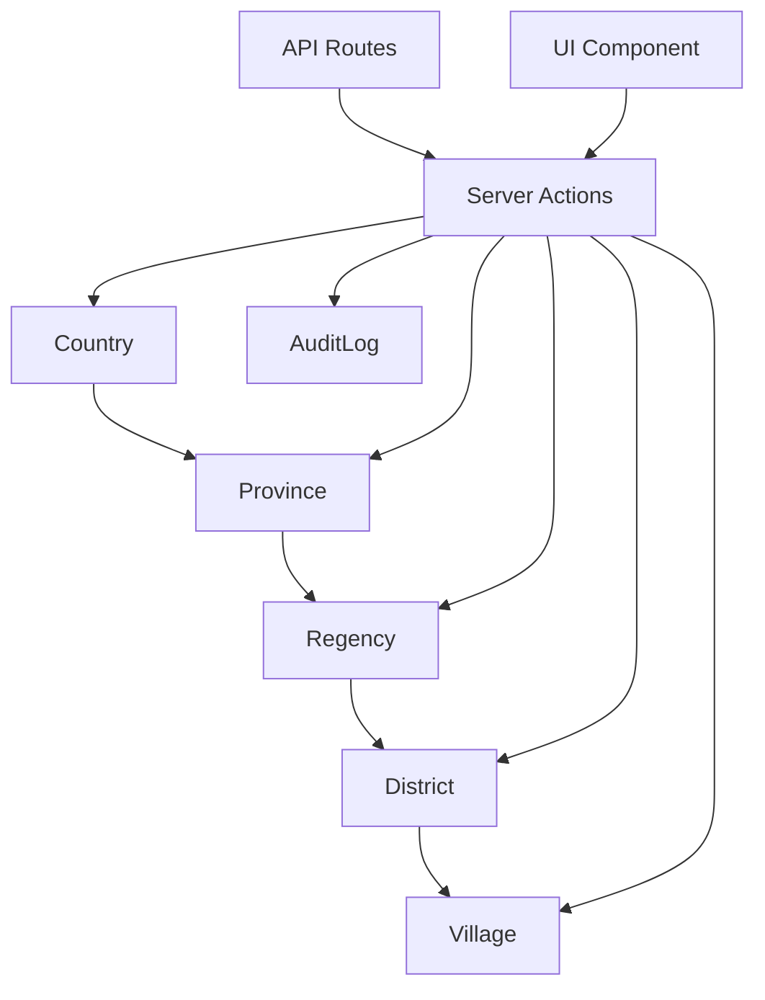

# Geographic Data Model

<cite>
**Referenced Files in This Document**
- [schema.prisma](file://prisma/schema.prisma)
- [wilayah.ts](file://src/app/actions/wilayah.ts)
- [route.ts (countries)](file://src/app/api/referensi/countries/route.ts)
- [route.ts (provinces)](file://src/app/api/referensi/provinces/route.ts)
- [route.ts (regencies)](file://src/app/api/referensi/regencies/route.ts)
- [route.ts (districts)](file://src/app/api/referensi/districts/route.ts)
- [route.ts (villages)](file://src/app/api/referensi/villages/route.ts)
- [WilayahClient.tsx](file://src/components/dashboard/referensi/wilayah/WilayahClient.tsx)
- [page.tsx](file://src/app/dashboard/referensi/wilayah/page.tsx)
</cite>

## Table of Contents
1. [Introduction](#introduction)
2. [Project Structure](#project-structure)
3. [Core Components](#core-components)
4. [Architecture Overview](#architecture-overview)
5. [Detailed Component Analysis](#detailed-component-analysis)
6. [Dependency Analysis](#dependency-analysis)
7. [Performance Considerations](#performance-considerations)
8. [Troubleshooting Guide](#troubleshooting-guide)
9. [Conclusion](#conclusion)

## Introduction
This document provides comprehensive data model documentation for the geographic reference system. It details the hierarchical geographic entities (Country, Province, Regency, District, and Village), their relationships, constraints, and operational behavior. The model supports cascading parent-child relationships, unique constraints per hierarchy level, and audit logging for all administrative changes. Business rules include mandatory codes and names, unique constraints, and referential integrity enforced via foreign keys.

## Project Structure
The geographic data model is defined in the Prisma schema and surfaced through server actions and API endpoints. The UI component manages user interactions and displays hierarchical data with filtering and pagination.

**Diagram sources**
- [schema.prisma:380-453](file://prisma/schema.prisma#L380-L453)
- [wilayah.ts:27-325](file://src/app/actions/wilayah.ts#L27-L325)
- [route.ts (countries):1-29](file://src/app/api/referensi/countries/route.ts#L1-L29)
- [route.ts (provinces):1-32](file://src/app/api/referensi/provinces/route.ts#L1-L32)
- [route.ts (regencies):1-32](file://src/app/api/referensi/regencies/route.ts#L1-L32)
- [route.ts (districts):1-32](file://src/app/api/referensi/districts/route.ts#L1-L32)
- [route.ts (villages):1-32](file://src/app/api/referensi/villages/route.ts#L1-L32)
- [WilayahClient.tsx:1-533](file://src/components/dashboard/referensi/wilayah/WilayahClient.tsx#L1-L533)

**Section sources**
- [schema.prisma:380-453](file://prisma/schema.prisma#L380-L453)
- [wilayah.ts:27-325](file://src/app/actions/wilayah.ts#L27-L325)
- [route.ts (countries):1-29](file://src/app/api/referensi/countries/route.ts#L1-L29)
- [route.ts (provinces):1-32](file://src/app/api/referensi/provinces/route.ts#L1-L32)
- [route.ts (regencies):1-32](file://src/app/api/referensi/regencies/route.ts#L1-L32)
- [route.ts (districts):1-32](file://src/app/api/referensi/districts/route.ts#L1-L32)
- [route.ts (villages):1-32](file://src/app/api/referensi/villages/route.ts#L1-L32)
- [WilayahClient.tsx:1-533](file://src/components/dashboard/referensi/wilayah/WilayahClient.tsx#L1-L533)
- [page.tsx:1-108](file://src/app/dashboard/referensi/wilayah/page.tsx#L1-L108)

## Core Components
This section documents each geographic entity, including fields, data types, constraints, and relationships.

### Country
- Purpose: Top-level geographic entity for countries.
- Fields:
  - id: String (UUID, @id)
  - code: String (@unique)
  - name: String (@unique)
  - createdAt: DateTime (@default(now()))
  - updatedAt: DateTime (@updatedAt)
- Relationships:
  - One-to-many to Province via Province.countryId
- Indexes:
  - Index on name
- Unique Constraints:
  - code: unique
  - name: unique
- Business Rules:
  - code and name are required and must be unique.

**Section sources**
- [schema.prisma:380-390](file://prisma/schema.prisma#L380-L390)

### Province
- Purpose: First-level administrative division within a Country.
- Fields:
  - id: String (UUID, @id)
  - code: String (@unique)
  - name: String
  - countryId: String (FK to Country.id)
  - createdAt: DateTime (@default(now()))
  - updatedAt: DateTime (@updatedAt)
- Relationships:
  - Many-to-one to Country via countryId
  - One-to-many to Regency via Regency.provinceId
- Indexes:
  - Index on name
  - Index on countryId
- Unique Constraints:
  - code: unique
  - (name, countryId): unique composite
- Business Rules:
  - code is required and unique per country.
  - name is required; uniqueness enforced per country.

**Section sources**
- [schema.prisma:392-406](file://prisma/schema.prisma#L392-L406)

### Regency
- Purpose: Second-level administrative division within a Province.
- Fields:
  - id: String (UUID, @id)
  - code: String (@unique)
  - name: String
  - provinceId: String (FK to Province.id)
  - createdAt: DateTime (@default(now()))
  - updatedAt: DateTime (@updatedAt)
- Relationships:
  - Many-to-one to Province via provinceId
  - One-to-many to District via District.regencyId
- Indexes:
  - Index on name
  - Index on provinceId
- Unique Constraints:
  - code: unique
  - (name, provinceId): unique composite
- Business Rules:
  - code is required and unique per province.
  - name is required; uniqueness enforced per province.

**Section sources**
- [schema.prisma:408-422](file://prisma/schema.prisma#L408-L422)

### District
- Purpose: Third-level administrative division within a Regency.
- Fields:
  - id: String (UUID, @id)
  - code: String (@unique)
  - name: String
  - regencyId: String (FK to Regency.id)
  - createdAt: DateTime (@default(now()))
  - updatedAt: DateTime (@updatedAt)
- Relationships:
  - Many-to-one to Regency via regencyId
  - One-to-many to Village via Village.districtId
- Indexes:
  - Index on name
  - Index on regencyId
- Unique Constraints:
  - code: unique
  - (name, regencyId): unique composite
- Business Rules:
  - code is required and unique per regency.
  - name is required; uniqueness enforced per regency.

**Section sources**
- [schema.prisma:424-438](file://prisma/schema.prisma#L424-L438)

### Village
- Purpose: Fourth-level administrative division within a District.
- Fields:
  - id: String (UUID, @id)
  - code: String (@unique)
  - name: String
  - districtId: String (FK to District.id)
  - createdAt: DateTime (@default(now()))
  - updatedAt: DateTime (@updatedAt)
- Relationships:
  - Many-to-one to District via districtId
- Indexes:
  - Index on name
  - Index on districtId
- Unique Constraints:
  - code: unique
  - (name, districtId): unique composite
- Business Rules:
  - code is required and unique per district.
  - name is required; uniqueness enforced per district.

**Section sources**
- [schema.prisma:440-453](file://prisma/schema.prisma#L440-L453)

### Data Integrity and Referential Integrity
- Foreign Keys:
  - Province.countryId references Country.id
  - Regency.provinceId references Province.id
  - District.regencyId references Regency.id
  - Village.districtId references District.id
- Cascade Behavior:
  - Deletes cascade from higher to lower levels (Country → Province → Regency → District → Village).
- Audit Logging:
  - All CRUD operations on geographic entities are logged to AuditLog with action, entityType, entityId, and snapshots.

**Section sources**
- [schema.prisma:380-453](file://prisma/schema.prisma#L380-L453)
- [wilayah.ts:11-25](file://src/app/actions/wilayah.ts#L11-L25)

## Architecture Overview
The geographic data model follows a strict hierarchical structure with cascading deletes and unique constraints per level. Server actions encapsulate business logic and enforce permissions, while API routes provide read-only access for UI components.

**Diagram sources**
- [schema.prisma:380-453](file://prisma/schema.prisma#L380-L453)

**Section sources**
- [schema.prisma:380-453](file://prisma/schema.prisma#L380-L453)

## Detailed Component Analysis

### Data Validation Rules and Unique Constraints
- Required Fields:
  - code and name are required for all entities.
- Unique Constraints:
  - code is unique per entity level.
  - Composite unique constraint on (name, parent) ensures uniqueness within the parent hierarchy.
- Parent Validation:
  - Import process validates that parent IDs are present for child levels.
- Duplicate Detection:
  - Import checks for duplicate codes within the uploaded batch.

**Section sources**
- [schema.prisma:380-453](file://prisma/schema.prisma#L380-L453)
- [wilayah.ts:270-325](file://src/app/actions/wilayah.ts#L270-L325)

### Indexing Strategy
- Name Index:
  - Indexed on Country, Province, Regency, District, Village for efficient name-based queries.
- Parent ID Index:
  - Indexed on Province.countryId, Regency.provinceId, District.regencyId, Village.districtId for efficient filtering by parent.
- AuditLog Index:
  - Indexed on AuditLog.entityType and entityId for audit retrieval.

**Section sources**
- [schema.prisma:380-453](file://prisma/schema.prisma#L380-L453)

### API Workflows
The API routes provide paginated, searchable read access to geographic entities with optional parent filters.

**Diagram sources**
- [route.ts (countries):1-29](file://src/app/api/referensi/countries/route.ts#L1-L29)
- [route.ts (provinces):1-32](file://src/app/api/referensi/provinces/route.ts#L1-L32)
- [wilayah.ts:29-48](file://src/app/actions/wilayah.ts#L29-L48)

**Section sources**
- [route.ts (countries):1-29](file://src/app/api/referensi/countries/route.ts#L1-L29)
- [route.ts (provinces):1-32](file://src/app/api/referensi/provinces/route.ts#L1-L32)
- [wilayah.ts:29-48](file://src/app/actions/wilayah.ts#L29-L48)

### Import Workflow
The import process validates data integrity and inserts records within a transaction.

**Diagram sources**
- [wilayah.ts:270-325](file://src/app/actions/wilayah.ts#L270-L325)

**Section sources**
- [wilayah.ts:270-325](file://src/app/actions/wilayah.ts#L270-L325)

### UI Integration and Filtering
The UI component manages tabbed views, search, pagination, and parent filtering. It calls server actions for CRUD operations and refreshes cached routes after changes.

**Diagram sources**
- [WilayahClient.tsx:143-184](file://src/components/dashboard/referensi/wilayah/WilayahClient.tsx#L143-L184)
- [wilayah.ts:50-71](file://src/app/actions/wilayah.ts#L50-L71)
- [wilayah.ts:106-120](file://src/app/actions/wilayah.ts#L106-L120)
- [wilayah.ts:253-267](file://src/app/actions/wilayah.ts#L253-L267)

**Section sources**
- [WilayahClient.tsx:143-184](file://src/components/dashboard/referensi/wilayah/WilayahClient.tsx#L143-L184)
- [page.tsx:15-107](file://src/app/dashboard/referensi/wilayah/page.tsx#L15-L107)
- [wilayah.ts:50-71](file://src/app/actions/wilayah.ts#L50-L71)
- [wilayah.ts:106-120](file://src/app/actions/wilayah.ts#L106-L120)
- [wilayah.ts:253-267](file://src/app/actions/wilayah.ts#L253-L267)

## Dependency Analysis
The geographic entities form a strict hierarchy with foreign keys enforcing referential integrity. Server actions depend on Prisma client and permissions, while API routes depend on server actions for data retrieval.

**Diagram sources**
- [schema.prisma:380-453](file://prisma/schema.prisma#L380-L453)
- [wilayah.ts:27-325](file://src/app/actions/wilayah.ts#L27-L325)
- [route.ts (countries):1-29](file://src/app/api/referensi/countries/route.ts#L1-L29)
- [route.ts (provinces):1-32](file://src/app/api/referensi/provinces/route.ts#L1-L32)
- [route.ts (regencies):1-32](file://src/app/api/referensi/regencies/route.ts#L1-L32)
- [route.ts (districts):1-32](file://src/app/api/referensi/districts/route.ts#L1-L32)
- [route.ts (villages):1-32](file://src/app/api/referensi/villages/route.ts#L1-L32)
- [WilayahClient.tsx:1-533](file://src/components/dashboard/referensi/wilayah/WilayahClient.tsx#L1-L533)

**Section sources**
- [schema.prisma:380-453](file://prisma/schema.prisma#L380-L453)
- [wilayah.ts:27-325](file://src/app/actions/wilayah.ts#L27-L325)

## Performance Considerations
- Index Selection:
  - Name and parent ID indexes optimize filtering and sorting across all levels.
- Pagination:
  - API routes and server actions implement skip/take pagination for large datasets.
- Audit Queries:
  - AuditLog is indexed by entityType and entityId to support efficient lookup by entity type and ID.
- Cascading Deletes:
  - Deletion order is optimized by parent-to-child hierarchy to minimize orphan risk.

[No sources needed since this section provides general guidance]

## Troubleshooting Guide
- Duplicate Code Errors:
  - Import throws errors when duplicate codes are detected within the batch or when existing records conflict with unique constraints.
- Missing Parent ID:
  - Import requires a parent ID for child levels; missing parent triggers validation errors.
- Permission Denied:
  - CRUD operations require appropriate permissions; otherwise, errors are thrown.
- Audit Trail:
  - All changes are logged; use entityType and entityId filters to locate specific audit events.

**Section sources**
- [wilayah.ts:270-325](file://src/app/actions/wilayah.ts#L270-L325)
- [route.ts (countries):16-28](file://src/app/api/referensi/countries/route.ts#L16-L28)
- [route.ts (provinces):19-31](file://src/app/api/referensi/provinces/route.ts#L19-L31)
- [route.ts (regencies):19-31](file://src/app/api/referensi/regencies/route.ts#L19-L31)
- [route.ts (districts):19-31](file://src/app/api/referensi/districts/route.ts#L19-L31)
- [route.ts (villages):19-31](file://src/app/api/referensi/villages/route.ts#L19-L31)

## Conclusion
The geographic data model establishes a robust, hierarchical reference system with strong integrity guarantees. Unique constraints per level, cascading deletes, and comprehensive audit logging ensure data consistency and traceability. The API and UI layers provide efficient, secure access to geographic data with proper validation and pagination.