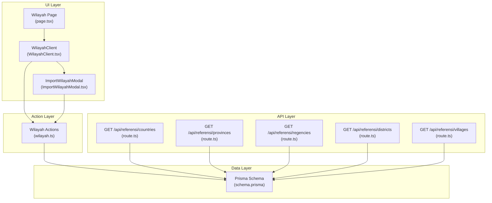
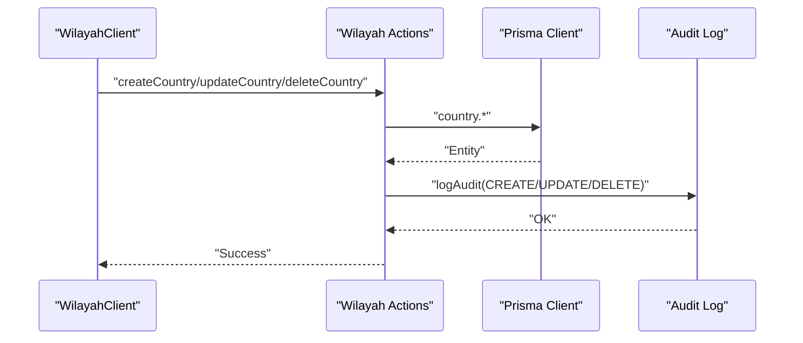
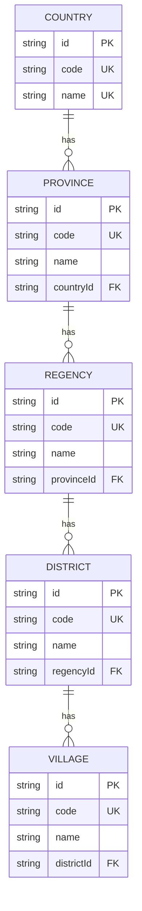
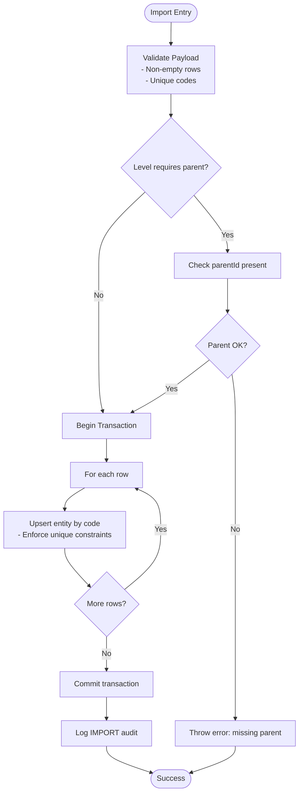
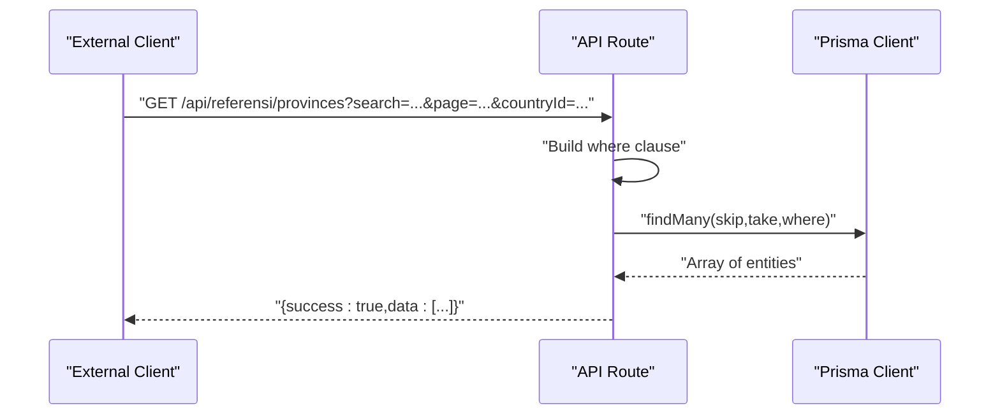
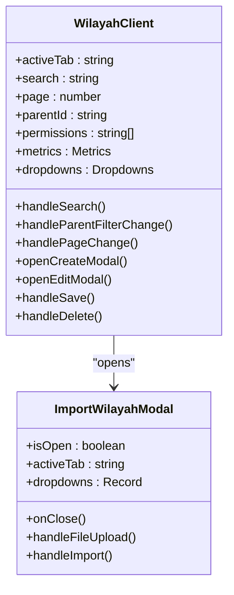
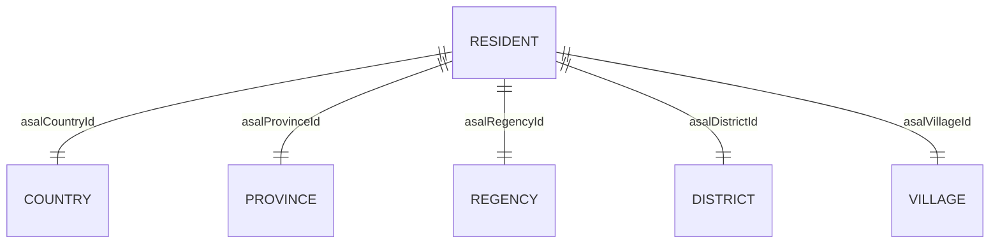
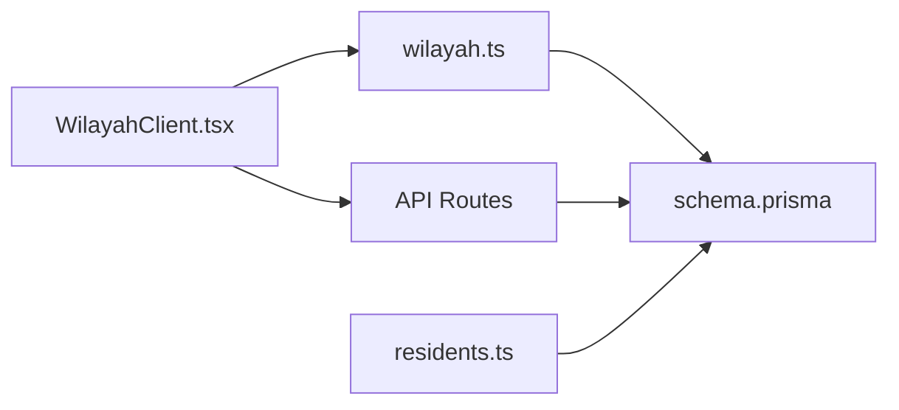

# Geographic Reference System

<cite>
**Referenced Files in This Document**
- [wilayah.ts](file://src/app/actions/wilayah.ts)
- [route.ts](file://src/app/api/referensi/countries/route.ts)
- [route.ts](file://src/app/api/referensi/provinces/route.ts)
- [route.ts](file://src/app/api/referensi/regencies/route.ts)
- [route.ts](file://src/app/api/referensi/districts/route.ts)
- [route.ts](file://src/app/api/referensi/villages/route.ts)
- [schema.prisma](file://prisma/schema.prisma)
- [WilayahClient.tsx](file://src/components/dashboard/referensi/wilayah/WilayahClient.tsx)
- [ImportWilayahModal.tsx](file://src/components/dashboard/referensi/wilayah/ImportWilayahModal.tsx)
- [page.tsx](file://src/app/dashboard/referensi/wilayah/page.tsx)
- [residents.ts](file://src/app/actions/residents.ts)
- [types.ts](file://src/components/dashboard/residents/types.ts)
</cite>

## Table of Contents
1. [Introduction](#introduction)
2. [Project Structure](#project-structure)
3. [Core Components](#core-components)
4. [Architecture Overview](#architecture-overview)
5. [Detailed Component Analysis](#detailed-component-analysis)
6. [Dependency Analysis](#dependency-analysis)
7. [Performance Considerations](#performance-considerations)
8. [Troubleshooting Guide](#troubleshooting-guide)
9. [Conclusion](#conclusion)

## Introduction
This document describes the Geographic Reference System responsible for managing hierarchical administrative geographic data (Country, Province, Regency/City, District, and Village) within the application. It covers the data model, import functionality, validation processes, API endpoints for geographic data retrieval, integration with resident registration, address verification, administrative reporting, and governance/maintenance procedures.

## Project Structure
The Geographic Reference System spans three primary areas:
- Data model and relationships defined in the Prisma schema
- Server-side actions for CRUD operations and batch import
- Client-side UI for administration and batch import via Excel

**Diagram sources**
- [page.tsx:15-107](file://src/app/dashboard/referensi/wilayah/page.tsx#L15-L107)
- [WilayahClient.tsx:65-503](file://src/components/dashboard/referensi/wilayah/WilayahClient.tsx#L65-L503)
- [ImportWilayahModal.tsx:9-221](file://src/components/dashboard/referensi/wilayah/ImportWilayahModal.tsx#L9-L221)
- [wilayah.ts:1-326](file://src/app/actions/wilayah.ts#L1-L326)
- [schema.prisma:380-453](file://prisma/schema.prisma#L380-L453)
- [route.ts:1-29](file://src/app/api/referensi/countries/route.ts#L1-L29)
- [route.ts:1-32](file://src/app/api/referensi/provinces/route.ts#L1-L32)
- [route.ts:1-32](file://src/app/api/referensi/regencies/route.ts#L1-L32)
- [route.ts:1-32](file://src/app/api/referensi/districts/route.ts#L1-L32)
- [route.ts:1-32](file://src/app/api/referensi/villages/route.ts#L1-L32)

**Section sources**
- [page.tsx:15-107](file://src/app/dashboard/referensi/wilayah/page.tsx#L15-L107)
- [WilayahClient.tsx:65-503](file://src/components/dashboard/referensi/wilayah/WilayahClient.tsx#L65-L503)
- [ImportWilayahModal.tsx:9-221](file://src/components/dashboard/referensi/wilayah/ImportWilayahModal.tsx#L9-L221)
- [wilayah.ts:1-326](file://src/app/actions/wilayah.ts#L1-L326)
- [schema.prisma:380-453](file://prisma/schema.prisma#L380-L453)

## Core Components
- Prisma schema defines the Country → Province → Regency → District → Village hierarchy with unique constraints and foreign keys.
- Server actions encapsulate CRUD operations and batch import with permission checks, pagination, and audit logging.
- API routes expose read-only endpoints for geographic data retrieval with search and filtering.
- UI components provide tabbed views, search, parent filters, pagination, and an Excel import modal.

Key responsibilities:
- Data integrity: unique constraints on code/name combinations per level and cascading deletes.
- Access control: permission-based checks for create/update/delete operations.
- Auditability: audit logs capture CREATE/UPDATE/DELETE/IMPORT actions with entity metadata.
- Batch import: Excel parsing and transactional insertions with duplicate detection and parent validation.

**Section sources**
- [schema.prisma:380-453](file://prisma/schema.prisma#L380-L453)
- [wilayah.ts:11-25](file://src/app/actions/wilayah.ts#L11-L25)
- [route.ts:5-31](file://src/app/api/referensi/provinces/route.ts#L5-L31)
- [WilayahClient.tsx:65-503](file://src/components/dashboard/referensi/wilayah/WilayahClient.tsx#L65-L503)

## Architecture Overview
The system follows a layered architecture:
- UI layer: Next.js client components render the administrative interface and manage state.
- Action layer: Server actions perform database operations, enforce permissions, and trigger cache revalidation.
- API layer: REST-like GET endpoints serve paginated, searchable geographic data.
- Data layer: Prisma schema models the geographic hierarchy and relationships.

**Diagram sources**
- [WilayahClient.tsx:143-169](file://src/components/dashboard/referensi/wilayah/WilayahClient.tsx#L143-L169)
- [wilayah.ts:50-71](file://src/app/actions/wilayah.ts#L50-L71)
- [schema.prisma:455-466](file://prisma/schema.prisma#L455-L466)

## Detailed Component Analysis

### Data Model and Hierarchical Structure
The geographic hierarchy is modeled with explicit relationships and constraints:
- Country: unique code and name; contains multiple Province entities.
- Province: belongs to a Country; unique name+countryId; contains multiple Regency entities.
- Regency: belongs to a Province; unique name+provinceId; contains multiple District entities.
- District: belongs to a Regency; unique name+regencyId; contains multiple Village entities.
- Village: belongs to a District; unique name+districtId.

**Diagram sources**
- [schema.prisma:380-453](file://prisma/schema.prisma#L380-L453)

**Section sources**
- [schema.prisma:380-453](file://prisma/schema.prisma#L380-L453)

### Server Actions: CRUD and Import
Actions provide:
- Searchable paginated queries with optional parent filters.
- Permission checks for each operation.
- Audit logging for all mutations.
- Batch import with validation:
  - Duplicate code detection within the uploaded payload.
  - Parent presence validation for non-country levels.
  - Unique constraint enforcement per level.
  - Transactional writes to ensure atomicity.

**Diagram sources**
- [wilayah.ts:270-325](file://src/app/actions/wilayah.ts#L270-L325)

**Section sources**
- [wilayah.ts:270-325](file://src/app/actions/wilayah.ts#L270-L325)

### API Endpoints for Geographic Data Retrieval
REST-like GET endpoints support:
- Search by name or code (case-insensitive partial match).
- Filtering by parent ID (countryId, provinceId, regencyId, districtId).
- Pagination with fixed limit and page number.
- Consistent response shape with success flag and data array.

Endpoints:
- GET /api/referensi/countries
- GET /api/referensi/provinces
- GET /api/referensi/regencies
- GET /api/referensi/districts
- GET /api/referensi/villages

**Diagram sources**
- [route.ts:5-31](file://src/app/api/referensi/provinces/route.ts#L5-L31)

**Section sources**
- [route.ts:5-28](file://src/app/api/referensi/countries/route.ts#L5-L28)
- [route.ts:5-31](file://src/app/api/referensi/provinces/route.ts#L5-L31)
- [route.ts:5-31](file://src/app/api/referensi/regencies/route.ts#L5-L31)
- [route.ts:5-31](file://src/app/api/referensi/districts/route.ts#L5-L31)
- [route.ts:5-31](file://src/app/api/referensi/villages/route.ts#L5-L31)

### Client UI: Administration and Import
The administrative UI provides:
- Tabbed interface for each geographic level.
- Search and parent filter controls.
- Paginated table with action buttons (edit/delete).
- Modal forms for create/edit operations with dynamic parent selection.
- Import modal supporting Excel upload with preview and parent selection.

**Diagram sources**
- [WilayahClient.tsx:65-503](file://src/components/dashboard/referensi/wilayah/WilayahClient.tsx#L65-L503)
- [ImportWilayahModal.tsx:9-221](file://src/components/dashboard/referensi/wilayah/ImportWilayahModal.tsx#L9-L221)

**Section sources**
- [WilayahClient.tsx:65-503](file://src/components/dashboard/referensi/wilayah/WilayahClient.tsx#L65-L503)
- [ImportWilayahModal.tsx:9-221](file://src/components/dashboard/referensi/wilayah/ImportWilayahModal.tsx#L9-L221)
- [page.tsx:15-107](file://src/app/dashboard/referensi/wilayah/page.tsx#L15-L107)

### Integration with Resident Registration and Address Verification
The geographic hierarchy integrates with resident records through dedicated foreign keys:
- asalCountryId, asalProvinceId, asalRegencyId, asalDistrictId, asalVillageId
- These fields enable address verification and demographic analytics.

**Diagram sources**
- [schema.prisma:44-101](file://prisma/schema.prisma#L44-L101)
- [residents.ts:113-200](file://src/app/actions/residents.ts#L113-L200)

**Section sources**
- [schema.prisma:44-101](file://prisma/schema.prisma#L44-L101)
- [residents.ts:113-200](file://src/app/actions/residents.ts#L113-L200)

### Administrative Reporting
The geographic data supports administrative reporting by enabling:
- Filtering residents by administrative boundaries.
- Generating reports segmented by Province/Regency/District/Village.
- Tracking demographic distributions for resource allocation and planning.

[No sources needed since this section provides general guidance]

## Dependency Analysis
The system exhibits clear separation of concerns:
- UI depends on actions for mutations and on API routes for read-only data.
- Actions depend on Prisma for persistence and on audit logging for compliance.
- API routes depend solely on Prisma for read operations.
- No circular dependencies were identified among the analyzed components.

**Diagram sources**
- [WilayahClient.tsx:65-503](file://src/components/dashboard/referensi/wilayah/WilayahClient.tsx#L65-L503)
- [wilayah.ts:1-326](file://src/app/actions/wilayah.ts#L1-L326)
- [route.ts:1-32](file://src/app/api/referensi/provinces/route.ts#L1-L32)
- [schema.prisma:380-453](file://prisma/schema.prisma#L380-L453)
- [residents.ts:113-200](file://src/app/actions/residents.ts#L113-L200)

**Section sources**
- [WilayahClient.tsx:65-503](file://src/components/dashboard/referensi/wilayah/WilayahClient.tsx#L65-L503)
- [wilayah.ts:1-326](file://src/app/actions/wilayah.ts#L1-L326)
- [route.ts:1-32](file://src/app/api/referensi/provinces/route.ts#L1-L32)
- [schema.prisma:380-453](file://prisma/schema.prisma#L380-L453)
- [residents.ts:113-200](file://src/app/actions/residents.ts#L113-L200)

## Performance Considerations
- Pagination: Fixed limit with skip/take ensures predictable query performance.
- Indexes: Name and foreign-key indexes improve search and join performance.
- Unique constraints: Prevent duplicate entries and maintain referential integrity.
- Transactional imports: Batch inserts occur within a single transaction to reduce overhead and ensure atomicity.
- Audit logging: Minimal impact due to selective logging of mutation events.

[No sources needed since this section provides general guidance]

## Troubleshooting Guide
Common issues and resolutions:
- Permission errors: Ensure the user has the appropriate "wilayah.view/create/update/delete" permissions before invoking actions.
- Import failures:
  - Empty or malformed Excel: Verify headers and presence of code/name columns.
  - Duplicate codes within the file: Remove duplicates before importing.
  - Missing parent for non-country levels: Select the correct parent before importing.
  - Existing codes in database: Resolve conflicts by updating or choosing unique codes.
- API errors: Check query parameters (search, page, parentId) and ensure proper formatting.

**Section sources**
- [wilayah.ts:30-48](file://src/app/actions/wilayah.ts#L30-L48)
- [ImportWilayahModal.tsx:55-78](file://src/components/dashboard/referensi/wilayah/ImportWilayahModal.tsx#L55-L78)
- [route.ts:19-30](file://src/app/api/referensi/provinces/route.ts#L19-L30)

## Conclusion
The Geographic Reference System provides a robust, permission-controlled, and auditable framework for managing hierarchical administrative geographic data. It integrates seamlessly with resident registration for address verification and administrative reporting, while offering scalable import capabilities and REST-like APIs for external integrations. Adhering to governance and maintenance procedures ensures long-term data quality and system reliability.