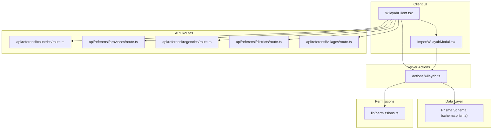
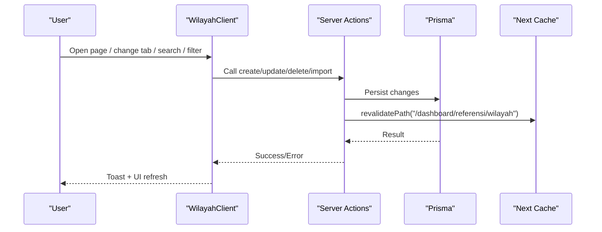
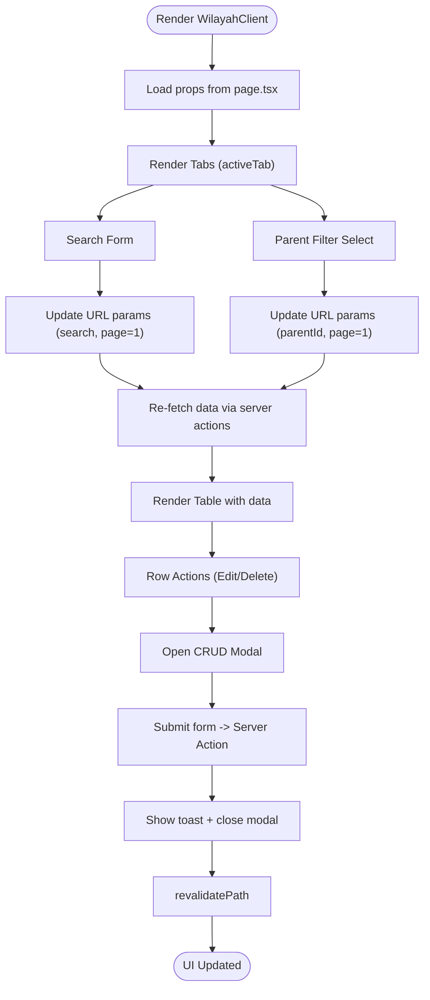
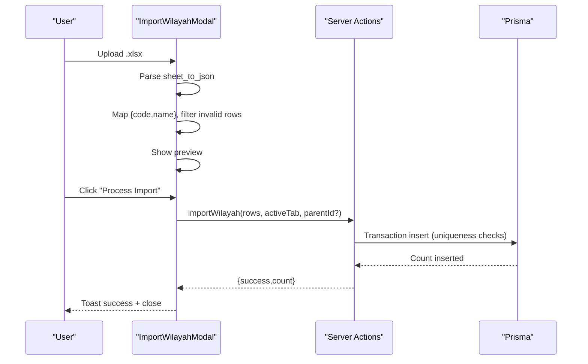
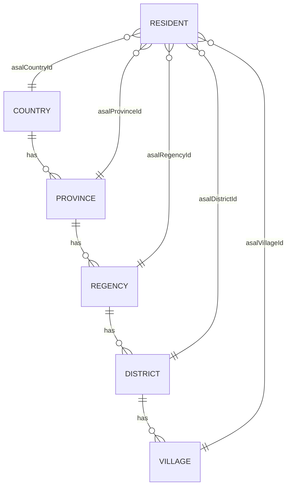
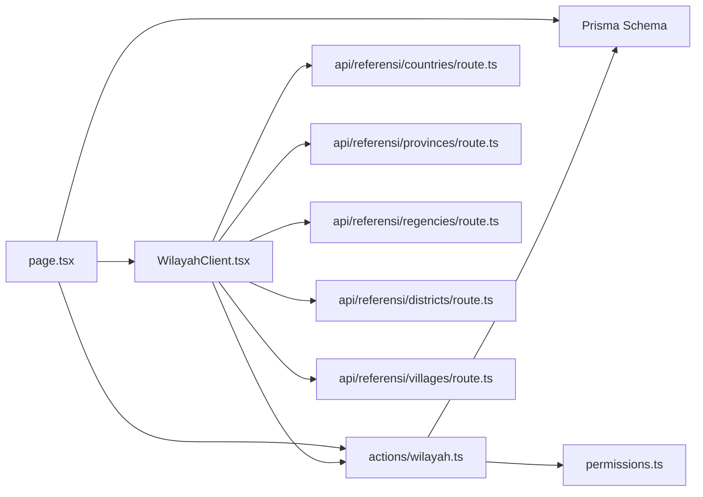

# UI Components & Interfaces

<cite>
**Referenced Files in This Document**
- [WilayahClient.tsx](file://src/components/dashboard/referensi/wilayah/WilayahClient.tsx)
- [ImportWilayahModal.tsx](file://src/components/dashboard/referensi/wilayah/ImportWilayahModal.tsx)
- [wilayah.ts](file://src/app/actions/wilayah.ts)
- [page.tsx](file://src/app/dashboard/referensi/wilayah/page.tsx)
- [countries.route.ts](file://src/app/api/referensi/countries/route.ts)
- [provinces.route.ts](file://src/app/api/referensi/provinces/route.ts)
- [regencies.route.ts](file://src/app/api/referensi/regencies/route.ts)
- [districts.route.ts](file://src/app/api/referensi/districts/route.ts)
- [villages.route.ts](file://src/app/api/referensi/villages/route.ts)
- [permissions.ts](file://src/lib/permissions.ts)
- [schema.prisma](file://prisma/schema.prisma)
- [types.ts](file://types/next-auth.d.ts)
</cite>

## Table of Contents
1. [Introduction](#introduction)
2. [Project Structure](#project-structure)
3. [Core Components](#core-components)
4. [Architecture Overview](#architecture-overview)
5. [Detailed Component Analysis](#detailed-component-analysis)
6. [Dependency Analysis](#dependency-analysis)
7. [Performance Considerations](#performance-considerations)
8. [Troubleshooting Guide](#troubleshooting-guide)
9. [Conclusion](#conclusion)
10. [Appendices](#appendices)

## Introduction
This document describes the geographic reference user interface components for administrative regions (countries, provinces, regencies, districts, and villages). It focuses on the WilayahClient component architecture, data fetching patterns, state management, hierarchical display, search and filtering, pagination, CRUD forms, import modal, validation feedback, and integration with server actions. It also covers responsive design, accessibility, keyboard navigation, real-time updates via cache revalidation, and the relationship to resident registration workflows.

## Project Structure
The geographic reference UI is organized around a client-side component (WilayahClient) that renders tabbed views for each geographic level, supports search and parent filters, pagination, inline CRUD operations, and an import modal. Server actions encapsulate persistence and permissions, while API routes provide auxiliary dropdown data for parent selection.

**Diagram sources**
- [WilayahClient.tsx:1-533](file://src/components/dashboard/referensi/wilayah/WilayahClient.tsx#L1-L533)
- [ImportWilayahModal.tsx:1-221](file://src/components/dashboard/referensi/wilayah/ImportWilayahModal.tsx#L1-L221)
- [wilayah.ts:1-326](file://src/app/actions/wilayah.ts#L1-L326)
- [countries.route.ts:1-29](file://src/app/api/referensi/countries/route.ts#L1-L29)
- [provinces.route.ts:1-32](file://src/app/api/referensi/provinces/route.ts#L1-L32)
- [regencies.route.ts:1-32](file://src/app/api/referensi/regencies/route.ts#L1-L32)
- [districts.route.ts:1-32](file://src/app/api/referensi/districts/route.ts#L1-L32)
- [villages.route.ts:1-32](file://src/app/api/referensi/villages/route.ts#L1-L32)
- [permissions.ts:1-21](file://src/lib/permissions.ts#L1-L21)
- [schema.prisma:380-453](file://prisma/schema.prisma#L380-L453)

**Section sources**
- [WilayahClient.tsx:1-533](file://src/components/dashboard/referensi/wilayah/WilayahClient.tsx#L1-L533)
- [page.tsx:1-108](file://src/app/dashboard/referensi/wilayah/page.tsx#L1-L108)

## Core Components
- WilayahClient: Renders metrics, tabs for geographic levels, search and parent filters, table, pagination, CRUD modal, and import modal. Manages local UI state for search, pagination, modals, and form inputs. Integrates with server actions for create/update/delete and with API routes for parent dropdowns.
- ImportWilayahModal: Handles Excel upload, preview, validation, and triggers import server action. Supports parent selection for non-country levels.
- Server Actions (actions/wilayah.ts): Implements CRUD and import operations with permission checks, audit logging, and cache revalidation.
- Page Container (page.tsx): Resolves URL search params, computes dropdowns per tab, fetches metrics and data, and passes props to WilayahClient.

Key props passed to WilayahClient:
- activeTab: string
- search: string
- page: number
- parentId: string
- data: array of items with id, code, name, and optional parent names
- total: number
- totalPages: number
- permissions: string[]
- dropdowns: { countries, provinces, regencies, districts } arrays of { id, code, name }

**Section sources**
- [WilayahClient.tsx:52-63](file://src/components/dashboard/referensi/wilayah/WilayahClient.tsx#L52-L63)
- [page.tsx:82-106](file://src/app/dashboard/referensi/wilayah/page.tsx#L82-L106)

## Architecture Overview
The UI follows a client-server split:
- Client: UI rendering, routing state (URL search params), local form/modal state, and user interactions.
- Server Actions: Business logic, permissions, database transactions, audit logs, and cache invalidation.
- API Routes: Lightweight endpoints to supply parent dropdown options for current tab.
- Data Model: Prisma schema defines the hierarchical geographic entities and their relationships.

**Diagram sources**
- [WilayahClient.tsx:143-184](file://src/components/dashboard/referensi/wilayah/WilayahClient.tsx#L143-L184)
- [wilayah.ts:50-71](file://src/app/actions/wilayah.ts#L50-L71)
- [page.tsx:15-107](file://src/app/dashboard/referensi/wilayah/page.tsx#L15-L107)

## Detailed Component Analysis

### WilayahClient Component
Responsibilities:
- Render dashboard metrics per geographic level.
- Tabbed interface for geographic levels (country/province/regency/district/village).
- Search by name or code with URL param sync.
- Parent filter dropdown synchronized with URL params.
- Paginated table with row actions (edit/delete).
- CRUD modal with dynamic parent selection based on active tab.
- Import modal trigger and integration.

State Management:
- URL-driven state: activeTab, search, page, parentId.
- Local UI state: modal open/close, modal mode (create/edit), form fields, import modal open.
- Permissions derived from session for enabling actions.

Data Fetching Patterns:
- Metrics computed via Prisma counts.
- Data fetched via server actions (getCountries/getProvinces/etc.) with pagination.
- Parent dropdowns populated via Prisma queries scoped to current tab.

Processing Logic:
- Tab change updates URL params.
- Search submits updates URL params and resets to page 1.
- Parent filter updates URL params and resets to page 1.
- Pagination updates URL params.
- CRUD modal saves via server actions and closes on success.
- Delete confirms and invokes server action.

**Diagram sources**
- [WilayahClient.tsx:80-184](file://src/components/dashboard/referensi/wilayah/WilayahClient.tsx#L80-L184)
- [page.tsx:51-80](file://src/app/dashboard/referensi/wilayah/page.tsx#L51-L80)

**Section sources**
- [WilayahClient.tsx:65-503](file://src/components/dashboard/referensi/wilayah/WilayahClient.tsx#L65-L503)

### ImportWilayahModal Component
Responsibilities:
- Accept Excel upload with drag-and-drop UX.
- Parse XLSX to extract code/name pairs.
- Preview mapped data.
- Validate import prerequisites (non-empty preview, parent selection for non-country).
- Trigger import server action and show feedback.

Processing Logic:
- FileReader + SheetJS to parse XLSX.
- Normalize headers to code/name.
- Filter out rows missing either field.
- Parent selection required for non-country tabs.
- Import server action runs within transaction, validates uniqueness, and logs audit.

**Diagram sources**
- [ImportWilayahModal.tsx:26-78](file://src/components/dashboard/referensi/wilayah/ImportWilayahModal.tsx#L26-L78)
- [wilayah.ts:270-325](file://src/app/actions/wilayah.ts#L270-L325)

**Section sources**
- [ImportWilayahModal.tsx:9-221](file://src/components/dashboard/referensi/wilayah/ImportWilayahModal.tsx#L9-L221)
- [wilayah.ts:270-325](file://src/app/actions/wilayah.ts#L270-L325)

### Server Actions (actions/wilayah.ts)
Responsibilities:
- CRUD operations for each geographic level with permission checks.
- Import operation with transaction and duplicate detection.
- Audit logging for create/update/delete/import.
- Cache revalidation to reflect changes immediately.

Patterns:
- Permission guard via hasPermission.
- Pagination constant (ITEMS_PER_PAGE).
- Parallel fetch for counts and data.
- URL-safe search with case-insensitive containment.
- Parent filter propagation via where conditions.

**Section sources**
- [wilayah.ts:29-48](file://src/app/actions/wilayah.ts#L29-L48)
- [wilayah.ts:75-97](file://src/app/actions/wilayah.ts#L75-L97)
- [wilayah.ts:124-146](file://src/app/actions/wilayah.ts#L124-L146)
- [wilayah.ts:173-195](file://src/app/actions/wilayah.ts#L173-L195)
- [wilayah.ts:222-244](file://src/app/actions/wilayah.ts#L222-L244)
- [wilayah.ts:270-325](file://src/app/actions/wilayah.ts#L270-L325)

### API Routes for Dropdowns
Purpose:
- Provide lightweight lists of parent entities for current tab to populate dropdowns in the UI.

Behavior:
- Accept search and pagination-like limit.
- Apply case-insensitive filter on name/code.
- Optionally filter by parent ID for nested levels.

**Section sources**
- [countries.route.ts:5-28](file://src/app/api/referensi/countries/route.ts#L5-L28)
- [provinces.route.ts:5-31](file://src/app/api/referensi/provinces/route.ts#L5-L31)
- [regencies.route.ts:5-31](file://src/app/api/referensi/regencies/route.ts#L5-L31)
- [districts.route.ts:5-31](file://src/app/api/referensi/districts/route.ts#L5-L31)
- [villages.route.ts:5-31](file://src/app/api/referensi/villages/route.ts#L5-L31)

### Data Model and Hierarchical Relationships
The Prisma schema defines a strict hierarchy:
- Country → Province (via countryId)
- Province → Regency (via provinceId)
- Regency → District (via regencyId)
- District → Village (via districtId)

Residents reference the leaf nodes (Village) and intermediate nodes via foreign keys for origin tracking.

**Diagram sources**
- [schema.prisma:380-453](file://prisma/schema.prisma#L380-L453)

**Section sources**
- [schema.prisma:380-453](file://prisma/schema.prisma#L380-L453)

### Relationship to Resident Registration Workflows
- Geographic data is foundational for resident registration:
  - Origin fields in Resident (asalCountry, asalProvince, asalRegency, asalDistrict, asalVillage) rely on the geographic hierarchy.
  - The hierarchy ensures consistent and valid origin selections during onboarding and profile updates.
- Importing bulk geographic data via ImportWilayahModal enables rapid population of reference data, supporting large-scale resident registration processes.

**Section sources**
- [schema.prisma:44-96](file://prisma/schema.prisma#L44-L96)
- [ImportWilayahModal.tsx:55-78](file://src/components/dashboard/referensi/wilayah/ImportWilayahModal.tsx#L55-L78)
- [wilayah.ts:270-325](file://src/app/actions/wilayah.ts#L270-L325)

## Dependency Analysis
- WilayahClient depends on:
  - Server actions for CRUD and import.
  - API routes for parent dropdowns.
  - Next.js router/search params for URL-driven state.
  - react-hot-toast for user feedback.
- Server actions depend on:
  - Prisma client for persistence.
  - permissions utility for authorization.
  - Next.js revalidatePath for real-time UI updates.
- Page container orchestrates:
  - Session and permissions checks.
  - Computation of metrics and dropdowns.
  - Data fetching via server actions.

**Diagram sources**
- [WilayahClient.tsx:8-15](file://src/components/dashboard/referensi/wilayah/WilayahClient.tsx#L8-L15)
- [wilayah.ts:1-8](file://src/app/actions/wilayah.ts#L1-L8)
- [page.tsx:1-13](file://src/app/dashboard/referensi/wilayah/page.tsx#L1-L13)
- [permissions.ts:1-21](file://src/lib/permissions.ts#L1-L21)
- [schema.prisma:380-453](file://prisma/schema.prisma#L380-L453)

**Section sources**
- [WilayahClient.tsx:1-16](file://src/components/dashboard/referensi/wilayah/WilayahClient.tsx#L1-L16)
- [page.tsx:1-21](file://src/app/dashboard/referensi/wilayah/page.tsx#L1-L21)

## Performance Considerations
- Pagination: Fixed page size via ITEMS_PER_PAGE constant ensures predictable load and rendering.
- Parallelization: Metrics, dropdowns, and data are fetched concurrently to reduce latency.
- Efficient queries: Case-insensitive filters use indexes on name/code; parent filters constrain queries.
- Real-time updates: revalidatePath invalidates cached paths to reflect changes instantly after CRUD/import.
- Large imports: Transactional batch insert minimizes round trips; duplicate detection prevents wasted writes.

[No sources needed since this section provides general guidance]

## Troubleshooting Guide
Common issues and resolutions:
- Permission errors: Ensure session has required permissions (e.g., wilayah.view, wilayah.create, wilayah.update, wilayah.delete). Server actions throw descriptive errors when unauthorized.
- Import failures:
  - Empty or malformed Excel: Verify headers and presence of code/name columns.
  - Duplicate codes within file: Fix duplicates before importing.
  - Missing parent selection for non-country levels: Choose appropriate parent before import.
- Validation feedback: Toast messages surface errors from server actions and modal validations.
- Real-time updates: After save/delete/import, UI reflects changes due to cache revalidation.

**Section sources**
- [permissions.ts:4-16](file://src/lib/permissions.ts#L4-L16)
- [wilayah.ts:50-71](file://src/app/actions/wilayah.ts#L50-L71)
- [wilayah.ts:270-325](file://src/app/actions/wilayah.ts#L270-L325)
- [ImportWilayahModal.tsx:55-78](file://src/components/dashboard/referensi/wilayah/ImportWilayahModal.tsx#L55-L78)

## Conclusion
The geographic reference UI is a cohesive system combining client-side interactivity with robust server-side operations. WilayahClient orchestrates hierarchical browsing, search, filtering, pagination, and inline editing, while ImportWilayahModal streamlines bulk data ingestion. Server actions enforce permissions, maintain audit trails, and keep the UI fresh via cache revalidation. The Prisma schema enforces referential integrity across the geographic hierarchy, directly supporting resident registration workflows.

[No sources needed since this section summarizes without analyzing specific files]

## Appendices

### Props and Events Reference
- WilayahClient props:
  - activeTab: string
  - search: string
  - page: number
  - parentId: string
  - data: array of items with id, code, name, and optional parent names
  - total: number
  - totalPages: number
  - permissions: string[]
  - dropdowns: { countries, provinces, regencies, districts }
- Event handlers:
  - handleTabChange(value: string)
  - handleSearch(event)
  - handleParentFilterChange(event)
  - handlePageChange(newPage: number)
  - openCreateModal()
  - openEditModal(item)
  - handleSave(event)
  - handleDelete(id: string)

**Section sources**
- [WilayahClient.tsx:52-184](file://src/components/dashboard/referensi/wilayah/WilayahClient.tsx#L52-L184)

### Accessibility and Keyboard Navigation
- Focus management: Inputs and buttons receive focus on activation; avoid fixed focus traps inside modals.
- Keyboard shortcuts: Enter to submit forms; Escape to close modals (standard browser behavior with modal overlays).
- ARIA: Use native button semantics; ensure labels for icons (e.g., Edit, Delete, Upload) are descriptive via surrounding text.
- Color contrast: Maintain sufficient contrast for metric cards and action buttons.
- Responsive layout: Ensure touch targets are accessible on mobile; tabs and filters adapt to small screens.

[No sources needed since this section provides general guidance]