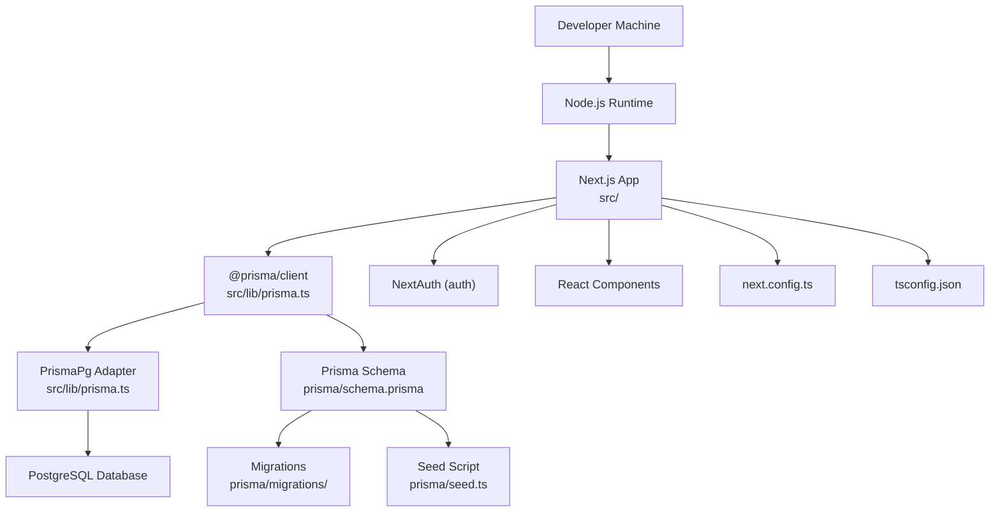
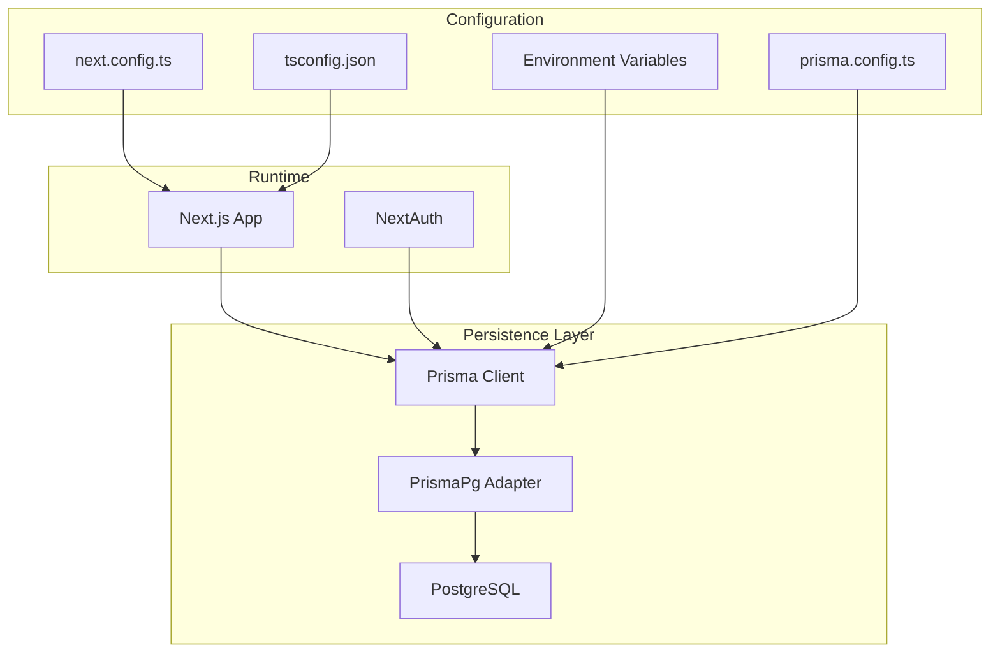
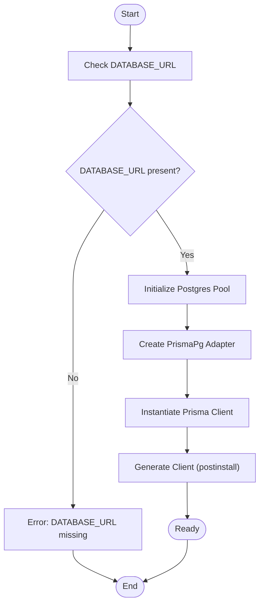
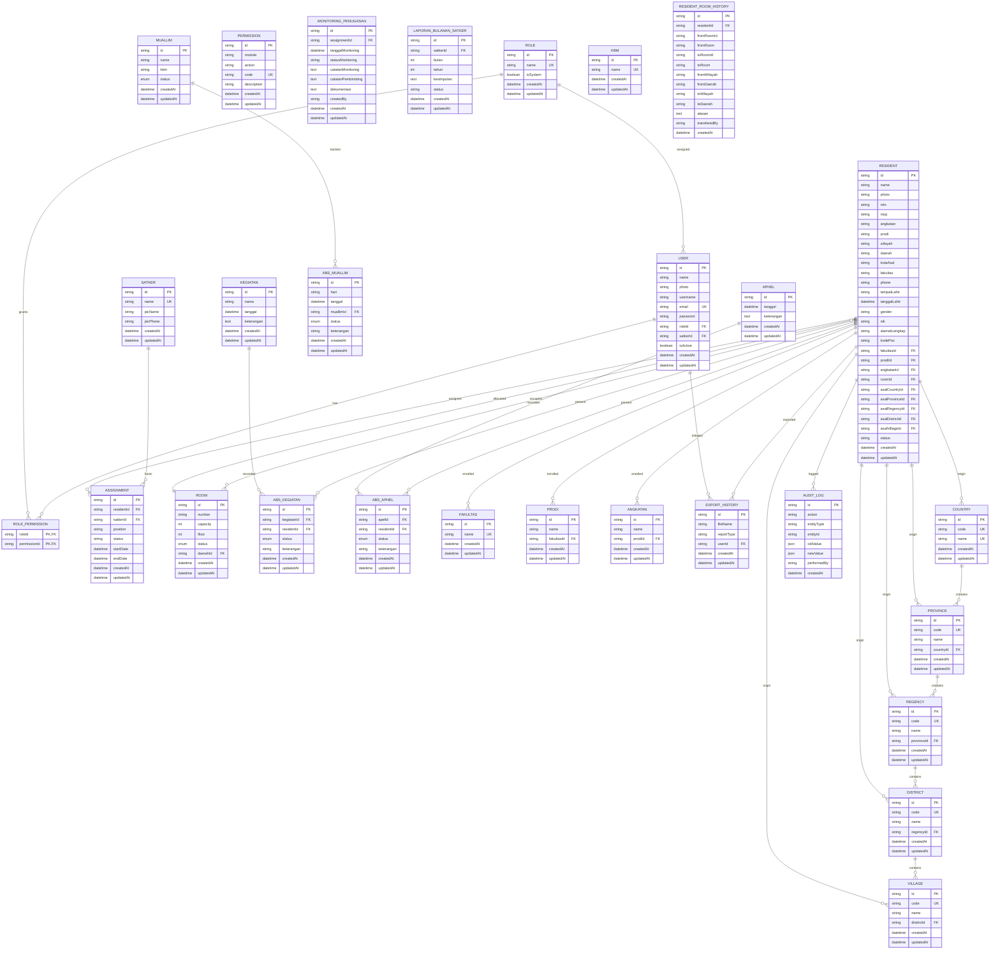
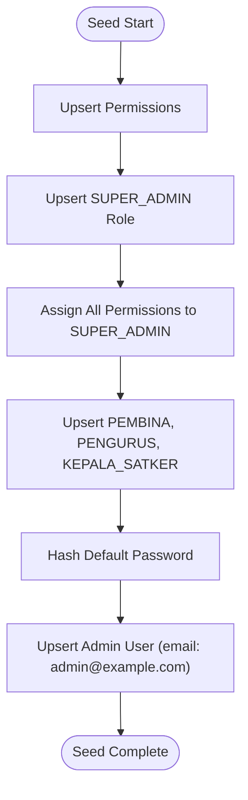
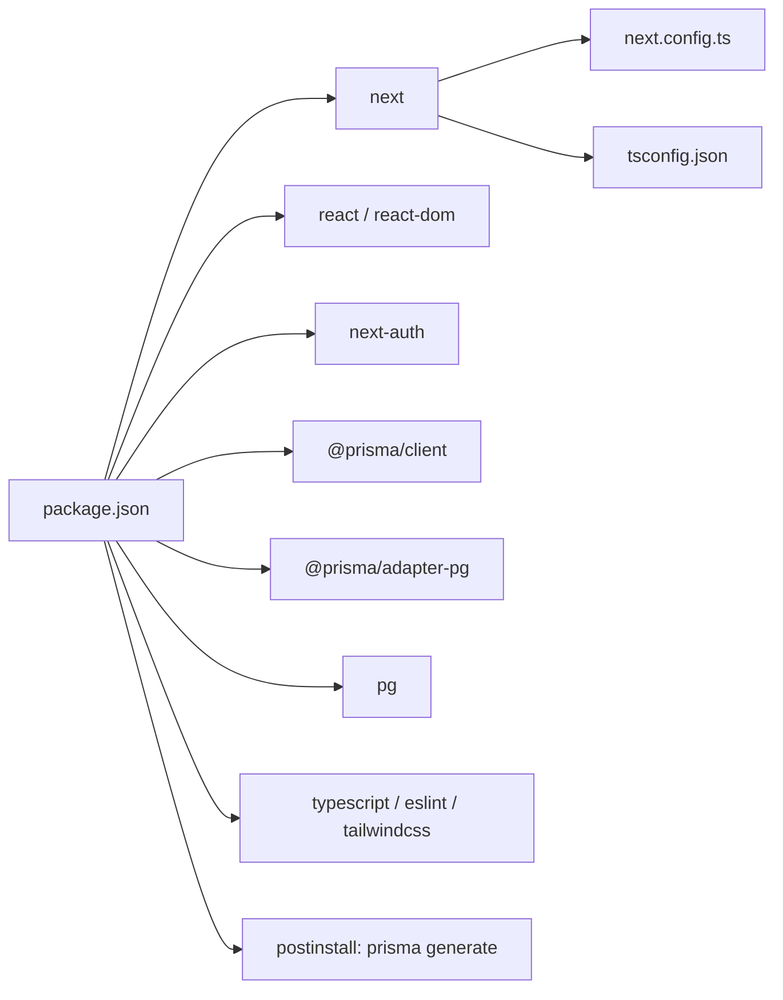

# Getting Started

<cite>
**Referenced Files in This Document**
- [README.md](file://README.md)
- [package.json](file://package.json)
- [prisma/schema.prisma](file://prisma/schema.prisma)
- [prisma/seed.ts](file://prisma/seed.ts)
- [prisma.config.ts](file://prisma.config.ts)
- [src/lib/prisma.ts](file://src/lib/prisma.ts)
- [next.config.ts](file://next.config.ts)
- [tsconfig.json](file://tsconfig.json)
</cite>

## Table of Contents
1. [Introduction](#introduction)
2. [Project Structure](#project-structure)
3. [Core Components](#core-components)
4. [Architecture Overview](#architecture-overview)
5. [Detailed Component Analysis](#detailed-component-analysis)
6. [Dependency Analysis](#dependency-analysis)
7. [Performance Considerations](#performance-considerations)
8. [Troubleshooting Guide](#troubleshooting-guide)
9. [Conclusion](#conclusion)
10. [Appendices](#appendices)

## Introduction
This guide helps you set up the ApsAsrama development environment from scratch. It covers installing prerequisites, configuring PostgreSQL, setting up Prisma, generating clients, preparing environment variables, running the development server, building for production, and preparing for deployment. It also includes step-by-step instructions for database migration and seeding, troubleshooting common setup issues, IDE recommendations, and deployment guidance for both development and production environments.

## Project Structure
ApsAsrama is a Next.js 16 application using TypeScript, Prisma ORM with PostgreSQL, and NextAuth for authentication. The repository includes:
- Application code under src/
- Prisma schema and migrations under prisma/
- Build and runtime configuration under next.config.ts, tsconfig.json
- Scripts and tasks under package.json

**Diagram sources**
- [src/lib/prisma.ts:1-31](file://src/lib/prisma.ts#L1-L31)
- [prisma/schema.prisma:1-487](file://prisma/schema.prisma#L1-L487)
- [prisma/seed.ts:1-174](file://prisma/seed.ts#L1-L174)
- [next.config.ts:1-24](file://next.config.ts#L1-L24)
- [tsconfig.json:1-35](file://tsconfig.json#L1-L35)

**Section sources**
- [README.md:1-37](file://README.md#L1-L37)
- [package.json:1-48](file://package.json#L1-L48)
- [prisma/schema.prisma:1-487](file://prisma/schema.prisma#L1-L487)
- [prisma/seed.ts:1-174](file://prisma/seed.ts#L1-L174)
- [prisma.config.ts:1-16](file://prisma.config.ts#L1-L16)
- [src/lib/prisma.ts:1-31](file://src/lib/prisma.ts#L1-L31)
- [next.config.ts:1-24](file://next.config.ts#L1-L24)
- [tsconfig.json:1-35](file://tsconfig.json#L1-L35)

## Core Components
- Prisma ORM and PostgreSQL integration via @prisma/client and @prisma/adapter-pg
- Next.js 16 application with TypeScript
- NextAuth v4 for authentication
- Tailwind CSS v4 and related tooling
- Cloudinary integration for media

Key implementation highlights:
- Prisma client initialization with a Postgres connection pool and adapter
- Environment-driven DATABASE_URL configuration
- Prisma schema defines entities, enums, relations, and indexes
- Seed script creates permissions, roles, and a default admin user

**Section sources**
- [package.json:12-32](file://package.json#L12-L32)
- [src/lib/prisma.ts:1-31](file://src/lib/prisma.ts#L1-L31)
- [prisma/schema.prisma:1-487](file://prisma/schema.prisma#L1-L487)
- [prisma/seed.ts:75-164](file://prisma/seed.ts#L75-L164)

## Architecture Overview
The application follows a layered architecture:
- Presentation: Next.js app pages and components
- Business logic: Actions and APIs under src/app/actions and src/app/api
- Persistence: Prisma client with PostgreSQL adapter
- Authentication: NextAuth with credentials flow
- Configuration: next.config.ts, tsconfig.json, prisma.config.ts

**Diagram sources**
- [src/lib/prisma.ts:1-31](file://src/lib/prisma.ts#L1-L31)
- [prisma.config.ts:1-16](file://prisma.config.ts#L1-L16)
- [next.config.ts:1-24](file://next.config.ts#L1-L24)
- [tsconfig.json:1-35](file://tsconfig.json#L1-L35)

## Detailed Component Analysis

### Prisma Setup and Configuration
- Provider: PostgreSQL
- Driver adapter: PrismaPg with a managed connection pool
- Client generation: Automated via postinstall script
- Migration and seed configuration: Managed by prisma.config.ts

**Diagram sources**
- [src/lib/prisma.ts:5-18](file://src/lib/prisma.ts#L5-L18)
- [prisma.config.ts:6-15](file://prisma.config.ts#L6-L15)
- [package.json:10-10](file://package.json#L10-L10)

**Section sources**
- [src/lib/prisma.ts:1-31](file://src/lib/prisma.ts#L1-L31)
- [prisma.config.ts:1-16](file://prisma.config.ts#L1-L16)
- [package.json:10-10](file://package.json#L10-L10)

### Database Schema Overview
The Prisma schema defines entities for users, roles, permissions, residents, rooms, assignments, monitoring, academic records, administrative regions, and audit logs. It includes enums for statuses and presence tracking, relations between entities, and indexes for performance.

**Diagram sources**
- [prisma/schema.prisma:10-487](file://prisma/schema.prisma#L10-L487)

**Section sources**
- [prisma/schema.prisma:1-487](file://prisma/schema.prisma#L1-L487)

### Seed Process
The seed script initializes:
- Permissions for modules and actions
- Roles including SUPER_ADMIN and system roles
- A default admin user with hashed password

**Diagram sources**
- [prisma/seed.ts:75-164](file://prisma/seed.ts#L75-L164)

**Section sources**
- [prisma/seed.ts:1-174](file://prisma/seed.ts#L1-L174)

### Environment Variables
Required environment variable:
- DATABASE_URL: Postgres connection string used by the Prisma client

Optional but recommended:
- NEXTAUTH_URL: NextAuth base URL for callbacks
- NEXTAUTH_SECRET: Secret key for session encryption

These variables are consumed by:
- Prisma client initialization
- NextAuth configuration (referenced in the application)

**Section sources**
- [src/lib/prisma.ts:6-8](file://src/lib/prisma.ts#L6-L8)
- [prisma.config.ts:13-13](file://prisma.config.ts#L13-L13)

## Dependency Analysis
- Runtime dependencies include Next.js, React, NextAuth, Prisma client, and PostgreSQL adapter
- Development dependencies include TypeScript, ESLint, Tailwind CSS, and related tooling
- Postinstall hook runs Prisma client generation
- Next.js configuration enables image optimization and sets caching behavior

**Diagram sources**
- [package.json:5-11](file://package.json#L5-L11)
- [next.config.ts:1-24](file://next.config.ts#L1-L24)
- [tsconfig.json:1-35](file://tsconfig.json#L1-L35)

**Section sources**
- [package.json:12-46](file://package.json#L12-L46)
- [next.config.ts:1-24](file://next.config.ts#L1-L24)
- [tsconfig.json:1-35](file://tsconfig.json#L1-L35)

## Performance Considerations
- Prisma client uses a connection pool with a small concurrency limit suitable for serverless environments
- Next.js experimental stale times reduce revalidation overhead for dynamic routes
- Image optimization is configured for Cloudinary CDN
- Strict TypeScript configuration improves type safety and reduces runtime errors

[No sources needed since this section provides general guidance]

## Troubleshooting Guide
Common setup issues and resolutions:
- Missing DATABASE_URL
  - Symptom: Prisma client throws an error indicating the environment variable is not defined
  - Fix: Set DATABASE_URL to a valid PostgreSQL connection string
  - Reference: [src/lib/prisma.ts:7-8](file://src/lib/prisma.ts#L7-L8)
- Prisma client generation fails
  - Symptom: Errors during postinstall or when importing Prisma client
  - Fix: Ensure Prisma CLI is installed and run postinstall again
  - Reference: [package.json:10-10](file://package.json#L10-L10)
- Next.js build or dev server errors
  - Symptom: Type errors or build failures
  - Fix: Verify TypeScript configuration and ensure all dependencies are installed
  - References: [tsconfig.json:1-35](file://tsconfig.json#L1-L35), [package.json:33-46](file://package.json#L33-L46)
- NextAuth authentication issues
  - Symptom: Login failures or redirect loops
  - Fix: Confirm NEXTAUTH_URL and NEXTAUTH_SECRET are set appropriately
  - References: [README.md:32-37](file://README.md#L32-L37), [package.json:22-22](file://package.json#L22-L22)

**Section sources**
- [src/lib/prisma.ts:7-8](file://src/lib/prisma.ts#L7-L8)
- [package.json:10-10](file://package.json#L10-L10)
- [tsconfig.json:1-35](file://tsconfig.json#L1-L35)
- [README.md:32-37](file://README.md#L32-L37)

## Conclusion
You now have the essentials to set up ApsAsrama locally: install Node.js, configure PostgreSQL, set DATABASE_URL, run Prisma client generation, and start the Next.js development server. Use the provided steps for migration and seeding, and consult the troubleshooting section for common issues. For production, ensure environment variables are properly configured and review deployment options referenced in the project’s documentation.

[No sources needed since this section summarizes without analyzing specific files]

## Appendices

### Installation and Setup Steps
- Install Node.js LTS
- Install PostgreSQL and create a database
- Clone the repository and install dependencies
- Set DATABASE_URL pointing to your PostgreSQL instance
- Run Prisma client generation via postinstall
- Initialize database with migrations and seed data
- Start the development server

References:
- [README.md:5-15](file://README.md#L5-L15)
- [package.json:5-11](file://package.json#L5-L11)
- [src/lib/prisma.ts:6-8](file://src/lib/prisma.ts#L6-L8)
- [prisma.config.ts:13-13](file://prisma.config.ts#L13-L13)

**Section sources**
- [README.md:5-15](file://README.md#L5-L15)
- [package.json:5-11](file://package.json#L5-L11)
- [src/lib/prisma.ts:6-8](file://src/lib/prisma.ts#L6-L8)
- [prisma.config.ts:13-13](file://prisma.config.ts#L13-L13)

### Development Server Startup
- Use the dev script to start the Next.js development server
- Open the application in your browser at the port indicated by the server

Reference:
- [README.md:5-15](file://README.md#L5-L15)

**Section sources**
- [README.md:5-15](file://README.md#L5-L15)

### Build Commands
- Build for production using the build script
- Start the production server using the start script

Reference:
- [package.json:6-8](file://package.json#L6-L8)

**Section sources**
- [package.json:6-8](file://package.json#L6-L8)

### Database Migration and Seeding
- Migrations: Managed by Prisma; run migrations as needed
- Seeding: Use the seed command configured in prisma.config.ts

References:
- [prisma.config.ts:8-11](file://prisma.config.ts#L8-L11)
- [prisma/seed.ts:1-174](file://prisma/seed.ts#L1-L174)

**Section sources**
- [prisma.config.ts:8-11](file://prisma.config.ts#L8-L11)
- [prisma/seed.ts:1-174](file://prisma/seed.ts#L1-L174)

### Environment Variable Setup
- Required: DATABASE_URL
- Recommended: NEXTAUTH_URL, NEXTAUTH_SECRET

References:
- [src/lib/prisma.ts:6-8](file://src/lib/prisma.ts#L6-L8)
- [prisma.config.ts:13-13](file://prisma.config.ts#L13-L13)

**Section sources**
- [src/lib/prisma.ts:6-8](file://src/lib/prisma.ts#L6-L8)
- [prisma.config.ts:13-13](file://prisma.config.ts#L13-L13)

### Deployment Preparation
- Configure environment variables for production
- Review deployment documentation linked in the project
- Ensure Prisma client is generated and migrations are applied

References:
- [README.md:32-37](file://README.md#L32-L37)
- [package.json:10-10](file://package.json#L10-L10)

**Section sources**
- [README.md:32-37](file://README.md#L32-L37)
- [package.json:10-10](file://package.json#L10-L10)

### IDE Recommendations
- Use VS Code with official extensions for TypeScript, ESLint, and Tailwind CSS
- Enable strict TypeScript checking and formatting on save

[No sources needed since this section provides general guidance]

### Prerequisite Knowledge
- Basic understanding of Next.js and React
- Familiarity with TypeScript
- Understanding of PostgreSQL and environment variables
- Knowledge of Prisma ORM basics

[No sources needed since this section provides general guidance]