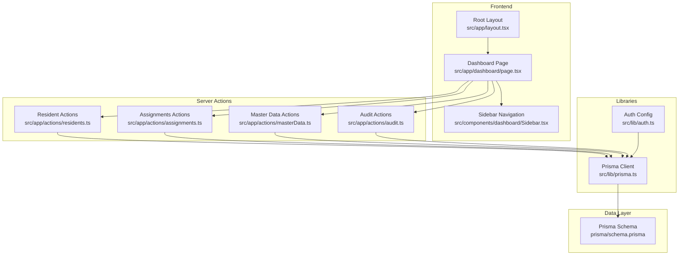
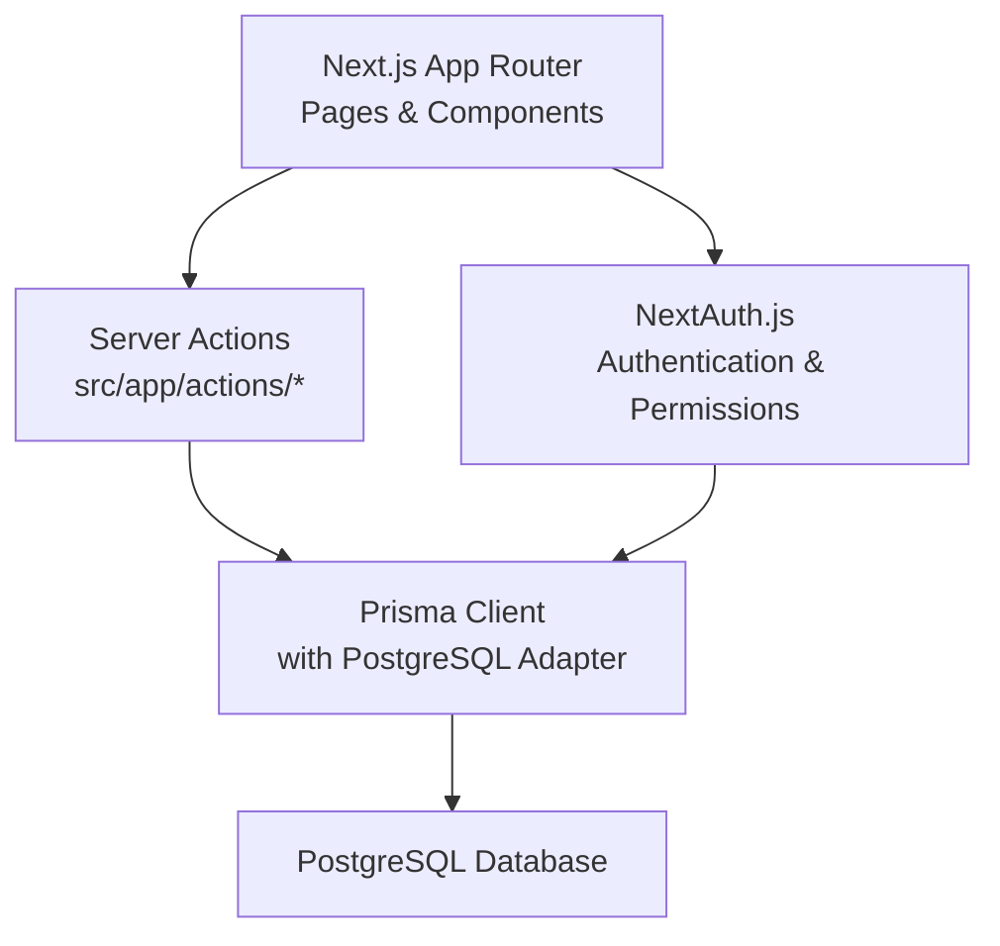
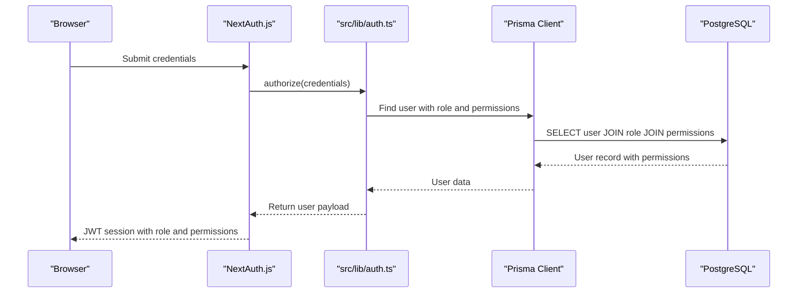
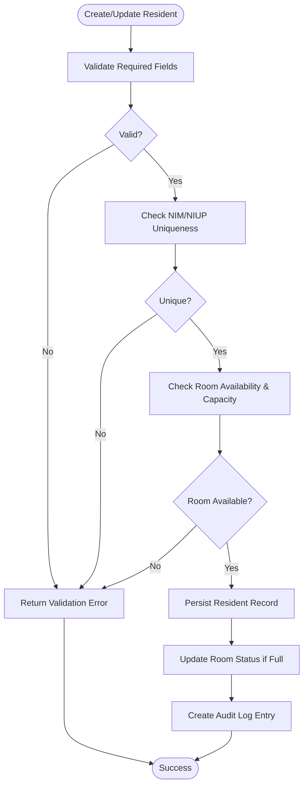
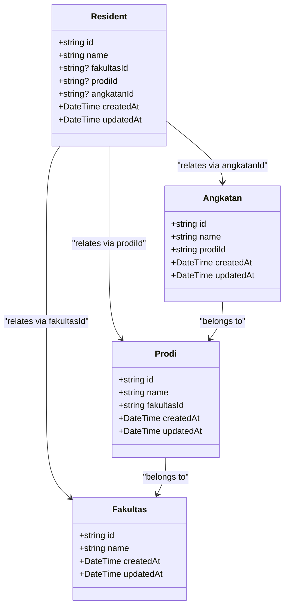
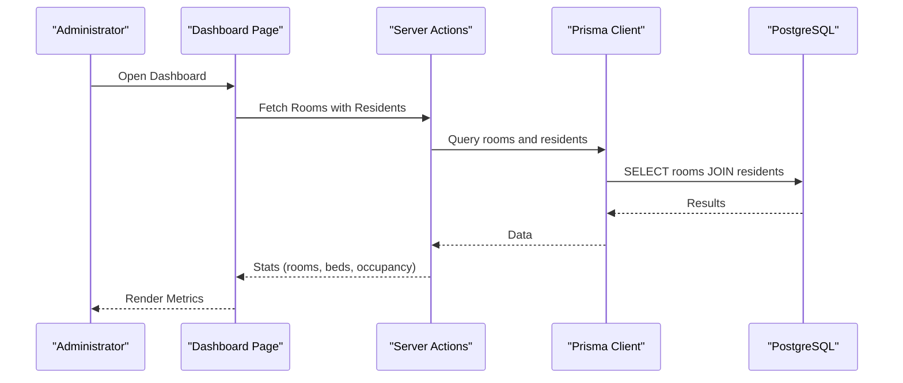
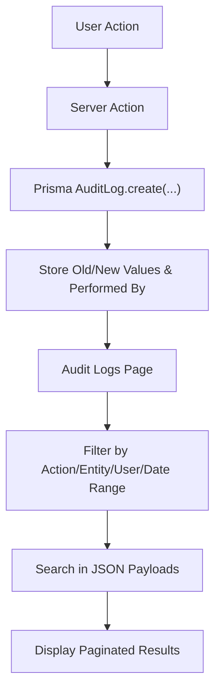
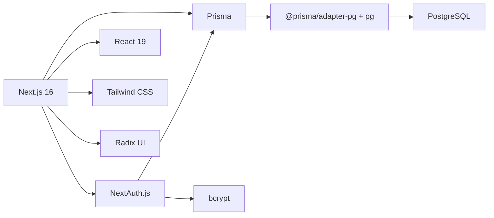

# Project Overview

<cite>
**Referenced Files in This Document**
- [README.md](file://README.md)
- [package.json](file://package.json)
- [prisma/schema.prisma](file://prisma/schema.prisma)
- [src/lib/prisma.ts](file://src/lib/prisma.ts)
- [src/lib/auth.ts](file://src/lib/auth.ts)
- [src/app/layout.tsx](file://src/app/layout.tsx)
- [src/app/dashboard/page.tsx](file://src/app/dashboard/page.tsx)
- [src/components/dashboard/Sidebar.tsx](file://src/components/dashboard/Sidebar.tsx)
- [src/app/actions/residents.ts](file://src/app/actions/residents.ts)
- [src/app/actions/masterData.ts](file://src/app/actions/masterData.ts)
- [src/app/actions/assignments.ts](file://src/app/actions/assignments.ts)
- [src/app/actions/audit.ts](file://src/app/actions/audit.ts)
- [SANTRI_SCHEMA_ANALYSIS.md](file://SANTRI_SCHEMA_ANALYSIS.md)
</cite>

## Table of Contents
1. [Introduction](#introduction)
2. [Project Structure](#project-structure)
3. [Core Components](#core-components)
4. [Architecture Overview](#architecture-overview)
5. [Detailed Component Analysis](#detailed-component-analysis)
6. [Dependency Analysis](#dependency-analysis)
7. [Performance Considerations](#performance-considerations)
8. [Troubleshooting Guide](#troubleshooting-guide)
9. [Conclusion](#conclusion)

## Introduction
ApsAsrama is an Indonesian pesantren (Islamic boarding school) dormitory management system designed to digitize and streamline daily operational workflows. It serves administrators, supervisors, and staff members responsible for managing resident life, academic tracking, and administrative tasks within pesantren institutions. The system aims to improve institutional efficiency by centralizing data, automating reporting, enforcing role-based access control, and providing real-time dashboards for oversight.

The project’s mission aligns with Indonesia’s educational ecosystem, where pesantren play a significant role in formal and informal education. By offering a modern, web-based platform built on contemporary technologies, ApsAsrama helps institutions reduce manual paperwork, minimize errors, and enhance transparency through audit trails and standardized reporting.

Key value propositions:
- Centralized resident lifecycle management (registration, room placement, academic records, and transfers)
- Automated attendance tracking for activities, prayers, and instructors
- Structured academic and administrative master data (faculties, programs, cohorts, work units)
- Role-based access control with granular permissions
- Real-time dashboards and monthly reporting for supervisors
- Comprehensive audit logging for compliance and accountability

Target audience:
- Administrators and supervisors within pesantren institutions
- Academic coordinators and dormitory staff
- Compliance officers requiring audit trails
- Institutional leadership needing performance insights

## Project Structure
The application follows Next.js App Router conventions with a clear separation of concerns:
- Frontend pages and layouts under src/app
- Shared UI components under src/components
- Business logic encapsulated in server actions under src/app/actions
- Authentication and database utilities under src/lib
- Data modeling and migrations under prisma

**Diagram sources**
- [src/app/layout.tsx:1-42](file://src/app/layout.tsx#L1-L42)
- [src/app/dashboard/page.tsx:1-144](file://src/app/dashboard/page.tsx#L1-L144)
- [src/components/dashboard/Sidebar.tsx:1-404](file://src/components/dashboard/Sidebar.tsx#L1-L404)
- [src/app/actions/residents.ts:1-666](file://src/app/actions/residents.ts#L1-L666)
- [src/app/actions/assignments.ts:1-215](file://src/app/actions/assignments.ts#L1-L215)
- [src/app/actions/masterData.ts:1-191](file://src/app/actions/masterData.ts#L1-L191)
- [src/app/actions/audit.ts:1-118](file://src/app/actions/audit.ts#L1-L118)
- [src/lib/auth.ts:1-81](file://src/lib/auth.ts#L1-L81)
- [src/lib/prisma.ts:1-31](file://src/lib/prisma.ts#L1-L31)
- [prisma/schema.prisma:1-487](file://prisma/schema.prisma#L1-L487)

**Section sources**
- [README.md:1-37](file://README.md#L1-L37)
- [src/app/layout.tsx:1-42](file://src/app/layout.tsx#L1-L42)
- [src/app/dashboard/page.tsx:1-144](file://src/app/dashboard/page.tsx#L1-L144)
- [src/components/dashboard/Sidebar.tsx:1-404](file://src/components/dashboard/Sidebar.tsx#L1-L404)
- [src/app/actions/residents.ts:1-666](file://src/app/actions/residents.ts#L1-L666)
- [src/app/actions/assignments.ts:1-215](file://src/app/actions/assignments.ts#L1-L215)
- [src/app/actions/masterData.ts:1-191](file://src/app/actions/masterData.ts#L1-L191)
- [src/app/actions/audit.ts:1-118](file://src/app/actions/audit.ts#L1-L118)
- [src/lib/auth.ts:1-81](file://src/lib/auth.ts#L1-L81)
- [src/lib/prisma.ts:1-31](file://src/lib/prisma.ts#L1-L31)
- [prisma/schema.prisma:1-487](file://prisma/schema.prisma#L1-L487)

## Core Components
- Authentication and Authorization: Implements credential-based login with JWT sessions, role-scoped permissions, and protected routes.
- Data Access Layer: Uses Prisma ORM with a PostgreSQL adapter and a managed connection pool for efficient serverless environments.
- Domain Actions: Encapsulate CRUD and business logic for residents, assignments, master data, and audit logs.
- UI Navigation: Dynamic sidebar with permission-aware visibility of menu items and nested dropdowns.
- Dashboard: Real-time statistics for rooms, beds, occupancy rates, and recent resident activity.

Technology stack highlights:
- Next.js 16 (App Router) for routing and SSR/SSG capabilities
- TypeScript for type safety across frontend and backend actions
- Prisma ORM with PostgreSQL for robust data modeling and queries
- NextAuth.js for authentication and session management
- Tailwind CSS and Radix UI for responsive UI components

**Section sources**
- [package.json:12-32](file://package.json#L12-L32)
- [src/lib/auth.ts:1-81](file://src/lib/auth.ts#L1-L81)
- [src/lib/prisma.ts:1-31](file://src/lib/prisma.ts#L1-L31)
- [prisma/schema.prisma:1-487](file://prisma/schema.prisma#L1-L487)
- [src/components/dashboard/Sidebar.tsx:223-404](file://src/components/dashboard/Sidebar.tsx#L223-L404)
- [src/app/dashboard/page.tsx:11-144](file://src/app/dashboard/page.tsx#L11-L144)

## Architecture Overview
The system employs a layered architecture:
- Presentation Layer: Next.js pages and components with server-side rendering and client-side interactivity
- Application Layer: Server actions orchestrating business logic and coordinating with the data layer
- Data Access Layer: Prisma client with a PostgreSQL adapter and connection pooling
- Security Layer: NextAuth.js for authentication and authorization via JWT tokens and role-based permissions

**Diagram sources**
- [src/app/dashboard/page.tsx:1-144](file://src/app/dashboard/page.tsx#L1-L144)
- [src/app/actions/residents.ts:1-666](file://src/app/actions/residents.ts#L1-L666)
- [src/app/actions/assignments.ts:1-215](file://src/app/actions/assignments.ts#L1-L215)
- [src/app/actions/masterData.ts:1-191](file://src/app/actions/masterData.ts#L1-L191)
- [src/app/actions/audit.ts:1-118](file://src/app/actions/audit.ts#L1-L118)
- [src/lib/auth.ts:1-81](file://src/lib/auth.ts#L1-L81)
- [src/lib/prisma.ts:1-31](file://src/lib/prisma.ts#L1-L31)
- [prisma/schema.prisma:1-487](file://prisma/schema.prisma#L1-L487)

## Detailed Component Analysis

### Authentication and Authorization
The authentication system integrates NextAuth.js with a custom credentials provider. It validates user credentials against the database, loads associated roles and permissions, and stores them in JWT tokens for subsequent requests. Session callbacks ensure the frontend receives enriched user data, including role and permissions.

**Diagram sources**
- [src/lib/auth.ts:6-80](file://src/lib/auth.ts#L6-L80)
- [src/lib/prisma.ts:1-31](file://src/lib/prisma.ts#L1-L31)
- [prisma/schema.prisma:10-25](file://prisma/schema.prisma#L10-L25)

**Section sources**
- [src/lib/auth.ts:1-81](file://src/lib/auth.ts#L1-L81)
- [src/lib/prisma.ts:1-31](file://src/lib/prisma.ts#L1-L31)
- [prisma/schema.prisma:10-25](file://prisma/schema.prisma#L10-L25)

### Resident Lifecycle Management
The resident domain encompasses registration, updates, room placement, and batch operations. Validation ensures data integrity, while room capacity checks prevent over-occupancy. Audit logs capture meaningful changes for compliance.

**Diagram sources**
- [src/app/actions/residents.ts:143-244](file://src/app/actions/residents.ts#L143-L244)
- [src/app/actions/residents.ts:371-412](file://src/app/actions/residents.ts#L371-L412)
- [prisma/schema.prisma:44-101](file://prisma/schema.prisma#L44-L101)

**Section sources**
- [src/app/actions/residents.ts:1-666](file://src/app/actions/residents.ts#L1-L666)
- [prisma/schema.prisma:44-101](file://prisma/schema.prisma#L44-L101)

### Academic Tracking and Master Data
Academic tracking is supported through structured master data for faculties, programs, and cohorts. Server actions manage CRUD operations for these entities, enabling accurate academic record linkage to residents.

**Diagram sources**
- [prisma/schema.prisma:326-358](file://prisma/schema.prisma#L326-L358)
- [prisma/schema.prisma:44-101](file://prisma/schema.prisma#L44-L101)

**Section sources**
- [src/app/actions/masterData.ts:1-191](file://src/app/actions/masterData.ts#L1-L191)
- [prisma/schema.prisma:326-358](file://prisma/schema.prisma#L326-L358)

### Administrative Workflows and Reporting
Administrative workflows include assigning residents to work units (satkers), monitoring progress, and generating monthly reports. The dashboard aggregates occupancy and recent activity metrics for quick oversight.

**Diagram sources**
- [src/app/dashboard/page.tsx:82-140](file://src/app/dashboard/page.tsx#L82-L140)
- [src/app/actions/residents.ts:76-93](file://src/app/actions/residents.ts#L76-L93)
- [prisma/schema.prisma:27-42](file://prisma/schema.prisma#L27-L42)

**Section sources**
- [src/app/dashboard/page.tsx:1-144](file://src/app/dashboard/page.tsx#L1-L144)
- [src/app/actions/assignments.ts:1-215](file://src/app/actions/assignments.ts#L1-L215)

### Audit Logging
The audit log tracks changes to entities, enabling compliance and historical tracing. Filtering supports pagination, date ranges, and free-text search across JSON payloads.

**Diagram sources**
- [src/app/actions/audit.ts:8-98](file://src/app/actions/audit.ts#L8-L98)
- [prisma/schema.prisma:455-466](file://prisma/schema.prisma#L455-L466)

**Section sources**
- [src/app/actions/audit.ts:1-118](file://src/app/actions/audit.ts#L1-L118)
- [prisma/schema.prisma:455-466](file://prisma/schema.prisma#L455-L466)

## Dependency Analysis
External dependencies and their roles:
- Next.js 16: Web framework and runtime
- NextAuth.js: Authentication and session management
- Prisma: ORM and database client
- PostgreSQL: Relational database
- React 19: UI library
- Tailwind CSS: Utility-first styling
- Radix UI: Accessible UI primitives
- bcrypt: Password hashing
- pg and @prisma/adapter-pg: PostgreSQL driver and adapter

**Diagram sources**
- [package.json:12-32](file://package.json#L12-L32)
- [src/lib/prisma.ts:1-31](file://src/lib/prisma.ts#L1-L31)
- [src/lib/auth.ts:1-81](file://src/lib/auth.ts#L1-L81)

**Section sources**
- [package.json:12-32](file://package.json#L12-L32)
- [src/lib/prisma.ts:1-31](file://src/lib/prisma.ts#L1-L31)
- [src/lib/auth.ts:1-81](file://src/lib/auth.ts#L1-L81)

## Performance Considerations
- Connection pooling: The Prisma client uses a single connection per serverless instance with timeouts configured for reliability.
- Query optimization: Indexes on frequently queried fields (e.g., room status, resident status, academic relations) improve lookup performance.
- ISR caching: Dashboard metrics are cached with a short revalidation interval to balance freshness and performance.
- Batch operations: Bulk resident creation and movement leverage optimistic updates and atomic transactions to reduce round trips.

Recommendations:
- Monitor database query plans for complex joins involving academic and administrative hierarchies.
- Consider adding composite indexes for common filter patterns (e.g., resident status with academic fields).
- Use pagination and server-side filtering for large datasets in audit logs and resident lists.

**Section sources**
- [src/lib/prisma.ts:10-17](file://src/lib/prisma.ts#L10-L17)
- [prisma/schema.prisma:98-101](file://prisma/schema.prisma#L98-L101)
- [src/app/dashboard/page.tsx:8-9](file://src/app/dashboard/page.tsx#L8-L9)

## Troubleshooting Guide
Common issues and resolutions:
- Authentication failures: Verify NEXTAUTH_SECRET and database connectivity for user lookup.
- Database connection errors: Confirm DATABASE_URL and adapter configuration; ensure the pool settings match serverless constraints.
- Permission denied: Ensure the user role includes required permissions for accessing specific views or performing actions.
- Audit log access: Only users with the audit.view permission can query audit logs; unauthorized requests return an error.

Operational checks:
- Validate Prisma schema and migrations before deploying.
- Test server actions with minimal datasets to isolate failures.
- Review server logs for Prisma client errors and timeout messages.

**Section sources**
- [src/lib/auth.ts:73-80](file://src/lib/auth.ts#L73-L80)
- [src/lib/prisma.ts:6-8](file://src/lib/prisma.ts#L6-L8)
- [src/app/actions/audit.ts:38-41](file://src/app/actions/audit.ts#L38-L41)

## Conclusion
ApsAsrama delivers a comprehensive digital solution tailored to the needs of Indonesian pesantren institutions. By combining modern web technologies with a robust data model and strict access controls, it enables efficient dormitory management, academic tracking, and administrative oversight. The system’s emphasis on auditability, real-time insights, and scalable architecture positions it to support institutional growth and compliance while preserving the cultural and educational values inherent to the pesantren ecosystem.