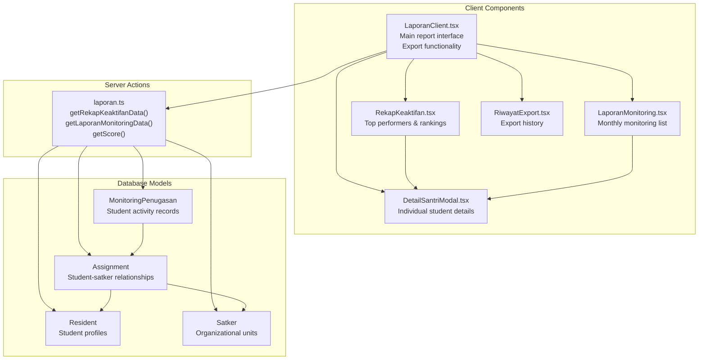
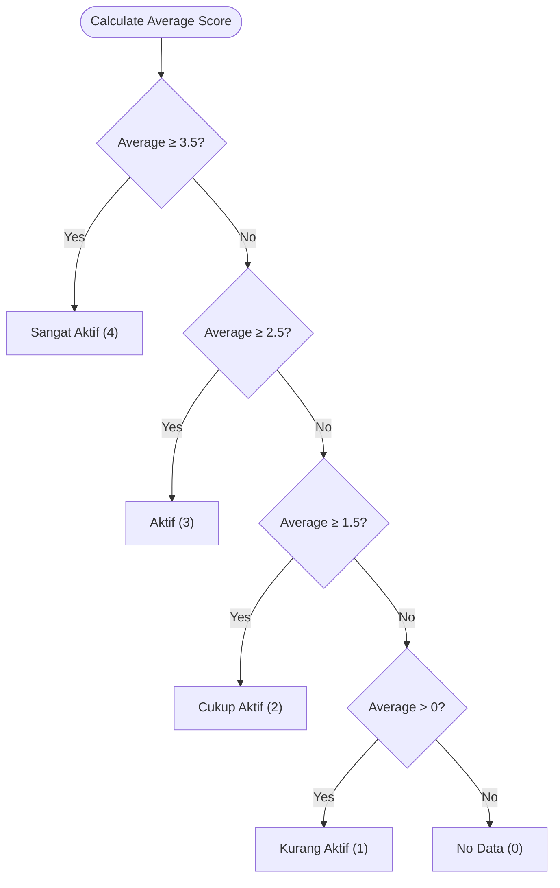
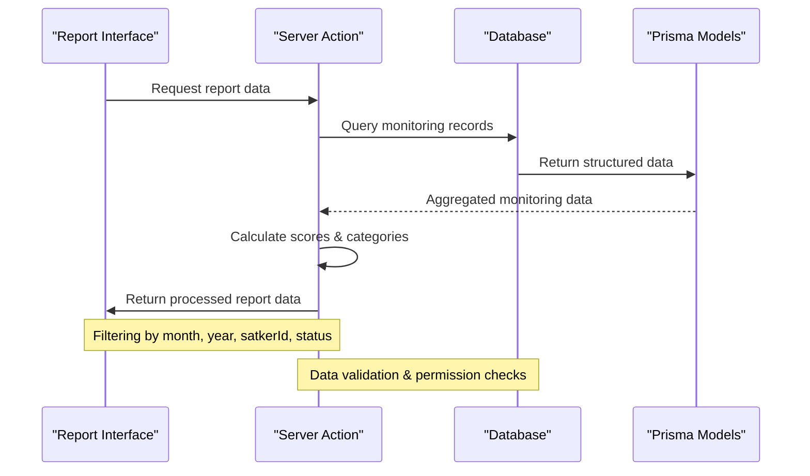
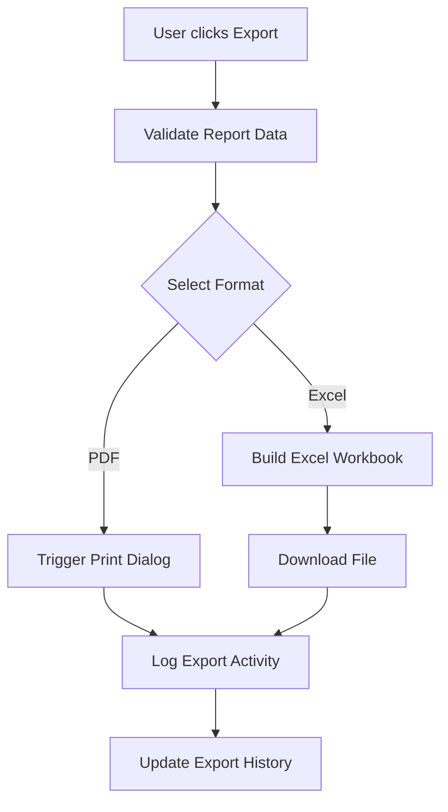
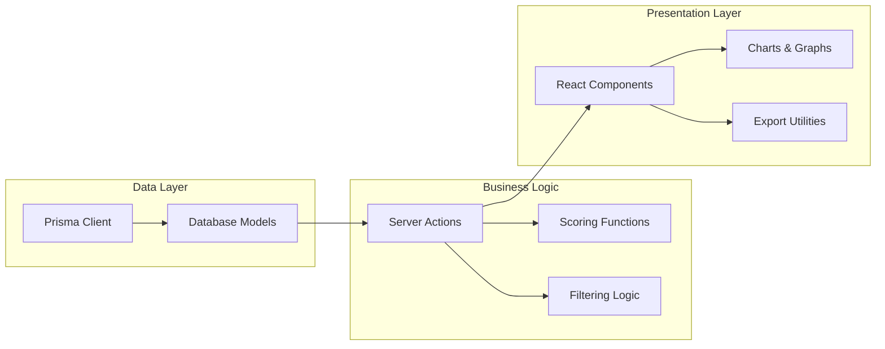

# Activity Reports

<cite>
**Referenced Files in This Document**
- [laporan.ts](file://src/app/actions/laporan.ts)
- [RekapKeaktifan.tsx](file://src/components/dashboard/laporan/RekapKeaktifan.tsx)
- [LaporanMonitoring.tsx](file://src/components/dashboard/laporan/LaporanMonitoring.tsx)
- [DetailSantriModal.tsx](file://src/components/dashboard/laporan/DetailSantriModal.tsx)
- [LaporanClient.tsx](file://src/components/dashboard/laporan/LaporanClient.tsx)
- [RiwayatExport.tsx](file://src/components/dashboard/laporan/RiwayatExport.tsx)
- [schema.prisma](file://prisma/schema.prisma)
</cite>

## Table of Contents
1. [Introduction](#introduction)
2. [Project Structure](#project-structure)
3. [Core Components](#core-components)
4. [Architecture Overview](#architecture-overview)
5. [Detailed Component Analysis](#detailed-component-analysis)
6. [Dependency Analysis](#dependency-analysis)
7. [Performance Considerations](#performance-considerations)
8. [Troubleshooting Guide](#troubleshooting-guide)
9. [Conclusion](#conclusion)

## Introduction
This document provides comprehensive technical documentation for the activity reporting system, focusing on:
- Student activity summary generation via getRekapKeaktifanData()
- Detailed monitoring reports via getLaporanMonitoringData()
- Activity scoring system and status categorization
- Filtering and sorting mechanisms
- Data export capabilities and report formatting

The system integrates server-side data processing with client-side visualization, enabling administrators to track student engagement across various organizational units (satkers).

## Project Structure
The activity reporting system spans server actions, client components, and database models:

**Diagram sources**
- [laporan.ts:122-289](file://src/app/actions/laporan.ts#L122-L289)
- [RekapKeaktifan.tsx:1-188](file://src/components/dashboard/laporan/RekapKeaktifan.tsx#L1-L188)
- [LaporanMonitoring.tsx:1-115](file://src/components/dashboard/laporan/LaporanMonitoring.tsx#L1-L115)
- [DetailSantriModal.tsx:1-339](file://src/components/dashboard/laporan/DetailSantriModal.tsx#L1-L339)
- [LaporanClient.tsx:1-430](file://src/components/dashboard/laporan/LaporanClient.tsx#L1-L430)
- [RiwayatExport.tsx:1-87](file://src/components/dashboard/laporan/RiwayatExport.tsx#L1-L87)
- [schema.prisma:115-149](file://prisma/schema.prisma#L115-L149)

**Section sources**
- [laporan.ts:1-565](file://src/app/actions/laporan.ts#L1-L565)
- [schema.prisma:115-149](file://prisma/schema.prisma#L115-L149)

## Core Components
This section documents the primary functions and their data processing logic.

### Activity Scoring System
The system uses a fixed-point scoring scale where each status category receives a predefined numeric value:

| Status Category | Numeric Score | Description |
|----------------|---------------|-------------|
| Sangat Aktif | 4 | Excellent performance |
| Aktif | 3 | Good performance |
| Cukup Aktif | 2 | Satisfactory performance |
| Kurang Aktif | 1 | Needs improvement |
| Other/Empty | 0 | Not applicable |

Scoring implementation:
- Centralized scoring via getScore() function
- Consistent application across all reporting functions
- Supports both server-side aggregation and client-side visualization

**Section sources**
- [laporan.ts:9-18](file://src/app/actions/laporan.ts#L9-L18)

### Status Categorization Algorithm
The system categorizes student activity based on calculated averages:

**Diagram sources**
- [laporan.ts:168-174](file://src/app/actions/laporan.ts#L168-L174)

**Section sources**
- [laporan.ts:168-174](file://src/app/actions/laporan.ts#L168-L174)

## Architecture Overview
The reporting system follows a layered architecture with clear separation between data processing and presentation:

**Diagram sources**
- [laporan.ts:122-195](file://src/app/actions/laporan.ts#L122-L195)
- [laporan.ts:236-289](file://src/app/actions/laporan.ts#L236-L289)

## Detailed Component Analysis

### getRekapKeaktifanData() - Student Activity Summary
This function generates comprehensive activity summaries for all students within specified filters.

#### Input Parameters
- bulan: Month filter (optional)
- tahun: Year filter (optional) 
- satkerId: Organizational unit filter (optional)

#### Processing Logic
1. **Permission Validation**: Ensures user has dashboard.view permission
2. **Satker Restriction**: Automatically restricts to user's satker if they lack global access
3. **Data Collection**: Retrieves active assignments with associated monitoring records
4. **Score Calculation**: Computes weighted average using getScore() function
5. **Category Assignment**: Applies categorization algorithm based on average score
6. **Sorting**: Orders results by descending score for ranking display

#### Output Structure
Each record includes:
- Student identification (id, name, NIM)
- Organizational unit (satker)
- Performance metrics (average score, total monitoring count)
- Categorized status level
- Numerical score for sorting

**Section sources**
- [laporan.ts:122-195](file://src/app/actions/laporan.ts#L122-L195)
- [RekapKeaktifan.tsx:1-188](file://src/components/dashboard/laporan/RekapKeaktifan.tsx#L1-L188)

### getLaporanMonitoringData() - Detailed Monitoring Reports
This function provides granular monitoring data with comprehensive filtering capabilities.

#### Advanced Filtering Options
- **Time Range**: Month and year combination for temporal filtering
- **Status Filter**: Specific activity status categories
- **Organizational Unit**: Target specific satkers
- **Permission Control**: Automatic restriction based on user access level

#### Data Transformation
The function transforms raw monitoring records into a standardized format:
- Student identifiers (id, name, NIM)
- Organizational unit information
- Status categorization
- Timestamped monitoring entries
- Associated notes/comments

**Section sources**
- [laporan.ts:236-289](file://src/app/actions/laporan.ts#L236-L289)
- [LaporanMonitoring.tsx:1-115](file://src/components/dashboard/laporan/LaporanMonitoring.tsx#L1-L115)

### Individual Student Detail View
The DetailSantriModal component provides comprehensive individual student analytics:

#### Key Features
- **Profile Information**: Personal details and academic background
- **Assignment History**: Complete placement timeline across organizations
- **Activity Timeline**: Chronological monitoring records with status progression
- **Visual Analytics**: Line charts displaying performance trends over time
- **Interactive Elements**: Filtering and export capabilities

#### Chart Implementation
The visualization component:
- Sorts monitoring records chronologically
- Maps status categories to numeric scores
- Generates smooth line curves for trend visualization
- Provides interactive tooltips with status details

**Section sources**
- [DetailSantriModal.tsx:1-339](file://src/components/dashboard/laporan/DetailSantriModal.tsx#L1-L339)

### Export and Reporting Capabilities
The system supports multiple export formats and reporting options:

#### Supported Formats
- **Excel (.xlsx)**: Structured spreadsheet export
- **PDF Printing**: Print-optimized document generation
- **Export History Tracking**: Audit trail of generated reports

#### Export Workflow

**Diagram sources**
- [LaporanClient.tsx:161-221](file://src/components/dashboard/laporan/LaporanClient.tsx#L161-L221)
- [RiwayatExport.tsx:1-87](file://src/components/dashboard/laporan/RiwayatExport.tsx#L1-L87)

**Section sources**
- [LaporanClient.tsx:161-221](file://src/components/dashboard/laporan/LaporanClient.tsx#L161-L221)
- [RiwayatExport.tsx:1-87](file://src/components/dashboard/laporan/RiwayatExport.tsx#L1-L87)

## Dependency Analysis
The reporting system exhibits strong modular design with clear dependency relationships:

**Diagram sources**
- [laporan.ts:1-565](file://src/app/actions/laporan.ts#L1-L565)
- [schema.prisma:115-149](file://prisma/schema.prisma#L115-L149)

### Key Dependencies
- **Prisma ORM**: Handles database operations and model relationships
- **React Components**: Client-side rendering and user interaction
- **XLSX Library**: Excel export functionality
- **Recharts**: Data visualization components
- **Next.js Server Actions**: Secure server-side computation

**Section sources**
- [laporan.ts:1-565](file://src/app/actions/laporan.ts#L1-L565)
- [schema.prisma:115-149](file://prisma/schema.prisma#L115-L149)

## Performance Considerations
The system implements several optimization strategies:

### Database Optimization
- **Index Usage**: Proper indexing on frequently queried fields (date ranges, foreign keys)
- **Selective Queries**: Only retrieve necessary fields using Prisma select clauses
- **Aggregation Strategies**: Pre-compute statistics where possible to reduce runtime calculations

### Client-Side Efficiency
- **Memoization**: React.memo for component caching
- **Virtual Scrolling**: Large datasets handled efficiently
- **Lazy Loading**: Modal components load data on demand

### Caching Strategy
- **Server Session Management**: Authentication tokens cached in server sessions
- **Component State**: Local component state for filtered data
- **Export History**: Persistent storage of generated reports

## Troubleshooting Guide

### Common Issues and Solutions

#### Permission Denied Errors
**Symptoms**: Empty reports or access denied messages
**Causes**: Missing required permissions (dashboard.view, monitoring.view)
**Solutions**: Verify user role permissions and organizational access restrictions

#### Empty Report Results
**Symptoms**: Blank tables or zero counts
**Causes**: Incorrect date filters, no monitoring data, or organizational restrictions
**Solutions**: Adjust filter parameters and verify data availability

#### Performance Issues
**Symptoms**: Slow loading times for large datasets
**Causes**: Excessive data volume or complex queries
**Solutions**: Implement pagination, optimize filters, and consider data archiving

#### Export Failures
**Symptoms**: Failed downloads or corrupted files
**Causes**: Browser compatibility issues or insufficient memory
**Solutions**: Clear browser cache, try alternative browsers, or reduce dataset size

**Section sources**
- [laporan.ts:122-195](file://src/app/actions/laporan.ts#L122-L195)
- [LaporanClient.tsx:161-221](file://src/components/dashboard/laporan/LaporanClient.tsx#L161-L221)

## Conclusion
The activity reporting system provides a robust framework for monitoring and analyzing student engagement across organizational units. Its modular architecture ensures maintainability while the comprehensive filtering and export capabilities support diverse reporting needs. The standardized scoring system and consistent categorization algorithms enable reliable performance comparisons and targeted intervention strategies.

The system's emphasis on security through permission-based access control and data validation ensures responsible use of sensitive educational data, while the flexible export options facilitate integration with external reporting systems and stakeholder communication channels.