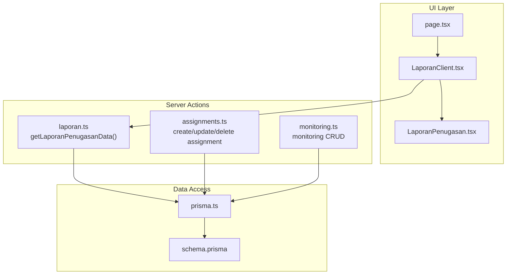
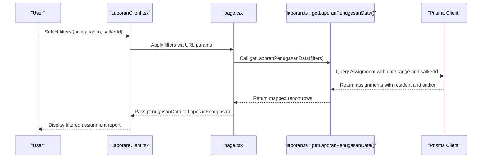
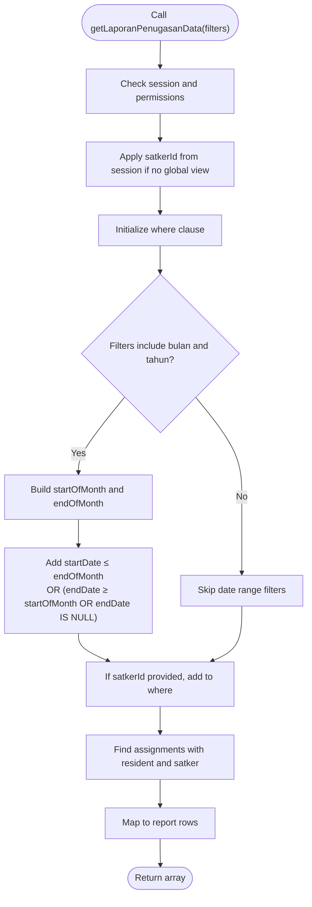
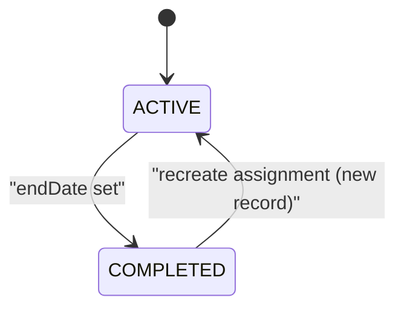
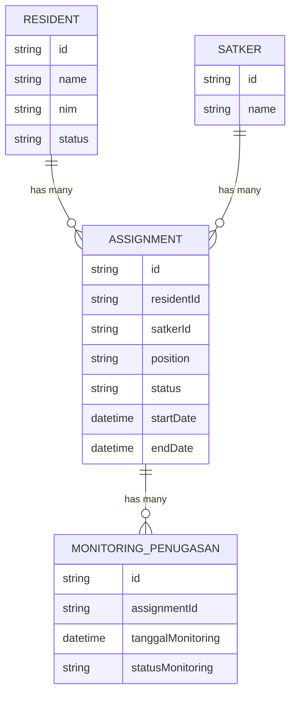
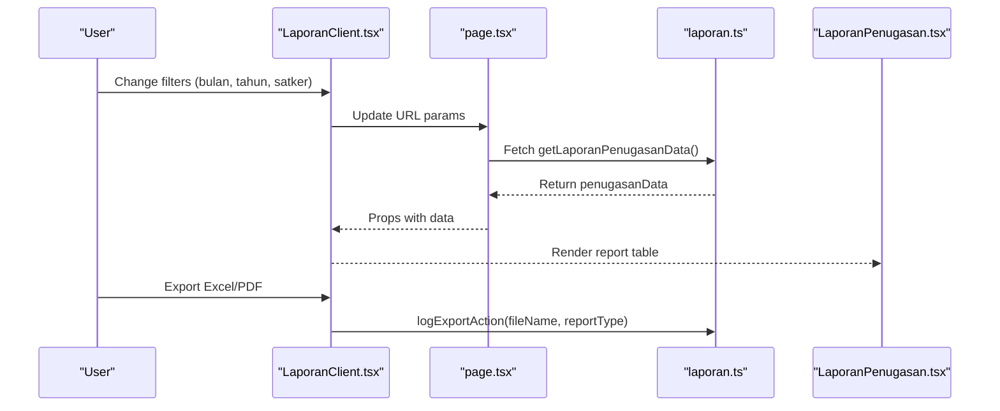
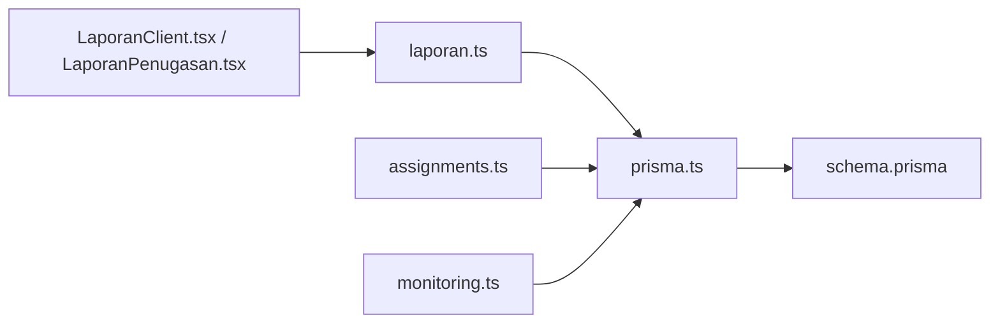

# Assignment Reports

<cite>
**Referenced Files in This Document**
- [laporan.ts](file://src/app/actions/laporan.ts)
- [assignments.ts](file://src/app/actions/assignments.ts)
- [prisma.ts](file://src/lib/prisma.ts)
- [schema.prisma](file://prisma/schema.prisma)
- [LaporanPenugasan.tsx](file://src/components/dashboard/laporan/LaporanPenugasan.tsx)
- [LaporanClient.tsx](file://src/components/dashboard/laporan/LaporanClient.tsx)
- [page.tsx](file://src/app/dashboard/laporan/page.tsx)
- [monitoring.ts](file://src/app/actions/monitoring.ts)
</cite>

## Table of Contents
1. [Introduction](#introduction)
2. [Project Structure](#project-structure)
3. [Core Components](#core-components)
4. [Architecture Overview](#architecture-overview)
5. [Detailed Component Analysis](#detailed-component-analysis)
6. [Dependency Analysis](#dependency-analysis)
7. [Performance Considerations](#performance-considerations)
8. [Troubleshooting Guide](#troubleshooting-guide)
9. [Conclusion](#conclusion)

## Introduction
This document explains the assignment reporting system with a focus on the getLaporanPenugasanData() function. It covers how assignment tracking reports are generated, including date range filtering for active assignments during specific months, assignment status tracking, resident assignment history, lifecycle management (start/end dates), continuous assignment detection, filtering by satkerId, and integration with resident and satker data models. It also documents the report generation process, UI components, and the underlying Prisma data model.

## Project Structure
The assignment reporting system spans server actions, UI components, and the Prisma data model:
- Server actions orchestrate report generation and data retrieval
- UI components render filters, tables, and export functionality
- Prisma models define the Assignment, Resident, Satker, and MonitoringPenugasan entities

**Diagram sources**
- [LaporanPenugasan.tsx:1-117](file://src/components/dashboard/laporan/LaporanPenugasan.tsx#L1-L117)
- [LaporanClient.tsx:1-430](file://src/components/dashboard/laporan/LaporanClient.tsx#L1-L430)
- [page.tsx:1-79](file://src/app/dashboard/laporan/page.tsx#L1-L79)
- [laporan.ts:291-341](file://src/app/actions/laporan.ts#L291-L341)
- [assignments.ts:128-215](file://src/app/actions/assignments.ts#L128-L215)
- [monitoring.ts:1-45](file://src/app/actions/monitoring.ts#L1-L45)
- [prisma.ts:1-31](file://src/lib/prisma.ts#L1-L31)
- [schema.prisma:115-149](file://prisma/schema.prisma#L115-L149)

**Section sources**
- [LaporanPenugasan.tsx:1-117](file://src/components/dashboard/laporan/LaporanPenugasan.tsx#L1-L117)
- [LaporanClient.tsx:1-430](file://src/components/dashboard/laporan/LaporanClient.tsx#L1-L430)
- [page.tsx:1-79](file://src/app/dashboard/laporan/page.tsx#L1-L79)
- [laporan.ts:291-341](file://src/app/actions/laporan.ts#L291-L341)
- [prisma.ts:1-31](file://src/lib/prisma.ts#L1-L31)
- [schema.prisma:115-149](file://prisma/schema.prisma#L115-L149)

## Core Components
- getLaporanPenugasanData(filters): Generates assignment tracking reports for a given month/year and optional satkerId. It filters assignments active during the specified period and returns resident, satker, start date, and status.
- LaporanPenugasan UI component: Renders the filtered assignment data with search and status badges.
- LaporanClient: Provides global filters (month, year, satker, status), manages tabs, and handles export to Excel/PDF.
- page.tsx: Orchestrates server-side data fetching for the report page and passes props to LaporanClient.

Key behaviors:
- Date range filtering ensures assignments that were active during the month (startDate ≤ last day of month AND (endDate ≥ first day of month OR endDate is null))
- Filtering by satkerId restricts results to a specific unit
- Report includes resident name, NIM, satker, start date, and status

**Section sources**
- [laporan.ts:291-341](file://src/app/actions/laporan.ts#L291-L341)
- [LaporanPenugasan.tsx:1-117](file://src/components/dashboard/laporan/LaporanPenugasan.tsx#L1-L117)
- [LaporanClient.tsx:136-160](file://src/components/dashboard/laporan/LaporanClient.tsx#L136-L160)
- [page.tsx:16-59](file://src/app/dashboard/laporan/page.tsx#L16-L59)

## Architecture Overview
The report pipeline follows a clear flow from UI to server actions and database queries.

**Diagram sources**
- [LaporanClient.tsx:136-160](file://src/components/dashboard/laporan/LaporanClient.tsx#L136-L160)
- [page.tsx:57-59](file://src/app/dashboard/laporan/page.tsx#L57-L59)
- [laporan.ts:291-341](file://src/app/actions/laporan.ts#L291-L341)

## Detailed Component Analysis

### getLaporanPenugasanData() Function
Purpose:
- Build assignment tracking reports for a selected month and year
- Filter assignments active during the month using start/end dates
- Optionally filter by satkerId
- Return resident, satker, start date, and status for reporting

Filtering logic:
- If both bulan and tahun are provided:
  - startDate ≤ last millisecond of the month
  - endDate is null OR endDate ≥ first day of the month
- Optional satkerId filter constrains results to a specific unit

Report output:
- Array of rows containing residentId, namaSantri, nim, satker, tanggalMulai, status

Integration points:
- Uses Prisma Assignment model with resident and satker relations
- Respects user permissions and satker visibility constraints

**Diagram sources**
- [laporan.ts:291-341](file://src/app/actions/laporan.ts#L291-L341)

**Section sources**
- [laporan.ts:291-341](file://src/app/actions/laporan.ts#L291-L341)

### Assignment Lifecycle Management
Lifecycle stages:
- Creation: Assignments are created with startDate and optional endDate; status defaults to ACTIVE
- Continuous assignment detection: If endDate is null, the assignment is considered active for the current period
- Completion: Updating endDate transitions status to COMPLETED (status field default is ACTIVE; explicit updates may be required)

Start/end date calculations:
- Start date: Defaults to current date if not provided
- End date: Optional; absence indicates ongoing assignment

**Diagram sources**
- [schema.prisma:115-127](file://prisma/schema.prisma#L115-L127)
- [laporan.ts:305-317](file://src/app/actions/laporan.ts#L305-L317)

**Section sources**
- [schema.prisma:115-127](file://prisma/schema.prisma#L115-L127)
- [laporan.ts:305-317](file://src/app/actions/laporan.ts#L305-L317)

### Resident Assignment History
The system supports retrieving a resident’s complete assignment history:
- Resident profile includes all assignments ordered by start date
- Each assignment includes satker, position, start/end dates, and status
- Monitoring records are included for activity tracking

**Diagram sources**
- [schema.prisma:44-149](file://prisma/schema.prisma#L44-L149)

**Section sources**
- [laporan.ts:359-422](file://src/app/actions/laporan.ts#L359-L422)
- [schema.prisma:44-149](file://prisma/schema.prisma#L44-L149)

### Report Generation and UI Integration
- Filters: Month, year, and optional satker selection
- Export: Excel and PDF export buttons with logging via logExportAction
- UI rendering: LaporanPenugasan displays resident, satker, start date, and status with searchable fields

**Diagram sources**
- [LaporanClient.tsx:136-221](file://src/components/dashboard/laporan/LaporanClient.tsx#L136-L221)
- [page.tsx:57-59](file://src/app/dashboard/laporan/page.tsx#L57-L59)
- [laporan.ts:291-341](file://src/app/actions/laporan.ts#L291-L341)
- [LaporanPenugasan.tsx:1-117](file://src/components/dashboard/laporan/LaporanPenugasan.tsx#L1-L117)

**Section sources**
- [LaporanClient.tsx:136-221](file://src/components/dashboard/laporan/LaporanClient.tsx#L136-L221)
- [page.tsx:57-59](file://src/app/dashboard/laporan/page.tsx#L57-L59)
- [LaporanPenugasan.tsx:1-117](file://src/components/dashboard/laporan/LaporanPenugasan.tsx#L1-L117)

## Dependency Analysis
- getLaporanPenugasanData depends on Prisma client initialization and schema models
- UI components depend on server actions for data and export logging
- Assignment lifecycle is enforced by Prisma model constraints and server action upsert logic

**Diagram sources**
- [LaporanClient.tsx:1-430](file://src/components/dashboard/laporan/LaporanClient.tsx#L1-L430)
- [LaporanPenugasan.tsx:1-117](file://src/components/dashboard/laporan/LaporanPenugasan.tsx#L1-L117)
- [laporan.ts:291-341](file://src/app/actions/laporan.ts#L291-L341)
- [assignments.ts:128-215](file://src/app/actions/assignments.ts#L128-L215)
- [monitoring.ts:1-45](file://src/app/actions/monitoring.ts#L1-L45)
- [prisma.ts:1-31](file://src/lib/prisma.ts#L1-L31)
- [schema.prisma:115-149](file://prisma/schema.prisma#L115-L149)

**Section sources**
- [laporan.ts:291-341](file://src/app/actions/laporan.ts#L291-L341)
- [prisma.ts:1-31](file://src/lib/prisma.ts#L1-L31)
- [schema.prisma:115-149](file://prisma/schema.prisma#L115-L149)

## Performance Considerations
- Indexes: The Assignment model includes indices on satkerId and a unique composite index on residentId and satkerId, aiding fast lookups and preventing duplicate active assignments
- Query patterns: Filtering by date ranges and optional satkerId leverages where clauses; ensure appropriate database indexing for optimal performance
- Pagination: For very large datasets, consider adding pagination to reduce payload sizes

[No sources needed since this section provides general guidance]

## Troubleshooting Guide
Common issues and resolutions:
- Unauthorized access: Ensure the user has the required permission for viewing reports
- No data returned: Verify filters (bulan, tahun, satkerId) and that assignments meet the active-during-month criteria
- Incorrect date filtering: Confirm that the date range logic considers both startDate ≤ endOfMonth and (endDate ≥ startOfMonth OR endDate is null)
- Export failures: Check logExportAction and ensure proper session and permissions

**Section sources**
- [laporan.ts:291-341](file://src/app/actions/laporan.ts#L291-L341)
- [LaporanClient.tsx:161-221](file://src/components/dashboard/laporan/LaporanClient.tsx#L161-L221)

## Conclusion
The assignment reporting system centers around getLaporanPenugasanData(), which accurately captures assignments active during a specified month using robust date-range filtering and optional satkerId constraints. It integrates seamlessly with UI components for filtering, rendering, and exporting reports while leveraging Prisma models for resident, satker, and assignment history tracking. The lifecycle management and continuous assignment detection ensure accurate reporting across time-bound tasks.