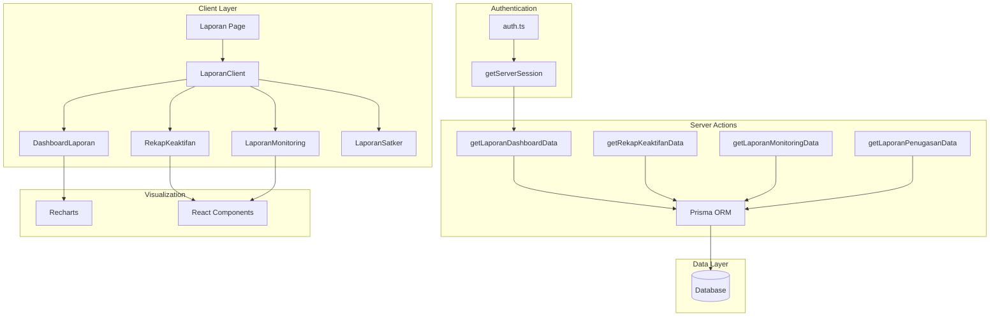
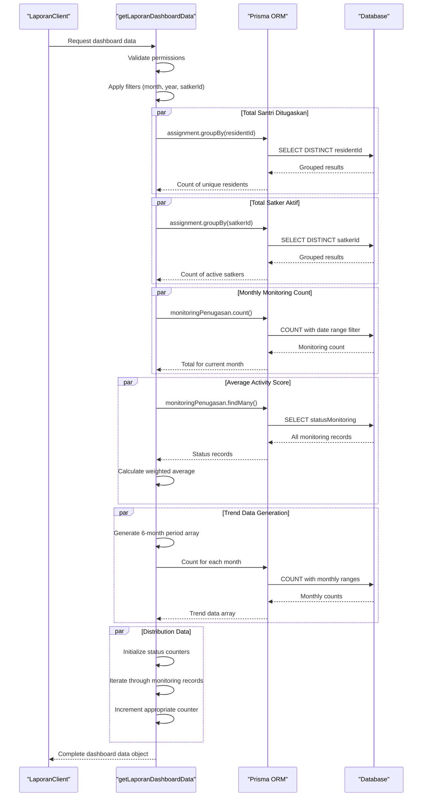
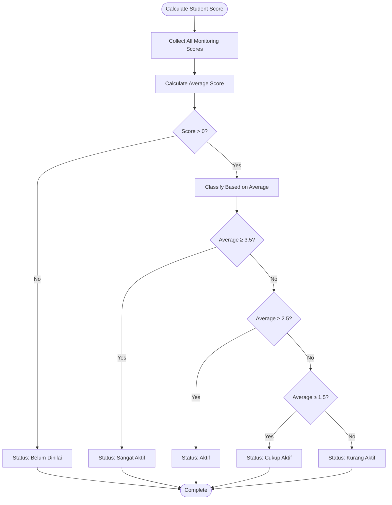
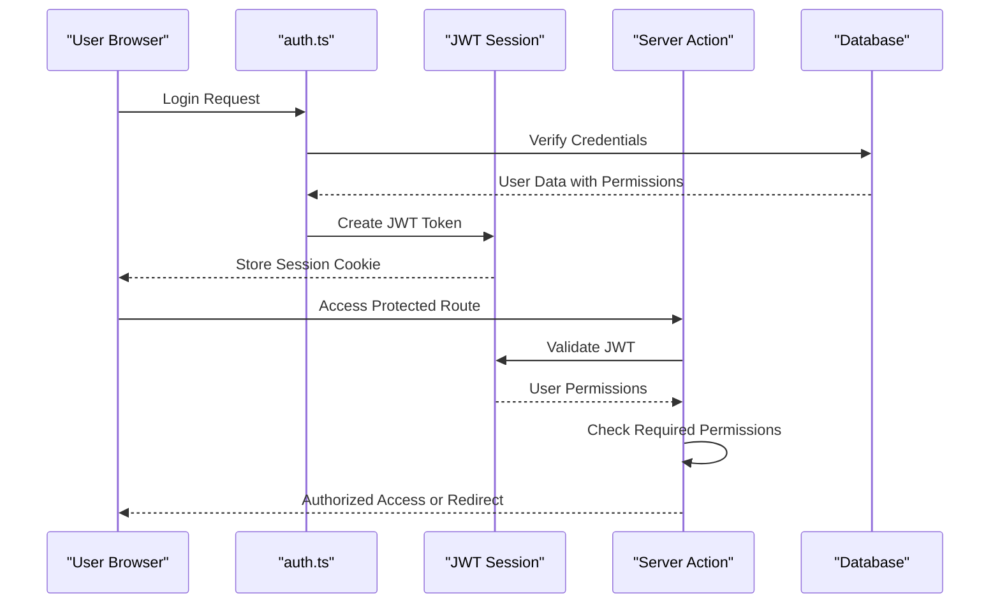

# Dashboard Analytics

<cite>
**Referenced Files in This Document**
- [page.tsx](file://src/app/dashboard/laporan/page.tsx)
- [laporan.ts](file://src/app/actions/laporan.ts)
- [LaporanClient.tsx](file://src/components/dashboard/laporan/LaporanClient.tsx)
- [DashboardLaporan.tsx](file://src/components/dashboard/laporan/DashboardLaporan.tsx)
- [RekapKeaktifan.tsx](file://src/components/dashboard/laporan/RekapKeaktifan.tsx)
- [LaporanMonitoring.tsx](file://src/components/dashboard/laporan/LaporanMonitoring.tsx)
- [DashboardKepalaSatkerClient.tsx](file://src/components/dashboard/kepala-satker/DashboardKepalaSatkerClient.tsx)
- [auth.ts](file://src/lib/auth.ts)
</cite>

## Table of Contents
1. [Introduction](#introduction)
2. [System Architecture](#system-architecture)
3. [Core Analytics Functions](#core-analytics-functions)
4. [Activity Scoring System](#activity-scoring-system)
5. [Data Visualization Components](#data-visualization-components)
6. [Filtering and Permission System](#filtering-and-permission-system)
7. [Real-time Features](#real-time-features)
8. [Performance Analysis](#performance-analysis)
9. [Troubleshooting Guide](#troubleshooting-guide)
10. [Conclusion](#conclusion)

## Introduction

The Dashboard Analytics system is a comprehensive reporting and monitoring platform designed for managing and analyzing student activities within the Asrama (dormitory) management system. This system provides real-time insights into student engagement, activity distributions, and performance metrics across multiple organizational units called "Satkers" (work units).

The analytics dashboard aggregates data from various sources including student assignments, monitoring records, and activity logs to present actionable insights through interactive visualizations and comprehensive reporting capabilities.

## System Architecture

The dashboard analytics system follows a modern Next.js architecture with server-side data fetching and client-side rendering:



**Diagram sources**
- [page.tsx:16-79](file://src/app/dashboard/laporan/page.tsx#L16-L79)
- [laporan.ts:20-120](file://src/app/actions/laporan.ts#L20-L120)
- [LaporanClient.tsx:87-430](file://src/components/dashboard/laporan/LaporanClient.tsx#L87-L430)

## Core Analytics Functions

### Dashboard Data Aggregation

The system provides comprehensive dashboard analytics through the `getLaporanDashboardData()` function, which performs sophisticated data aggregation across multiple dimensions:



**Diagram sources**
- [laporan.ts:20-120](file://src/app/actions/laporan.ts#L20-L120)

### Key Metrics Calculation

The system calculates several critical metrics for dashboard display:

**Total Santri Ditugaskan** (`totalSantriDitugaskan`)
- Counts distinct active assignments per resident
- Uses database grouping to avoid duplicate counting
- Filters by assignment status and optional satkerId

**Total Satker Aktif** (`totalSatkerAktif`)
- Counts active satkers based on assignment presence
- Returns 1 when viewing specific satker (limiting scope)
- Provides organizational context for reporting

**Total Monitoring Bulan Ini** (`totalMonitoringBulanIni`)
- Counts monitoring records for the current month
- Applies date range filtering using database operators
- Supports month/year filtering for historical analysis

**Average Activity Score** (`averageKeaktifan`)
- Calculates weighted average based on status categories
- Uses predefined scoring system (4=Very Active, 3=Active, 2=Moderately Active, 1=Needs Improvement)
- Normalizes scores to percentage scale (0-100%)

**Section sources**
- [laporan.ts:20-120](file://src/app/actions/laporan.ts#L20-L120)

## Activity Scoring System

### KEAKTIFAN_SCORE Mapping

The activity scoring system uses a standardized 4-point scale:

| Status Category | Score Value | Description |
|----------------|-------------|-------------|
| Sangat Aktif | 4 | Excellent participation and performance |
| Aktif | 3 | Good engagement and compliance |
| Cukup Aktif | 2 | Satisfactory but needs improvement |
| Kurang Aktif | 1 | Requires intervention and support |

### Average Keaktifan Calculation Formula

The system calculates the average activity score using the following formula:

```
averageKeaktifan = (Σ(score × weight) / (validCount × maxScore)) × 100
```

Where:
- `score` = individual monitoring score (1-4)
- `weight` = frequency of occurrence
- `validCount` = total number of valid monitoring records
- `maxScore` = maximum possible score per record (4)

### Individual Student Scoring

Student-level activity classification follows this algorithm:



**Diagram sources**
- [laporan.ts:122-195](file://src/app/actions/laporan.ts#L122-L195)

**Section sources**
- [laporan.ts:9-18](file://src/app/actions/laporan.ts#L9-L18)
- [laporan.ts:122-195](file://src/app/actions/laporan.ts#L122-L195)

## Data Visualization Components

### DashboardLaporan Component

The dashboard visualization component presents two primary charts:

**Trend Monitoring Chart (Bar Chart)**
- Displays monthly monitoring trends for the last 6 months
- Uses Recharts library for responsive data visualization
- Shows bar heights proportional to monitoring counts
- Includes interactive tooltips and legends

**Distribution Chart (Pie Chart)**
- Visualizes activity status distributions
- Color-coded segments for different activity levels
- Responsive design that adapts to container size
- Automatic filtering of zero-value categories

### RekapKeaktifan Component

The activity recap component provides:

**Top Performers Section**
- Lists top 10 most active students
- Highlights students needing guidance/support
- Sorts by calculated activity scores
- Displays rank positions and average scores

**Full Activity Table**
- Comprehensive listing of all monitored students
- Search functionality for quick filtering
- Status badges with color coding
- Detailed score breakdowns

**Section sources**
- [DashboardLaporan.tsx:14-79](file://src/components/dashboard/laporan/DashboardLaporan.tsx#L14-L79)
- [RekapKeaktifan.tsx:1-188](file://src/components/dashboard/laporan/RekapKeaktifan.tsx#L1-L188)

## Filtering and Permission System

### Session-Based Authentication

The system implements robust session-based authentication using NextAuth.js:



**Diagram sources**
- [auth.ts:14-50](file://src/lib/auth.ts#L14-L50)

### Permission Validation

The system enforces granular permissions:

**Dashboard Access Control**
- `dashboard.view`: Required for accessing analytics data
- `laporan.view`: Required for viewing reports
- `monitoring.view`: Required for monitoring data
- `penugasan.view`: Required for assignment data
- `laporan.export`: Required for export functionality

**Role-Based Restrictions**
- Super Admin: Full access to all data and functions
- Kepala Satker: Limited to their assigned satker data
- Regular Users: Restricted based on assigned permissions

### Filtering Mechanisms

The system supports comprehensive filtering:

**URL Parameter Filters**
- `bulan`: Month selection (1-12)
- `tahun`: Year selection (2024-2027)
- `satkerId`: Specific satker filtering
- `status`: Activity status filtering

**Dynamic Filter Application**
- Real-time URL updates when filters change
- Reset functionality to restore defaults
- Persistent filter state across page navigation

**Section sources**
- [page.tsx:16-79](file://src/app/dashboard/laporan/page.tsx#L16-L79)
- [LaporanClient.tsx:137-159](file://src/components/dashboard/laporan/LaporanClient.tsx#L137-L159)
- [auth.ts:53-80](file://src/lib/auth.ts#L53-L80)

## Real-time Features

### Live Clock and Date Display

The dashboard includes real-time updating clocks:

**Islamic Calendar Integration**
- Hijri date display using Umalqura calendar
- Automatic synchronization with system time
- Fallback handling for calendar conversion errors

**Clock Updates**
- Second-level precision for live clock display
- Automatic refresh every 1000ms
- Timezone handling for WIB (Western Indonesia Time)

### Automatic Data Refresh

**Server-Side Rendering with Caching**
- ISR (Incremental Static Regeneration) with 30-second cache
- Automatic background refresh without user intervention
- Cache invalidation on data changes

**Client-Side Updates**
- URL parameter synchronization for filter persistence
- Real-time chart updates when filters change
- Export history updates after successful exports

**Section sources**
- [page.tsx:38-73](file://src/app/dashboard/page.tsx#L38-L73)
- [LaporanClient.tsx:161-221](file://src/components/dashboard/laporan/LaporanClient.tsx#L161-L221)

## Performance Analysis

### Database Optimization Strategies

**Efficient Query Patterns**
- Single-pass aggregation using database grouping
- Selective field retrieval to minimize bandwidth
- Index-friendly date range queries
- Batch operations for export logging

**Memory Management**
- Streaming data processing for large datasets
- Client-side pagination for table components
- Lazy loading for chart components
- Efficient state management for filters

### Scalability Considerations

**Horizontal Scaling**
- Stateless server actions for load balancing
- Shared database connection pooling
- CDN-ready static assets
- Optimized image and chart rendering

**Performance Monitoring**
- Query execution time tracking
- Memory usage monitoring
- Response time analysis
- Database connection pool utilization

## Troubleshooting Guide

### Common Issues and Solutions

**Permission Denied Errors**
- Verify user has required permission codes
- Check role assignment in user profile
- Confirm session validity and expiration
- Review database permission associations

**Missing Data in Reports**
- Validate date range selections
- Check satkerId filtering constraints
- Verify monitoring records exist for selected period
- Confirm assignment status is active

**Performance Issues**
- Monitor database query execution times
- Check for missing database indexes
- Review chart rendering performance
- Optimize large dataset pagination

**Authentication Problems**
- Verify NextAuth configuration
- Check JWT token validity
- Review session storage issues
- Confirm database connectivity

### Debug Information Collection

**Server Action Logging**
- Error messages with stack traces
- Database query execution plans
- Session validation results
- Permission check outcomes

**Client-Side Diagnostics**
- Network request/response analysis
- Component state snapshots
- Chart rendering errors
- Filter parameter validation

**Section sources**
- [laporan.ts:116-119](file://src/app/actions/laporan.ts#L116-L119)
- [LaporanClient.tsx:214-221](file://src/components/dashboard/laporan/LaporanClient.tsx#L214-L221)

## Conclusion

The Dashboard Analytics system provides a comprehensive solution for monitoring and analyzing student activities within the Asrama management system. Through its sophisticated data aggregation functions, standardized activity scoring system, and rich visualization capabilities, the platform enables informed decision-making and effective resource allocation.

Key strengths of the system include its robust permission model, efficient database queries, real-time data presentation, and comprehensive filtering capabilities. The modular architecture ensures maintainability and scalability while providing immediate value through actionable insights.

Future enhancements could include advanced predictive analytics, automated reporting schedules, and expanded export formats to further improve the analytical capabilities of the system.