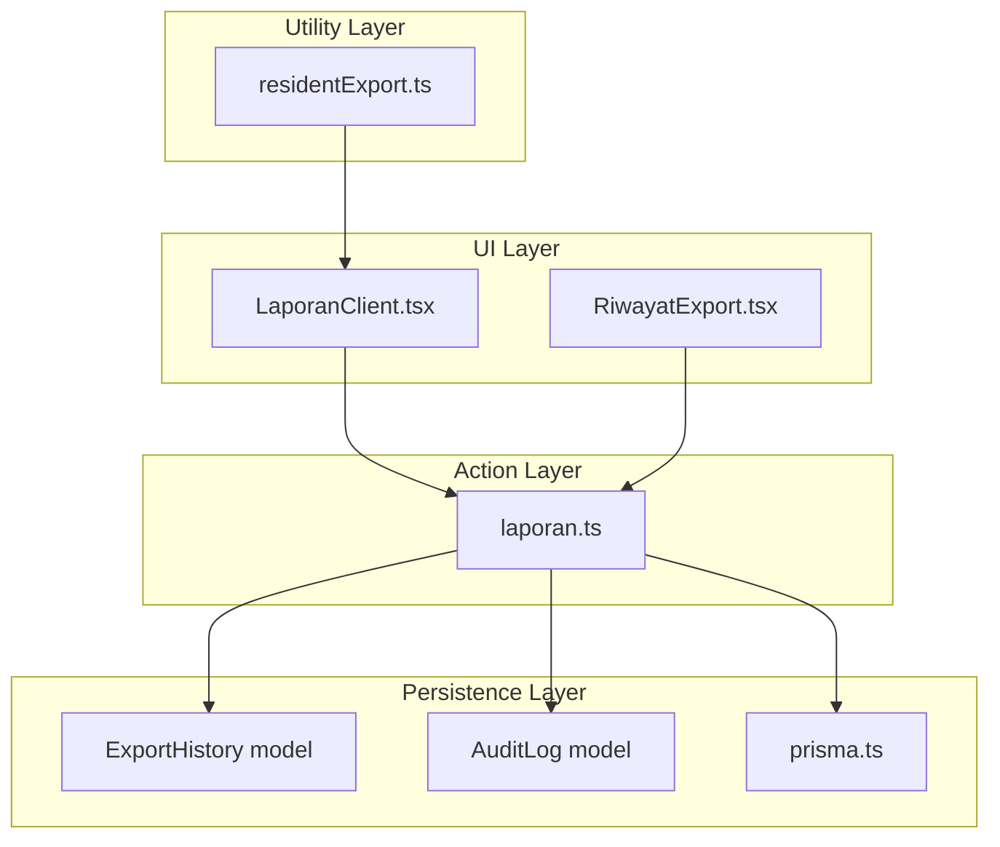
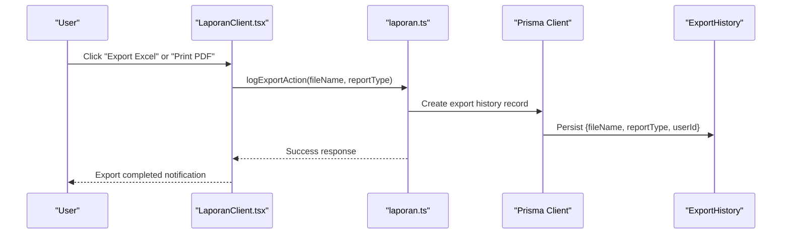
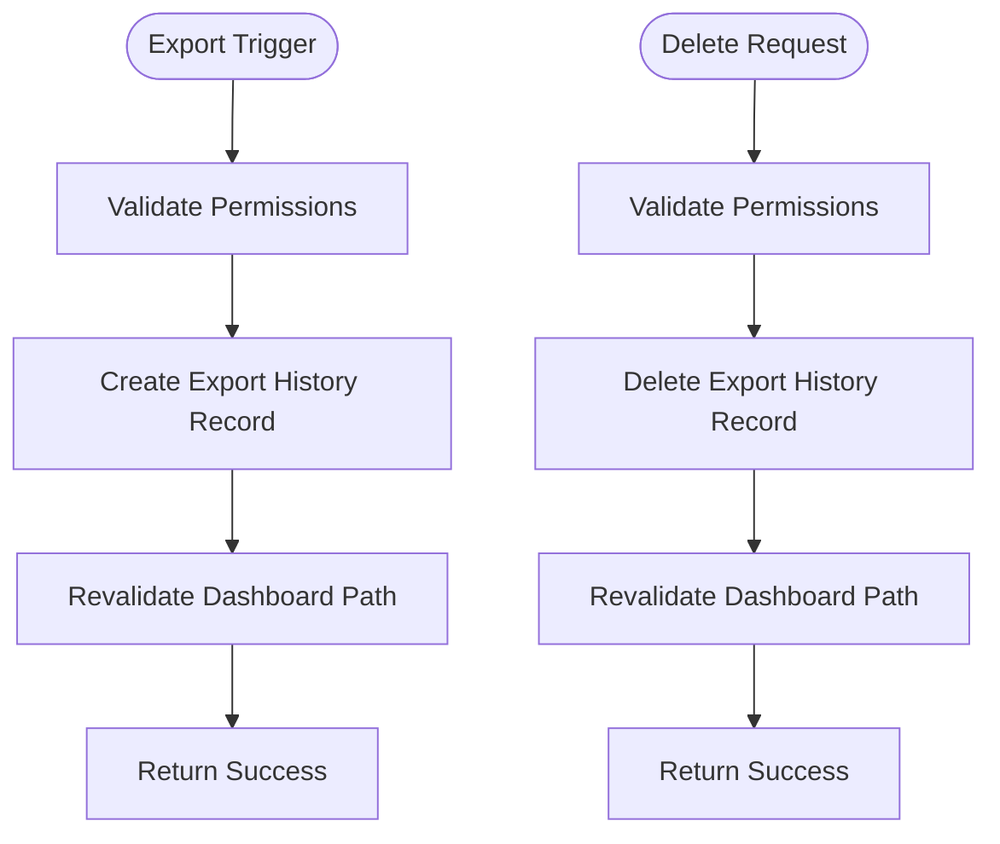
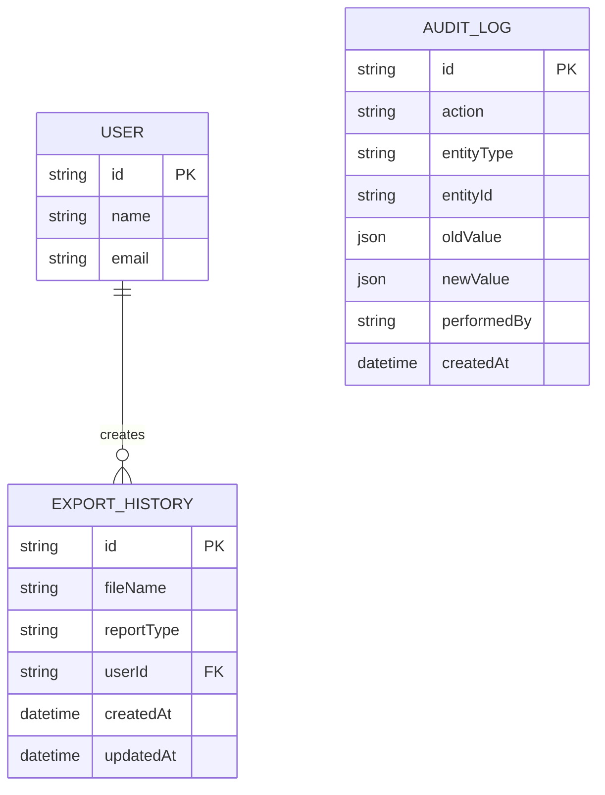
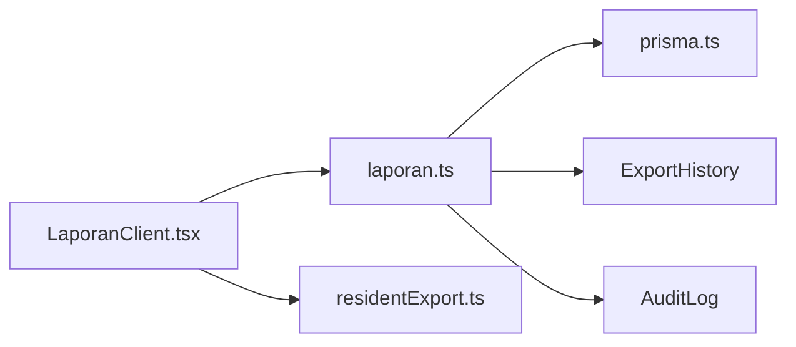

# Export System

<cite>
**Referenced Files in This Document**
- [residentExport.ts](file://src/utils/residentExport.ts)
- [laporan.ts](file://src/app/actions/laporan.ts)
- [RiwayatExport.tsx](file://src/components/dashboard/laporan/RiwayatExport.tsx)
- [schema.prisma](file://prisma/schema.prisma)
- [LaporanClient.tsx](file://src/components/dashboard/laporan/LaporanClient.tsx)
- [page.tsx](file://src/app/dashboard/laporan/page.tsx)
- [prisma.ts](file://src/lib/prisma.ts)
- [audit.ts](file://src/app/actions/audit.ts)
</cite>

## Table of Contents
1. [Introduction](#introduction)
2. [Project Structure](#project-structure)
3. [Core Components](#core-components)
4. [Architecture Overview](#architecture-overview)
5. [Detailed Component Analysis](#detailed-component-analysis)
6. [Dependency Analysis](#dependency-analysis)
7. [Performance Considerations](#performance-considerations)
8. [Troubleshooting Guide](#troubleshooting-guide)
9. [Conclusion](#conclusion)

## Introduction
This document provides comprehensive documentation for the export system functionality within the application. It covers the export workflow, including logging export activities, managing export history, and deleting individual export records. It also explains file naming conventions, report type categorization, user attribution, and compliance logging for audit purposes. The documentation includes integration points with resident export utilities, supported export formats, and download mechanisms.

## Project Structure
The export system spans several layers:
- Action layer: server-side functions that orchestrate export-related operations and persist audit/tracking data.
- UI layer: client components that render export history and trigger export actions.
- Utility layer: helper functions for generating resident reports and printing.
- Persistence layer: Prisma models and database schema for export history and audit logs.

**Diagram sources**
- [LaporanClient.tsx:173-239](file://src/components/dashboard/laporan/LaporanClient.tsx#L173-L239)
- [RiwayatExport.tsx:1-111](file://src/components/dashboard/laporan/RiwayatExport.tsx#L1-L111)
- [laporan.ts:197-226](file://src/app/actions/laporan.ts#L197-L226)
- [residentExport.ts:1-123](file://src/utils/residentExport.ts#L1-L123)
- [schema.prisma:367-378](file://prisma/schema.prisma#L367-L378)
- [prisma.ts:1-31](file://src/lib/prisma.ts#L1-L31)

**Section sources**
- [LaporanClient.tsx:173-239](file://src/components/dashboard/laporan/LaporanClient.tsx#L173-L239)
- [RiwayatExport.tsx:1-111](file://src/components/dashboard/laporan/RiwayatExport.tsx#L1-L111)
- [laporan.ts:197-226](file://src/app/actions/laporan.ts#L197-L226)
- [residentExport.ts:1-123](file://src/utils/residentExport.ts#L1-L123)
- [schema.prisma:367-378](file://prisma/schema.prisma#L367-L378)
- [prisma.ts:1-31](file://src/lib/prisma.ts#L1-L31)

## Core Components
- logExportAction(): Server action that logs export events with filename, report type, and user ID, and triggers cache revalidation.
- getExportHistory(): Server action that retrieves export history ordered by creation time, including user attribution.
- deleteExportHistory(): Server action that deletes a specific export history record after permission verification.
- ExportHistory model: Database model storing export metadata and user relationship.
- AuditLog model: Database model supporting compliance logging for audit trails.
- Resident export utilities: Functions for CSV generation, Excel template creation, and PDF printing.

**Section sources**
- [laporan.ts:197-226](file://src/app/actions/laporan.ts#L197-L226)
- [schema.prisma:367-378](file://prisma/schema.prisma#L367-L378)
- [residentExport.ts:6-31](file://src/utils/residentExport.ts#L6-L31)
- [residentExport.ts:33-42](file://src/utils/residentExport.ts#L33-L42)
- [residentExport.ts:44-122](file://src/utils/residentExport.ts#L44-L122)
- [audit.ts:1-117](file://src/app/actions/audit.ts#L1-L117)

## Architecture Overview
The export system follows a layered architecture:
- UI triggers export actions via client components.
- Actions validate permissions, gather data, and write to persistence.
- Export history and audit logs are stored separately for traceability and compliance.
- Utilities provide standardized export formats and naming conventions.

**Diagram sources**
- [LaporanClient.tsx:173-239](file://src/components/dashboard/laporan/LaporanClient.tsx#L173-L239)
- [laporan.ts:197-215](file://src/app/actions/laporan.ts#L197-L215)
- [schema.prisma:367-378](file://prisma/schema.prisma#L367-L378)
- [prisma.ts:1-31](file://src/lib/prisma.ts#L1-L31)

## Detailed Component Analysis

### Export History Management
The export history is managed through three primary actions:
- logExportAction(fileName, reportType): Creates a new export history record with the current user's ID and revalidates the dashboard path.
- getExportHistory(): Retrieves all export history entries ordered by creation time, including associated user names.
- deleteExportHistory(id): Removes a specific export history record after verifying permissions.

**Diagram sources**
- [laporan.ts:197-215](file://src/app/actions/laporan.ts#L197-L215)
- [laporan.ts:217-226](file://src/app/actions/laporan.ts#L217-L226)
- [laporan.ts:343-357](file://src/app/actions/laporan.ts#L343-L357)

**Section sources**
- [laporan.ts:197-215](file://src/app/actions/laporan.ts#L197-L215)
- [laporan.ts:217-226](file://src/app/actions/laporan.ts#L217-L226)
- [laporan.ts:343-357](file://src/app/actions/laporan.ts#L343-L357)

### Export File Naming Conventions
- Excel exports generated from the LaporanClient use a structured naming pattern that includes the active tab, selected month, and year.
- CSV exports for resident data use a standardized prefix with a date suffix.
- PDF exports follow a similar naming convention to Excel, incorporating the active tab and date context.

These naming conventions ensure traceability and prevent collisions across different report types and time periods.

**Section sources**
- [LaporanClient.tsx:173-239](file://src/components/dashboard/laporan/LaporanClient.tsx#L173-L239)
- [residentExport.ts:6-31](file://src/utils/residentExport.ts#L6-L31)

### Report Type Categorization
Report types are categorized based on the active tab and export method:
- Excel exports: "Rekap Keaktifan", "Laporan Monitoring", "Laporan Penugasan".
- PDF exports: "TAB (PDF)" where TAB corresponds to the active tab.
- Resident CSV exports: "Laporan_Data_Santri" with date suffix.

These categories aid in filtering and auditing export activities.

**Section sources**
- [LaporanClient.tsx:173-239](file://src/components/dashboard/laporan/LaporanClient.tsx#L173-L239)
- [residentExport.ts:6-31](file://src/utils/residentExport.ts#L6-L31)

### User Activity Logging and Attribution
- Export actions are attributed to the currently authenticated user via the session.
- The ExportHistory model maintains a foreign key relationship to the User model, enabling user attribution in the export history table.
- The UI displays the user's name alongside each export record.

**Section sources**
- [laporan.ts:197-215](file://src/app/actions/laporan.ts#L197-L215)
- [schema.prisma:367-378](file://prisma/schema.prisma#L367-L378)
- [RiwayatExport.tsx:76-82](file://src/components/dashboard/laporan/RiwayatExport.tsx#L76-L82)

### Compliance Logging for Audit Purposes
- The system supports audit logging through the AuditLog model, capturing actions, entity types, and changes over time.
- While export actions are logged in ExportHistory, broader system changes are tracked in AuditLog for compliance and investigation.
- Audit actions can be filtered and searched across multiple criteria, including date ranges and textual content.

**Section sources**
- [audit.ts:1-117](file://src/app/actions/audit.ts#L1-L117)
- [schema.prisma:455-466](file://prisma/schema.prisma#L455-L466)

### Integration with Resident Export Utilities
The resident export utilities provide:
- CSV export for resident data with standardized headers and formatting.
- Excel template generation for importing resident data.
- PDF printing functionality for resident lists with printable HTML.

These utilities complement the main export system by offering specialized formats and templates.

**Section sources**
- [residentExport.ts:6-31](file://src/utils/residentExport.ts#L6-L31)
- [residentExport.ts:33-42](file://src/utils/residentExport.ts#L33-L42)
- [residentExport.ts:44-122](file://src/utils/residentExport.ts#L44-L122)

### Export Format Specifications and Download Mechanisms
Supported formats and mechanisms:
- Excel (.xlsx/.xls): Generated from LaporanClient data and saved locally.
- CSV (.csv): Generated for resident data with UTF-8 encoding and BOM for Excel compatibility.
- PDF (.pdf): Printed via browser print dialog with embedded styles and automatic close behavior.
- Download mechanism: Excel and CSV exports are downloaded directly to the user's device.

Note: The UI indicates that re-download functionality requires cloud storage configuration, while new exports can be regenerated from the relevant report tabs.

**Section sources**
- [LaporanClient.tsx:173-239](file://src/components/dashboard/laporan/LaporanClient.tsx#L173-L239)
- [residentExport.ts:6-31](file://src/utils/residentExport.ts#L6-L31)
- [RiwayatExport.tsx:84-91](file://src/components/dashboard/laporan/RiwayatExport.tsx#L84-L91)

### Export History Tracking UI
The export history UI provides:
- A sortable table displaying file name, report type, file type, creation timestamp, and user.
- Icons and labels indicating file types (PDF, Excel, Document).
- A delete action to remove export history entries after confirmation.

**Section sources**
- [RiwayatExport.tsx:1-111](file://src/components/dashboard/laporan/RiwayatExport.tsx#L1-L111)

### Data Models Overview
The export system relies on two key Prisma models:
- ExportHistory: Stores export metadata, report type, user association, and timestamps.
- AuditLog: Stores audit events with action, entity type, entity ID, old/new values, and performed by.

**Diagram sources**
- [schema.prisma:367-378](file://prisma/schema.prisma#L367-L378)
- [schema.prisma:455-466](file://prisma/schema.prisma#L455-L466)

**Section sources**
- [schema.prisma:367-378](file://prisma/schema.prisma#L367-L378)
- [schema.prisma:455-466](file://prisma/schema.prisma#L455-L466)

## Dependency Analysis
The export system exhibits clear separation of concerns:
- UI components depend on action functions for server-side operations.
- Actions depend on Prisma for database interactions and NextAuth for session management.
- Utilities are independent and reusable across different contexts.
- Audit logging is decoupled from export logging but complements compliance needs.

**Diagram sources**
- [LaporanClient.tsx:173-239](file://src/components/dashboard/laporan/LaporanClient.tsx#L173-L239)
- [laporan.ts:197-215](file://src/app/actions/laporan.ts#L197-L215)
- [residentExport.ts:1-123](file://src/utils/residentExport.ts#L1-L123)
- [prisma.ts:1-31](file://src/lib/prisma.ts#L1-L31)
- [schema.prisma:367-378](file://prisma/schema.prisma#L367-L378)
- [schema.prisma:455-466](file://prisma/schema.prisma#L455-L466)

**Section sources**
- [LaporanClient.tsx:173-239](file://src/components/dashboard/laporan/LaporanClient.tsx#L173-L239)
- [laporan.ts:197-215](file://src/app/actions/laporan.ts#L197-L215)
- [residentExport.ts:1-123](file://src/utils/residentExport.ts#L1-L123)
- [prisma.ts:1-31](file://src/lib/prisma.ts#L1-L31)
- [schema.prisma:367-378](file://prisma/schema.prisma#L367-L378)
- [schema.prisma:455-466](file://prisma/schema.prisma#L455-L466)

## Performance Considerations
- Export history retrieval is optimized by ordering and indexing on user ID and creation time.
- Cache revalidation occurs after export logging and deletion to keep the UI synchronized.
- For large datasets, consider pagination or server-side filtering in future enhancements.
- Database connections are pooled and limited to reduce resource contention in serverless environments.

[No sources needed since this section provides general guidance]

## Troubleshooting Guide
Common issues and resolutions:
- Unauthorized access: Ensure the user has the required permissions for exporting and viewing reports.
- Missing export history: Verify that export logging occurred and that the user has permission to view export history.
- Deletion failures: Confirm that the user has permission to delete export history and that the record exists.
- Audit log queries: Use the audit action filters and date range parameters to narrow down results effectively.

**Section sources**
- [laporan.ts:197-215](file://src/app/actions/laporan.ts#L197-L215)
- [laporan.ts:343-357](file://src/app/actions/laporan.ts#L343-L357)
- [audit.ts:27-98](file://src/app/actions/audit.ts#L27-L98)

## Conclusion
The export system provides a robust, auditable, and user-attributed mechanism for generating and tracking reports. It integrates seamlessly with the UI, utilities, and persistence layers while maintaining clear separation of concerns. The combination of export history and audit logging ensures compliance and facilitates troubleshooting. Future enhancements could include cloud-based re-download capabilities and expanded export formats.