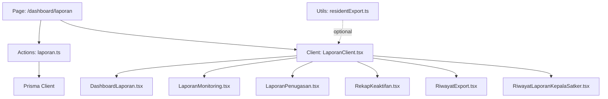
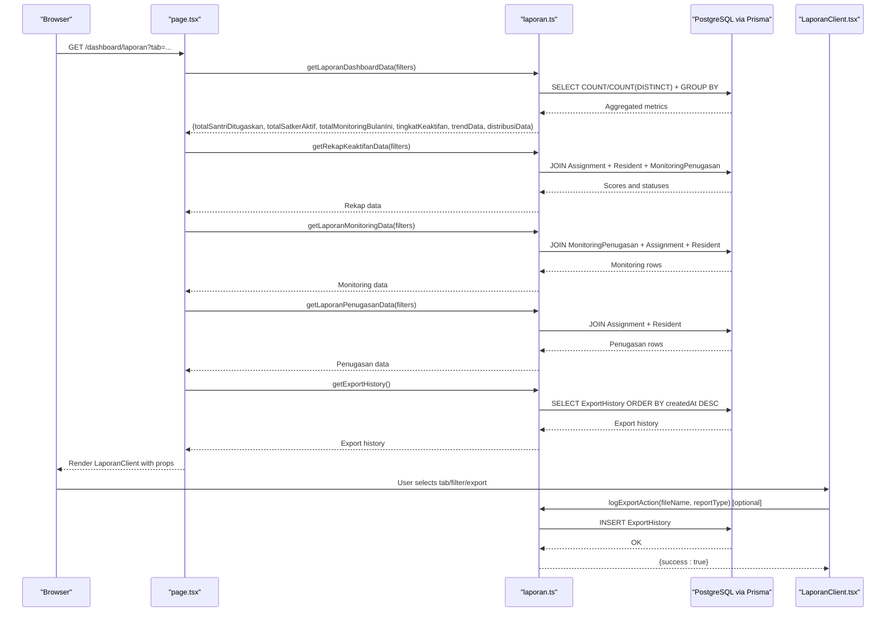
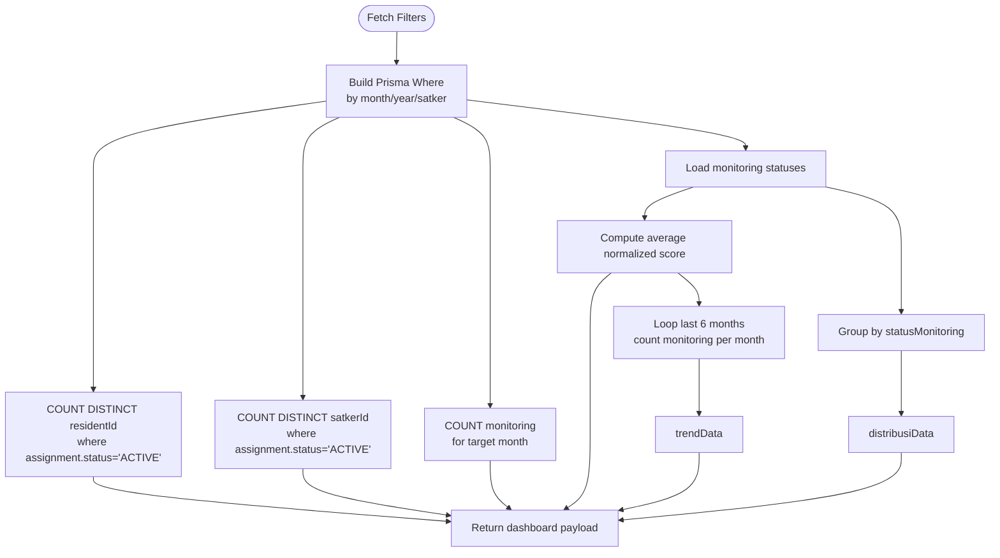
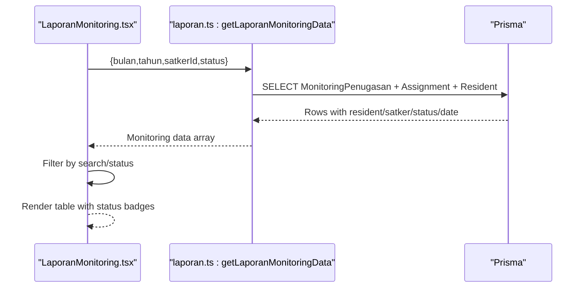
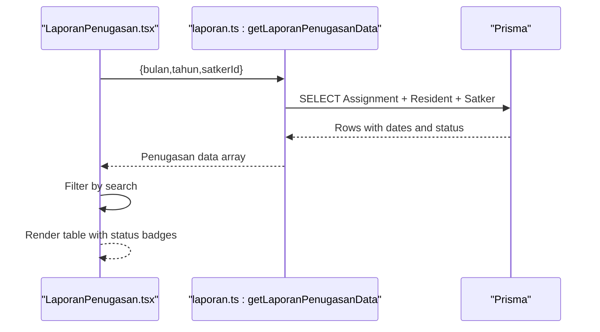
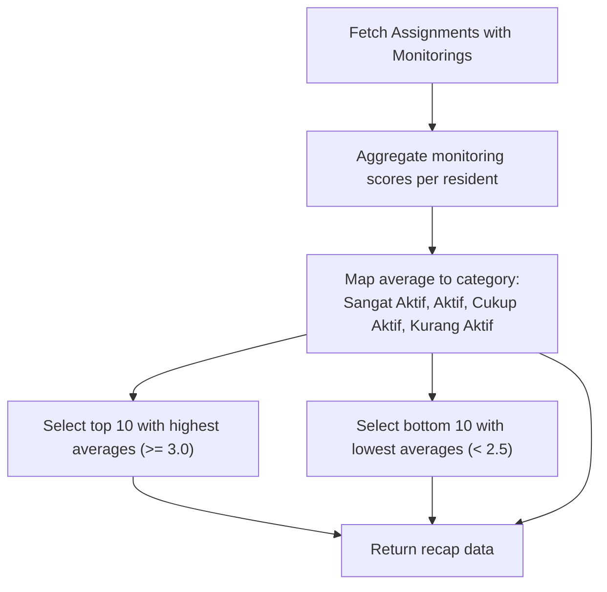
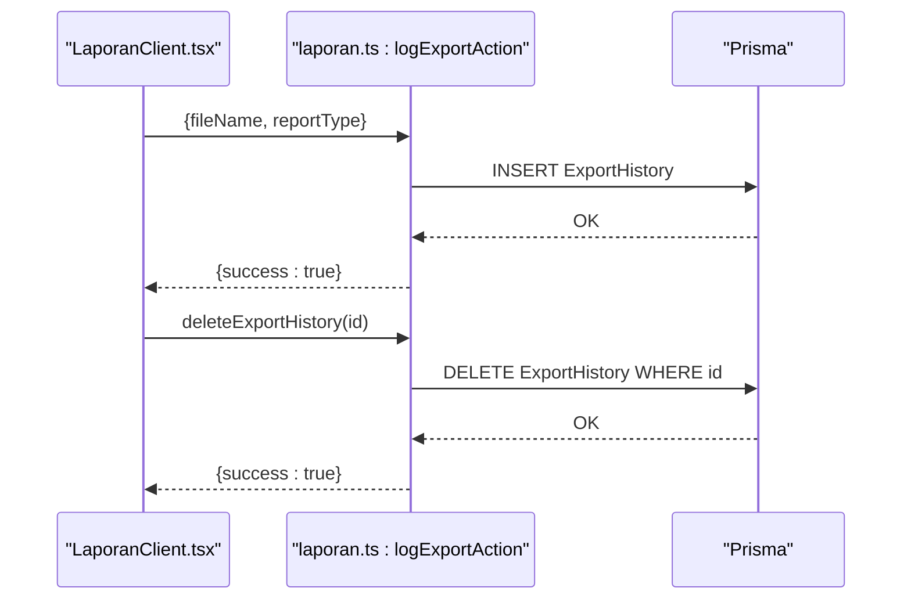
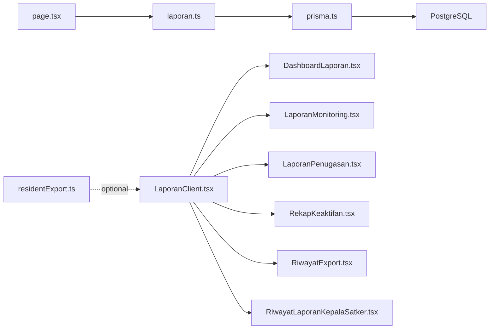
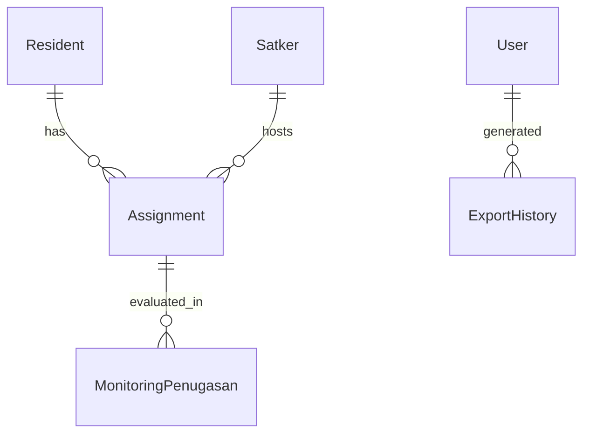

# Reporting & Analytics

<cite>
**Referenced Files in This Document**
- [DashboardLaporan.tsx](file://src/components/dashboard/laporan/DashboardLaporan.tsx)
- [LaporanClient.tsx](file://src/components/dashboard/laporan/LaporanClient.tsx)
- [LaporanMonitoring.tsx](file://src/components/dashboard/laporan/LaporanMonitoring.tsx)
- [LaporanPenugasan.tsx](file://src/components/dashboard/laporan/LaporanPenugasan.tsx)
- [RekapKeaktifan.tsx](file://src/components/dashboard/laporan/RekapKeaktifan.tsx)
- [RiwayatExport.tsx](file://src/components/dashboard/laporan/RiwayatExport.tsx)
- [page.tsx](file://src/app/dashboard/laporan/page.tsx)
- [laporan.ts](file://src/app/actions/laporan.ts)
- [residentExport.ts](file://src/utils/residentExport.ts)
- [schema.prisma](file://prisma/schema.prisma)
- [prisma.ts](file://src/lib/prisma.ts)
- [RiwayatLaporanKepalaSatker.tsx](file://src/components/dashboard/kepala-satker/RiwayatLaporanKepalaSatker.tsx)
</cite>

## Table of Contents
1. [Introduction](#introduction)
2. [Project Structure](#project-structure)
3. [Core Components](#core-components)
4. [Architecture Overview](#architecture-overview)
5. [Detailed Component Analysis](#detailed-component-analysis)
6. [Dependency Analysis](#dependency-analysis)
7. [Performance Considerations](#performance-considerations)
8. [Troubleshooting Guide](#troubleshooting-guide)
9. [Conclusion](#conclusion)
10. [Appendices](#appendices)

## Introduction
This document describes the reporting and analytics system for the dormitory management platform. It covers monthly reporting functionality, dashboard analytics, and export capabilities. It explains how data is aggregated from resident assignments, monitoring records, and administrative workflows, and how these feed interactive dashboards, charts, and downloadable reports. It also documents integration points with resident data, academic tracking, and administrative roles, along with performance characteristics, trend analysis, compliance logging, supported export formats, and distribution mechanisms.

## Project Structure
The reporting and analytics feature is organized around:
- A server-side page that orchestrates data fetching and permissions
- Action modules that encapsulate data aggregation and persistence
- Client-side components that render dashboards, tables, and export controls
- A shared data model backed by Prisma ORM

**Diagram sources**
- [page.tsx:16-78](file://src/app/dashboard/laporan/page.tsx#L16-L78)
- [laporan.ts:20-120](file://src/app/actions/laporan.ts#L20-L120)
- [LaporanClient.tsx:87-101](file://src/components/dashboard/laporan/LaporanClient.tsx#L87-L101)
- [DashboardLaporan.tsx:14-79](file://src/components/dashboard/laporan/DashboardLaporan.tsx#L14-L79)
- [LaporanMonitoring.tsx:6-115](file://src/components/dashboard/laporan/LaporanMonitoring.tsx#L6-L115)
- [LaporanPenugasan.tsx:6-117](file://src/components/dashboard/laporan/LaporanPenugasan.tsx#L6-L117)
- [RekapKeaktifan.tsx:6-188](file://src/components/dashboard/laporan/RekapKeaktifan.tsx#L6-L188)
- [RiwayatExport.tsx:7-111](file://src/components/dashboard/laporan/RiwayatExport.tsx#L7-L111)
- [RiwayatLaporanKepalaSatker.tsx:5-90](file://src/components/dashboard/kepala-satker/RiwayatLaporanKepalaSatker.tsx#L5-L90)
- [residentExport.ts:1-123](file://src/utils/residentExport.ts#L1-L123)

**Section sources**
- [page.tsx:16-78](file://src/app/dashboard/laporan/page.tsx#L16-L78)
- [LaporanClient.tsx:87-101](file://src/components/dashboard/laporan/LaporanClient.tsx#L87-L101)

## Core Components
- Monthly reporting dashboard: renders summary cards and two visualizations (trend and distribution) for activity monitoring.
- Tabbed report views: monitoring logs, assignment tracking, activity recap, and export history.
- Export and printing: Excel (.xlsx) via SheetJS and PDF printing with print-specific styles.
- Administrative integration: role-aware tabs and submission workflows for monthly reports.

Key responsibilities:
- Data aggregation: counts, averages, and distributions derived from monitoring and assignment records.
- Filtering: month/year, unit (satker), and status for monitoring.
- Export logging: audit trail of generated exports.

**Section sources**
- [DashboardLaporan.tsx:14-79](file://src/components/dashboard/laporan/DashboardLaporan.tsx#L14-L79)
- [LaporanClient.tsx:87-101](file://src/components/dashboard/laporan/LaporanClient.tsx#L87-L101)
- [laporan.ts:20-120](file://src/app/actions/laporan.ts#L20-L120)

## Architecture Overview
The system follows a Next.js app-dir pattern with server actions for data access and client components for rendering.

**Diagram sources**
- [page.tsx:16-78](file://src/app/dashboard/laporan/page.tsx#L16-L78)
- [laporan.ts:20-120](file://src/app/actions/laporan.ts#L20-L120)
- [LaporanClient.tsx:161-221](file://src/components/dashboard/laporan/LaporanClient.tsx#L161-L221)

## Detailed Component Analysis

### Dashboard Analytics
The dashboard aggregates:
- Total assigned residents
- Active units
- Monthly monitoring count
- Average activity level (normalized score)
- Trend chart (last six months)
- Distribution pie chart (activity categories)

**Diagram sources**
- [laporan.ts:20-120](file://src/app/actions/laporan.ts#L20-L120)

**Section sources**
- [DashboardLaporan.tsx:14-79](file://src/components/dashboard/laporan/DashboardLaporan.tsx#L14-L79)
- [laporan.ts:20-120](file://src/app/actions/laporan.ts#L20-L120)

### Monthly Monitoring Reports
- Provides a searchable table of monitoring entries with status badges and notes.
- Supports filtering by status and free-text search across resident name, NIM, and unit.
- Integrates with a detail modal to inspect resident profiles and related assignments/monitorings.

**Diagram sources**
- [LaporanMonitoring.tsx:6-115](file://src/components/dashboard/laporan/LaporanMonitoring.tsx#L6-L115)
- [laporan.ts:236-289](file://src/app/actions/laporan.ts#L236-L289)

**Section sources**
- [LaporanMonitoring.tsx:6-115](file://src/components/dashboard/laporan/LaporanMonitoring.tsx#L6-L115)
- [laporan.ts:236-289](file://src/app/actions/laporan.ts#L236-L289)

### Assignment Tracking Reports
- Lists active and completed assignments for the selected period.
- Includes resident name, unit, start date, and status.
- Supports search and opens a detail modal for deeper inspection.

**Diagram sources**
- [LaporanPenugasan.tsx:6-117](file://src/components/dashboard/laporan/LaporanPenugasan.tsx#L6-L117)
- [laporan.ts:291-341](file://src/app/actions/laporan.ts#L291-L341)

**Section sources**
- [LaporanPenugasan.tsx:6-117](file://src/components/dashboard/laporan/LaporanPenugasan.tsx#L6-L117)
- [laporan.ts:291-341](file://src/app/actions/laporan.ts#L291-L341)

### Activity Recap and Ranking
- Computes per-resident average scores from monitoring records and assigns a category.
- Highlights top performers and identifies those needing guidance.
- Provides a sortable table with rank, average score, and status badge.

**Diagram sources**
- [RekapKeaktifan.tsx:6-188](file://src/components/dashboard/laporan/RekapKeaktifan.tsx#L6-L188)
- [laporan.ts:122-195](file://src/app/actions/laporan.ts#L122-L195)

**Section sources**
- [RekapKeaktifan.tsx:6-188](file://src/components/dashboard/laporan/RekapKeaktifan.tsx#L6-L188)
- [laporan.ts:122-195](file://src/app/actions/laporan.ts#L122-L195)

### Export History and Compliance Logging
- Maintains a history of exported files with type, timestamp, and user.
- Logs each export event with filename and report type for auditability.
- Supports deletion of history entries for compliance.

**Diagram sources**
- [LaporanClient.tsx:161-221](file://src/components/dashboard/laporan/LaporanClient.tsx#L161-L221)
- [laporan.ts:197-226](file://src/app/actions/laporan.ts#L197-L226)
- [laporan.ts:343-357](file://src/app/actions/laporan.ts#L343-L357)

**Section sources**
- [RiwayatExport.tsx:7-111](file://src/components/dashboard/laporan/RiwayatExport.tsx#L7-L111)
- [laporan.ts:197-226](file://src/app/actions/laporan.ts#L197-L226)
- [laporan.ts:343-357](file://src/app/actions/laporan.ts#L343-L357)

### Export Capabilities
- Excel export: transforms current tab’s data into a spreadsheet and downloads .xlsx.
- PDF export: triggers browser print dialog with print-specific styles applied.
- Resident bulk export utilities: separate helpers for resident lists (CSV and printable PDF) exist in utils.

Supported formats:
- Excel (.xlsx) via SheetJS
- PDF via browser print

Note: The “download again” feature for historical exports is currently placeholder and requires cloud storage configuration.

**Section sources**
- [LaporanClient.tsx:161-221](file://src/components/dashboard/laporan/LaporanClient.tsx#L161-L221)
- [residentExport.ts:1-123](file://src/utils/residentExport.ts#L1-L123)

### Administrative Workflows and Role Integration
- Role-aware tabs: administrators see dashboard, monitoring, assignments, activity recap, and export history; unit heads see monitoring history and export history.
- Unit head monthly reporting: submits consolidated monthly report with status and summary; system tracks submitted vs draft.
- Permissions enforced server-side to restrict access to views and exports.

**Section sources**
- [LaporanClient.tsx:106-117](file://src/components/dashboard/laporan/LaporanClient.tsx#L106-L117)
- [page.tsx:26-28](file://src/app/dashboard/laporan/page.tsx#L26-L28)
- [laporan.ts:437-519](file://src/app/actions/laporan.ts#L437-L519)
- [RiwayatLaporanKepalaSatker.tsx:5-90](file://src/components/dashboard/kepala-satker/RiwayatLaporanKepalaSatker.tsx#L5-L90)

## Dependency Analysis
The reporting system depends on:
- Prisma ORM for data access and PostgreSQL for persistence
- Next.js server actions for secure, server-rendered data fetching
- Client components for rendering and interactivity
- Third-party libraries for visualization and spreadsheets

**Diagram sources**
- [page.tsx:16-78](file://src/app/dashboard/laporan/page.tsx#L16-L78)
- [laporan.ts:20-120](file://src/app/actions/laporan.ts#L20-L120)
- [prisma.ts:1-31](file://src/lib/prisma.ts#L1-L31)

**Section sources**
- [schema.prisma:103-163](file://prisma/schema.prisma#L103-L163)
- [prisma.ts:1-31](file://src/lib/prisma.ts#L1-L31)

## Performance Considerations
- Database queries use targeted filters (month/year, unit, status) to minimize result sets.
- Aggregation queries leverage COUNT and GROUP BY to compute metrics efficiently.
- Client-side filtering is applied after fetching to keep server queries deterministic.
- Print/PDF export relies on client-side rendering; consider server-side PDF generation for very large datasets.
- Export history retrieval is paginated implicitly by ordering and limiting results.

[No sources needed since this section provides general guidance]

## Troubleshooting Guide
Common issues and resolutions:
- Unauthorized access: ensure the user has the required permission codes for viewing reports and exporting.
- Empty dashboard: verify filters (month/year/unit) and presence of monitoring records for the selected period.
- Export fails silently: confirm SheetJS is available and user allows downloads; check console for errors.
- Missing export history: confirm export events are being logged and the user has permission to view history.
- Unit head cannot submit: verify the user belongs to the correct unit and the monthly report status is editable.

**Section sources**
- [page.tsx:26-28](file://src/app/dashboard/laporan/page.tsx#L26-L28)
- [laporan.ts:197-226](file://src/app/actions/laporan.ts#L197-L226)
- [LaporanClient.tsx:161-221](file://src/components/dashboard/laporan/LaporanClient.tsx#L161-L221)

## Conclusion
The reporting and analytics system integrates resident, assignment, and monitoring data to deliver actionable insights through dashboards and tabular reports. It supports flexible filtering, export logging, and role-aware workflows. With optional server-side PDF generation and cloud-backed export retrieval, the system can evolve to meet larger-scale needs while maintaining strong auditability and performance.

[No sources needed since this section summarizes without analyzing specific files]

## Appendices

### Data Model Overview
The reporting feature primarily uses the following entities and relationships:
- Resident: personal and academic attributes, linked to rooms and assignments
- Assignment: links residents to units (satker), includes status and date range
- MonitoringPenugasan: records monthly evaluations with status and notes
- Satker: organizational units with monthly report submissions
- ExportHistory: audit trail of generated exports

**Diagram sources**
- [schema.prisma:44-149](file://prisma/schema.prisma#L44-L149)
- [schema.prisma:103-163](file://prisma/schema.prisma#L103-L163)
- [schema.prisma:367-378](file://prisma/schema.prisma#L367-L378)

### Supported Export Formats
- Excel (.xlsx): generated client-side using SheetJS
- PDF: printed via browser print dialog with print-specific styles

**Section sources**
- [LaporanClient.tsx:161-221](file://src/components/dashboard/laporan/LaporanClient.tsx#L161-L221)
- [residentExport.ts:1-123](file://src/utils/residentExport.ts#L1-L123)