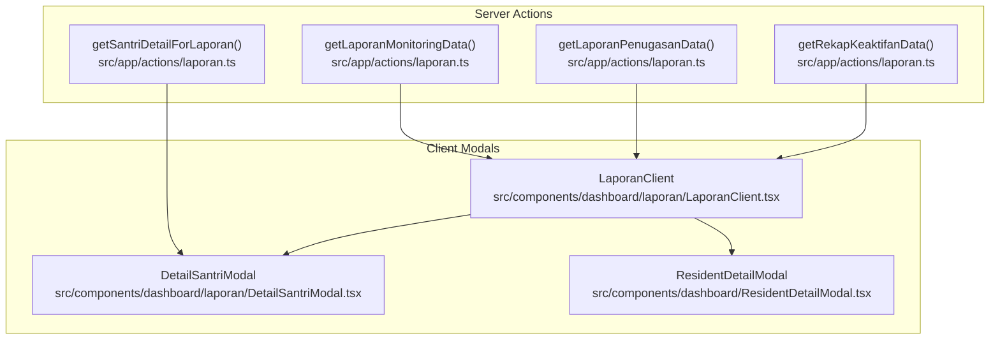
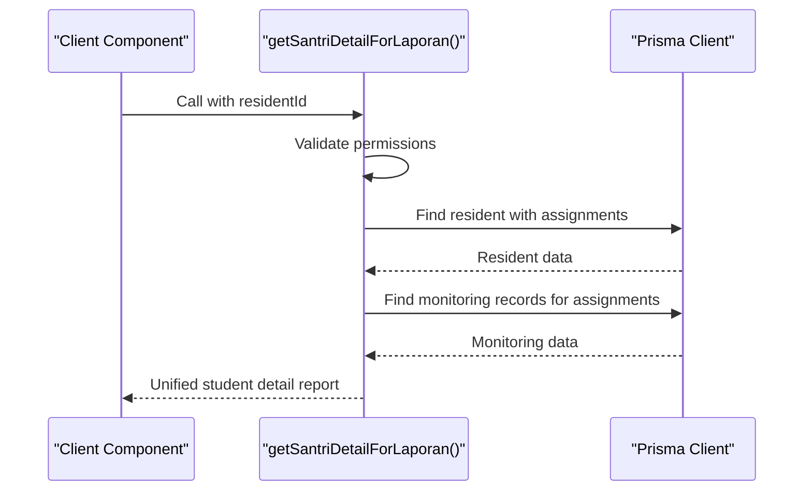
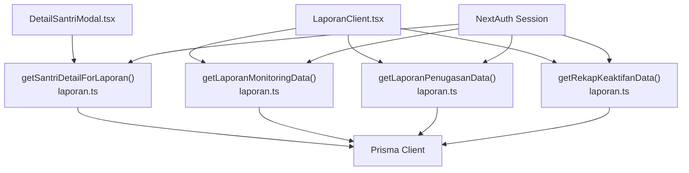

# Student Detail Reports

<cite>
**Referenced Files in This Document**
- [laporan.ts](file://src/app/actions/laporan.ts)
- [DetailSantriModal.tsx](file://src/components/dashboard/laporan/DetailSantriModal.tsx)
- [LaporanClient.tsx](file://src/components/dashboard/laporan/LaporanClient.tsx)
- [ResidentDetailModal.tsx](file://src/components/dashboard/ResidentDetailModal.tsx)
</cite>

## Table of Contents
1. [Introduction](#introduction)
2. [Project Structure](#project-structure)
3. [Core Components](#core-components)
4. [Architecture Overview](#architecture-overview)
5. [Detailed Component Analysis](#detailed-component-analysis)
6. [Dependency Analysis](#dependency-analysis)
7. [Performance Considerations](#performance-considerations)
8. [Troubleshooting Guide](#troubleshooting-guide)
9. [Conclusion](#conclusion)

## Introduction
This document provides comprehensive documentation for the student detail reporting system, focusing on the `getSantriDetailForLaporan()` function and related components. It explains how the system aggregates student profile information, assignment history, and monitoring data into unified reports. The documentation covers the modal-based presentation system, data filtering mechanisms, real-time report generation, student profile management, assignment tracking integration, and monitoring history consolidation for comprehensive student performance analysis.

## Project Structure
The student detail reporting system spans server-side action functions and client-side modal components:
- Server actions handle data retrieval, filtering, and aggregation from the database.
- Client modals present the consolidated student information in a structured, interactive UI.
- Filtering and pagination are handled via URL parameters and component state.

**Diagram sources**
- [laporan.ts:359-422](file://src/app/actions/laporan.ts#L359-L422)
- [DetailSantriModal.tsx:1-339](file://src/components/dashboard/laporan/DetailSantriModal.tsx#L1-L339)
- [LaporanClient.tsx:49-111](file://src/components/dashboard/laporan/LaporanClient.tsx#L49-L111)
- [ResidentDetailModal.tsx:283-758](file://src/components/dashboard/ResidentDetailModal.tsx#L283-L758)

**Section sources**
- [laporan.ts:1-565](file://src/app/actions/laporan.ts#L1-L565)
- [DetailSantriModal.tsx:1-339](file://src/components/dashboard/laporan/DetailSantriModal.tsx#L1-L339)
- [LaporanClient.tsx:49-111](file://src/components/dashboard/laporan/LaporanClient.tsx#L49-L111)
- [ResidentDetailModal.tsx:283-758](file://src/components/dashboard/ResidentDetailModal.tsx#L283-L758)

## Core Components
This section focuses on the primary components involved in retrieving and displaying student detail reports.

- getSantriDetailForLaporan(): Aggregates student profile, assignment history, and monitoring data into a unified structure for reporting.
- DetailSantriModal: Presents the aggregated student data in a modal UI with charts and tabular views.
- LaporanClient: Provides filtering controls and displays monitoring and assignment reports.
- ResidentDetailModal: Alternative modal for broader resident information (used in other contexts).

Key responsibilities:
- Data aggregation: Combines resident profile, assignments, and monitoring records.
- Real-time updates: Fetches data on modal open and supports revalidation.
- Filtering: Applies date range, status, and organizational filters.
- Presentation: Renders charts, tables, and badges for quick comprehension.

**Section sources**
- [laporan.ts:359-422](file://src/app/actions/laporan.ts#L359-L422)
- [DetailSantriModal.tsx:33-61](file://src/components/dashboard/laporan/DetailSantriModal.tsx#L33-L61)
- [LaporanClient.tsx:71-111](file://src/components/dashboard/laporan/LaporanClient.tsx#L71-L111)
- [ResidentDetailModal.tsx:307-312](file://src/components/dashboard/ResidentDetailModal.tsx#L307-L312)

## Architecture Overview
The system follows a server-action-driven architecture:
- Client components trigger server actions via client-side fetch calls.
- Server actions enforce permissions, apply filters, and query the database.
- Aggregated data is returned to client components for rendering.

**Diagram sources**
- [laporan.ts:359-422](file://src/app/actions/laporan.ts#L359-L422)

## Detailed Component Analysis

### getSantriDetailForLaporan Function
Purpose:
- Retrieve a comprehensive student profile report including personal details, academic status, and assignment history.
- Aggregate monitoring data linked to the student's assignments.

Processing logic:
- Validates user permissions before proceeding.
- Queries the resident record with nested assignment data ordered by start date.
- Retrieves all monitoring records associated with the student's assignments, ordered by monitoring date.
- Constructs a unified response containing:
  - Profile: name, NIM, dormitory/wilayah, program study, and status.
  - Assignments: satker, position, start/end dates, and status.
  - Monitoring: monthly monitoring records with status and notes.

Data aggregation:
- Combines three datasets (resident, assignments, monitoring) into a single object.
- Ensures chronological ordering for both assignments and monitoring records.

Security and permissions:
- Requires "santri.view" permission to access student details.

Error handling:
- Returns null on permission failure or errors, allowing the UI to gracefully handle missing data.

**Section sources**
- [laporan.ts:359-422](file://src/app/actions/laporan.ts#L359-L422)

### DetailSantriModal Component
Purpose:
- Present the student detail report in a modal interface with charts and tables.

Key features:
- Dynamic loading state while fetching data.
- Status badges with color-coded categories for activity levels.
- Line chart visualization of activity trends over time.
- Tabular views for assignment history and monitoring records.
- Responsive design with dark mode support.

Data binding:
- Uses the unified report structure from getSantriDetailForLaporan().
- Sorts monitoring data chronologically for chart rendering.

Rendering logic:
- Displays profile information in two-column layout.
- Shows recent placement details and full assignment history.
- Renders a line chart with activity scores mapped to status categories.
- Lists monitoring records with status badges and notes.

**Section sources**
- [DetailSantriModal.tsx:33-94](file://src/components/dashboard/laporan/DetailSantriModal.tsx#L33-L94)
- [DetailSantriModal.tsx:133-330](file://src/components/dashboard/laporan/DetailSantriModal.tsx#L133-L330)

### LaporanClient Component
Purpose:
- Provide filtering controls and display monitoring and assignment reports.

Filtering mechanisms:
- Supports month/year selection, satker filtering, and status filtering for monitoring reports.
- Applies filters to server actions for monitoring and assignment data retrieval.

Integration points:
- Passes selected filters to server actions.
- Opens DetailSantriModal when a student is selected from monitoring or assignment lists.

Real-time report generation:
- Uses URL parameters to maintain filter state.
- Re-renders filtered data sets based on user selections.

**Section sources**
- [LaporanClient.tsx:49-111](file://src/components/dashboard/laporan/LaporanClient.tsx#L49-L111)
- [LaporanClient.tsx:414-429](file://src/components/dashboard/laporan/LaporanClient.tsx#L414-L429)

### ResidentDetailModal Component
Purpose:
- Provide an alternative modal for broader resident information and editing capabilities.

Permissions:
- Checks for "audit.view" and "santri.update" permissions to enable audit logs and edit buttons.

UI elements:
- Tabs for different information sections.
- Edit and close actions with appropriate styling.

Note:
- This modal is separate from the student detail reporting modal and serves different use cases.

**Section sources**
- [ResidentDetailModal.tsx:307-312](file://src/components/dashboard/ResidentDetailModal.tsx#L307-L312)
- [ResidentDetailModal.tsx:734-752](file://src/components/dashboard/ResidentDetailModal.tsx#L734-L752)

## Dependency Analysis
The system exhibits clear separation of concerns:
- Server actions depend on Prisma for database queries and NextAuth for session validation.
- Client components depend on server actions for data and on external libraries for visualization.
- Filtering logic is centralized in server actions, ensuring consistent behavior across components.

**Diagram sources**
- [laporan.ts:1-565](file://src/app/actions/laporan.ts#L1-L565)
- [DetailSantriModal.tsx:1-339](file://src/components/dashboard/laporan/DetailSantriModal.tsx#L1-L339)
- [LaporanClient.tsx:49-111](file://src/components/dashboard/laporan/LaporanClient.tsx#L49-L111)

**Section sources**
- [laporan.ts:1-565](file://src/app/actions/laporan.ts#L1-L565)
- [DetailSantriModal.tsx:1-339](file://src/components/dashboard/laporan/DetailSantriModal.tsx#L1-L339)
- [LaporanClient.tsx:49-111](file://src/components/dashboard/laporan/LaporanClient.tsx#L49-L111)

## Performance Considerations
- Database queries: The server actions use targeted queries with includes and orderings to minimize overhead.
- Pagination: While not implemented in the reported functions, consider adding pagination for large datasets.
- Caching: Leverage Next.js revalidation for cache updates after data changes.
- Rendering: Charts and tables are rendered client-side; ensure efficient data sorting and mapping for large arrays.

## Troubleshooting Guide
Common issues and resolutions:
- Permission errors: Ensure the user has "santri.view" permission for accessing student details.
- Empty data: Verify that the resident exists and has associated assignments and monitoring records.
- Filter inconsistencies: Confirm that URL parameters match the expected filter structure in server actions.
- Modal not opening: Check that the modal receives a valid residentId and isOpen flag.

**Section sources**
- [laporan.ts:359-362](file://src/app/actions/laporan.ts#L359-L362)
- [DetailSantriModal.tsx:45-61](file://src/components/dashboard/laporan/DetailSantriModal.tsx#L45-L61)
- [LaporanClient.tsx:414-429](file://src/components/dashboard/laporan/LaporanClient.tsx#L414-L429)

## Conclusion
The student detail reporting system provides a robust framework for aggregating and presenting student information. The `getSantriDetailForLaporan()` function centralizes data retrieval and ensures consistent reporting across modal interfaces. With modular components, clear filtering mechanisms, and real-time updates, the system supports comprehensive student performance analysis and effective administrative oversight.