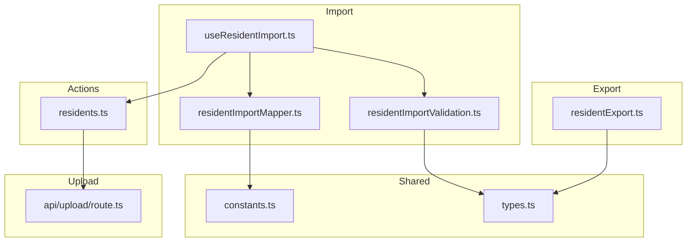
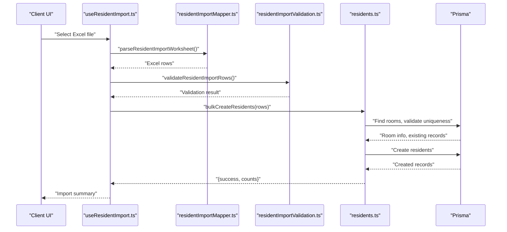
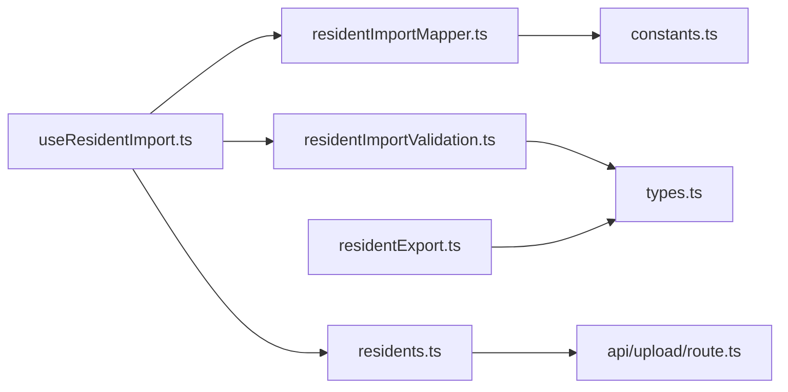

# Batch Import & Export Functionality

<cite>
**Referenced Files in This Document**
- [residentExport.ts](file://src/utils/residentExport.ts)
- [residents.ts](file://src/app/actions/residents.ts)
- [residentImportMapper.ts](file://src/components/dashboard/residents/import/residentImportMapper.ts)
- [residentImportValidation.ts](file://src/components/dashboard/residents/import/residentImportValidation.ts)
- [constants.ts](file://src/components/dashboard/residents/constants.ts)
- [types.ts](file://src/components/dashboard/residents/types.ts)
- [useResidentImport.ts](file://src/components/dashboard/residents/import/useResidentImport.ts)
- [route.ts](file://src/app/api/upload/route.ts)
</cite>

## Table of Contents
1. [Introduction](#introduction)
2. [Project Structure](#project-structure)
3. [Core Components](#core-components)
4. [Architecture Overview](#architecture-overview)
5. [Detailed Component Analysis](#detailed-component-analysis)
6. [Dependency Analysis](#dependency-analysis)
7. [Performance Considerations](#performance-considerations)
8. [Troubleshooting Guide](#troubleshooting-guide)
9. [Conclusion](#conclusion)

## Introduction
This document explains the batch import and export functionality for resident data. It covers the Excel file processing workflow, data validation rules, error handling during import, the import mapper functionality, duplicate detection mechanisms, and the export capabilities including CSV generation, PDF printing, and template downloads. It also documents supported file formats, validation error messages, success/failure scenarios, and integration with audit logging for tracking import operations.

## Project Structure
The batch import/export functionality spans several modules:
- Export utilities for CSV, PDF, and template downloads
- Import mapper and validator for Excel processing
- Server actions for bulk creation and validation
- Types and constants supporting import/export operations
- Upload endpoint for external assets (e.g., images)

**Diagram sources**
- [residentExport.ts:1-123](file://src/utils/residentExport.ts#L1-L123)
- [residentImportMapper.ts:1-82](file://src/components/dashboard/residents/import/residentImportMapper.ts#L1-L82)
- [residentImportValidation.ts:1-36](file://src/components/dashboard/residents/import/residentImportValidation.ts#L1-L36)
- [useResidentImport.ts:1-40](file://src/components/dashboard/residents/import/useResidentImport.ts#L1-L40)
- [residents.ts:477-578](file://src/app/actions/residents.ts#L477-L578)
- [constants.ts:1-41](file://src/components/dashboard/residents/constants.ts#L1-L41)
- [types.ts:1-46](file://src/components/dashboard/residents/types.ts#L1-L46)
- [route.ts:1-37](file://src/app/api/upload/route.ts#L1-L37)

**Section sources**
- [residentExport.ts:1-123](file://src/utils/residentExport.ts#L1-L123)
- [residentImportMapper.ts:1-82](file://src/components/dashboard/residents/import/residentImportMapper.ts#L1-L82)
- [residentImportValidation.ts:1-36](file://src/components/dashboard/residents/import/residentImportValidation.ts#L1-L36)
- [useResidentImport.ts:1-40](file://src/components/dashboard/residents/import/useResidentImport.ts#L1-L40)
- [residents.ts:477-578](file://src/app/actions/residents.ts#L477-L578)
- [constants.ts:1-41](file://src/components/dashboard/residents/constants.ts#L1-L41)
- [types.ts:1-46](file://src/components/dashboard/residents/types.ts#L1-L46)
- [route.ts:1-37](file://src/app/api/upload/route.ts#L1-L37)

## Core Components
- Export utilities:
  - CSV export with UTF-8 BOM for Excel compatibility
  - Template download for Excel import
  - PDF printing for resident lists
- Import pipeline:
  - Column aliasing and normalization
  - Required field validation
  - Bulk creation via server action
- Validation and deduplication:
  - Name-required rule
  - Gender normalization and validation
  - Date validation
  - Duplicate detection for NIM and NIUP
- Audit logging:
  - Tracks updates and changes to resident records

**Section sources**
- [residentExport.ts:6-31](file://src/utils/residentExport.ts#L6-L31)
- [residentExport.ts:33-42](file://src/utils/residentExport.ts#L33-L42)
- [residentExport.ts:44-122](file://src/utils/residentExport.ts#L44-L122)
- [residentImportMapper.ts:8-78](file://src/components/dashboard/residents/import/residentImportMapper.ts#L8-L78)
- [residentImportValidation.ts:23-36](file://src/components/dashboard/residents/import/residentImportValidation.ts#L23-L36)
- [residents.ts:53-74](file://src/app/actions/residents.ts#L53-L74)
- [residents.ts:477-578](file://src/app/actions/residents.ts#L477-L578)
- [residents.ts:370-412](file://src/app/actions/residents.ts#L370-L412)

## Architecture Overview
The import/export architecture integrates client-side processing with server actions and database operations. The client triggers import processing and export actions, which delegate to server actions for validation, deduplication, and persistence. Audit logs capture changes made during updates.

**Diagram sources**
- [useResidentImport.ts:1-40](file://src/components/dashboard/residents/import/useResidentImport.ts#L1-L40)
- [residentImportMapper.ts:54-78](file://src/components/dashboard/residents/import/residentImportMapper.ts#L54-L78)
- [residentImportValidation.ts:30-36](file://src/components/dashboard/residents/import/residentImportValidation.ts#L30-L36)
- [residents.ts:477-578](file://src/app/actions/residents.ts#L477-L578)

## Detailed Component Analysis

### Export Functionality
- CSV export:
  - Generates UTF-8 CSV with BOM for Excel compatibility
  - Formats headers and rows for resident data
  - Downloads file with date-stamped filename
- Template download:
  - Creates an Excel workbook with import headers and sample rows
  - Saves as "Template_Import_Santri.xlsx"
- PDF printing:
  - Builds HTML table with styled badges for status
  - Opens print dialog and closes window after printing

Supported formats:
- CSV for spreadsheet import
- Excel (.xlsx) template for guided import
- PDF for printable reports

**Section sources**
- [residentExport.ts:6-31](file://src/utils/residentExport.ts#L6-L31)
- [residentExport.ts:33-42](file://src/utils/residentExport.ts#L33-L42)
- [residentExport.ts:44-122](file://src/utils/residentExport.ts#L44-L122)

### Import Mapper and Validation
- Column aliasing:
  - Defines aliases for each target field (name, NIM, NIUP, gender, birth details, contact, academic info, location, room, address, postal code)
  - Normalizes column keys to match headers regardless of spacing or casing
- Row parsing:
  - Converts worksheet to JSON rows
  - Extracts values using normalized keys
- Required data validation:
  - At least "Name" must be present
  - Additional validations enforced by server action
- Duplicate detection:
  - Checks existing records for NIM and NIUP before creating

Supported formats:
- Excel (.xlsx) with headers aligned to import column aliases

**Section sources**
- [residentImportMapper.ts:8-32](file://src/components/dashboard/residents/import/residentImportMapper.ts#L8-L32)
- [residentImportMapper.ts:34-52](file://src/components/dashboard/residents/import/residentImportMapper.ts#L34-L52)
- [residentImportMapper.ts:54-78](file://src/components/dashboard/residents/import/residentImportMapper.ts#L54-L78)
- [residentImportValidation.ts:23-36](file://src/components/dashboard/residents/import/residentImportValidation.ts#L23-L36)
- [constants.ts:21-34](file://src/components/dashboard/residents/constants.ts#L21-L34)

### Data Validation Rules
Validation performed on the server during bulk creation:
- Required fields:
  - Name is mandatory
- Gender normalization and validation:
  - Accepts various forms of "male"/"female" and normalizes to standardized values
- Date validation:
  - Ensures valid date format for birth date
- Room assignment:
  - Validates room existence, availability, and capacity
- Uniqueness:
  - Prevents duplicate NIM and NIUP across records

Common validation errors:
- "Data wajib belum lengap: ..." (missing required fields)
- "Tanggal Lahir harus memakai format tanggal yang valid, contoh 2000-01-31."
- "Jenis Kelamin harus diisi LAKI_LAKI/Laki-Laki atau PEREMPUAN/Perempuan."
- "Resident with this NIM is already registered."
- "Resident with this NIUP is already registered."

**Section sources**
- [residents.ts:20-51](file://src/app/actions/residents.ts#L20-L51)
- [residents.ts:53-74](file://src/app/actions/residents.ts#L53-L74)
- [residents.ts:151-168](file://src/app/actions/residents.ts#L151-L168)
- [residents.ts:517-525](file://src/app/actions/residents.ts#L517-L525)

### Duplicate Detection Mechanisms
- Pre-check for NIM and NIUP uniqueness
- Skips rows with duplicates without failing the entire batch
- Maintains separate counts for successes and skips

**Section sources**
- [residents.ts:517-525](file://src/app/actions/residents.ts#L517-L525)
- [residents.ts:495-578](file://src/app/actions/residents.ts#L495-L578)

### Import Error Handling
- Client-side:
  - Validates presence of required fields
  - Provides feedback for empty or invalid sheets
- Server-side:
  - Performs comprehensive validation and deduplication
  - Returns structured success/failure responses with counts
  - Logs errors for debugging

Success/failure scenarios:
- Success: returns counts of created and skipped records
- Failure: returns error message for invalid data or system issues

**Section sources**
- [residentImportValidation.ts:30-36](file://src/components/dashboard/residents/import/residentImportValidation.ts#L30-L36)
- [residents.ts:573-578](file://src/app/actions/residents.ts#L573-L578)
- [residents.ts:574-577](file://src/app/actions/residents.ts#L574-L577)

### Audit Logging Integration
- Update operations log changes to tracked fields
- Captures old and new values for audit trail
- Uses current session user for "performedBy"

Note: Audit logging is implemented for update operations; import operations are handled via bulk creation without explicit audit entries.

**Section sources**
- [residents.ts:370-412](file://src/app/actions/residents.ts#L370-L412)

### Data Models and Types
- Resident interface defines fields persisted to the database
- Room and related nodes support room assignment and hierarchy
- Import row types align with mapped Excel columns

**Section sources**
- [types.ts:13-42](file://src/components/dashboard/residents/types.ts#L13-L42)

## Dependency Analysis
The import/export pipeline depends on shared constants, types, and server actions. The client hook orchestrates mapping and validation before invoking server actions.

**Diagram sources**
- [useResidentImport.ts:1-40](file://src/components/dashboard/residents/import/useResidentImport.ts#L1-L40)
- [residentImportMapper.ts:1-82](file://src/components/dashboard/residents/import/residentImportMapper.ts#L1-L82)
- [residentImportValidation.ts:1-36](file://src/components/dashboard/residents/import/residentImportValidation.ts#L1-L36)
- [constants.ts:1-41](file://src/components/dashboard/residents/constants.ts#L1-L41)
- [types.ts:1-46](file://src/components/dashboard/residents/types.ts#L1-L46)
- [residentExport.ts:1-123](file://src/utils/residentExport.ts#L1-L123)
- [residents.ts:477-578](file://src/app/actions/residents.ts#L477-L578)
- [route.ts:1-37](file://src/app/api/upload/route.ts#L1-L37)

**Section sources**
- [useResidentImport.ts:1-40](file://src/components/dashboard/residents/import/useResidentImport.ts#L1-L40)
- [residentImportMapper.ts:1-82](file://src/components/dashboard/residents/import/residentImportMapper.ts#L1-L82)
- [residentImportValidation.ts:1-36](file://src/components/dashboard/residents/import/residentImportValidation.ts#L1-L36)
- [constants.ts:1-41](file://src/components/dashboard/residents/constants.ts#L1-L41)
- [types.ts:1-46](file://src/components/dashboard/residents/types.ts#L1-L46)
- [residentExport.ts:1-123](file://src/utils/residentExport.ts#L1-L123)
- [residents.ts:477-578](file://src/app/actions/residents.ts#L477-L578)
- [route.ts:1-37](file://src/app/api/upload/route.ts#L1-L37)

## Performance Considerations
- Bulk operations:
  - Server action iterates rows sequentially; consider pagination or chunking for very large files
- Room capacity checks:
  - Room lookup and capacity checks occur per row; pre-loading rooms reduces repeated queries
- Deduplication:
  - Parallel uniqueness checks for NIM/NIUP improve throughput
- Client-side processing:
  - Normalize column keys once per sheet to avoid repeated computations

## Troubleshooting Guide
Common issues and resolutions:
- Empty or invalid Excel sheet:
  - Ensure headers match import aliases and at least "Name" is filled
- Invalid date format:
  - Use YYYY-MM-DD for birth dates
- Invalid gender values:
  - Use recognized forms that normalize to standardized values
- Duplicate NIM/NIUP:
  - Remove or correct duplicates before importing
- Room capacity exceeded:
  - Adjust room assignments or increase capacity
- Upload failures:
  - Verify Cloudinary configuration and network connectivity

**Section sources**
- [residentImportValidation.ts:23-36](file://src/components/dashboard/residents/import/residentImportValidation.ts#L23-L36)
- [residents.ts:53-74](file://src/app/actions/residents.ts#L53-L74)
- [residents.ts:517-525](file://src/app/actions/residents.ts#L517-L525)
- [residents.ts:529-543](file://src/app/actions/residents.ts#L529-L543)
- [route.ts:12-36](file://src/app/api/upload/route.ts#L12-L36)

## Conclusion
The batch import/export system provides robust support for managing resident data at scale. Excel import leverages flexible column aliasing, strict validation, and deduplication safeguards. Exports deliver CSV templates and printable PDFs for reporting. Server actions encapsulate validation and persistence, while audit logging tracks significant changes. Together, these components enable efficient, reliable data operations with clear error reporting and recovery pathways.