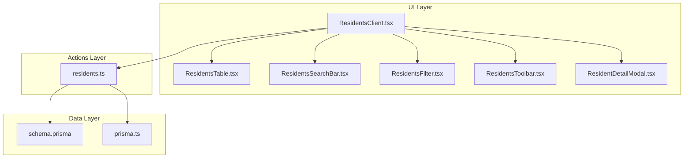
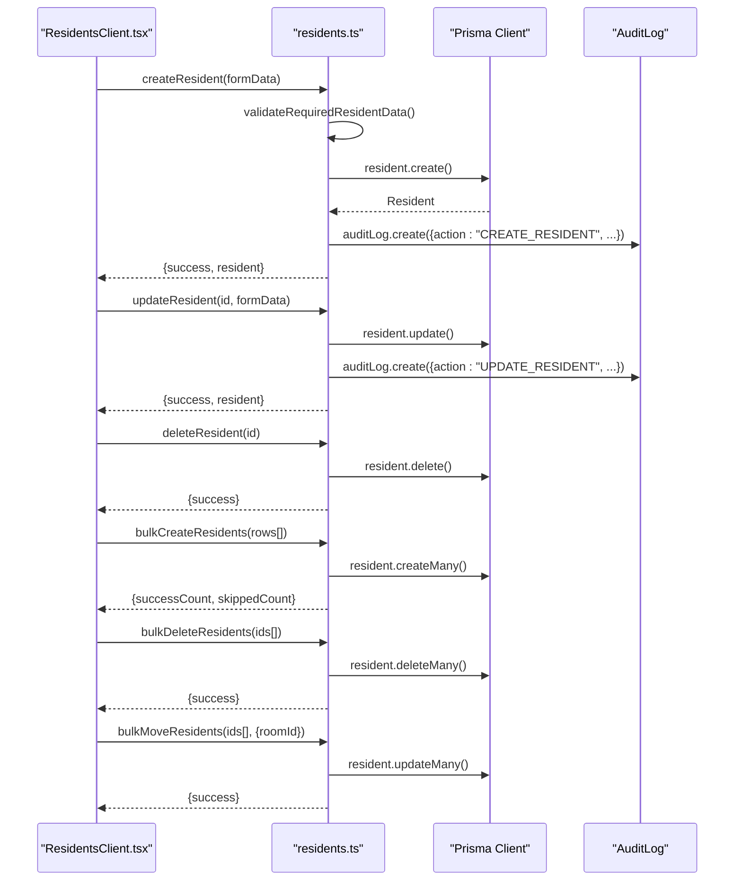
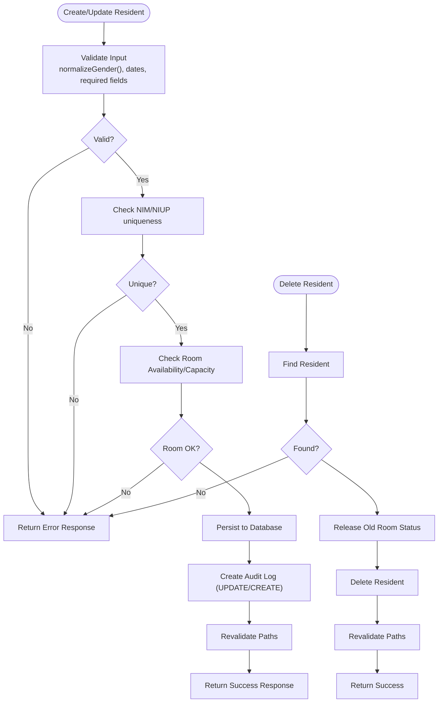
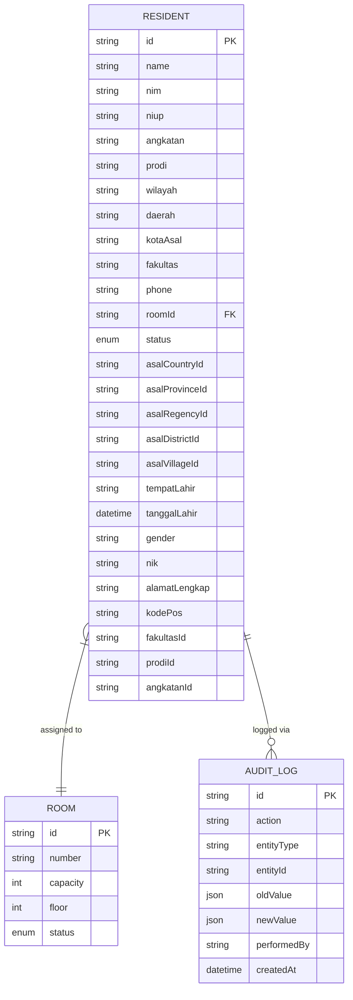
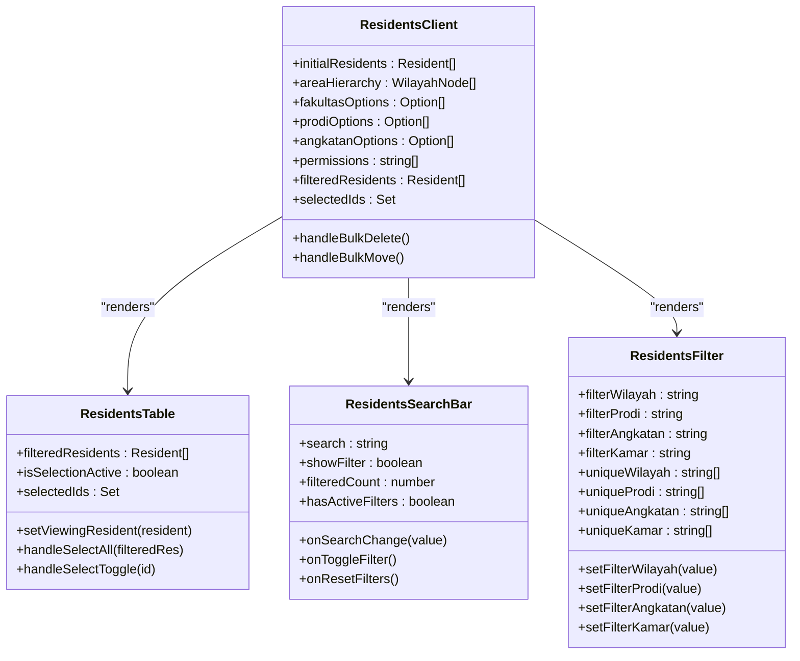
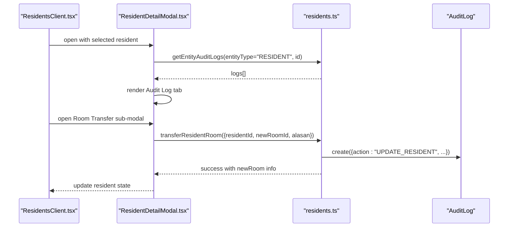
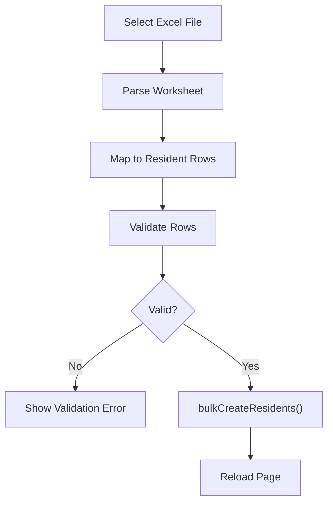
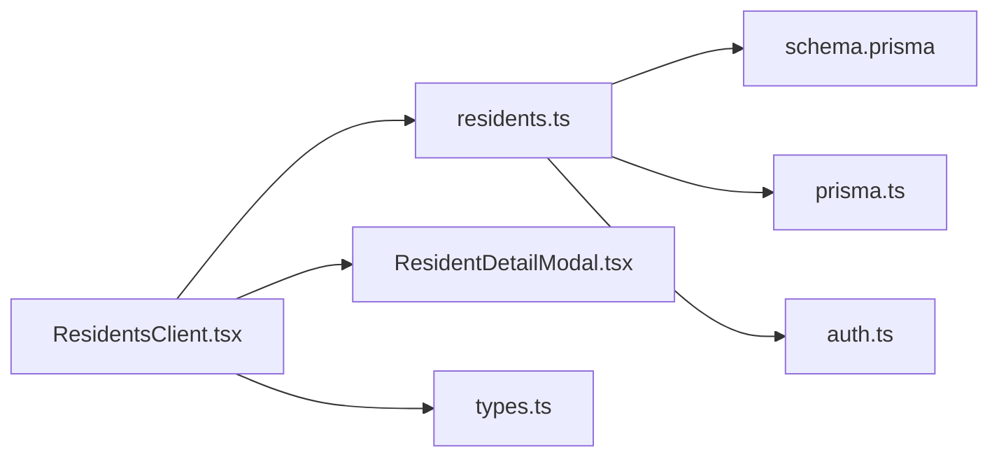

# Profile Management & CRUD Operations

<cite>
**Referenced Files in This Document**
- [residents.ts](file://src/app/actions/residents.ts)
- [types.ts](file://src/components/dashboard/residents/types.ts)
- [constants.ts](file://src/components/dashboard/residents/constants.ts)
- [ResidentsClient.tsx](file://src/components/dashboard/ResidentsClient.tsx)
- [ResidentDetailModal.tsx](file://src/components/dashboard/ResidentDetailModal.tsx)
- [ResidentsTable.tsx](file://src/components/dashboard/residents/ResidentsTable.tsx)
- [ResidentsSearchBar.tsx](file://src/components/dashboard/residents/ResidentsSearchBar.tsx)
- [ResidentsFilter.tsx](file://src/components/dashboard/residents/ResidentsFilter.tsx)
- [ResidentsToolbar.tsx](file://src/components/dashboard/residents/ResidentsToolbar.tsx)
- [useResidentImport.ts](file://src/components/dashboard/residents/import/useResidentImport.ts)
- [residentExport.ts](file://src/utils/residentExport.ts)
- [page.tsx](file://src/app/dashboard/residents/page.tsx)
- [prisma.ts](file://src/lib/prisma.ts)
- [schema.prisma](file://prisma/schema.prisma)
</cite>

## Table of Contents
1. [Introduction](#introduction)
2. [Project Structure](#project-structure)
3. [Core Components](#core-components)
4. [Architecture Overview](#architecture-overview)
5. [Detailed Component Analysis](#detailed-component-analysis)
6. [Dependency Analysis](#dependency-analysis)
7. [Performance Considerations](#performance-considerations)
8. [Troubleshooting Guide](#troubleshooting-guide)
9. [Conclusion](#conclusion)

## Introduction
This document provides comprehensive documentation for resident profile management and CRUD operations within the Asrama management system. It covers the complete resident record lifecycle including creation, updates, deletion, and bulk operations. It also documents server actions implementation, data validation rules, business logic for maintaining data integrity, the resident detail modal functionality, table operations, and search/filter capabilities. Examples of form submissions, validation errors, and success responses are included, along with integration details for audit logging to track changes to resident records.

## Project Structure
The resident management feature spans server actions, UI components, and data modeling:
- Server actions encapsulate all backend operations and validations for resident records.
- UI components provide filtering, searching, selection, and modal-based viewing/editing experiences.
- Prisma schema defines the data model and relationships for residents, rooms, and audit logs.
- Utilities support import/export and printing/report generation.

**Diagram sources**
- [ResidentsClient.tsx:1-327](file://src/components/dashboard/ResidentsClient.tsx#L1-L327)
- [residents.ts:1-666](file://src/app/actions/residents.ts#L1-L666)
- [schema.prisma:44-101](file://prisma/schema.prisma#L44-L101)
- [prisma.ts:1-31](file://src/lib/prisma.ts#L1-L31)

**Section sources**
- [ResidentsClient.tsx:1-327](file://src/components/dashboard/ResidentsClient.tsx#L1-L327)
- [residents.ts:1-666](file://src/app/actions/residents.ts#L1-L666)
- [schema.prisma:44-101](file://prisma/schema.prisma#L44-L101)
- [prisma.ts:1-31](file://src/lib/prisma.ts#L1-L31)

## Core Components
- Server Actions: Centralized CRUD operations with validation, room capacity checks, and audit logging.
- UI Components: Filtering/searching, selection, table rendering, toolbar, and detail modal.
- Data Types: Strongly typed interfaces for residents and rooms.
- Import/Export Utilities: Excel template download, CSV export, and PDF printing.
- Prisma Schema: Defines resident, room, audit log, and related entities.

**Section sources**
- [residents.ts:76-666](file://src/app/actions/residents.ts#L76-L666)
- [types.ts:1-46](file://src/components/dashboard/residents/types.ts#L1-L46)
- [constants.ts:1-41](file://src/components/dashboard/residents/constants.ts#L1-L41)
- [residentExport.ts:1-123](file://src/utils/residentExport.ts#L1-L123)
- [schema.prisma:44-101](file://prisma/schema.prisma#L44-L101)

## Architecture Overview
The system follows a Next.js app directory pattern with server actions for data mutations and client components for UI interactions. The server actions coordinate with Prisma for persistence and maintain audit logs for resident updates.

**Diagram sources**
- [residents.ts:113-244](file://src/app/actions/residents.ts#L113-L244)
- [residents.ts:246-442](file://src/app/actions/residents.ts#L246-L442)
- [residents.ts:444-475](file://src/app/actions/residents.ts#L444-L475)
- [residents.ts:477-578](file://src/app/actions/residents.ts#L477-L578)
- [residents.ts:580-608](file://src/app/actions/residents.ts#L580-L608)
- [residents.ts:610-665](file://src/app/actions/residents.ts#L610-L665)

## Detailed Component Analysis

### Server Actions: Resident CRUD and Business Logic
- Validation Functions:
  - Required fields validation for creation.
  - Gender normalization and validation.
  - Date validation for birth date.
- Creation:
  - Unique NIM/NIUP checks.
  - Room availability and capacity checks.
  - Room status auto-update when capacity is reached.
- Updates:
  - Unique NIM/NIUP checks excluding self.
  - Room change handling with old room status release and new room status update.
  - Audit logging for tracked fields with oldValue/newValue and changedFields metadata.
- Deletion:
  - Room status release for previously assigned room.
- Bulk Operations:
  - Bulk create with duplicate detection and room assignment.
  - Bulk delete with room status release for affected rooms.
  - Bulk move with capacity validation and room status updates.

**Diagram sources**
- [residents.ts:20-51](file://src/app/actions/residents.ts#L20-L51)
- [residents.ts:143-244](file://src/app/actions/residents.ts#L143-L244)
- [residents.ts:246-442](file://src/app/actions/residents.ts#L246-L442)
- [residents.ts:444-475](file://src/app/actions/residents.ts#L444-L475)

**Section sources**
- [residents.ts:20-51](file://src/app/actions/residents.ts#L20-L51)
- [residents.ts:113-244](file://src/app/actions/residents.ts#L113-L244)
- [residents.ts:246-442](file://src/app/actions/residents.ts#L246-L442)
- [residents.ts:444-475](file://src/app/actions/residents.ts#L444-L475)
- [residents.ts:477-578](file://src/app/actions/residents.ts#L477-L578)
- [residents.ts:580-665](file://src/app/actions/residents.ts#L580-L665)

### Data Model: Resident, Room, and Audit Logging
- Resident entity includes personal, academic, and location attributes with optional identifiers and foreign keys to related entities.
- Room entity tracks capacity, floor, and status with residents relationship.
- AuditLog captures entity changes with oldValue/newValue JSON and performedBy.

**Diagram sources**
- [schema.prisma:44-101](file://prisma/schema.prisma#L44-L101)
- [schema.prisma:27-42](file://prisma/schema.prisma#L27-L42)
- [schema.prisma:455-466](file://prisma/schema.prisma#L455-L466)

**Section sources**
- [schema.prisma:44-101](file://prisma/schema.prisma#L44-L101)
- [schema.prisma:27-42](file://prisma/schema.prisma#L27-L42)
- [schema.prisma:455-466](file://prisma/schema.prisma#L455-L466)

### UI Components: Search, Filter, Selection, and Table
- Search Bar: Text-based search across names and NIM with filter toggle and reset controls.
- Filters: Multi-dimensional filters by wilayah, program study, batch, and room.
- Selection: Toggle selection mode and bulk actions (move, delete).
- Table: Renders resident list with photo placeholders, room status, and clickable rows opening the detail modal.

**Diagram sources**
- [ResidentsClient.tsx:21-327](file://src/components/dashboard/ResidentsClient.tsx#L21-L327)
- [ResidentsTable.tsx:1-112](file://src/components/dashboard/residents/ResidentsTable.tsx#L1-L112)
- [ResidentsSearchBar.tsx:1-60](file://src/components/dashboard/residents/ResidentsSearchBar.tsx#L1-L60)
- [ResidentsFilter.tsx:1-72](file://src/components/dashboard/residents/ResidentsFilter.tsx#L1-L72)

**Section sources**
- [ResidentsClient.tsx:1-327](file://src/components/dashboard/ResidentsClient.tsx#L1-L327)
- [ResidentsTable.tsx:1-112](file://src/components/dashboard/residents/ResidentsTable.tsx#L1-L112)
- [ResidentsSearchBar.tsx:1-60](file://src/components/dashboard/residents/ResidentsSearchBar.tsx#L1-L60)
- [ResidentsFilter.tsx:1-72](file://src/components/dashboard/residents/ResidentsFilter.tsx#L1-L72)

### Resident Detail Modal: Viewing, Editing, and Room Transfer
- Tabs: Biodata, History, Assignments, Address, Education, Audit Log (conditional).
- Audit Log Tab: Displays field-level changes with oldValue/newValue and timestamps.
- Room Transfer: Dedicated sub-modal to move residents with capacity checks and history recording.
- Printing: Generates printable cards with QR codes and downloadable PDFs.

**Diagram sources**
- [ResidentDetailModal.tsx:307-759](file://src/components/dashboard/ResidentDetailModal.tsx#L307-L759)
- [residents.ts:400-412](file://src/app/actions/residents.ts#L400-L412)

**Section sources**
- [ResidentDetailModal.tsx:307-759](file://src/components/dashboard/ResidentDetailModal.tsx#L307-L759)
- [residents.ts:400-412](file://src/app/actions/residents.ts#L400-L412)

### Import/Export and Templates
- Import:
  - Excel parsing and mapping to resident rows.
  - Validation pipeline before bulk creation.
  - Error reporting and success feedback.
- Export:
  - CSV export with standardized headers.
  - PDF printing of resident lists.
  - Template download for Excel import.

**Diagram sources**
- [useResidentImport.ts:13-56](file://src/components/dashboard/residents/import/useResidentImport.ts#L13-L56)
- [residentExport.ts:6-31](file://src/utils/residentExport.ts#L6-L31)

**Section sources**
- [useResidentImport.ts:1-66](file://src/components/dashboard/residents/import/useResidentImport.ts#L1-L66)
- [residentExport.ts:1-123](file://src/utils/residentExport.ts#L1-L123)
- [constants.ts:1-41](file://src/components/dashboard/residents/constants.ts#L1-L41)

### Example Workflows and Responses
- Form Submission (Create):
  - Input: Full name, gender, birth place/date, program study, batch, optional identifiers and contact.
  - Validation: Required fields, date format, gender normalization.
  - Success: Returns {success: true, resident}.
  - Error: Returns {error: "<message>"}.
- Update Resident:
  - Input: Same as create plus roomId and status.
  - Validation: Unique NIM/NIUP, room capacity checks.
  - Success: Returns {success: true, resident}.
  - Error: Returns {error: "<message>"}.
- Bulk Import:
  - Input: Excel rows mapped to resident fields.
  - Validation: Name required, optional gender/date checks.
  - Success: Returns {success: true, successCount, skippedCount}.
  - Error: Returns {error: "<message>"}.
- Bulk Move/Delete:
  - Input: Selected IDs and target room (move) or empty (delete).
  - Success: Returns {success: true}.
  - Error: Returns {error: "<message>"}.

**Section sources**
- [residents.ts:143-244](file://src/app/actions/residents.ts#L143-L244)
- [residents.ts:246-442](file://src/app/actions/residents.ts#L246-L442)
- [residents.ts:477-578](file://src/app/actions/residents.ts#L477-L578)
- [residents.ts:610-665](file://src/app/actions/residents.ts#L610-L665)
- [useResidentImport.ts:37-48](file://src/components/dashboard/residents/import/useResidentImport.ts#L37-L48)

## Dependency Analysis
- UI depends on server actions for all mutations and on shared types for typing.
- Server actions depend on Prisma client and authentication/session utilities.
- Prisma schema defines relationships and indexes for performance and integrity.
- Audit logging is integrated into update operations to capture field-level changes.

**Diagram sources**
- [ResidentsClient.tsx:1-327](file://src/components/dashboard/ResidentsClient.tsx#L1-L327)
- [residents.ts:1-8](file://src/app/actions/residents.ts#L1-L8)
- [schema.prisma:1-10](file://prisma/schema.prisma#L1-L10)
- [prisma.ts:1-31](file://src/lib/prisma.ts#L1-L31)

**Section sources**
- [ResidentsClient.tsx:1-327](file://src/components/dashboard/ResidentsClient.tsx#L1-L327)
- [residents.ts:1-8](file://src/app/actions/residents.ts#L1-L8)
- [schema.prisma:1-10](file://prisma/schema.prisma#L1-L10)
- [prisma.ts:1-31](file://src/lib/prisma.ts#L1-L31)

## Performance Considerations
- Use server actions to minimize client-server round trips and centralize validation.
- Leverage Prisma indexes on frequently queried fields (e.g., status, room ID).
- Batch operations (bulk create/delete/move) reduce repeated database calls.
- Audit logging captures only human-readable fields to keep payload sizes reasonable.
- Pagination and virtualization can be considered for very large resident datasets.

## Troubleshooting Guide
Common issues and resolutions:
- Validation Errors:
  - Missing required fields: Ensure name, gender, birth place/date, program study, and batch are provided during creation.
  - Invalid date format: Use YYYY-MM-DD for birth date.
  - Invalid gender values: Use recognized aliases for LAKI_LAKI or PEREMPUAN.
- Duplicate Identifier Errors:
  - NIM/NIUP must be unique; choose alternate values if conflicts occur.
- Room Capacity Issues:
  - Selected room must have available slots; choose another room or wait for availability.
  - Maintenance status rooms cannot be assigned.
- Bulk Import Failures:
  - Verify Excel template headers match expected fields.
  - Rows with invalid or duplicate identifiers are skipped; review skipped count and fix data.
- Audit Log Visibility:
  - Audit Log tab appears only for users with appropriate permissions.

**Section sources**
- [residents.ts:151-188](file://src/app/actions/residents.ts#L151-L188)
- [residents.ts:289-314](file://src/app/actions/residents.ts#L289-L314)
- [residents.ts:318-336](file://src/app/actions/residents.ts#L318-L336)
- [useResidentImport.ts:31-42](file://src/components/dashboard/residents/import/useResidentImport.ts#L31-L42)

## Conclusion
The resident profile management system provides a robust, validated, and auditable foundation for CRUD operations on resident records. The UI enables efficient search, filtering, selection, and bulk actions, while server actions enforce business rules and maintain data integrity. Audit logging ensures transparency and traceability of changes. The import/export utilities streamline data onboarding and reporting, supporting scalable management of resident databases.