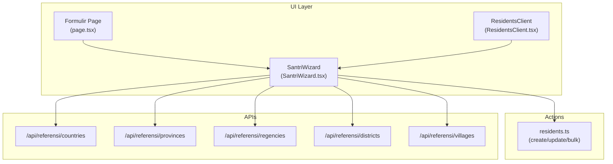
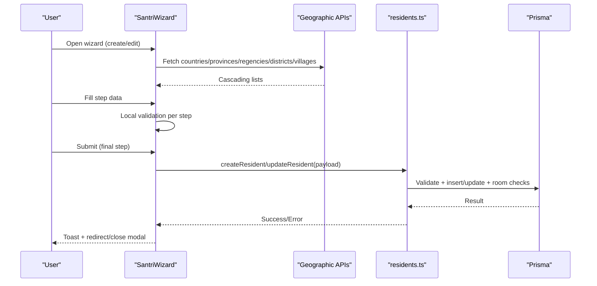
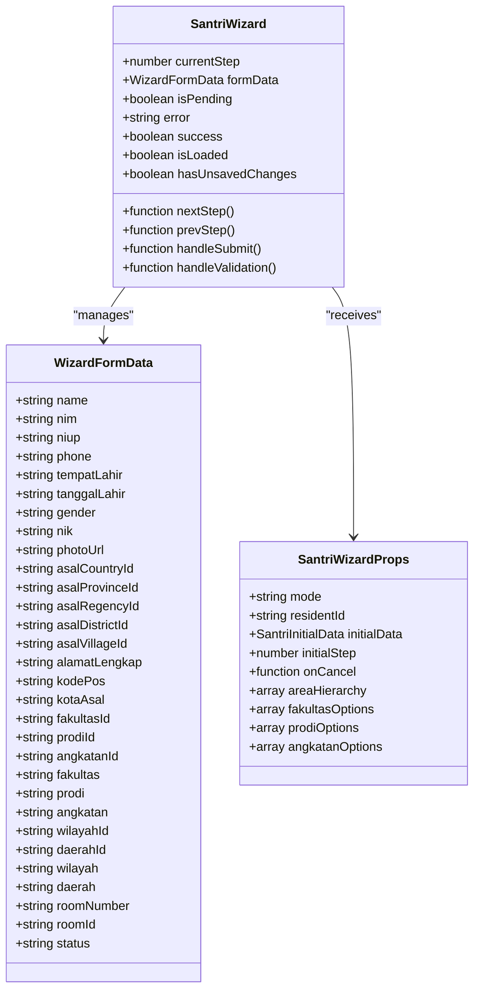
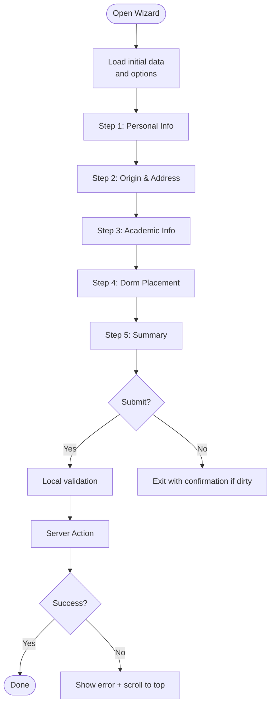
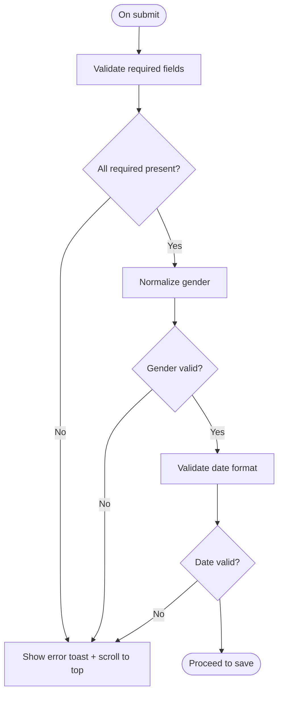
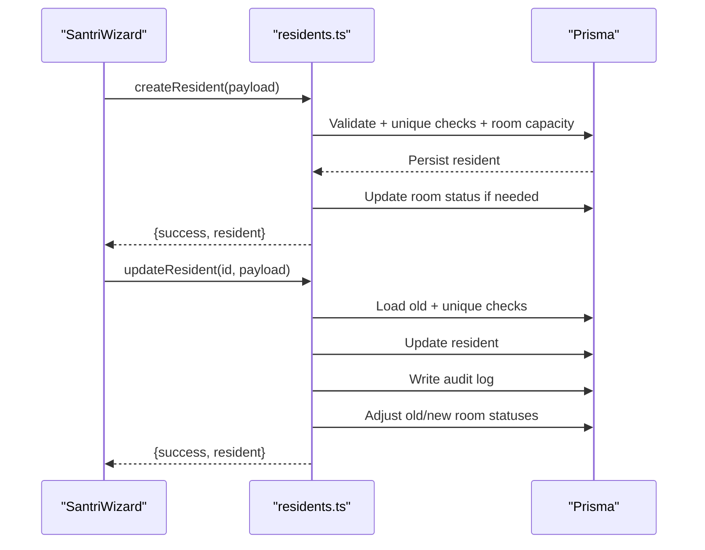
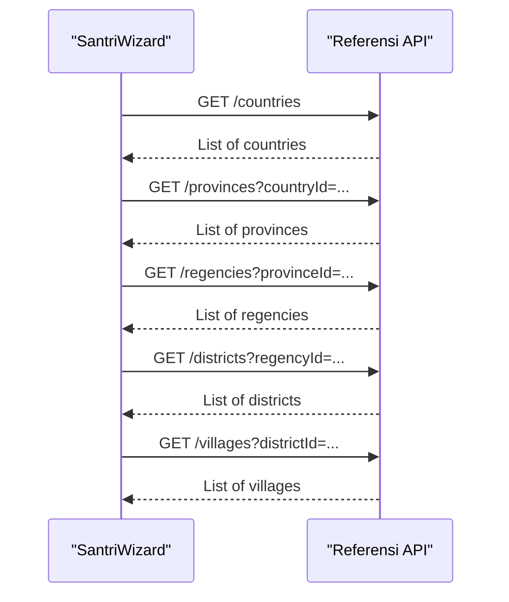
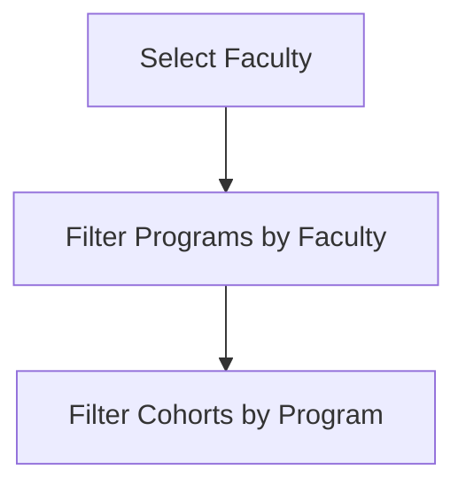
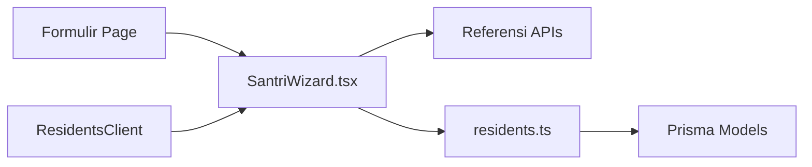

# Registration Wizard & Forms

<cite>
**Referenced Files in This Document**
- [SantriWizard.tsx](file://src/components/dashboard/santri/wizard/SantriWizard.tsx)
- [residents.ts](file://src/app/actions/residents.ts)
- [route.ts (countries)](file://src/app/api/referensi/countries/route.ts)
- [route.ts (provinces)](file://src/app/api/referensi/provinces/route.ts)
- [route.ts (regencies)](file://src/app/api/referensi/regencies/route.ts)
- [route.ts (districts)](file://src/app/api/referensi/districts/route.ts)
- [route.ts (villages)](file://src/app/api/referensi/villages/route.ts)
- [page.tsx (Formulir Page)](file://src/app/dashboard/formulir/page.tsx)
- [types.ts](file://src/components/dashboard/residents/types.ts)
- [constants.ts](file://src/components/dashboard/residents/constants.ts)
- [ResidentsClient.tsx](file://src/components/dashboard/ResidentsClient.tsx)
</cite>

## Table of Contents
1. [Introduction](#introduction)
2. [Project Structure](#project-structure)
3. [Core Components](#core-components)
4. [Architecture Overview](#architecture-overview)
5. [Detailed Component Analysis](#detailed-component-analysis)
6. [Dependency Analysis](#dependency-analysis)
7. [Performance Considerations](#performance-considerations)
8. [Troubleshooting Guide](#troubleshooting-guide)
9. [Conclusion](#conclusion)

## Introduction
This document describes the resident registration wizard system used to onboard new residents and manage their profiles. It covers the multi-step form workflow, step-by-step navigation, validation rules, data persistence, and integration with geographic reference data for birthplace and origin information. It also documents the differences between creation and editing modes, error handling, and user experience patterns such as auto-save drafts and unsaved-changes protection.

## Project Structure
The wizard is implemented as a single shared component that supports both “create” and “edit” modes. It integrates with:
- Geographic reference APIs for cascading location selection
- Academic master data for faculty, program, and cohort selection
- Backend actions for creating/updating residents and room availability checks
- Frontend pages that supply hierarchical data to the wizard

**Diagram sources**
- [page.tsx (Formulir Page):1-22](file://src/app/dashboard/formulir/page.tsx#L1-L22)
- [SantriWizard.tsx:1-773](file://src/components/dashboard/santri/wizard/SantriWizard.tsx#L1-L773)
- [residents.ts:1-666](file://src/app/actions/residents.ts#L1-L666)
- [route.ts (countries):1-29](file://src/app/api/referensi/countries/route.ts#L1-L29)
- [route.ts (provinces):1-32](file://src/app/api/referensi/provinces/route.ts#L1-L32)
- [route.ts (regencies):1-32](file://src/app/api/referensi/regencies/route.ts#L1-L32)
- [route.ts (districts):1-32](file://src/app/api/referensi/districts/route.ts#L1-L32)
- [route.ts (villages):1-32](file://src/app/api/referensi/villages/route.ts#L1-L32)

**Section sources**
- [page.tsx (Formulir Page):1-22](file://src/app/dashboard/formulir/page.tsx#L1-L22)
- [SantriWizard.tsx:1-773](file://src/components/dashboard/santri/wizard/SantriWizard.tsx#L1-L773)

## Core Components
- SantriWizard: A single-page, multi-step wizard supporting create and edit modes, with five steps, progress indicators, and step-specific forms.
- Backend Actions: Server functions that validate, persist, and audit resident records, including room availability checks and uniqueness constraints.
- Geographic Reference APIs: REST endpoints that provide cascading lists of countries, provinces, regencies, districts, and villages.
- Academic Options: Faculty, program study, and cohort options supplied to the wizard for academic details.
- Types and Constants: Shared TypeScript types and import header definitions for consistency.

**Section sources**
- [SantriWizard.tsx:1-773](file://src/components/dashboard/santri/wizard/SantriWizard.tsx#L1-L773)
- [residents.ts:1-666](file://src/app/actions/residents.ts#L1-L666)
- [route.ts (countries):1-29](file://src/app/api/referensi/countries/route.ts#L1-L29)
- [route.ts (provinces):1-32](file://src/app/api/referensi/provinces/route.ts#L1-L32)
- [route.ts (regencies):1-32](file://src/app/api/referensi/regencies/route.ts#L1-L32)
- [route.ts (districts):1-32](file://src/app/api/referensi/districts/route.ts#L1-L32)
- [route.ts (villages):1-32](file://src/app/api/referensi/villages/route.ts#L1-L32)
- [types.ts:1-46](file://src/components/dashboard/residents/types.ts#L1-L46)
- [constants.ts:1-41](file://src/components/dashboard/residents/constants.ts#L1-L41)

## Architecture Overview
The wizard orchestrates user input across five steps, validates locally and on the server, persists data via server actions, and updates room availability and audit logs. Geographic selections cascade via API calls, while academic selections depend on master data options.

**Diagram sources**
- [SantriWizard.tsx:163-267](file://src/components/dashboard/santri/wizard/SantriWizard.tsx#L163-L267)
- [residents.ts:113-244](file://src/app/actions/residents.ts#L113-L244)
- [route.ts (countries):1-29](file://src/app/api/referensi/countries/route.ts#L1-L29)
- [route.ts (provinces):1-32](file://src/app/api/referensi/provinces/route.ts#L1-L32)
- [route.ts (regencies):1-32](file://src/app/api/referensi/regencies/route.ts#L1-L32)
- [route.ts (districts):1-32](file://src/app/api/referensi/districts/route.ts#L1-L32)
- [route.ts (villages):1-32](file://src/app/api/referensi/villages/route.ts#L1-L32)

## Detailed Component Analysis

### Wizard Data Model and Steps
The wizard maintains a consolidated form state across five steps:
- Step 1: Personal info (name, NIM/NIUP/NIK, phone, gender, place/date of birth, photo)
- Step 2: Origin and address (country/province/regency/district/village, postal code, full address)
- Step 3: Academic info (faculty, program, cohort)
- Step 4: Dormitory placement (area hierarchy and room selection)
- Step 5: Summary (preview/create or diff view/edit)

**Diagram sources**
- [SantriWizard.tsx:21-63](file://src/components/dashboard/santri/wizard/SantriWizard.tsx#L21-L63)

**Section sources**
- [SantriWizard.tsx:21-63](file://src/components/dashboard/santri/wizard/SantriWizard.tsx#L21-L63)

### Step-by-Step Navigation and UX
- Progress indicators show completion and allow direct navigation in edit mode.
- Auto-save draft for create mode stores partial data in local storage.
- Unsaved-changes protection prompts before exit in edit mode.
- Final step displays either a summary preview (create) or a diff view (edit).

**Diagram sources**
- [SantriWizard.tsx:75-390](file://src/components/dashboard/santri/wizard/SantriWizard.tsx#L75-L390)

**Section sources**
- [SantriWizard.tsx:75-390](file://src/components/dashboard/santri/wizard/SantriWizard.tsx#L75-L390)

### Form Validation Rules
- Step 1 mandatory fields: name, gender, place of birth, date of birth.
- Step 3 mandatory fields: program and cohort.
- Final submission requires all required fields validated server-side.
- Gender normalization ensures accepted values map to canonical codes.
- Date validation enforces a valid date format.

**Diagram sources**
- [SantriWizard.tsx:163-185](file://src/components/dashboard/santri/wizard/SantriWizard.tsx#L163-L185)
- [residents.ts:20-51](file://src/app/actions/residents.ts#L20-L51)

**Section sources**
- [SantriWizard.tsx:163-185](file://src/components/dashboard/santri/wizard/SantriWizard.tsx#L163-L185)
- [residents.ts:20-51](file://src/app/actions/residents.ts#L20-L51)

### Data Persistence and Backend Integration
- Create: Validates required fields, checks NIM/NIUP uniqueness, room availability, and persists the record. Updates room status if capacity is met.
- Update: Loads existing record, enforces uniqueness constraints excluding self, performs room change checks, audits changes, and updates room statuses accordingly.
- Bulk operations: Support importing and moving residents with capacity and maintenance checks.

**Diagram sources**
- [residents.ts:113-244](file://src/app/actions/residents.ts#L113-L244)
- [residents.ts:246-442](file://src/app/actions/residents.ts#L246-L442)

**Section sources**
- [residents.ts:113-244](file://src/app/actions/residents.ts#L113-L244)
- [residents.ts:246-442](file://src/app/actions/residents.ts#L246-L442)

### Geographic Reference Data Integration
- Cascading selects for country → province → regency → district → village.
- Each level fetches filtered lists from dedicated APIs with optional search and pagination.
- On selection changes, dependent lower levels reset and reload.

**Diagram sources**
- [SantriWizard.tsx:486-512](file://src/components/dashboard/santri/wizard/SantriWizard.tsx#L486-L512)
- [route.ts (countries):1-29](file://src/app/api/referensi/countries/route.ts#L1-L29)
- [route.ts (provinces):1-32](file://src/app/api/referensi/provinces/route.ts#L1-L32)
- [route.ts (regencies):1-32](file://src/app/api/referensi/regencies/route.ts#L1-L32)
- [route.ts (districts):1-32](file://src/app/api/referensi/districts/route.ts#L1-L32)
- [route.ts (villages):1-32](file://src/app/api/referensi/villages/route.ts#L1-L32)

**Section sources**
- [SantriWizard.tsx:486-512](file://src/components/dashboard/santri/wizard/SantriWizard.tsx#L486-L512)
- [route.ts (countries):1-29](file://src/app/api/referensi/countries/route.ts#L1-L29)
- [route.ts (provinces):1-32](file://src/app/api/referensi/provinces/route.ts#L1-L32)
- [route.ts (regencies):1-32](file://src/app/api/referensi/regencies/route.ts#L1-L32)
- [route.ts (districts):1-32](file://src/app/api/referensi/districts/route.ts#L1-L32)
- [route.ts (villages):1-32](file://src/app/api/referensi/villages/route.ts#L1-L32)

### Academic Details and Cohort Selection
- Faculty → Program Study → Cohort cascades based on master data options.
- Cohort filtering depends on selected program.

**Diagram sources**
- [SantriWizard.tsx:585-628](file://src/components/dashboard/santri/wizard/SantriWizard.tsx#L585-L628)

**Section sources**
- [SantriWizard.tsx:585-628](file://src/components/dashboard/santri/wizard/SantriWizard.tsx#L585-L628)

### Emergency Contacts and Additional Information
- The wizard collects phone number and full address during the origin/address step.
- Additional identifiers (NIK, NIM, NIUP) are captured in the personal info step.
- No explicit emergency contact fields are defined in the wizard’s current schema.

**Section sources**
- [SantriWizard.tsx:426-462](file://src/components/dashboard/santri/wizard/SantriWizard.tsx#L426-L462)
- [SantriWizard.tsx:564-572](file://src/components/dashboard/santri/wizard/SantriWizard.tsx#L564-L572)

### Relationship Between Wizard Steps and Backend Validation
- Required fields enforced on the frontend per step, with final server-side validation ensuring completeness and correctness.
- Backend validation includes:
  - Required fields: name, gender, place of birth, date of birth, program, cohort
  - Gender normalization and acceptance
  - Date format validation
  - Unique constraints for NIM/NIUP
  - Room availability and capacity checks
  - Audit logging on updates

**Section sources**
- [SantriWizard.tsx:163-185](file://src/components/dashboard/santri/wizard/SantriWizard.tsx#L163-L185)
- [residents.ts:20-51](file://src/app/actions/residents.ts#L20-L51)
- [residents.ts:143-244](file://src/app/actions/residents.ts#L143-L244)
- [residents.ts:246-442](file://src/app/actions/residents.ts#L246-L442)

## Dependency Analysis
- SantriWizard depends on:
  - Geographic APIs for cascading location lists
  - Academic options for faculty/program/cohort
  - Backend actions for create/update
- Backend actions depend on Prisma for database operations and room availability logic.
- Page layer supplies hierarchical data to the wizard.

**Diagram sources**
- [SantriWizard.tsx:1-773](file://src/components/dashboard/santri/wizard/SantriWizard.tsx#L1-L773)
- [residents.ts:1-666](file://src/app/actions/residents.ts#L1-L666)
- [page.tsx (Formulir Page):1-22](file://src/app/dashboard/formulir/page.tsx#L1-L22)
- [ResidentsClient.tsx:285-295](file://src/components/dashboard/ResidentsClient.tsx#L285-L295)

**Section sources**
- [SantriWizard.tsx:1-773](file://src/components/dashboard/santri/wizard/SantriWizard.tsx#L1-L773)
- [residents.ts:1-666](file://src/app/actions/residents.ts#L1-L666)
- [page.tsx (Formulir Page):1-22](file://src/app/dashboard/formulir/page.tsx#L1-L22)
- [ResidentsClient.tsx:285-295](file://src/components/dashboard/ResidentsClient.tsx#L285-L295)

## Performance Considerations
- Cascading selects trigger lightweight API calls with pagination support; keep queries scoped to reduce payload sizes.
- Photo uploads occur before saving; consider client-side previews and small image sizes to minimize latency.
- Room capacity checks are performed server-side; avoid unnecessary repeated saves by validating early and deferring submission until ready.
- Use transitions and optimistic UI feedback to improve perceived responsiveness during long-running operations.

## Troubleshooting Guide
Common issues and resolutions:
- Missing required fields: Ensure name, gender, place of birth, date of birth, program, and cohort are filled before submission.
- Invalid date format: Use a valid date format; the system validates dates server-side.
- Gender normalization errors: Use recognized gender values; the system normalizes inputs to canonical codes.
- NIM/NIUP conflicts: Ensure uniqueness; the system prevents duplicates.
- Room unavailable or full: Select another room or wait until capacity is available; the system checks room status and capacity.
- Upload failures: Verify network connectivity and file type; the system reports upload errors and prevents submission with invalid images.
- Exit with unsaved changes: Confirm before leaving; the wizard protects against accidental data loss.

**Section sources**
- [SantriWizard.tsx:163-267](file://src/components/dashboard/santri/wizard/SantriWizard.tsx#L163-L267)
- [residents.ts:143-244](file://src/app/actions/residents.ts#L143-L244)
- [residents.ts:246-442](file://src/app/actions/residents.ts#L246-L442)

## Conclusion
The resident registration wizard provides a robust, user-friendly, and auditable pathway for registering and updating resident profiles. Its five-step design, cascading geographic and academic selections, and strict validation rules ensure data integrity while maintaining a smooth user experience. Integration with backend actions guarantees uniqueness, room availability, and comprehensive audit trails.