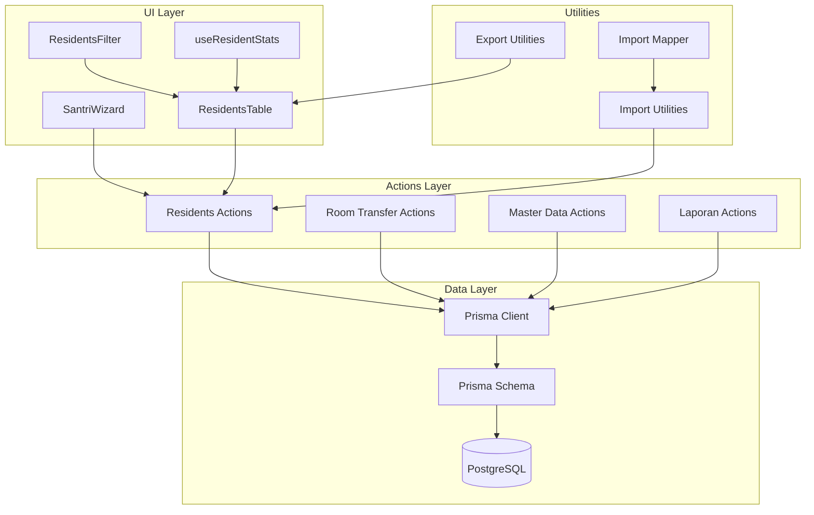
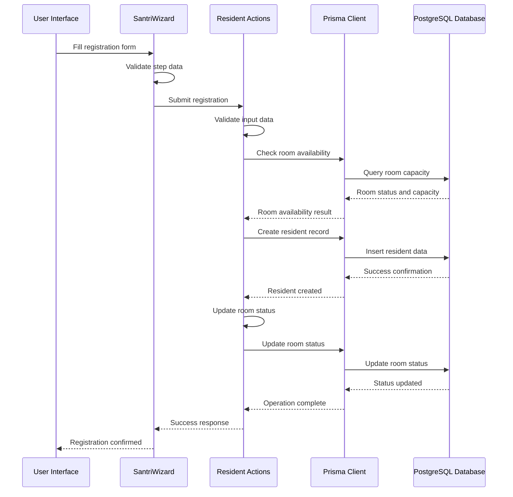
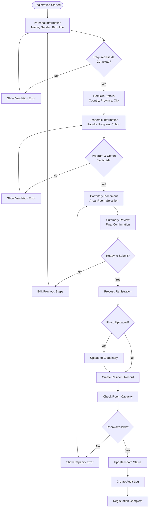
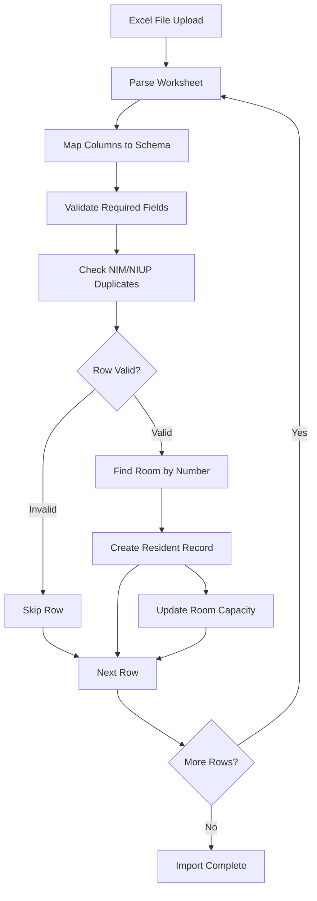
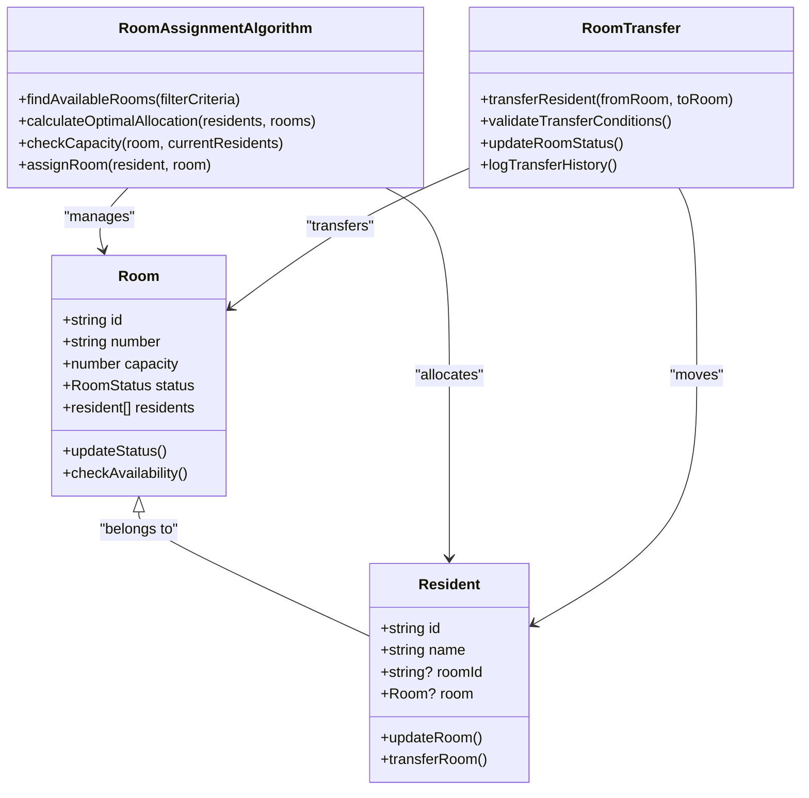
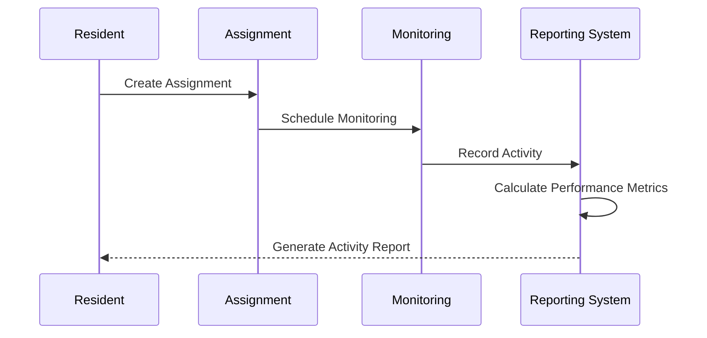
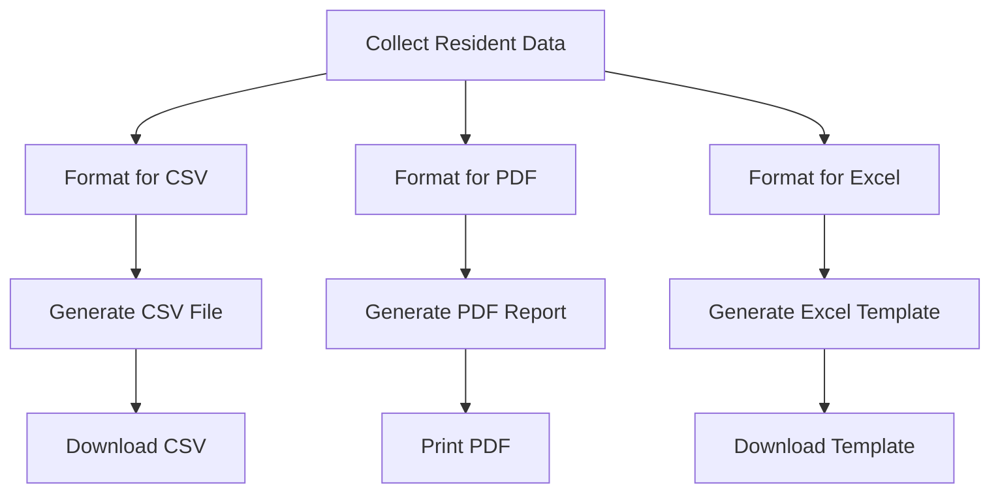
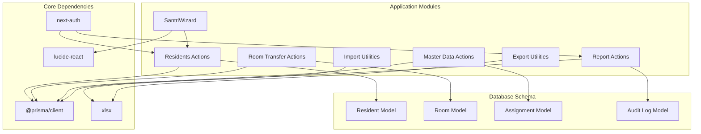

# Resident Management System

<cite>
**Referenced Files in This Document**
- [residents.ts](file://src/app/actions/residents.ts)
- [SantriWizard.tsx](file://src/components/dashboard/santri/wizard/SantriWizard.tsx)
- [schema.prisma](file://prisma/schema.prisma)
- [prisma.ts](file://src/lib/prisma.ts)
- [useResidentImport.ts](file://src/components/dashboard/residents/import/useResidentImport.ts)
- [residentImportMapper.ts](file://src/components/dashboard/residents/import/residentImportMapper.ts)
- [residentExport.ts](file://src/utils/residentExport.ts)
- [roomTransfer.ts](file://src/app/actions/roomTransfer.ts)
- [ResidentsFilter.tsx](file://src/components/dashboard/residents/ResidentsFilter.tsx)
- [ResidentsTable.tsx](file://src/components/dashboard/residents/ResidentsTable.tsx)
- [useResidentStats.ts](file://src/components/dashboard/residents/useResidentStats.ts)
- [masterData.ts](file://src/app/actions/masterData.ts)
- [laporan.ts](file://src/app/actions/laporan.ts)
- [constants.ts](file://src/components/dashboard/residents/constants.ts)
</cite>

## Table of Contents
1. [Introduction](#introduction)
2. [Project Structure](#project-structure)
3. [Core Components](#core-components)
4. [Architecture Overview](#architecture-overview)
5. [Detailed Component Analysis](#detailed-component-analysis)
6. [Dependency Analysis](#dependency-analysis)
7. [Performance Considerations](#performance-considerations)
8. [Troubleshooting Guide](#troubleshooting-guide)
9. [Conclusion](#conclusion)

## Introduction
This document provides comprehensive documentation for the resident management system used in dormitory administration. It covers the complete resident lifecycle from registration to graduation, including profile management, room allocation, and academic tracking. The system integrates a wizard-based registration process, batch import functionality, robust data validation, intelligent room assignment algorithms, transfer procedures, capacity management, advanced search and filtering, statistical reporting, and export capabilities. It also documents integrations with academic tracking systems and administrative workflows.

## Project Structure
The system follows a Next.js-based architecture with a clear separation of concerns:
- Actions layer: Server-side business logic for CRUD operations and workflows
- Components layer: Client-side UI components with wizards, forms, and data presentation
- Data layer: Prisma ORM with PostgreSQL database
- Utilities: Export, import, and helper functions
- API routes: Authentication, health checks, and reference data endpoints

**Diagram sources**
- [SantriWizard.tsx:1-773](file://src/components/dashboard/santri/wizard/SantriWizard.tsx#L1-L773)
- [residents.ts:1-666](file://src/app/actions/residents.ts#L1-L666)
- [schema.prisma:1-487](file://prisma/schema.prisma#L1-L487)
- [prisma.ts:1-31](file://src/lib/prisma.ts#L1-L31)

**Section sources**
- [SantriWizard.tsx:1-773](file://src/components/dashboard/santri/wizard/SantriWizard.tsx#L1-L773)
- [residents.ts:1-666](file://src/app/actions/residents.ts#L1-L666)
- [schema.prisma:1-487](file://prisma/schema.prisma#L1-L487)

## Core Components
The system comprises several core components that work together to manage resident lifecycle:

### Resident Management Actions
The central actions module handles all resident-related operations including creation, updates, deletions, bulk operations, and room management. It enforces data validation, maintains audit trails, and manages room capacity constraints.

### Wizard-Based Registration
The SantriWizard component provides an intuitive multi-step registration process with real-time validation, progress tracking, and photo upload capabilities. It supports both creation and editing modes with draft persistence.

### Batch Import System
The import system enables bulk registration of residents via Excel files with flexible column mapping, validation rules, and duplicate detection. It processes large datasets efficiently while maintaining data integrity.

### Room Management and Transfer
The room transfer system handles resident room assignments, capacity management, and transfer procedures with audit logging and room status updates.

### Reporting and Analytics
The reporting module provides comprehensive analytics including activity tracking, performance metrics, and export capabilities for administrative reporting.

**Section sources**
- [residents.ts:1-666](file://src/app/actions/residents.ts#L1-L666)
- [SantriWizard.tsx:1-773](file://src/components/dashboard/santri/wizard/SantriWizard.tsx#L1-L773)
- [roomTransfer.ts:1-156](file://src/app/actions/roomTransfer.ts#L1-L156)
- [laporan.ts:1-565](file://src/app/actions/laporan.ts#L1-L565)

## Architecture Overview
The system employs a layered architecture with clear separation between presentation, business logic, and data access layers:

**Diagram sources**
- [SantriWizard.tsx:199-267](file://src/components/dashboard/santri/wizard/SantriWizard.tsx#L199-L267)
- [residents.ts:113-244](file://src/app/actions/residents.ts#L113-L244)

The architecture ensures data consistency through:
- Transaction boundaries for critical operations
- Audit logging for all modifications
- Real-time validation at multiple layers
- Idempotent operations for reliability

## Detailed Component Analysis

### Wizard-Based Registration System
The SantriWizard provides a comprehensive registration experience with five distinct steps covering personal information, domicile details, academic information, dormitory placement, and summary review.

**Diagram sources**
- [SantriWizard.tsx:163-185](file://src/components/dashboard/santri/wizard/SantriWizard.tsx#L163-L185)
- [SantriWizard.tsx:199-267](file://src/components/dashboard/santri/wizard/SantriWizard.tsx#L199-L267)

**Section sources**
- [SantriWizard.tsx:1-773](file://src/components/dashboard/santri/wizard/SantriWizard.tsx#L1-L773)

### Batch Import and Validation System
The import system processes Excel files with flexible column mapping and comprehensive validation rules:

**Diagram sources**
- [useResidentImport.ts:13-56](file://src/components/dashboard/residents/import/useResidentImport.ts#L13-L56)
- [residentImportMapper.ts:54-82](file://src/components/dashboard/residents/import/residentImportMapper.ts#L54-L82)

**Section sources**
- [useResidentImport.ts:1-66](file://src/components/dashboard/residents/import/useResidentImport.ts#L1-L66)
- [residentImportMapper.ts:1-83](file://src/components/dashboard/residents/import/residentImportMapper.ts#L1-L83)
- [constants.ts:1-41](file://src/components/dashboard/residents/constants.ts#L1-L41)

### Room Assignment and Capacity Management
The room management system implements sophisticated algorithms for optimal room allocation:

**Diagram sources**
- [schema.prisma:27-42](file://prisma/schema.prisma#L27-L42)
- [schema.prisma:44-101](file://prisma/schema.prisma#L44-L101)
- [roomTransfer.ts:14-125](file://src/app/actions/roomTransfer.ts#L14-L125)

**Section sources**
- [roomTransfer.ts:1-156](file://src/app/actions/roomTransfer.ts#L1-L156)
- [schema.prisma:195-204](file://prisma/schema.prisma#L195-L204)

### Academic Tracking and Integration
The system integrates with academic tracking through assignment management and monitoring workflows:

**Diagram sources**
- [schema.prisma:115-131](file://prisma/schema.prisma#L115-L131)
- [laporan.ts:122-195](file://src/app/actions/laporan.ts#L122-L195)

**Section sources**
- [laporan.ts:1-565](file://src/app/actions/laporan.ts#L1-L565)
- [schema.prisma:133-149](file://prisma/schema.prisma#L133-L149)

### Data Export and Reporting
The export system provides multiple formats for administrative reporting:

**Diagram sources**
- [residentExport.ts:6-31](file://src/utils/residentExport.ts#L6-L31)
- [residentExport.ts:44-122](file://src/utils/residentExport.ts#L44-L122)

**Section sources**
- [residentExport.ts:1-123](file://src/utils/residentExport.ts#L1-L123)

## Dependency Analysis
The system exhibits strong modularity with clear dependency relationships:

**Diagram sources**
- [residents.ts:1-8](file://src/app/actions/residents.ts#L1-L8)
- [SantriWizard.tsx:1-9](file://src/components/dashboard/santri/wizard/SantriWizard.tsx#L1-L9)
- [useResidentImport.ts:1-6](file://src/components/dashboard/residents/import/useResidentImport.ts#L1-L6)

**Section sources**
- [prisma.ts:1-31](file://src/lib/prisma.ts#L1-L31)
- [schema.prisma:1-487](file://prisma/schema.prisma#L1-L487)

## Performance Considerations
The system implements several performance optimization strategies:

### Database Optimization
- Indexes on frequently queried fields (room ID, status, academic year)
- Efficient query patterns using selective includes
- Connection pooling for PostgreSQL
- Transaction batching for bulk operations

### Frontend Performance
- Client-side caching for wizard drafts
- Lazy loading of heavy components
- Optimistic UI updates for better responsiveness
- Debounced search and filter operations

### Scalability Features
- Server-side rendering with incremental static regeneration
- Efficient pagination for large datasets
- Selective data fetching based on user permissions
- CDN integration for image assets

## Troubleshooting Guide

### Common Registration Issues
**Problem**: Room capacity validation fails during registration
**Solution**: Verify room status is not under maintenance and has available capacity

**Problem**: Duplicate NIM/NIUP validation errors
**Solution**: Check existing records and ensure unique identifiers are properly formatted

**Problem**: Photo upload failures
**Solution**: Verify cloud storage configuration and file size limits

### Import Process Issues
**Problem**: Excel parsing errors
**Solution**: Ensure column headers match expected formats and data types are correct

**Problem**: Bulk import skips rows
**Solution**: Check validation rules and remove duplicate entries

### Room Transfer Problems
**Problem**: Transfer operation fails
**Solution**: Verify destination room has sufficient capacity and is not under maintenance

### Performance Issues
**Problem**: Slow data loading
**Solution**: Check database query performance and implement appropriate indexing

**Section sources**
- [residents.ts:170-188](file://src/app/actions/residents.ts#L170-L188)
- [roomTransfer.ts:40-46](file://src/app/actions/roomTransfer.ts#L40-L46)
- [useResidentImport.ts:31-35](file://src/components/dashboard/residents/import/useResidentImport.ts#L31-L35)

## Conclusion
The resident management system provides a comprehensive solution for dormitory administration with robust features for resident lifecycle management. Its modular architecture, comprehensive validation, and integration capabilities make it suitable for complex institutional environments. The system's emphasis on data integrity, audit trails, and user experience ensures reliable operation across diverse administrative scenarios.

Key strengths include:
- Intuitive wizard-based registration process
- Robust batch import capabilities
- Sophisticated room assignment algorithms
- Comprehensive reporting and analytics
- Strong data validation and error handling
- Scalable architecture with performance optimizations

The system successfully bridges the gap between academic administration and dormitory management, providing administrators with powerful tools for resident oversight and reporting.