# Room Allocation & Transfer System

<cite>
**Referenced Files in This Document**
- [roomTransfer.ts](file://src/app/actions/roomTransfer.ts)
- [residents.ts](file://src/app/actions/residents.ts)
- [rooms.ts](file://src/app/actions/rooms.ts)
- [schema.prisma](file://prisma/schema.prisma)
- [ResidentsClient.tsx](file://src/components/dashboard/ResidentsClient.tsx)
- [RoomsClient.tsx](file://src/components/dashboard/RoomsClient.tsx)
- [ResidentDetailModal.tsx](file://src/components/dashboard/ResidentDetailModal.tsx)
- [audit.ts](file://src/app/actions/audit.ts)
- [page.tsx](file://src/app/dashboard/residents/page.tsx)
</cite>

## Table of Contents
1. [Introduction](#introduction)
2. [System Architecture](#system-architecture)
3. [Core Components](#core-components)
4. [Room Assignment Algorithms](#room-assignment-algorithms)
5. [Capacity Management](#capacity-management)
6. [Availability Checking Mechanisms](#availability-checking-mechanisms)
7. [Room Transfer Workflow](#room-transfer-workflow)
8. [Bulk Transfer Operations](#bulk-transfer-operations)
9. [Integration Between Resident and Room Entities](#integration-between-resident-and-room-entities)
10. [Room Management System Integration](#room-management-system-integration)
11. [Resident Movement Tracking](#resident-movement-tracking)
12. [Examples and Scenarios](#examples-and-scenarios)
13. [Performance Considerations](#performance-considerations)
14. [Troubleshooting Guide](#troubleshooting-guide)
15. [Conclusion](#conclusion)

## Introduction

The Room Allocation & Transfer System is a comprehensive solution designed to manage student accommodation within the Asrama (student dormitory) management system. This system provides sophisticated room assignment algorithms, capacity management, and availability checking mechanisms, along with robust room transfer workflows including bulk operations.

The system integrates seamlessly with the broader Asrama management platform, offering real-time tracking of resident movements, automated room status updates, and comprehensive audit logging capabilities. It supports both individual room transfers and bulk operations, ensuring efficient management of large-scale accommodation changes.

## System Architecture

The room allocation system follows a modular architecture with clear separation of concerns between data management, business logic, and user interface components.

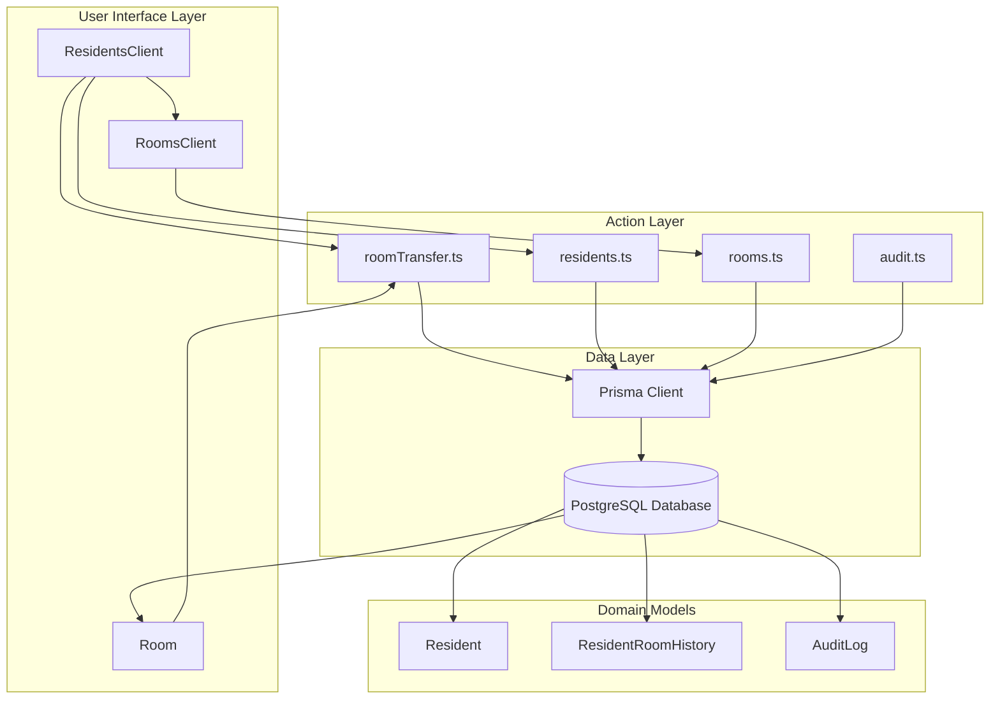

**Diagram sources**
- [roomTransfer.ts:1-156](file://src/app/actions/roomTransfer.ts#L1-L156)
- [residents.ts:1-666](file://src/app/actions/residents.ts#L1-L666)
- [rooms.ts:1-118](file://src/app/actions/rooms.ts#L1-L118)

**Section sources**
- [roomTransfer.ts:1-156](file://src/app/actions/roomTransfer.ts#L1-L156)
- [residents.ts:1-666](file://src/app/actions/residents.ts#L1-L666)
- [rooms.ts:1-118](file://src/app/actions/rooms.ts#L1-L118)

## Core Components

### Domain Models

The system is built around four primary domain models that define the core functionality:

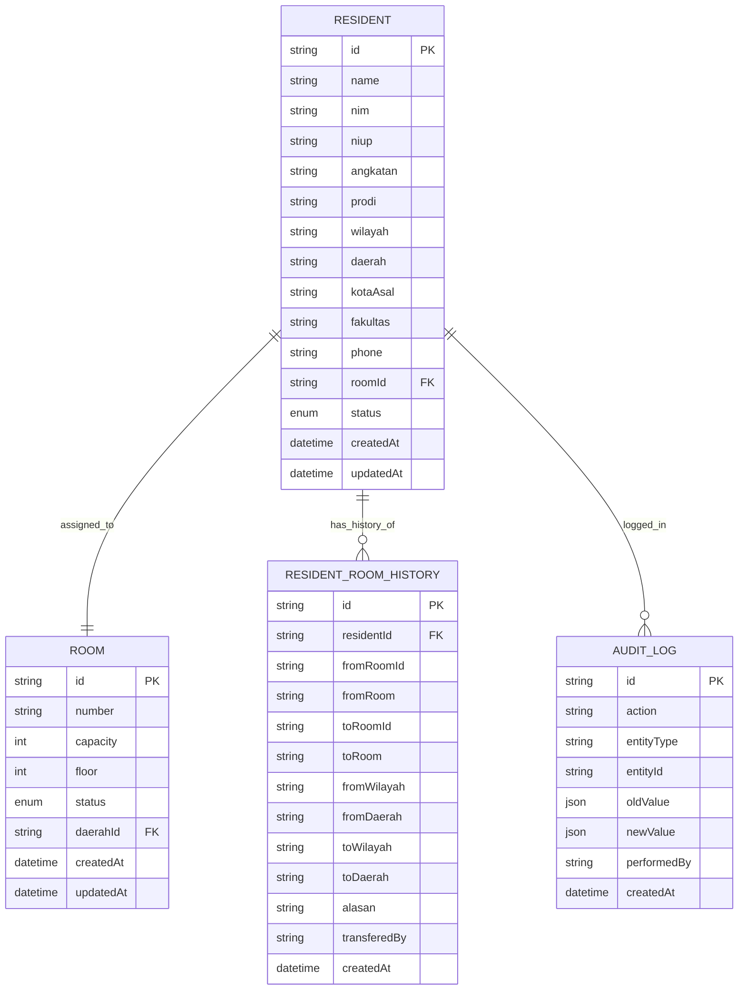

**Diagram sources**
- [schema.prisma:27-101](file://prisma/schema.prisma#L27-L101)
- [schema.prisma:468-486](file://prisma/schema.prisma#L468-L486)

### Action Services

The system employs a service-oriented architecture with dedicated action services handling specific business operations:

| Service | Primary Responsibilities | Key Functions |
|---------|-------------------------|---------------|
| **RoomTransferService** | Individual room transfers | `transferResidentRoom()`, `getResidentRoomHistory()`, `getAvailableRooms()` |
| **ResidentManagementService** | Resident lifecycle management | `createResident()`, `updateResident()`, `deleteResident()` |
| **BulkOperationsService** | Mass operations | `bulkCreateResidents()`, `bulkMoveResidents()`, `bulkDeleteResidents()` |
| **RoomManagementService** | Room administration | `createRoom()`, `updateRoom()`, `deleteRoom()`, `getRooms()` |

**Section sources**
- [roomTransfer.ts:8-125](file://src/app/actions/roomTransfer.ts#L8-L125)
- [residents.ts:113-244](file://src/app/actions/residents.ts#L113-L244)
- [rooms.ts:21-90](file://src/app/actions/rooms.ts#L21-L90)

## Room Assignment Algorithms

The room assignment system implements sophisticated algorithms to ensure optimal room allocation while maintaining capacity constraints and operational requirements.

### Single Resident Assignment Algorithm

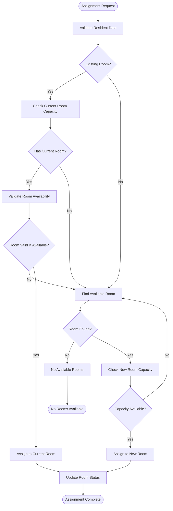

**Diagram sources**
- [residents.ts:170-188](file://src/app/actions/residents.ts#L170-L188)
- [residents.ts:318-336](file://src/app/actions/residents.ts#L318-L336)

### Bulk Assignment Algorithm

The bulk assignment algorithm extends the single assignment logic to handle multiple residents efficiently:

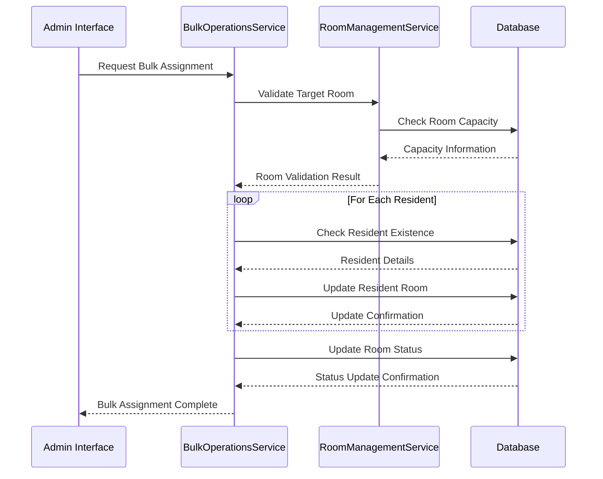

**Diagram sources**
- [residents.ts:495-578](file://src/app/actions/residents.ts#L495-L578)
- [residents.ts:610-665](file://src/app/actions/residents.ts#L610-L665)

**Section sources**
- [residents.ts:170-244](file://src/app/actions/residents.ts#L170-L244)
- [residents.ts:495-578](file://src/app/actions/residents.ts#L495-L578)

## Capacity Management

The capacity management system ensures that room allocations respect physical limitations while providing flexibility for operational needs.

### Capacity Constraint Enforcement

| Constraint Type | Enforcement Point | Validation Logic | Error Handling |
|----------------|-------------------|------------------|----------------|
| **Physical Capacity** | Room Assignment | `residents.length >= capacity` | Capacity exceeded error |
| **Maintenance Status** | Room Access | `status === MAINTENANCE` | Maintenance unavailable error |
| **Room Occupancy** | Transfer Operations | `current_occupancy + transfer_count > capacity` | Insufficient capacity error |
| **Unique Room Numbers** | Room Creation | `number_exists` | Duplicate room number error |

### Dynamic Status Updates

The system automatically manages room status based on occupancy levels:

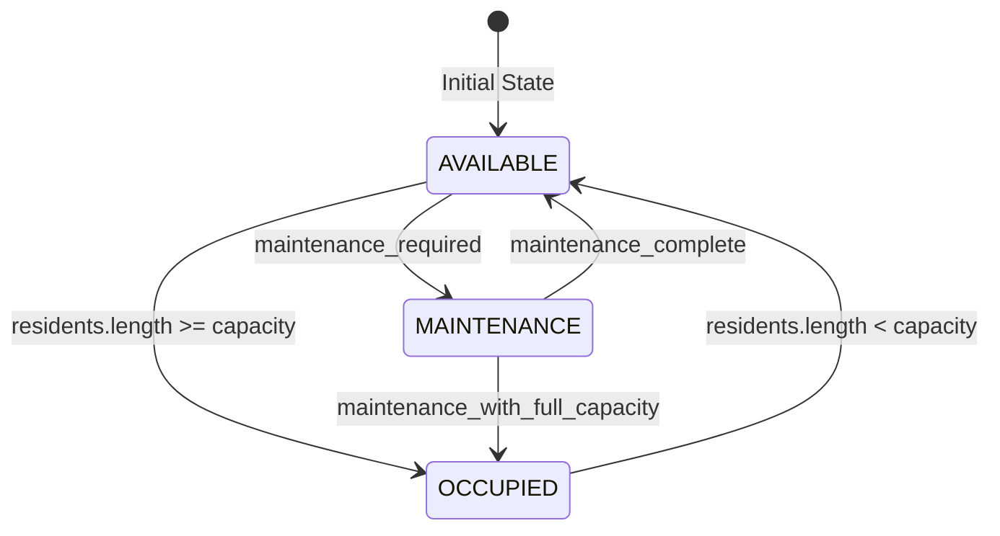

**Diagram sources**
- [schema.prisma:195-199](file://prisma/schema.prisma#L195-L199)
- [residents.ts:222-235](file://src/app/actions/residents.ts#L222-L235)
- [residents.ts:414-433](file://src/app/actions/residents.ts#L414-L433)

**Section sources**
- [rooms.ts:21-51](file://src/app/actions/rooms.ts#L21-L51)
- [residents.ts:222-235](file://src/app/actions/residents.ts#L222-L235)

## Availability Checking Mechanisms

The availability checking system provides real-time room status information and capacity calculations.

### Real-Time Availability Queries

The system maintains several availability indices for efficient querying:

| Query Type | Purpose | Implementation |
|------------|---------|----------------|
| **Available Rooms** | Find rooms with free capacity | `status = AVAILABLE AND residents.length < capacity` |
| **Capacity Analysis** | Calculate utilization rates | `residents.length / capacity * 100` |
| **Maintenance Rooms** | Identify rooms under repair | `status = MAINTENANCE` |
| **Full Capacity Rooms** | Find rooms at 100% occupancy | `residents.length = capacity` |

### Availability Filtering Logic

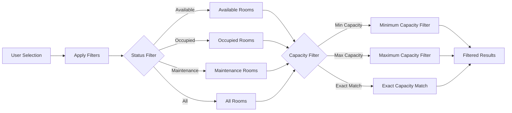

**Diagram sources**
- [ResidentsClient.tsx:114-120](file://src/components/dashboard/ResidentsClient.tsx#L114-L120)
- [RoomsClient.tsx:46-57](file://src/components/dashboard/RoomsClient.tsx#L46-L57)

**Section sources**
- [ResidentsClient.tsx:114-120](file://src/components/dashboard/ResidentsClient.tsx#L114-L120)
- [RoomsClient.tsx:46-57](file://src/components/dashboard/RoomsClient.tsx#L46-L57)

## Room Transfer Workflow

The room transfer system provides comprehensive functionality for moving residents between accommodations with full audit trail and status management.

### Individual Transfer Process

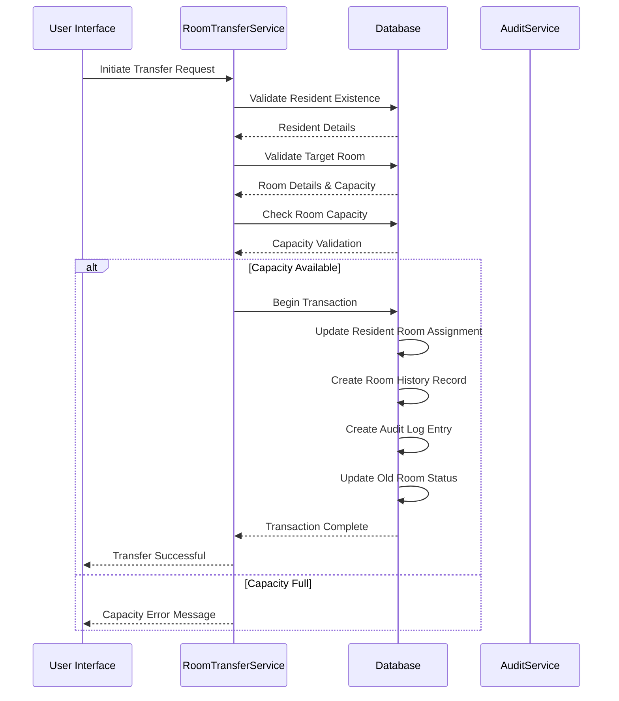

**Diagram sources**
- [roomTransfer.ts:14-125](file://src/app/actions/roomTransfer.ts#L14-L125)

### Transfer Validation Rules

| Validation Rule | Condition | Error Message |
|----------------|-----------|---------------|
| **Resident Exists** | `resident !== null` | "Santri tidak ditemukan" |
| **Target Room Exists** | `newRoom !== null` | "Kamar tujuan tidak ditemukan" |
| **Capacity Available** | `newRoom.residents.length < newRoom.capacity` | "Kamar sudah penuh" |
| **Same Room Check** | `newRoom.id !== resident.roomId` | "Santri sudah berada di kamar ini" |
| **Maintenance Status** | `newRoom.status !== MAINTENANCE` | "Kamar sedang dalam perbaikan" |

**Section sources**
- [roomTransfer.ts:14-125](file://src/app/actions/roomTransfer.ts#L14-L125)

## Bulk Transfer Operations

The bulk transfer system enables administrators to move multiple residents simultaneously with comprehensive capacity validation and status management.

### Bulk Transfer Algorithm

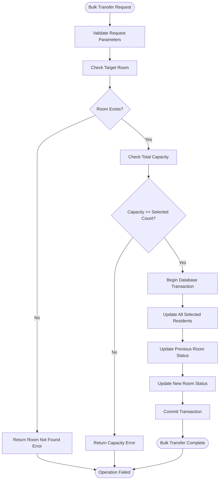

**Diagram sources**
- [residents.ts:610-665](file://src/app/actions/residents.ts#L610-L665)

### Bulk Operation Features

| Feature | Description | Implementation |
|---------|-------------|----------------|
| **Multi-Resident Selection** | Select multiple residents via checkboxes | Frontend selection state management |
| **Batch Validation** | Validate all selected residents before transfer | Pre-transfer capacity calculation |
| **Atomic Operations** | All updates occur within single transaction | Database transaction wrapper |
| **Status Automation** | Automatic room status updates | Post-transfer status recalculations |
| **Error Handling** | Graceful handling of partial failures | Transaction rollback on errors |

**Section sources**
- [residents.ts:610-665](file://src/app/actions/residents.ts#L610-L665)
- [ResidentsClient.tsx:93-110](file://src/components/dashboard/ResidentsClient.tsx#L93-L110)

## Integration Between Resident and Room Entities

The system maintains strong integration between resident and room entities through foreign key relationships and cascading operations.

### Entity Relationship Management

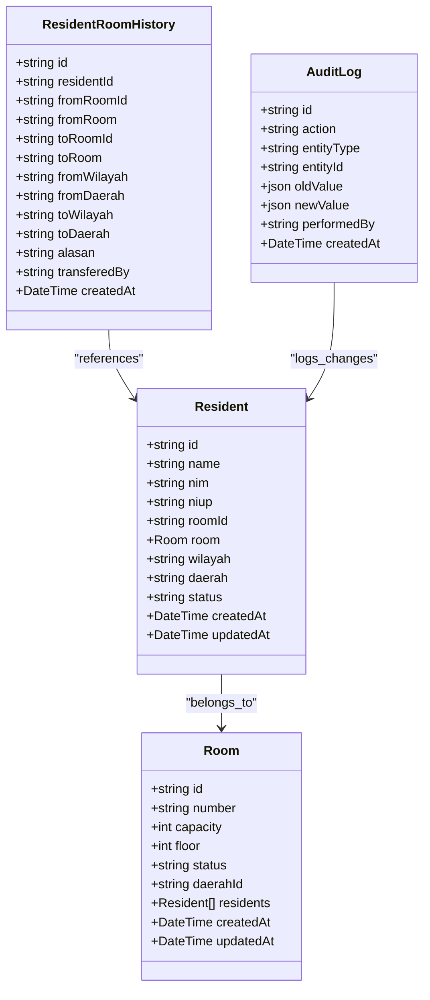

**Diagram sources**
- [schema.prisma:44-101](file://prisma/schema.prisma#L44-L101)
- [schema.prisma:468-486](file://prisma/schema.prisma#L468-L486)

### Automatic Status Updates

The system implements automatic status updates for seamless room management:

| Trigger Event | Affected Entity | Status Change | Reason |
|---------------|----------------|---------------|---------|
| **First Resident Assigned** | Room | AVAILABLE → OCCUPIED | Room reaches capacity threshold |
| **Last Resident Evacuated** | Room | OCCUPIED → AVAILABLE | Room becomes empty |
| **Maintenance Initiated** | Room | AVAILABLE → MAINTENANCE | Scheduled repairs |
| **Maintenance Completed** | Room | MAINTENANCE → AVAILABLE | Repairs finished |
| **Resident Transferred Out** | Previous Room | Occupancy Decreased | Resident leaves |
| **Resident Transferred In** | New Room | Occupancy Increased | New resident arrives |

**Section sources**
- [residents.ts:414-433](file://src/app/actions/residents.ts#L414-L433)
- [roomTransfer.ts:96-108](file://src/app/actions/roomTransfer.ts#L96-L108)

## Room Management System Integration

The room allocation system integrates deeply with the broader room management infrastructure, providing comprehensive oversight and control capabilities.

### Room Management Features

| Feature | Description | User Interface |
|---------|-------------|----------------|
| **Room Creation** | Add new rooms to the system | Modal form with validation |
| **Room Modification** | Update room details and capacity | Editable room cards |
| **Room Deletion** | Remove rooms (with safety checks) | Confirmation dialog |
| **Status Management** | Control room availability | Status indicators and controls |
| **Capacity Planning** | Monitor room utilization | Dashboard visualizations |

### Dashboard Integration

The system provides comprehensive room management through integrated dashboard components:

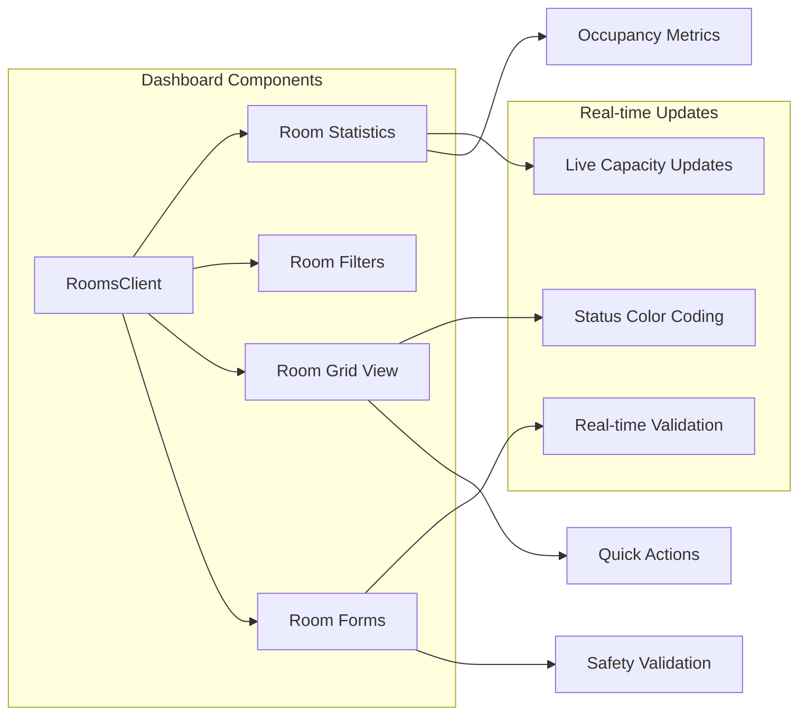

**Diagram sources**
- [RoomsClient.tsx:23-433](file://src/components/dashboard/RoomsClient.tsx#L23-L433)

**Section sources**
- [rooms.ts:7-118](file://src/app/actions/rooms.ts#L7-L118)
- [RoomsClient.tsx:23-433](file://src/components/dashboard/RoomsClient.tsx#L23-L433)

## Resident Movement Tracking

The system maintains comprehensive tracking of resident movements through dedicated history and audit logging mechanisms.

### Movement History Architecture

```mermaid
erDiagram
RESIDENT_MOVEMENT_HISTORY {
string id PK
string residentId FK
string fromRoomId
string fromRoomNumber
string toRoomId
string toRoomNumber
string fromWilayah
string fromDaerah
string toWilayah
string toDaerah
string alasan
string transferedBy
datetime createdAt
}
RESIDENT ||--o{ RESIDENT_MOVEMENT_HISTORY : "has_moved_from_to"
note for RESIDENT_MOVEMENT_HISTORY "Stores historical room assignments\nwith location context and reasons"
```

**Diagram sources**
- [schema.prisma:468-486](file://prisma/schema.prisma#L468-L486)

### Audit Trail Implementation

The audit system captures comprehensive change information for compliance and tracking purposes:

| Audit Category | Events Logged | Data Captured |
|----------------|---------------|---------------|
| **Room Transfers** | All transfer operations | Resident, rooms, reason, operator |
| **Resident Changes** | Updates to resident records | Field changes, values before/after |
| **Room Modifications** | Room creation/editing/deletion | Room details, status changes |
| **Bulk Operations** | Mass operations execution | Operation details, participants |

**Section sources**
- [roomTransfer.ts:67-94](file://src/app/actions/roomTransfer.ts#L67-L94)
- [audit.ts:8-25](file://src/app/actions/audit.ts#L8-L25)

## Examples and Scenarios

### Scenario 1: New Student Registration with Room Assignment

**Context**: A new student registers and requires room assignment

**Process Flow**:
1. Student data validated and saved to database
2. Available room with capacity checked
3. Room assignment recorded with status update
4. Audit log entry created
5. Frontend cache invalidated for real-time updates

**Expected Outcome**: Student successfully assigned to available room with updated system state

### Scenario 2: Room Transfer Due to Maintenance

**Context**: Student needs to be moved due to room maintenance

**Process Flow**:
1. Maintenance room identified and marked as unavailable
2. Alternative room with capacity located
3. Transfer operation executed with validation
4. Both rooms' statuses updated appropriately
5. Comprehensive audit trail maintained

**Expected Outcome**: Student relocated to suitable alternative room with complete documentation

### Scenario 3: Bulk Transfer During Academic Year Change

**Context**: Entire academic year cohort needs room reassignment

**Process Flow**:
1. Target rooms for new year groups identified
2. Capacity validated for all target rooms
3. Batch transfer operation initiated
4. All affected rooms' statuses updated
5. System-wide cache refreshed

**Expected Outcome**: Smooth transition of entire cohort with minimal disruption

## Performance Considerations

The room allocation system is optimized for performance through several key strategies:

### Database Optimization

| Optimization | Implementation | Benefit |
|------------|----------------|---------|
| **Indexing Strategy** | Composite indexes on frequently queried fields | Faster room queries and filters |
| **Connection Pooling** | Prisma connection pooling | Reduced database overhead |
| **Query Optimization** | Efficient JOIN operations and projections | Improved response times |
| **Caching Strategy** | Next.js revalidation for cached data | Reduced database load |

### Memory Management

| Aspect | Strategy | Impact |
|--------|----------|--------|
| **Bulk Operations** | Batch processing with transaction boundaries | Prevents memory leaks |
| **Large Dataset Handling** | Pagination and lazy loading | Optimizes frontend performance |
| **State Management** | Efficient React state updates | Reduces unnecessary re-renders |

### Scalability Features

| Feature | Benefit | Implementation |
|---------|---------|----------------|
| **Horizontal Scaling** | Support for multiple database instances | Prisma driver adapters |
| **Load Balancing** | Distribute requests across servers | Next.js serverless deployment |
| **Database Sharding** | Partition data by geographic regions | Regional room management |

## Troubleshooting Guide

### Common Issues and Solutions

| Issue | Symptoms | Solution |
|-------|----------|----------|
| **Room Not Available** | Capacity validation fails during assignment | Check room status and capacity |
| **Transfer Operation Fails** | Transaction rollback occurs | Verify target room availability |
| **Audit Log Missing** | No change history in system | Check user permissions for audit access |
| **Bulk Operation Partial Failure** | Some residents not transferred | Review individual resident constraints |

### Error Handling Patterns

The system implements comprehensive error handling across all operations:

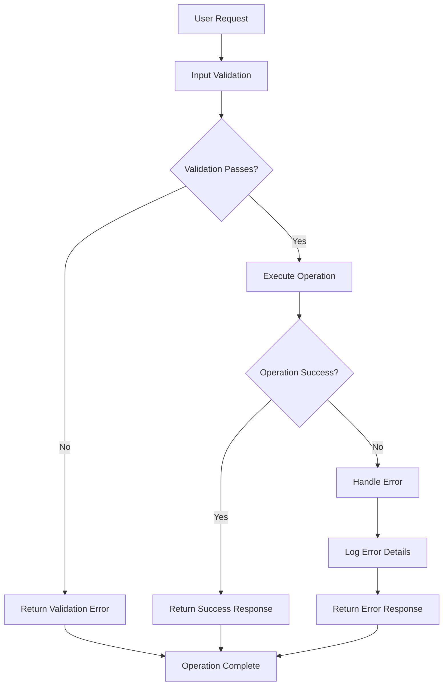

**Diagram sources**
- [roomTransfer.ts:120-125](file://src/app/actions/roomTransfer.ts#L120-L125)
- [residents.ts:240-244](file://src/app/actions/residents.ts#L240-L244)

### Debugging Tools

| Tool | Purpose | Usage |
|------|---------|-------|
| **Audit Logs** | Track system changes and operations | Filter by entity type and timeframe |
| **Console Logging** | Detailed operation tracing | Monitor server-side execution |
| **Database Queries** | Analyze performance bottlenecks | Review query execution plans |
| **Frontend DevTools** | Client-side debugging | Monitor API responses and state |

**Section sources**
- [roomTransfer.ts:120-125](file://src/app/actions/roomTransfer.ts#L120-L125)
- [audit.ts:27-98](file://src/app/actions/audit.ts#L27-L98)

## Conclusion

The Room Allocation & Transfer System represents a comprehensive solution for managing student accommodation within educational institutions. Through its sophisticated algorithms, robust validation mechanisms, and comprehensive tracking capabilities, the system ensures efficient room management while maintaining data integrity and operational transparency.

Key strengths of the system include:

- **Automated Capacity Management**: Intelligent room status updates prevent over-occupancy and ensure compliance with safety regulations
- **Comprehensive Audit Trail**: Complete tracking of all room assignments and transfers enables compliance and operational oversight
- **Flexible Transfer Operations**: Support for both individual and bulk transfers accommodates various operational scenarios
- **Real-time Integration**: Seamless integration between resident and room management provides accurate, up-to-date information
- **Performance Optimization**: Carefully designed database queries and caching strategies ensure responsive system performance

The system's modular architecture and clear separation of concerns facilitate future enhancements and maintenance. Its comprehensive error handling and debugging capabilities ensure reliable operation in production environments.

Future development opportunities include advanced analytics capabilities, predictive room utilization forecasting, and enhanced mobile device support for field operations.