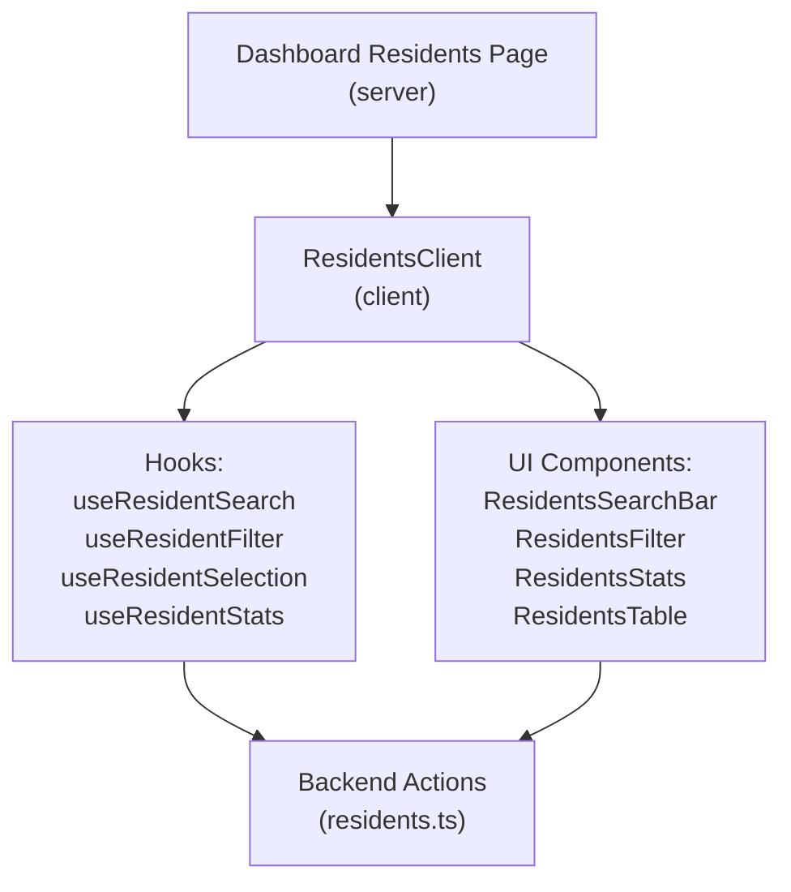
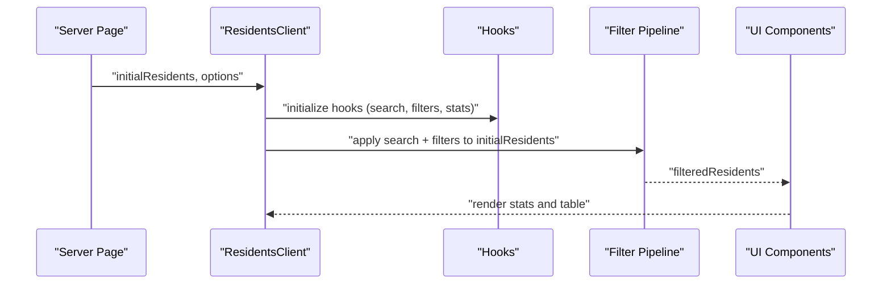
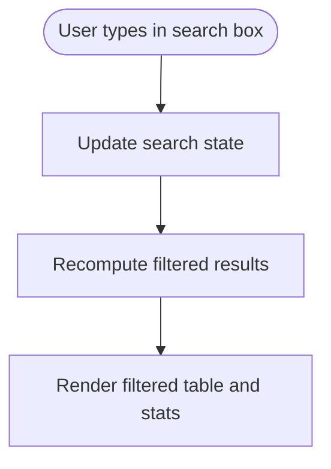
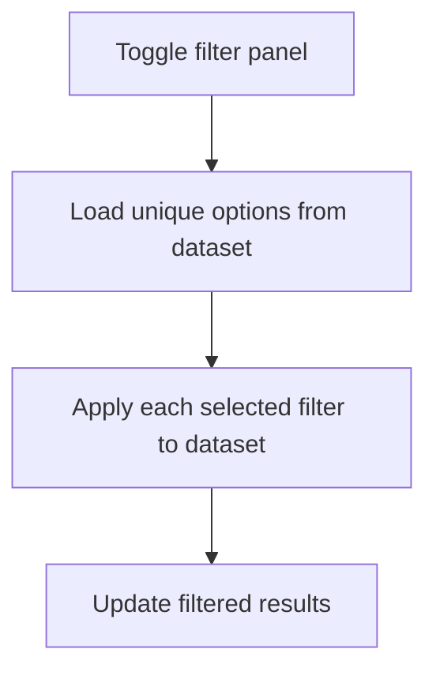
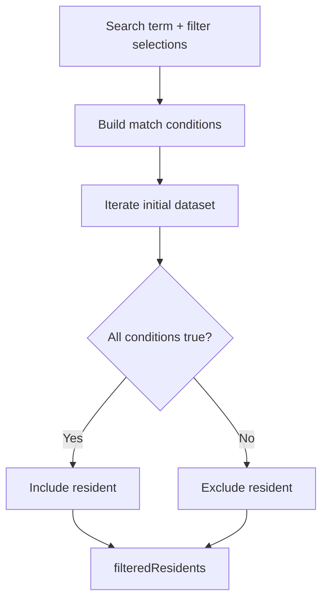
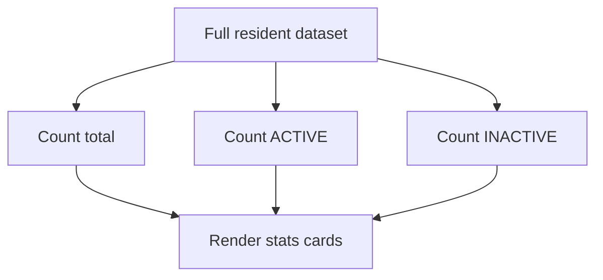
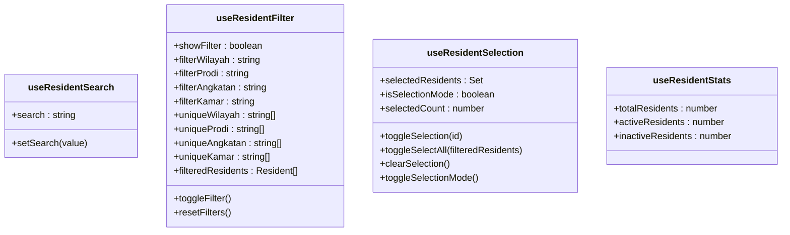
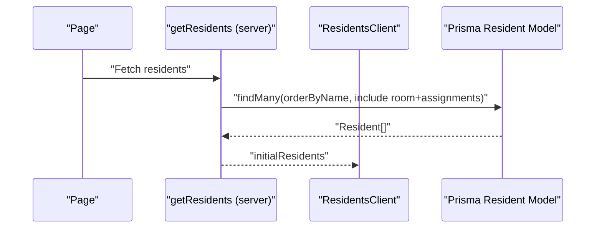
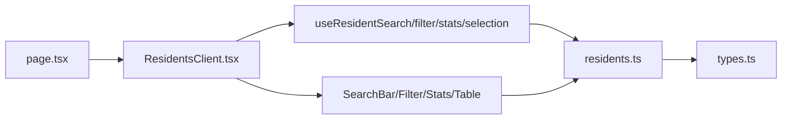

# Search, Filter & Statistics

<cite>
**Referenced Files in This Document**
- [page.tsx](file://src/app/dashboard/residents/page.tsx)
- [ResidentsClient.tsx](file://src/components/dashboard/ResidentsClient.tsx)
- [useResidentSearch.ts](file://src/components/dashboard/residents/useResidentSearch.ts)
- [useResidentFilter.ts](file://src/components/dashboard/residents/useResidentFilter.ts)
- [useResidentStats.ts](file://src/components/dashboard/residents/useResidentStats.ts)
- [ResidentsSearchBar.tsx](file://src/components/dashboard/residents/ResidentsSearchBar.tsx)
- [ResidentsFilter.tsx](file://src/components/dashboard/residents/ResidentsFilter.tsx)
- [ResidentsStats.tsx](file://src/components/dashboard/residents/ResidentsStats.tsx)
- [ResidentsTable.tsx](file://src/components/dashboard/residents/ResidentsTable.tsx)
- [types.ts](file://src/components/dashboard/residents/types.ts)
- [residents.ts](file://src/app/actions/residents.ts)
</cite>

## Table of Contents
1. [Introduction](#introduction)
2. [Project Structure](#project-structure)
3. [Core Components](#core-components)
4. [Architecture Overview](#architecture-overview)
5. [Detailed Component Analysis](#detailed-component-analysis)
6. [Dependency Analysis](#dependency-analysis)
7. [Performance Considerations](#performance-considerations)
8. [Troubleshooting Guide](#troubleshooting-guide)
9. [Conclusion](#conclusion)

## Introduction
This document explains the resident search, filtering, and statistics functionality implemented in the dashboard. It covers the search bar, advanced filters, real-time filtering pipeline, statistics dashboard, and the hook-based architecture that manages search state, filters, selections, and statistics. It also documents how frontend filtering integrates with backend data retrieval and outlines performance strategies for large datasets.

## Project Structure
The residents dashboard is composed of:
- A server-side page that preloads data and passes it to the client.
- A client component orchestrating UI, hooks, and child components.
- Hook modules for search, filters, selection, and statistics.
- UI components for search bar, filters, statistics cards, and the results table.
- Backend actions for fetching and mutating resident data.

**Diagram sources**
- [page.tsx:10-38](file://src/app/dashboard/residents/page.tsx#L10-L38)
- [ResidentsClient.tsx:21-35](file://src/components/dashboard/ResidentsClient.tsx#L21-L35)
- [useResidentSearch.ts:3-9](file://src/components/dashboard/residents/useResidentSearch.ts#L3-L9)
- [useResidentFilter.ts:9-71](file://src/components/dashboard/residents/useResidentFilter.ts#L9-L71)
- [useResidentStats.ts:4-13](file://src/components/dashboard/residents/useResidentStats.ts#L4-L13)
- [residents.ts:76-93](file://src/app/actions/residents.ts#L76-L93)

**Section sources**
- [page.tsx:10-38](file://src/app/dashboard/residents/page.tsx#L10-L38)
- [ResidentsClient.tsx:21-35](file://src/components/dashboard/ResidentsClient.tsx#L21-L35)

## Core Components
- Search state management via a lightweight hook storing a single string term.
- Advanced filters with four categories: region, program study, cohort, and room number.
- Real-time filtering pipeline that applies search and filters to the initial dataset.
- Statistics dashboard computing totals and counts for active/inactive residents.
- Selection mode enabling bulk operations on filtered results.

**Section sources**
- [useResidentSearch.ts:3-9](file://src/components/dashboard/residents/useResidentSearch.ts#L3-L9)
- [useResidentFilter.ts:9-71](file://src/components/dashboard/residents/useResidentFilter.ts#L9-L71)
- [useResidentStats.ts:4-13](file://src/components/dashboard/residents/useResidentStats.ts#L4-L13)
- [ResidentsClient.tsx:38-65](file://src/components/dashboard/ResidentsClient.tsx#L38-L65)

## Architecture Overview
The system follows a client-driven filtering model:
- Server loads the full resident dataset and passes it to the client.
- Client maintains state for search and filters.
- Filtering runs locally on the client against the initial dataset.
- UI components render filtered results and statistics.

**Diagram sources**
- [page.tsx:19-26](file://src/app/dashboard/residents/page.tsx#L19-L26)
- [ResidentsClient.tsx:37-56](file://src/components/dashboard/ResidentsClient.tsx#L37-L56)
- [useResidentFilter.ts:40-52](file://src/components/dashboard/residents/useResidentFilter.ts#L40-L52)
- [ResidentsTable.tsx:14-21](file://src/components/dashboard/residents/ResidentsTable.tsx#L14-L21)

## Detailed Component Analysis

### Search Bar Implementation
- Purpose: Accept free-text input to match resident name, NIM, or NIUP.
- Behavior: Updates local search state; downstream filtering recomputes automatically.
- UI feedback: Shows current filtered count and reset controls when filters are active.

**Diagram sources**
- [ResidentsSearchBar.tsx:25-33](file://src/components/dashboard/residents/ResidentsSearchBar.tsx#L25-L33)
- [useResidentSearch.ts:3-9](file://src/components/dashboard/residents/useResidentSearch.ts#L3-L9)
- [useResidentFilter.ts:40-52](file://src/components/dashboard/residents/useResidentFilter.ts#L40-L52)

**Section sources**
- [ResidentsSearchBar.tsx:13-59](file://src/components/dashboard/residents/ResidentsSearchBar.tsx#L13-L59)
- [useResidentSearch.ts:3-9](file://src/components/dashboard/residents/useResidentSearch.ts#L3-L9)

### Advanced Filters
- Criteria:
  - Region (Wilayah)
  - Program Study (Prodi)
  - Cohort (Angkatan)
  - Room Number (Kamar)
- Behavior:
  - Each filter is optional; any combination can be applied.
  - Unique option lists are derived from the initial dataset.
  - Toggle shows/hides the filter panel and resets filters when hidden.

**Diagram sources**
- [ResidentsFilter.tsx:16-69](file://src/components/dashboard/residents/ResidentsFilter.tsx#L16-L69)
- [useResidentFilter.ts:30-38](file://src/components/dashboard/residents/useResidentFilter.ts#L30-L38)
- [useResidentFilter.ts:40-52](file://src/components/dashboard/residents/useResidentFilter.ts#L40-L52)

**Section sources**
- [ResidentsFilter.tsx:16-69](file://src/components/dashboard/residents/ResidentsFilter.tsx#L16-L69)
- [useResidentFilter.ts:9-71](file://src/components/dashboard/residents/useResidentFilter.ts#L9-L71)

### Real-Time Filtering Mechanism
- Search matches across name, NIM, and NIUP.
- Filters are combined with logical AND semantics.
- Sorting for room numbers handles numeric ordering for padded strings.

**Diagram sources**
- [useResidentFilter.ts:40-52](file://src/components/dashboard/residents/useResidentFilter.ts#L40-L52)
- [useResidentFilter.ts:33-38](file://src/components/dashboard/residents/useResidentFilter.ts#L33-L38)

**Section sources**
- [useResidentFilter.ts:40-52](file://src/components/dashboard/residents/useResidentFilter.ts#L40-L52)

### Statistics Dashboard
- Computes:
  - Total residents
  - Active residents
  - Inactive residents
- Renders three cards with icons and color-coded values.

**Diagram sources**
- [useResidentStats.ts:4-13](file://src/components/dashboard/residents/useResidentStats.ts#L4-L13)
- [ResidentsStats.tsx:9-56](file://src/components/dashboard/residents/ResidentsStats.tsx#L9-L56)

**Section sources**
- [useResidentStats.ts:4-13](file://src/components/dashboard/residents/useResidentStats.ts#L4-L13)
- [ResidentsStats.tsx:9-56](file://src/components/dashboard/residents/ResidentsStats.tsx#L9-L56)

### Hook-Based Architecture
- useResidentSearch: Manages the free-text search term.
- useResidentFilter: Manages visibility, filter values, unique options, and computed filtered results.
- useResidentSelection: Manages selection mode, selected IDs, and bulk selection toggles.
- useResidentStats: Computes statistics from the resident dataset.

**Diagram sources**
- [useResidentSearch.ts:3-9](file://src/components/dashboard/residents/useResidentSearch.ts#L3-L9)
- [useResidentFilter.ts:9-71](file://src/components/dashboard/residents/useResidentFilter.ts#L9-L71)
- [useResidentSelection.ts:4-55](file://src/components/dashboard/residents/useResidentSelection.ts#L4-L55)
- [useResidentStats.ts:4-13](file://src/components/dashboard/residents/useResidentStats.ts#L4-L13)

**Section sources**
- [useResidentSearch.ts:3-9](file://src/components/dashboard/residents/useResidentSearch.ts#L3-L9)
- [useResidentFilter.ts:9-71](file://src/components/dashboard/residents/useResidentFilter.ts#L9-L71)
- [useResidentSelection.ts:4-55](file://src/components/dashboard/residents/useResidentSelection.ts#L4-L55)
- [useResidentStats.ts:4-13](file://src/components/dashboard/residents/useResidentStats.ts#L4-L13)

### Backend Integration and Data Model
- Server-side action fetches the full resident dataset with related room and assignment data.
- Client-side filtering operates on this dataset; backend actions support creation, updates, deletions, and bulk operations.
- Resident entity includes identifiers, personal info, academic info, location, room association, and status.

**Diagram sources**
- [page.tsx:19-26](file://src/app/dashboard/residents/page.tsx#L19-L26)
- [residents.ts:76-93](file://src/app/actions/residents.ts#L76-L93)
- [types.ts:13-42](file://src/components/dashboard/residents/types.ts#L13-L42)

**Section sources**
- [residents.ts:76-93](file://src/app/actions/residents.ts#L76-L93)
- [types.ts:13-42](file://src/components/dashboard/residents/types.ts#L13-L42)

### Example Scenarios
- Search query syntax:
  - Name substring search
  - Exact NIM match
  - Exact NIUP match
- Filter combinations:
  - Search + Region
  - Program Study + Cohort
  - Room Number + Region + Program Study
- Statistical calculations:
  - Total = count of all residents
  - Active = count where status equals ACTIVE
  - Inactive = count where status equals INACTIVE

Note: These behaviors are implemented by the filtering and statistics hooks and are visible in the UI components.

**Section sources**
- [useResidentFilter.ts:40-52](file://src/components/dashboard/residents/useResidentFilter.ts#L40-L52)
- [useResidentStats.ts:4-13](file://src/components/dashboard/residents/useResidentStats.ts#L4-L13)
- [ResidentsSearchBar.tsx:25-33](file://src/components/dashboard/residents/ResidentsSearchBar.tsx#L25-L33)

## Dependency Analysis
- The client orchestrator depends on:
  - Hooks for state and computation
  - UI components for rendering
  - Backend actions for data loading and mutations
- The filtering pipeline depends on:
  - Initial dataset passed from the server
  - Search term and filter selections from hooks
- The statistics component depends on:
  - Full dataset for accurate counts

**Diagram sources**
- [page.tsx:10-38](file://src/app/dashboard/residents/page.tsx#L10-L38)
- [ResidentsClient.tsx:21-35](file://src/components/dashboard/ResidentsClient.tsx#L21-L35)
- [residents.ts:76-93](file://src/app/actions/residents.ts#L76-L93)
- [types.ts:13-42](file://src/components/dashboard/residents/types.ts#L13-L42)

**Section sources**
- [ResidentsClient.tsx:37-56](file://src/components/dashboard/ResidentsClient.tsx#L37-L56)
- [useResidentFilter.ts:30-38](file://src/components/dashboard/residents/useResidentFilter.ts#L30-L38)

## Performance Considerations
- Current approach: Client-side filtering on the full dataset loaded by the server.
- Recommendations for large datasets:
  - Introduce server-side pagination and filtering APIs to reduce payload sizes.
  - Debounce search input to limit frequent recomputation.
  - Memoize computed results using stable references to prevent unnecessary renders.
  - Consider virtualizing the results table for very large filtered sets.
  - Add indexing on frequently filtered fields (e.g., name, nim, niup, room number).

[No sources needed since this section provides general guidance]

## Troubleshooting Guide
- No results after applying filters:
  - Verify that the initial dataset contains values for the selected filter categories.
  - Confirm that the search term length is sufficient to yield matches.
- Unexpected sorting in room numbers:
  - Room number sorting is designed to compare numerically when possible; ensure inputs are consistent.
- Bulk operations failing:
  - Check room capacity and maintenance status before moving residents.
  - Ensure selected IDs correspond to existing records.

**Section sources**
- [useResidentFilter.ts:33-38](file://src/components/dashboard/residents/useResidentFilter.ts#L33-L38)
- [residents.ts:610-665](file://src/app/actions/residents.ts#L610-L665)

## Conclusion
The residents dashboard implements a straightforward, effective client-side search and filter system with a clean hook-based architecture. The statistics dashboard provides immediate insights into resident demographics. For very large datasets, consider augmenting the solution with server-side pagination and debounced filtering to maintain responsiveness.