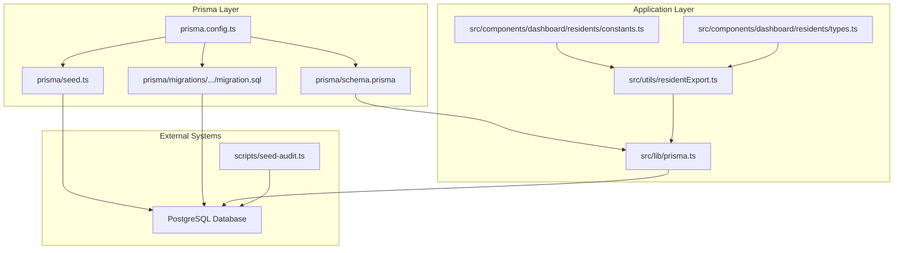
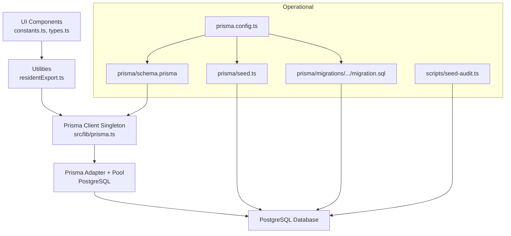
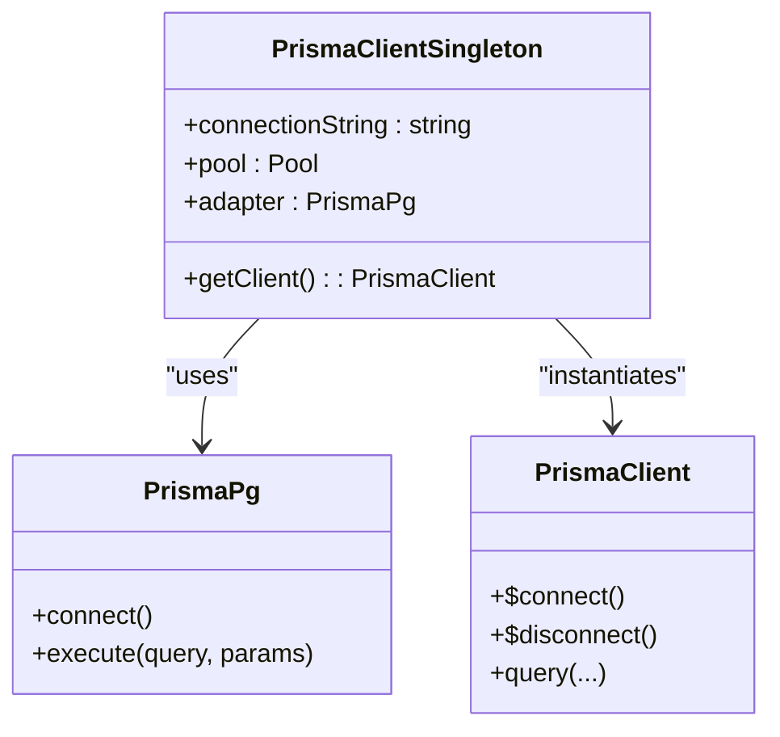
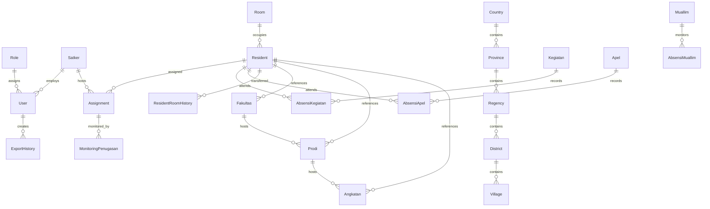
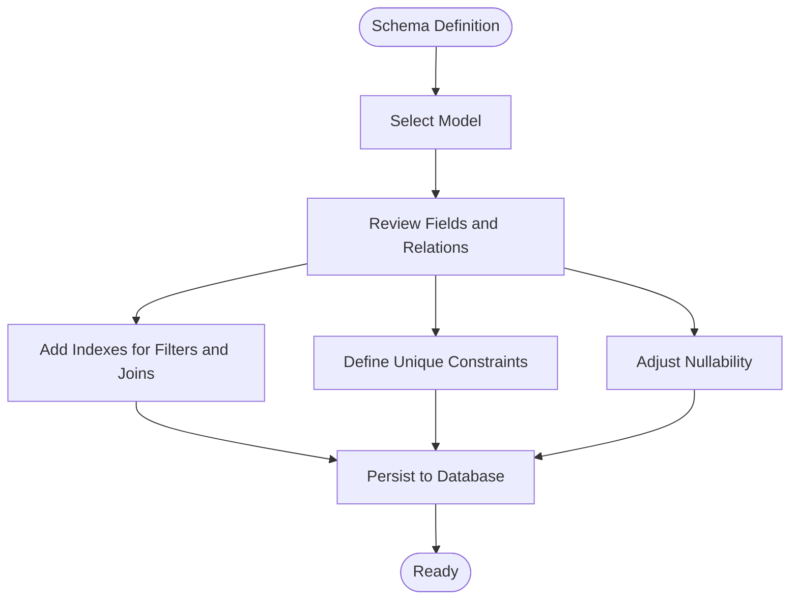
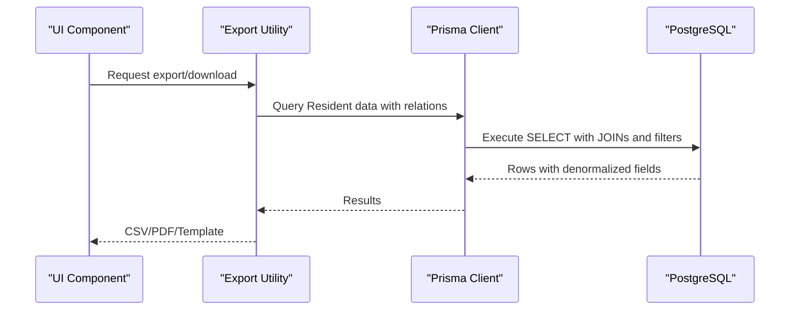
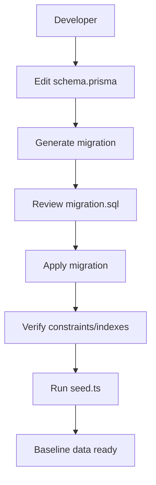
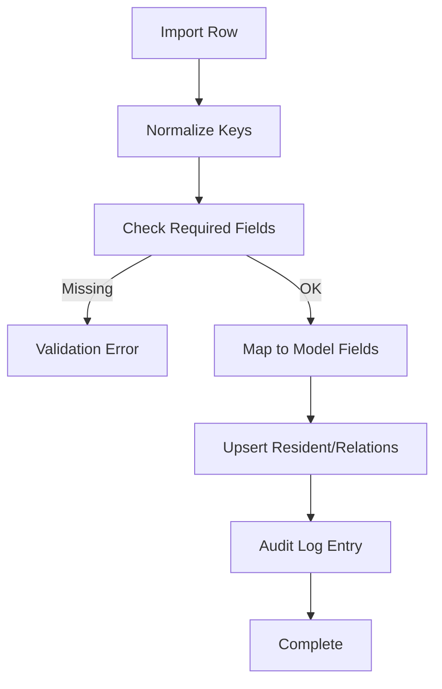
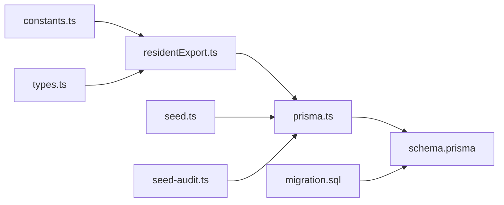

# Data Architecture

<cite>
**Referenced Files in This Document**
- [schema.prisma](file://prisma/schema.prisma)
- [seed.ts](file://prisma/seed.ts)
- [prisma.ts](file://src/lib/prisma.ts)
- [prisma.config.ts](file://prisma.config.ts)
- [migration.sql](file://prisma/migrations/202606230001_make_resident_nim_optional/migration.sql)
- [seed-audit.ts](file://scripts/seed-audit.ts)
- [residentExport.ts](file://src/utils/residentExport.ts)
- [constants.ts](file://src/components/dashboard/residents/constants.ts)
- [types.ts](file://src/components/dashboard/residents/types.ts)
</cite>

## Table of Contents
1. [Introduction](#introduction)
2. [Project Structure](#project-structure)
3. [Core Components](#core-components)
4. [Architecture Overview](#architecture-overview)
5. [Detailed Component Analysis](#detailed-component-analysis)
6. [Dependency Analysis](#dependency-analysis)
7. [Performance Considerations](#performance-considerations)
8. [Troubleshooting Guide](#troubleshooting-guide)
9. [Conclusion](#conclusion)
10. [Appendices](#appendices)

## Introduction
This document presents the comprehensive data architecture for ApsAsrama, focusing on the Prisma ORM implementation, entity relationship modeling, database schema design, and data management systems. It explains data flow patterns between components, persistence strategies, caching mechanisms, migration and seeding, data integrity constraints, performance optimization, export/import capabilities, and the relationship between Prisma models and business logic.

## Project Structure
The data architecture centers around Prisma schema definitions, a singleton Prisma client configured with a PostgreSQL adapter, and supporting scripts for seeding and migrations. UI components and utilities integrate with the Prisma models to manage data export and import workflows.

**Diagram sources**
- [prisma.config.ts:1-16](file://prisma.config.ts#L1-L16)
- [schema.prisma:1-487](file://prisma/schema.prisma#L1-L487)
- [seed.ts:1-174](file://prisma/seed.ts#L1-L174)
- [migration.sql:1-2](file://prisma/migrations/202606230001_make_resident_nim_optional/migration.sql#L1-L2)
- [prisma.ts:1-31](file://src/lib/prisma.ts#L1-L31)
- [residentExport.ts:1-123](file://src/utils/residentExport.ts#L1-L123)
- [constants.ts:1-41](file://src/components/dashboard/residents/constants.ts#L1-L41)
- [types.ts:1-46](file://src/components/dashboard/residents/types.ts#L1-L46)
- [seed-audit.ts:1-42](file://scripts/seed-audit.ts#L1-L42)

**Section sources**
- [prisma.config.ts:1-16](file://prisma.config.ts#L1-L16)
- [schema.prisma:1-487](file://prisma/schema.prisma#L1-L487)
- [prisma.ts:1-31](file://src/lib/prisma.ts#L1-L31)

## Core Components
- Prisma Schema: Defines models, enums, relations, indexes, and constraints for the domain (users, roles, rooms, residents, administrative regions, academic programs, attendance, audit logs, and room transfers).
- Prisma Client Singleton: Provides a globally scoped PrismaClient configured with a PostgreSQL adapter and connection pooling tuned for serverless environments.
- Seeding: Initializes RBAC permissions, roles, and admin user via seed scripts; includes targeted permission updates for audit logs.
- Migrations: Version-controlled schema changes with a recent migration relaxing residency NIM constraints.
- Data Export Utilities: CSV/PDF generation and Excel template creation for resident data.
- UI Constants and Types: Define import headers and TypeScript interfaces aligned with Prisma enums and relations.

**Section sources**
- [schema.prisma:1-487](file://prisma/schema.prisma#L1-L487)
- [prisma.ts:1-31](file://src/lib/prisma.ts#L1-L31)
- [seed.ts:1-174](file://prisma/seed.ts#L1-L174)
- [migration.sql:1-2](file://prisma/migrations/202606230001_make_resident_nim_optional/migration.sql#L1-L2)
- [residentExport.ts:1-123](file://src/utils/residentExport.ts#L1-L123)
- [constants.ts:1-41](file://src/components/dashboard/residents/constants.ts#L1-L41)
- [types.ts:1-46](file://src/components/dashboard/residents/types.ts#L1-L46)

## Architecture Overview
The system follows a layered architecture:
- Presentation/UI layer consumes Prisma models via TypeScript interfaces and utilities.
- Application logic orchestrates data operations using the Prisma client singleton.
- Persistence layer uses PostgreSQL with Prisma driver adapters and connection pooling.
- Operational layer manages migrations and seeds for schema evolution and baseline data.

**Diagram sources**
- [prisma.ts:1-31](file://src/lib/prisma.ts#L1-L31)
- [prisma.config.ts:1-16](file://prisma.config.ts#L1-L16)
- [schema.prisma:1-487](file://prisma/schema.prisma#L1-L487)
- [seed.ts:1-174](file://prisma/seed.ts#L1-L174)
- [migration.sql:1-2](file://prisma/migrations/202606230001_make_resident_nim_optional/migration.sql#L1-L2)
- [seed-audit.ts:1-42](file://scripts/seed-audit.ts#L1-L42)
- [residentExport.ts:1-123](file://src/utils/residentExport.ts#L1-L123)
- [constants.ts:1-41](file://src/components/dashboard/residents/constants.ts#L1-L41)
- [types.ts:1-46](file://src/components/dashboard/residents/types.ts#L1-L46)

## Detailed Component Analysis

### Prisma ORM and Client Configuration
- Provider and Driver Adapters: PostgreSQL provider with driverAdapters preview feature; adapter wraps a pg.Pool for connection management.
- Connection Pooling: Single connection per serverless instance with explicit timeouts to reduce contention and cost.
- Environment Safety: Requires DATABASE_URL; throws if missing to prevent runtime failures.
- Singleton Pattern: Ensures a single PrismaClient instance across the app lifecycle outside production.

**Diagram sources**
- [prisma.ts:1-31](file://src/lib/prisma.ts#L1-L31)

**Section sources**
- [prisma.ts:1-31](file://src/lib/prisma.ts#L1-L31)

### Entity Relationship Modeling and Schema Design
Key entities and relationships:
- Users belong to Roles and Satkers; linked by optional foreign keys; include audit history via ExportHistory.
- Rooms are uniquely identified by daerahId and number; indexed by status and floor.
- Residents have personal and academic attributes; linked to Rooms and academic entities (Fakultas, Prodi, Angkatan); indexed by roomId, status, and angkatan.
- Administrative hierarchy: Country → Province → Regency → District → Village; indexed by name and parent relations.
- Academic hierarchy: Fakultas → Prodi → Angkatan; indexed by unique combinations.
- Attendance and activities: Kegiatan and Apel with AbsensiKegiatan and AbsensiApel; Muallim with AbsensiMuallim.
- Assignments connect Residents and Satkers; monitored via MonitoringPenugasan.
- Audit logging captures CREATE/UPDATE/DELETE/IMPORT actions with JSON old/new values.
- Room transfers tracked via ResidentRoomHistory with indexed residentId and createdAt.

**Diagram sources**
- [schema.prisma:1-487](file://prisma/schema.prisma#L1-L487)

**Section sources**
- [schema.prisma:1-487](file://prisma/schema.prisma#L1-L487)

### Indexing and Constraints
- Explicit indexes: Room (status, floor), Resident (roomId, status, angkatan), Assignment (satkerId), MonitoringPenugasan (assignmentId, tanggalMonitoring), Kegiatan (tanggal), AbsensiKegiatan (residentId), AbsensiApel (residentId), Country (name), Province (name, countryId), Regency (name, provinceId), District (name, regencyId), Village (name, districtId), ExportHistory (userId, createdAt), AuditLog (entityType, entityId), ResidentRoomHistory (residentId, createdAt).
- Unique constraints: Room (daerahId, number), Country (code, name), Province (name, countryId), Regency (name, provinceId), District (name, regencyId), Village (name, districtId), Prodi (name, fakultasId), Angkatan (name, prodiId).
- Not-null constraints relaxed for Resident.nim via migration to support optional student ID.

**Diagram sources**
- [schema.prisma:1-487](file://prisma/schema.prisma#L1-L487)
- [migration.sql:1-2](file://prisma/migrations/202606230001_make_resident_nim_optional/migration.sql#L1-L2)

**Section sources**
- [schema.prisma:1-487](file://prisma/schema.prisma#L1-L487)
- [migration.sql:1-2](file://prisma/migrations/202606230001_make_resident_nim_optional/migration.sql#L1-L2)

### Data Flow Patterns and Persistence Strategies
- UI-driven data operations: Components import constants and types to validate and map data; utilities export reports and templates.
- Persistence pipeline: UI → Prisma client singleton → PostgreSQL via adapter and pool.
- Batch operations: Seed scripts initialize baseline data; targeted audits add new permissions across system roles.
- Data integrity: Foreign keys enforced by relations; unique and index constraints ensure referential integrity and query performance.

**Diagram sources**
- [residentExport.ts:1-123](file://src/utils/residentExport.ts#L1-L123)
- [prisma.ts:1-31](file://src/lib/prisma.ts#L1-L31)
- [schema.prisma:1-487](file://prisma/schema.prisma#L1-L487)

**Section sources**
- [residentExport.ts:1-123](file://src/utils/residentExport.ts#L1-L123)
- [prisma.ts:1-31](file://src/lib/prisma.ts#L1-L31)
- [schema.prisma:1-487](file://prisma/schema.prisma#L1-L487)

### Migration System and Seed Management
- Migration: Versioned SQL applied to evolve schema; recent migration relaxes Resident.nim nullability.
- Seed: Initializes permissions, roles, and admin user; ensures idempotent upserts.
- Audit seed: Adds and propagates audit.view permission across system roles.

**Diagram sources**
- [prisma.config.ts:1-16](file://prisma.config.ts#L1-L16)
- [schema.prisma:1-487](file://prisma/schema.prisma#L1-L487)
- [seed.ts:1-174](file://prisma/seed.ts#L1-L174)
- [migration.sql:1-2](file://prisma/migrations/202606230001_make_resident_nim_optional/migration.sql#L1-L2)
- [seed-audit.ts:1-42](file://scripts/seed-audit.ts#L1-L42)

**Section sources**
- [prisma.config.ts:1-16](file://prisma.config.ts#L1-L16)
- [seed.ts:1-174](file://prisma/seed.ts#L1-L174)
- [seed-audit.ts:1-42](file://scripts/seed-audit.ts#L1-L42)
- [migration.sql:1-2](file://prisma/migrations/202606230001_make_resident_nim_optional/migration.sql#L1-L2)

### Data Validation Rules and Business Constraints
- UI-level validation: Import headers and required fields ensure minimal completeness before persistence.
- Prisma-level constraints: Unique indexes enforce uniqueness; relation fields maintain referential integrity; enums constrain categorical values.
- Business rules reflected in schema: Room occupancy limits via capacity; Resident status via enum; academic progression via hierarchical relations.

**Diagram sources**
- [constants.ts:1-41](file://src/components/dashboard/residents/constants.ts#L1-L41)
- [types.ts:1-46](file://src/components/dashboard/residents/types.ts#L1-L46)
- [schema.prisma:1-487](file://prisma/schema.prisma#L1-L487)

**Section sources**
- [constants.ts:1-41](file://src/components/dashboard/residents/constants.ts#L1-L41)
- [types.ts:1-46](file://src/components/dashboard/residents/types.ts#L1-L46)
- [schema.prisma:1-487](file://prisma/schema.prisma#L1-L487)

## Dependency Analysis
- Internal dependencies: UI components depend on Prisma models via types; export utilities depend on Prisma client; seed scripts depend on Prisma client.
- External dependencies: PostgreSQL via Prisma adapter; bcrypt for password hashing in seeds; xlsx for Excel template generation.
- Coupling: Low coupling between UI and persistence through Prisma; high cohesion within Prisma models and seed logic.

**Diagram sources**
- [constants.ts:1-41](file://src/components/dashboard/residents/constants.ts#L1-L41)
- [types.ts:1-46](file://src/components/dashboard/residents/types.ts#L1-L46)
- [residentExport.ts:1-123](file://src/utils/residentExport.ts#L1-L123)
- [prisma.ts:1-31](file://src/lib/prisma.ts#L1-L31)
- [schema.prisma:1-487](file://prisma/schema.prisma#L1-L487)
- [seed.ts:1-174](file://prisma/seed.ts#L1-L174)
- [seed-audit.ts:1-42](file://scripts/seed-audit.ts#L1-L42)
- [migration.sql:1-2](file://prisma/migrations/202606230001_make_resident_nim_optional/migration.sql#L1-L2)

**Section sources**
- [residentExport.ts:1-123](file://src/utils/residentExport.ts#L1-L123)
- [prisma.ts:1-31](file://src/lib/prisma.ts#L1-L31)
- [schema.prisma:1-487](file://prisma/schema.prisma#L1-L487)
- [seed.ts:1-174](file://prisma/seed.ts#L1-L174)
- [seed-audit.ts:1-42](file://scripts/seed-audit.ts#L1-L42)
- [migration.sql:1-2](file://prisma/migrations/202606230001_make_resident_nim_optional/migration.sql#L1-L2)

## Performance Considerations
- Indexes: Strategic indexes on frequently filtered fields (status, floor, date, residentId) improve query performance for lists and analytics.
- Unique constraints: Prevent duplicates and support fast lookups for joins and upserts.
- Connection pooling: Single connection per serverless instance reduces overhead; adjust timeouts to balance latency and resource usage.
- Query patterns: Denormalized fields in exports reduce joins; consider materialized summaries for frequent reports.
- Pagination and filtering: Use cursor-based pagination and selective field selection to minimize payload sizes.

[No sources needed since this section provides general guidance]

## Troubleshooting Guide
- Missing DATABASE_URL: The Prisma client singleton throws if the environment variable is not defined; ensure it is configured in deployment.
- Migration conflicts: Review migration SQL and apply incrementally; verify unique and index constraints after migration.
- Seed failures: Confirm seed script connectivity and permissions; idempotent upserts help recover from partial runs.
- Export errors: Validate headers and data completeness; ensure sufficient memory for large exports.

**Section sources**
- [prisma.ts:1-31](file://src/lib/prisma.ts#L1-L31)
- [seed.ts:1-174](file://prisma/seed.ts#L1-L174)
- [seed-audit.ts:1-42](file://scripts/seed-audit.ts#L1-L42)
- [migration.sql:1-2](file://prisma/migrations/202606230001_make_resident_nim_optional/migration.sql#L1-L2)

## Conclusion
ApsAsrama’s data architecture leverages Prisma for robust ORM capabilities, PostgreSQL for reliable persistence, and a clear separation of concerns across UI, utilities, and operational scripts. The schema enforces data integrity via indexes and constraints, while the client singleton and adapter ensure efficient database access. Export/import utilities and seed scripts support operational needs, and strategic indexing underpins query performance.

[No sources needed since this section summarizes without analyzing specific files]

## Appendices

### Appendix A: Data Export and Import Specifications
- Export formats: CSV and PDF for resident listings; Excel template for imports.
- Import headers: Defined in constants; validation ensures required fields presence.
- Data mapping: UI types align with Prisma enums and relations to maintain consistency.

**Section sources**
- [residentExport.ts:1-123](file://src/utils/residentExport.ts#L1-L123)
- [constants.ts:1-41](file://src/components/dashboard/residents/constants.ts#L1-L41)
- [types.ts:1-46](file://src/components/dashboard/residents/types.ts#L1-L46)