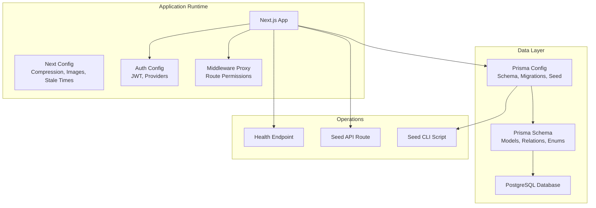
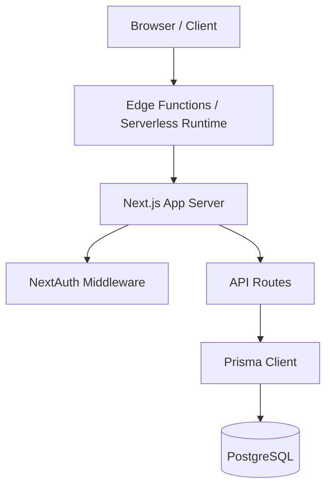
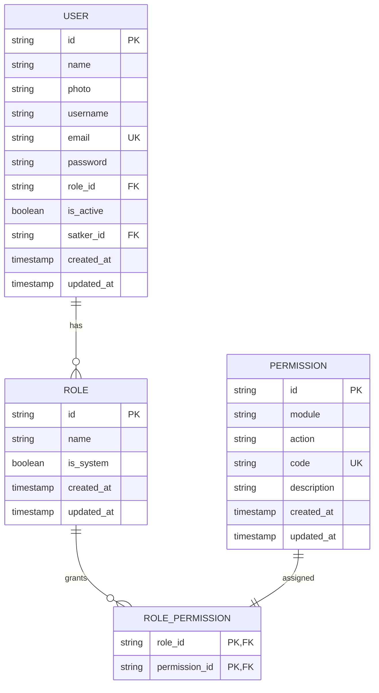
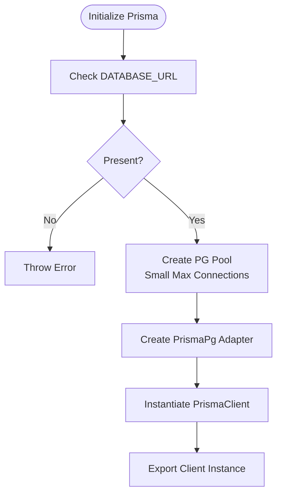
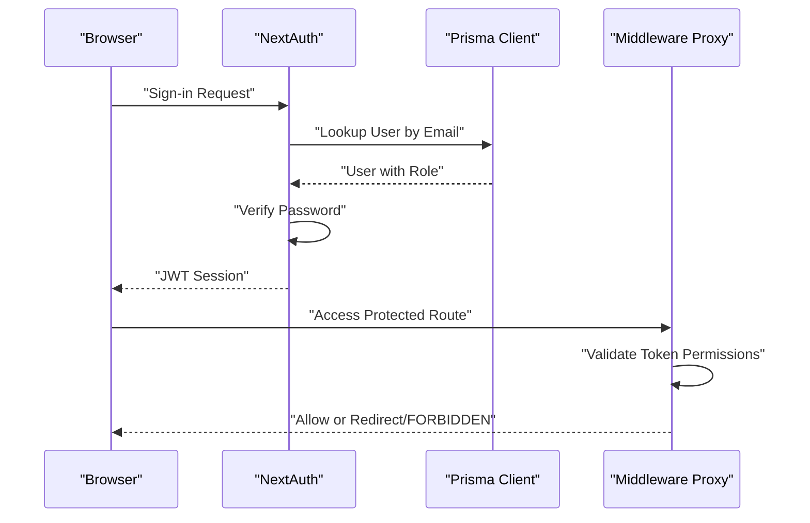
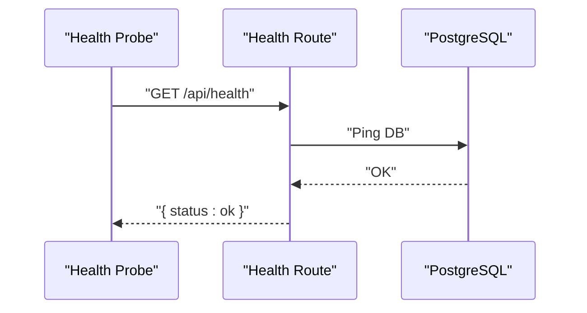
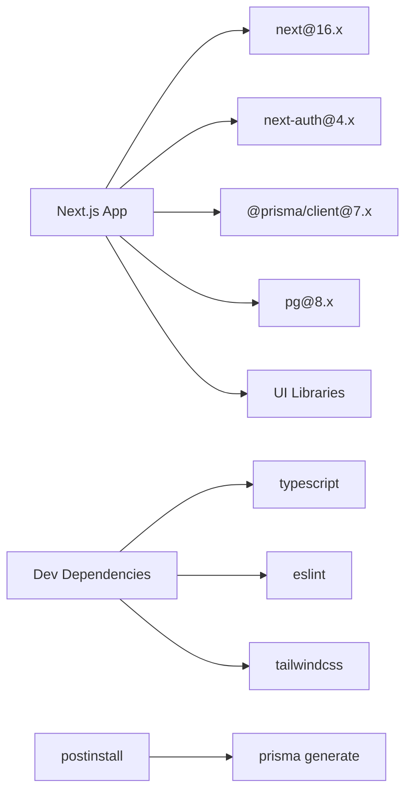

# Deployment Architecture & Infrastructure

<cite>
**Referenced Files in This Document**
- [package.json](file://package.json)
- [next.config.ts](file://next.config.ts)
- [prisma.config.ts](file://prisma.config.ts)
- [prisma/schema.prisma](file://prisma/schema.prisma)
- [src/lib/prisma.ts](file://src/lib/prisma.ts)
- [src/lib/auth.ts](file://src/lib/auth.ts)
- [src/proxy.ts](file://src/proxy.ts)
- [src/app/api/health/route.ts](file://src/app/api/health/route.ts)
- [src/app/api/seed/route.ts](file://src/app/api/seed/route.ts)
- [prisma/seed.ts](file://prisma/seed.ts)
</cite>

## Table of Contents
1. [Introduction](#introduction)
2. [Project Structure](#project-structure)
3. [Core Components](#core-components)
4. [Architecture Overview](#architecture-overview)
5. [Detailed Component Analysis](#detailed-component-analysis)
6. [Dependency Analysis](#dependency-analysis)
7. [Performance Considerations](#performance-considerations)
8. [Troubleshooting Guide](#troubleshooting-guide)
9. [Conclusion](#conclusion)
10. [Appendices](#appendices)

## Introduction
This document describes the deployment architecture and infrastructure for ApsAsrama, focusing on the Next.js application runtime, database and Prisma configuration, authentication and authorization, API endpoints, and operational practices. It consolidates the repository’s configuration and code to present a coherent picture of build, runtime, and operational characteristics suitable for planning deployments, CI/CD automation, and production hardening.

## Project Structure
The project is a Next.js 16 application configured with TypeScript and Prisma ORM. Key deployment-relevant areas:
- Application runtime and build configuration
- Database schema and Prisma configuration
- Authentication and authorization middleware
- API routes for health checks and seeding
- Environment variable usage for secrets and database connectivity

**Diagram sources**
- [next.config.ts:1-24](file://next.config.ts#L1-L24)
- [src/lib/auth.ts:1-81](file://src/lib/auth.ts#L1-L81)
- [src/proxy.ts:1-60](file://src/proxy.ts#L1-L60)
- [prisma.config.ts:1-16](file://prisma.config.ts#L1-L16)
- [prisma/schema.prisma:1-487](file://prisma/schema.prisma#L1-L487)
- [src/app/api/health/route.ts:1-24](file://src/app/api/health/route.ts#L1-L24)
- [src/app/api/seed/route.ts:1-183](file://src/app/api/seed/route.ts#L1-L183)
- [prisma/seed.ts:1-174](file://prisma/seed.ts#L1-L174)

**Section sources**
- [package.json:1-48](file://package.json#L1-L48)
- [next.config.ts:1-24](file://next.config.ts#L1-L24)
- [prisma.config.ts:1-16](file://prisma.config.ts#L1-L16)
- [prisma/schema.prisma:1-487](file://prisma/schema.prisma#L1-L487)
- [src/lib/prisma.ts:1-31](file://src/lib/prisma.ts#L1-L31)
- [src/lib/auth.ts:1-81](file://src/lib/auth.ts#L1-L81)
- [src/proxy.ts:1-60](file://src/proxy.ts#L1-L60)
- [src/app/api/health/route.ts:1-24](file://src/app/api/health/route.ts#L1-L24)
- [src/app/api/seed/route.ts:1-183](file://src/app/api/seed/route.ts#L1-L183)
- [prisma/seed.ts:1-174](file://prisma/seed.ts#L1-L174)

## Core Components
- Next.js runtime and build configuration
  - Compression enabled, image remote pattern for Cloudinary, and experimental stale timing settings.
  - See [next.config.ts:1-24](file://next.config.ts#L1-L24).
- Prisma ORM and PostgreSQL
  - Client generator with driver adapters, PostgreSQL datasource, and extensive model definitions.
  - See [prisma/schema.prisma:1-487](file://prisma/schema.prisma#L1-L487).
- Prisma configuration and seeding
  - Prisma config pointing to schema, migrations, and seed command; seed script and API route for RBAC initialization.
  - See [prisma.config.ts:1-16](file://prisma.config.ts#L1-L16), [prisma/seed.ts:1-174](file://prisma/seed.ts#L1-L174), [src/app/api/seed/route.ts:1-183](file://src/app/api/seed/route.ts#L1-L183).
- Database client and connection pooling
  - Singleton Prisma client backed by a Postgres adapter and a small connection pool suitable for serverless environments.
  - See [src/lib/prisma.ts:1-31](file://src/lib/prisma.ts#L1-L31).
- Authentication and authorization
  - NextAuth JWT-based authentication with credential provider, role-based permissions, and middleware-based route protection.
  - See [src/lib/auth.ts:1-81](file://src/lib/auth.ts#L1-L81), [src/proxy.ts:1-60](file://src/proxy.ts#L1-L60).
- Operational endpoints
  - Health check endpoint for keepalive and warm connections.
  - See [src/app/api/health/route.ts:1-24](file://src/app/api/health/route.ts#L1-L24).

**Section sources**
- [next.config.ts:1-24](file://next.config.ts#L1-L24)
- [prisma/schema.prisma:1-487](file://prisma/schema.prisma#L1-L487)
- [prisma.config.ts:1-16](file://prisma.config.ts#L1-L16)
- [prisma/seed.ts:1-174](file://prisma/seed.ts#L1-L174)
- [src/app/api/seed/route.ts:1-183](file://src/app/api/seed/route.ts#L1-L183)
- [src/lib/prisma.ts:1-31](file://src/lib/prisma.ts#L1-L31)
- [src/lib/auth.ts:1-81](file://src/lib/auth.ts#L1-L81)
- [src/proxy.ts:1-60](file://src/proxy.ts#L1-L60)
- [src/app/api/health/route.ts:1-24](file://src/app/api/health/route.ts#L1-L24)

## Architecture Overview
The deployment architecture centers on a Next.js application serving a React UI with serverless-friendly runtime characteristics. Data persistence relies on PostgreSQL via Prisma with a dedicated seed and migration strategy. Authentication is handled by NextAuth with JWT tokens and middleware-based authorization.

**Diagram sources**
- [src/lib/auth.ts:1-81](file://src/lib/auth.ts#L1-L81)
- [src/proxy.ts:1-60](file://src/proxy.ts#L1-L60)
- [src/app/api/health/route.ts:1-24](file://src/app/api/health/route.ts#L1-L24)
- [src/lib/prisma.ts:1-31](file://src/lib/prisma.ts#L1-L31)
- [prisma/schema.prisma:1-487](file://prisma/schema.prisma#L1-L487)

## Detailed Component Analysis

### Next.js Build and Runtime Configuration
- Build and start scripts are defined for development, production builds, and runtime.
- Next configuration enables compression, disables the powered-by header, sets experimental stale times for dynamic and static routes, and whitelists Cloudinary for remote images.
- These settings influence caching behavior, asset delivery, and cold-start characteristics in serverless environments.

**Section sources**
- [package.json:5-11](file://package.json#L5-L11)
- [next.config.ts:3-20](file://next.config.ts#L3-L20)

### Database and Prisma Configuration
- Prisma client generator uses driver adapters; datasource is PostgreSQL.
- The schema defines numerous models, enums, relations, and indexes aligned with administrative and academic workflows.
- Prisma config specifies schema location, migration path, and seed command invoking a TypeScript script.
- The seed script and API route initialize permissions, roles, and a default admin user.

**Diagram sources**
- [prisma/schema.prisma:10-194](file://prisma/schema.prisma#L10-L194)

**Section sources**
- [prisma/schema.prisma:1-487](file://prisma/schema.prisma#L1-L487)
- [prisma.config.ts:6-15](file://prisma.config.ts#L6-L15)
- [prisma/seed.ts:75-164](file://prisma/seed.ts#L75-L164)
- [src/app/api/seed/route.ts:76-182](file://src/app/api/seed/route.ts#L76-L182)

### Database Client and Connection Management
- A singleton Prisma client is created using a Postgres adapter with a small pool size appropriate for serverless instances.
- The client enforces presence of DATABASE_URL and restricts concurrency to minimize connection overhead.
- Non-production environments cache the client in global scope for hot reload behavior.

**Diagram sources**
- [src/lib/prisma.ts:5-28](file://src/lib/prisma.ts#L5-L28)

**Section sources**
- [src/lib/prisma.ts:1-31](file://src/lib/prisma.ts#L1-L31)

### Authentication and Authorization
- NextAuth configuration uses a credential provider, hashes passwords with bcrypt, and attaches role and permissions to JWT tokens.
- Middleware-based proxy enforces route-level permissions derived from JWT claims and redirects unauthorized users appropriately.
- Login page is routed to a dedicated sign-in page, and session strategy uses JWT.

**Diagram sources**
- [src/lib/auth.ts:6-80](file://src/lib/auth.ts#L6-L80)
- [src/proxy.ts:24-59](file://src/proxy.ts#L24-L59)

**Section sources**
- [src/lib/auth.ts:1-81](file://src/lib/auth.ts#L1-L81)
- [src/proxy.ts:1-60](file://src/proxy.ts#L1-L60)

### API Endpoints and Operational Utilities
- Health endpoint performs a lightweight database ping and returns service status.
- Seed API route initializes RBAC and admin user, useful for bootstrapping environments.

**Diagram sources**
- [src/app/api/health/route.ts:8-23](file://src/app/api/health/route.ts#L8-L23)

**Section sources**
- [src/app/api/health/route.ts:1-24](file://src/app/api/health/route.ts#L1-L24)
- [src/app/api/seed/route.ts:1-183](file://src/app/api/seed/route.ts#L1-L183)

## Dependency Analysis
- Application dependencies include Next.js, NextAuth, Prisma client, Postgres driver, and UI libraries.
- Dev dependencies include TypeScript, Tailwind, and ESLint.
- Prisma is integrated via a postinstall script to generate clients.

**Diagram sources**
- [package.json:12-46](file://package.json#L12-L46)
- [package.json:10](file://package.json#L10)

**Section sources**
- [package.json:1-48](file://package.json#L1-L48)

## Performance Considerations
- Compression reduces payload sizes; consider enabling gzip or brotli at the CDN or edge layer if not already done.
- Image optimization is configured for Cloudinary; ensure remote patterns align with actual domains.
- Experimental stale times reduce revalidation pressure for dynamic routes; tune values based on content volatility.
- Database connection pooling is constrained for serverless; ensure queries remain efficient and avoid long transactions.
- Keepalive/ping endpoints help mitigate cold starts; schedule periodic pings to maintain readiness.

[No sources needed since this section provides general guidance]

## Troubleshooting Guide
- Authentication failures
  - Verify NEXTAUTH_SECRET is set and consistent across environments.
  - Confirm user exists and password hashes match expectations.
  - Check JWT callback outputs and middleware route permissions.
- Database connectivity
  - Ensure DATABASE_URL is present and reachable; confirm Prisma client initialization succeeds.
  - Review pool configuration and connection limits under load.
- Seed failures
  - RBAC seeding uses upserts; inspect seed logs for constraint violations or permission mismatches.
  - Validate admin user creation/update and role assignment.
- Health endpoint errors
  - A 503 response indicates database ping failure; verify connectivity and credentials.

**Section sources**
- [src/lib/auth.ts:76-80](file://src/lib/auth.ts#L76-L80)
- [src/lib/prisma.ts:6-9](file://src/lib/prisma.ts#L6-L9)
- [prisma/seed.ts:138-163](file://prisma/seed.ts#L138-L163)
- [src/app/api/seed/route.ts:134-175](file://src/app/api/seed/route.ts#L134-L175)
- [src/app/api/health/route.ts:17-22](file://src/app/api/health/route.ts#L17-L22)

## Conclusion
ApsAsrama’s deployment architecture leverages Next.js serverless runtime, Prisma ORM with PostgreSQL, and NextAuth for secure, role-based access. Operational endpoints support health monitoring and bootstrap tasks. The configuration emphasizes small connection pools, explicit environment variables, and pragmatic seeding. For production, complement this foundation with robust CI/CD, environment-specific configuration management, and observability practices.

[No sources needed since this section summarizes without analyzing specific files]

## Appendices

### Environment Variables and Secrets
- DATABASE_URL: Postgres connection string for Prisma.
- NEXTAUTH_SECRET: Secret key for signing NextAuth JWT tokens.
- NEXT_PUBLIC_SITE_URL: Publicly accessible site URL (used by NextAuth and related flows).

**Section sources**
- [src/lib/prisma.ts:6](file://src/lib/prisma.ts#L6)
- [src/lib/auth.ts:79](file://src/lib/auth.ts#L79)

### Database Migration and Seeding Strategy
- Migrations are managed under the Prisma migrations directory; apply migrations via Prisma CLI.
- Seed data is produced by both a TypeScript script and an API route for programmatic initialization.

**Section sources**
- [prisma.config.ts:8-11](file://prisma.config.ts#L8-L11)
- [prisma/seed.ts:1-174](file://prisma/seed.ts#L1-L174)
- [src/app/api/seed/route.ts:1-183](file://src/app/api/seed/route.ts#L1-L183)

### Monitoring and Logging
- Health endpoint provides a simple status indicator suitable for probes and keepalive.
- Extend with structured logging and metrics collection at the application and database layers as needed.

**Section sources**
- [src/app/api/health/route.ts:1-24](file://src/app/api/health/route.ts#L1-L24)