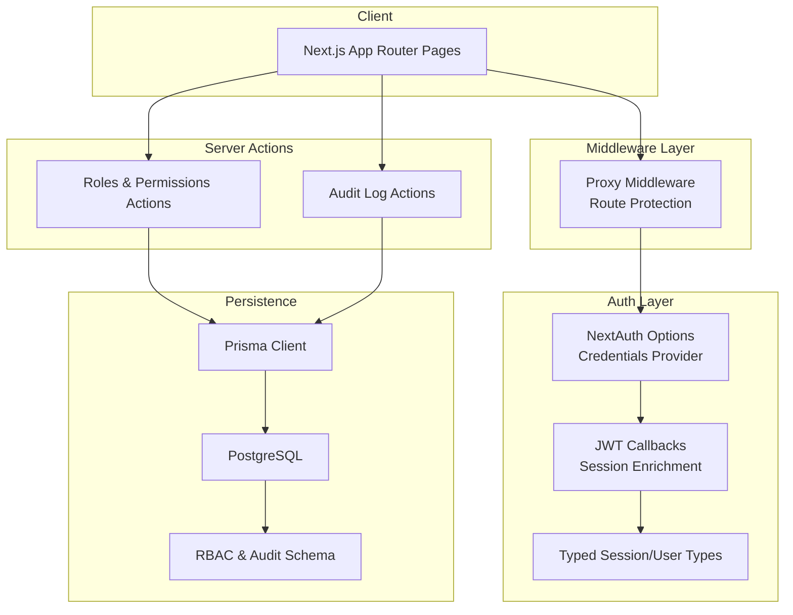
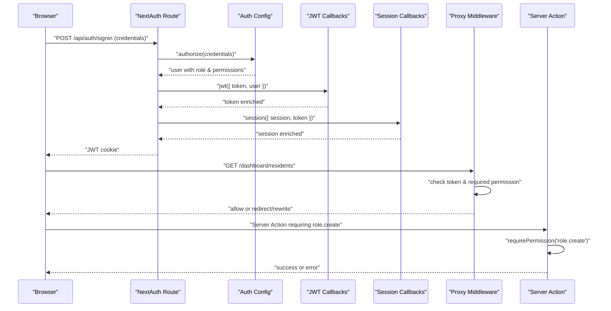
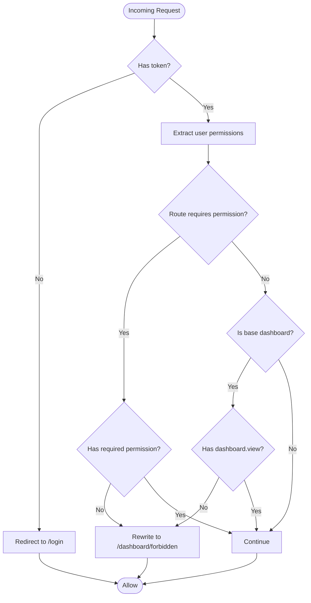
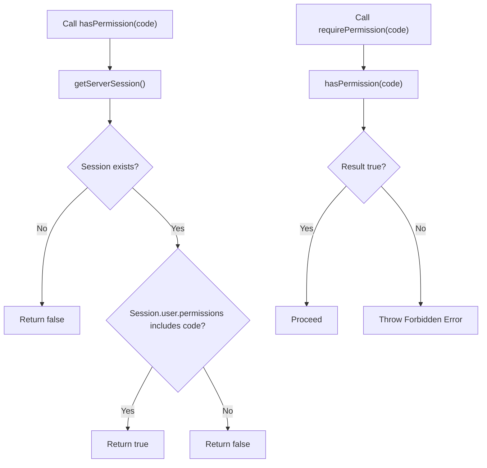
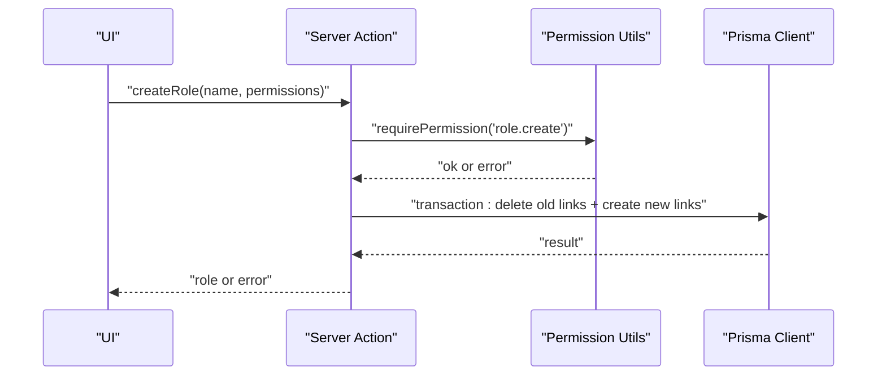
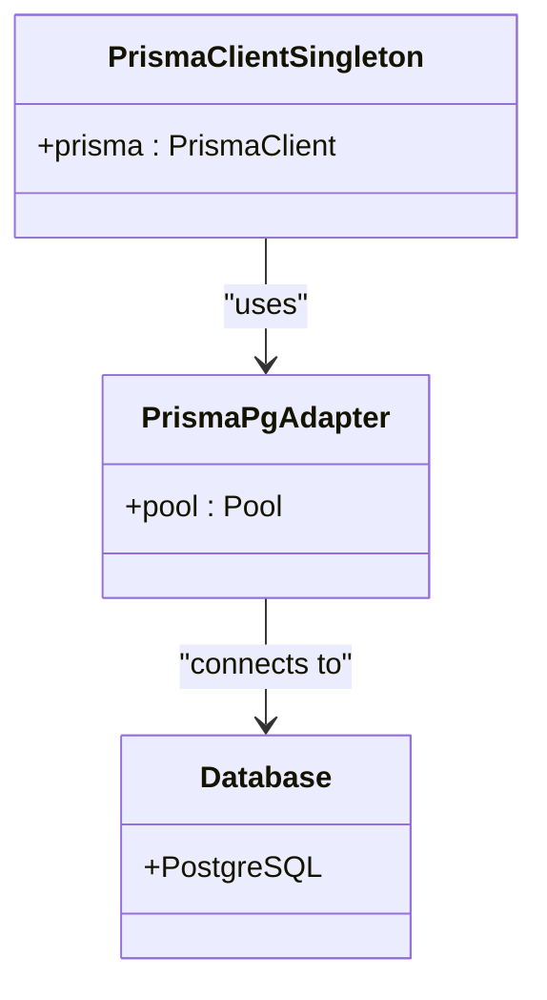
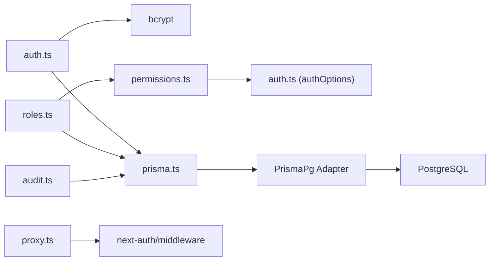

# Security Architecture & Access Control

<cite>
**Referenced Files in This Document**
- [auth.ts](file://src/lib/auth.ts)
- [permissions.ts](file://src/lib/permissions.ts)
- [proxy.ts](file://src/proxy.ts)
- [next-auth.d.ts](file://types/next-auth.d.ts)
- [schema.prisma](file://prisma/schema.prisma)
- [roles.ts](file://src/app/actions/roles.ts)
- [audit.ts](file://src/app/actions/audit.ts)
- [prisma.ts](file://src/lib/prisma.ts)
- [seed.ts](file://prisma/seed.ts)
- [route.ts](file://src/app/api/auth/[...nextauth]/route.ts)
</cite>

## Table of Contents
1. [Introduction](#introduction)
2. [Project Structure](#project-structure)
3. [Core Components](#core-components)
4. [Architecture Overview](#architecture-overview)
5. [Detailed Component Analysis](#detailed-component-analysis)
6. [Dependency Analysis](#dependency-analysis)
7. [Performance Considerations](#performance-considerations)
8. [Troubleshooting Guide](#troubleshooting-guide)
9. [Conclusion](#conclusion)

## Introduction
This document presents the security architecture and access control design for ApsAsrama’s authentication and authorization systems. It covers the NextAuth.js implementation, the custom credentials provider, JWT-based session management, role-based access control (RBAC), permission enforcement, middleware-based route protection, and secure API access patterns. It also documents the proxy implementation for protecting dashboard routes, the permission matrix, and data protection mechanisms including audit logging.

## Project Structure
The security system spans several layers:
- Authentication configuration and session management via NextAuth.js
- Middleware-based route protection for the dashboard
- Server-side permission checks for protected actions
- Database schema enforcing RBAC and audit logging
- Utility modules for permission checks and Prisma client initialization



**Diagram sources**
- [proxy.ts:24-55](file://src/proxy.ts#L24-L55)
- [auth.ts:6-80](file://src/lib/auth.ts#L6-L80)
- [next-auth.d.ts:3-18](file://types/next-auth.d.ts#L3-L18)
- [roles.ts:1-119](file://src/app/actions/roles.ts#L1-L119)
- [audit.ts:47-117](file://src/app/actions/audit.ts#L47-L117)
- [prisma.ts:1-31](file://src/lib/prisma.ts#L1-L31)
- [schema.prisma:103-193](file://prisma/schema.prisma#L103-L193)

**Section sources**
- [proxy.ts:1-60](file://src/proxy.ts#L1-L60)
- [auth.ts:1-81](file://src/lib/auth.ts#L1-L81)
- [next-auth.d.ts:1-19](file://types/next-auth.d.ts#L1-L19)
- [roles.ts:1-119](file://src/app/actions/roles.ts#L1-L119)
- [audit.ts:47-117](file://src/app/actions/audit.ts#L47-L117)
- [prisma.ts:1-31](file://src/lib/prisma.ts#L1-L31)
- [schema.prisma:103-193](file://prisma/schema.prisma#L103-L193)

## Core Components
- NextAuth.js configuration with a custom credentials provider, JWT callbacks, and session enrichment
- Typed session/user interfaces extending NextAuth types
- Middleware-based proxy for route-level permission checks
- Permission utilities for server-side checks and enforcement
- Server actions implementing RBAC for roles and permissions
- Prisma client configured with PostgreSQL adapter and connection pooling
- Database schema modeling RBAC and audit logging

Key implementation references:
- NextAuth options and callbacks: [auth.ts:6-80](file://src/lib/auth.ts#L6-L80)
- Typed session/user augmentation: [next-auth.d.ts:3-18](file://types/next-auth.d.ts#L3-L18)
- Proxy middleware and route permission mapping: [proxy.ts:4-59](file://src/proxy.ts#L4-L59)
- Permission utilities: [permissions.ts:4-20](file://src/lib/permissions.ts#L4-L20)
- Roles and permissions actions: [roles.ts:7-118](file://src/app/actions/roles.ts#L7-L118)
- Prisma client singleton and adapter: [prisma.ts:5-28](file://src/lib/prisma.ts#L5-L28)
- RBAC and audit schema: [schema.prisma:103-193](file://prisma/schema.prisma#L103-L193)

**Section sources**
- [auth.ts:6-80](file://src/lib/auth.ts#L6-L80)
- [next-auth.d.ts:3-18](file://types/next-auth.d.ts#L3-L18)
- [proxy.ts:4-59](file://src/proxy.ts#L4-L59)
- [permissions.ts:4-20](file://src/lib/permissions.ts#L4-L20)
- [roles.ts:7-118](file://src/app/actions/roles.ts#L7-L118)
- [prisma.ts:5-28](file://src/lib/prisma.ts#L5-L28)
- [schema.prisma:103-193](file://prisma/schema.prisma#L103-L193)

## Architecture Overview
The system enforces authentication and authorization across three planes:
- Authentication plane: NextAuth.js with a custom credentials provider validates user identity and loads role/permissions
- Authorization plane: JWT callbacks enrich the token/session with role and permission arrays; middleware enforces route-level permissions
- Enforcement plane: Server actions validate permissions before executing sensitive operations; audit logs record changes



**Diagram sources**
- [auth.ts:14-50](file://src/lib/auth.ts#L14-L50)
- [auth.ts:54-71](file://src/lib/auth.ts#L54-L71)
- [proxy.ts:25-48](file://src/proxy.ts#L25-L48)
- [permissions.ts:11-16](file://src/lib/permissions.ts#L11-L16)
- [roles.ts:41-64](file://src/app/actions/roles.ts#L41-L64)

## Detailed Component Analysis

### NextAuth.js Implementation and Session Management
- Custom credentials provider validates email/password and loads user with role and permissions
- JWT callback stores role, permissions, user id, and optional satker id in the token
- Session callback enriches the session with role, permissions, user id, and optional satker id
- Session strategy is JWT; secret is sourced from environment variables
- Login page is redirected to the application’s sign-in route

```mermaid
classDiagram
class CredentialsProvider {
+authorize(credentials) User|null
}
class JWTCallbacks {
+jwt({ token, user }) Token
}
class SessionCallbacks {
+session({ session, token }) Session
}
class AuthConfig {
+providers : CredentialsProvider[]
+callbacks : JWTCallbacks & SessionCallbacks
+pages.signIn
+session.strategy
+secret
}
AuthConfig --> CredentialsProvider : "uses"
AuthConfig --> JWTCallbacks : "uses"
AuthConfig --> SessionCallbacks : "uses"
```

**Diagram sources**
- [auth.ts:8-51](file://src/lib/auth.ts#L8-L51)
- [auth.ts:54-71](file://src/lib/auth.ts#L54-L71)
- [auth.ts:73-80](file://src/lib/auth.ts#L73-L80)

**Section sources**
- [auth.ts:6-80](file://src/lib/auth.ts#L6-L80)
- [next-auth.d.ts:3-18](file://types/next-auth.d.ts#L3-L18)

### Middleware and Route Protection
- The proxy middleware leverages NextAuth middleware to guard dashboard routes
- It checks for a valid token and verifies required permissions per route prefix
- Unauthorized requests are rewritten to a forbidden page; missing tokens redirect to login
- The matcher targets all paths under /dashboard



**Diagram sources**
- [proxy.ts:25-48](file://src/proxy.ts#L25-L48)

**Section sources**
- [proxy.ts:4-59](file://src/proxy.ts#L4-L59)

### Role-Based Access Control (RBAC) and Permission Matrix
- RBAC is modeled with Role, Permission, and RolePermission entities
- Permissions are uniquely identified by a code combining module and action (e.g., “santri.view”)
- Users belong to a single Role; Roles are linked to Permissions via RolePermission
- A seeded SUPER_ADMIN role receives all permissions by default
- Server actions enforce permissions before performing mutations

```mermaid
erDiagram
ROLE {
string id PK
string name UK
boolean isSystem
datetime createdAt
datetime updatedAt
}
PERMISSION {
string id PK
string module
string action
string code UK
string description
datetime createdAt
datetime updatedAt
}
ROLE_PERMISSION {
string roleId PK
string permissionId PK
}
USER {
string id PK
string name
string email UK
string roleId FK
string satkerId FK?
boolean isActive
datetime createdAt
datetime updatedAt
}
ROLE ||--o{ ROLE_PERMISSION : "has"
PERMISSION ||--o{ ROLE_PERMISSION : "grants"
USER }o--|| ROLE : "belongs to"
```

**Diagram sources**
- [schema.prisma:103-193](file://prisma/schema.prisma#L103-L193)
- [seed.ts:78-123](file://prisma/seed.ts#L78-L123)

**Section sources**
- [schema.prisma:103-193](file://prisma/schema.prisma#L103-L193)
- [seed.ts:78-123](file://prisma/seed.ts#L78-L123)
- [roles.ts:7-118](file://src/app/actions/roles.ts#L7-L118)

### Permission Utilities and Enforcement
- hasPermission checks the current server session for a specific permission code
- requirePermission throws an error if the permission is missing
- hasPermissionClient performs client-side checks using the permissions array from the session



**Diagram sources**
- [permissions.ts:4-16](file://src/lib/permissions.ts#L4-L16)

**Section sources**
- [permissions.ts:4-20](file://src/lib/permissions.ts#L4-L20)

### Server Actions and Data Protection
- Roles and permissions actions enforce permissions before CRUD operations
- Transactions are used to maintain atomicity during updates
- System roles (e.g., SUPER_ADMIN) are protected from unauthorized modifications
- Audit logs capture mutation events with entity type, IDs, and serialized values



**Diagram sources**
- [roles.ts:41-101](file://src/app/actions/roles.ts#L41-L101)
- [permissions.ts:11-16](file://src/lib/permissions.ts#L11-L16)

**Section sources**
- [roles.ts:7-118](file://src/app/actions/roles.ts#L7-L118)
- [audit.ts:47-117](file://src/app/actions/audit.ts#L47-L117)

### Prisma Client and Database Adapter
- The Prisma client is initialized as a singleton with a PostgreSQL adapter
- Connection pooling is configured for serverless environments
- Environment validation ensures DATABASE_URL is present
- Audit logs and RBAC entities are stored in the database



**Diagram sources**
- [prisma.ts:5-28](file://src/lib/prisma.ts#L5-L28)

**Section sources**
- [prisma.ts:1-31](file://src/lib/prisma.ts#L1-L31)
- [schema.prisma:455-466](file://prisma/schema.prisma#L455-L466)

## Dependency Analysis
The security system exhibits clear separation of concerns:
- auth.ts depends on bcrypt for password comparison and Prisma for user/role/permission lookup
- permissions.ts depends on authOptions and NextAuth session retrieval
- proxy.ts depends on NextAuth middleware and route-to-permission mapping
- roles.ts depends on permissions.ts and Prisma for RBAC operations
- audit.ts depends on Prisma and authOptions for audit queries
- prisma.ts encapsulates Prisma client initialization and adapter configuration



**Diagram sources**
- [auth.ts:2-4](file://src/lib/auth.ts#L2-L4)
- [auth.ts:19-30](file://src/lib/auth.ts#L19-L30)
- [permissions.ts:1-2](file://src/lib/permissions.ts#L1-L2)
- [proxy.ts:1](file://src/proxy.ts#L1)
- [roles.ts:3-4](file://src/app/actions/roles.ts#L3-L4)
- [audit.ts:1-1](file://src/app/actions/audit.ts#L1-L1)
- [prisma.ts:1-3](file://src/lib/prisma.ts#L1-L3)

**Section sources**
- [auth.ts:1-81](file://src/lib/auth.ts#L1-L81)
- [permissions.ts:1-20](file://src/lib/permissions.ts#L1-L20)
- [proxy.ts:1-60](file://src/proxy.ts#L1-L60)
- [roles.ts:1-119](file://src/app/actions/roles.ts#L1-L119)
- [audit.ts:47-117](file://src/app/actions/audit.ts#L47-L117)
- [prisma.ts:1-31](file://src/lib/prisma.ts#L1-L31)

## Performance Considerations
- JWT-based sessions avoid server-side session storage and reduce load on shared state
- Password hashing uses bcrypt; ensure appropriate cost factors are configured in production
- Prisma client is a singleton with connection pooling suitable for serverless environments
- Middleware checks are lightweight and short-circuit on missing tokens or insufficient permissions
- Audit log queries support pagination and filtering to minimize payload sizes

[No sources needed since this section provides general guidance]

## Troubleshooting Guide
Common issues and resolutions:
- Missing NEXTAUTH_SECRET: Ensure the environment variable is set; otherwise, NextAuth configuration will fail
- Unauthorized access to dashboard routes: Verify the user’s permissions array includes the required code for the route prefix
- Permission errors in server actions: Confirm that requirePermission is called before executing privileged operations
- Database connectivity failures: Check DATABASE_URL and connection pool settings
- Audit log queries failing: Validate filters and date ranges; note that search operates on serialized JSON fields

**Section sources**
- [auth.ts:79](file://src/lib/auth.ts#L79)
- [proxy.ts:30-46](file://src/proxy.ts#L30-L46)
- [permissions.ts:11-16](file://src/lib/permissions.ts#L11-L16)
- [prisma.ts:6-9](file://src/lib/prisma.ts#L6-L9)
- [audit.ts:74-92](file://src/app/actions/audit.ts#L74-L92)

## Conclusion
ApsAsrama’s security architecture integrates NextAuth.js with a custom credentials provider, JWT-based session management, and a robust RBAC model enforced at the middleware and server action layers. The proxy middleware protects dashboard routes using a route-to-permission mapping, while server actions enforce granular permissions for sensitive operations. Audit logging captures changes for compliance and traceability. Together, these components form a layered defense-in-depth strategy aligned with modern web security best practices.