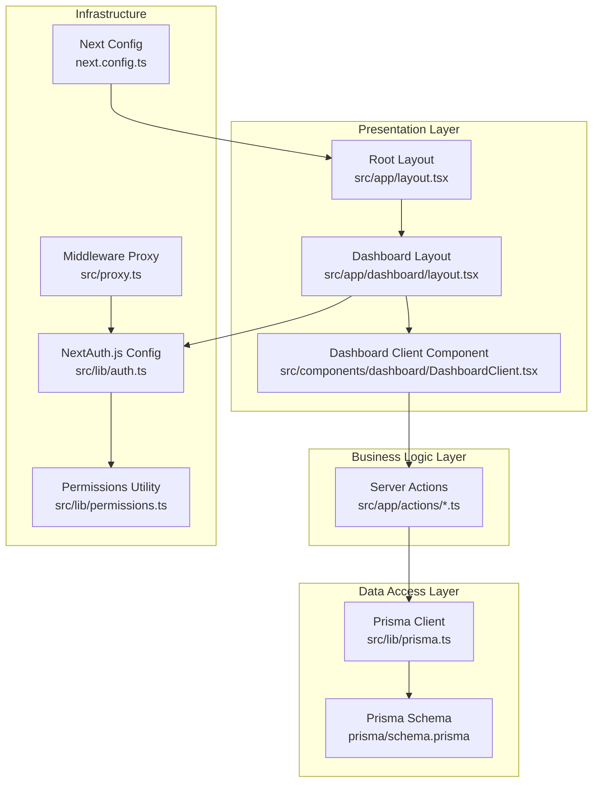
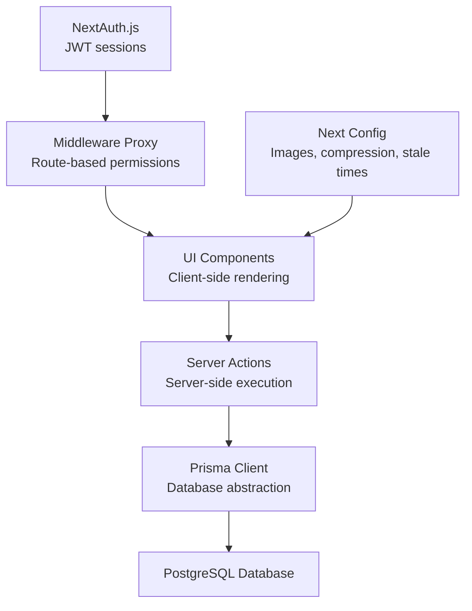
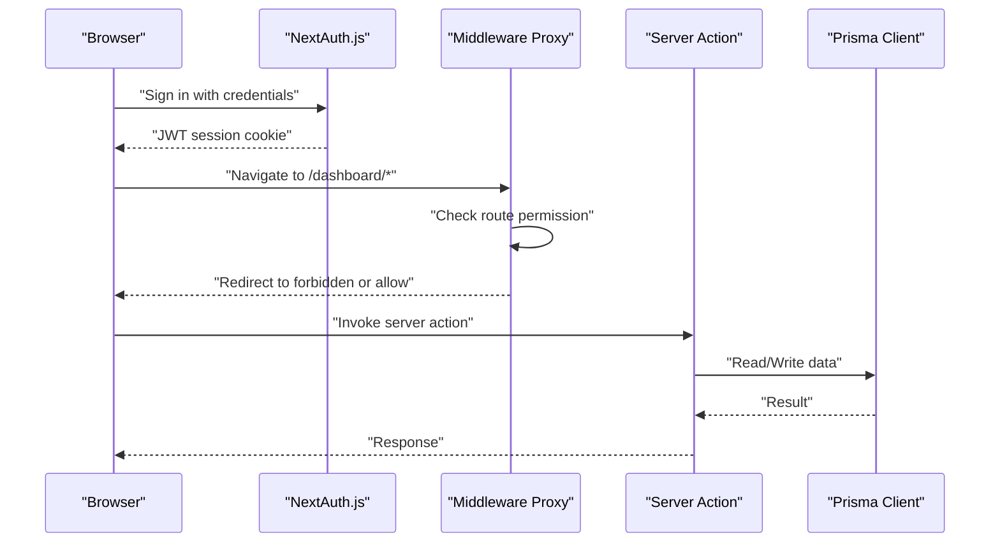
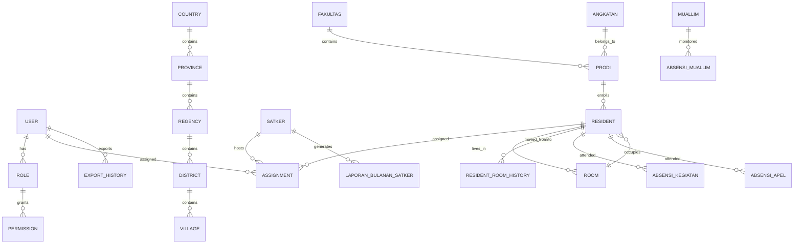
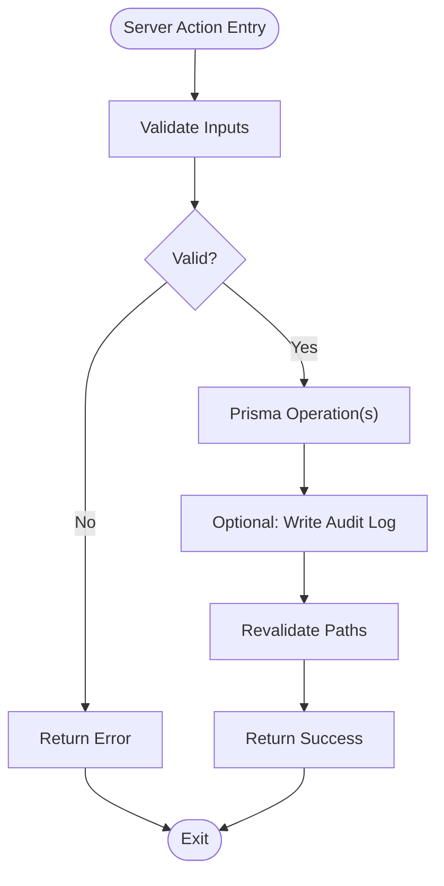
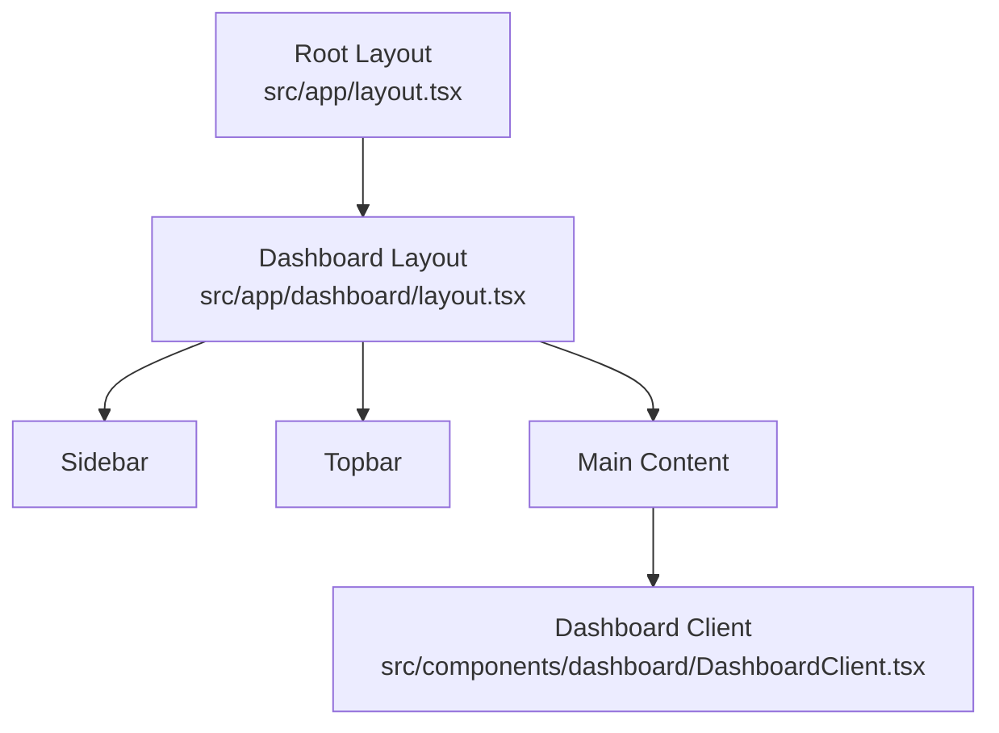
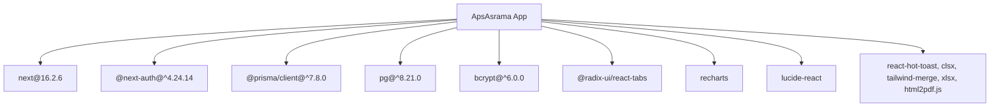

# System Architecture

<cite>
**Referenced Files in This Document**
- [README.md](file://README.md)
- [package.json](file://package.json)
- [next.config.ts](file://next.config.ts)
- [prisma/schema.prisma](file://prisma/schema.prisma)
- [prisma/seed.ts](file://prisma/seed.ts)
- [src/lib/prisma.ts](file://src/lib/prisma.ts)
- [src/lib/auth.ts](file://src/lib/auth.ts)
- [src/lib/permissions.ts](file://src/lib/permissions.ts)
- [src/proxy.ts](file://src/proxy.ts)
- [src/app/layout.tsx](file://src/app/layout.tsx)
- [src/app/dashboard/layout.tsx](file://src/app/dashboard/layout.tsx)
- [src/components/dashboard/DashboardClient.tsx](file://src/components/dashboard/DashboardClient.tsx)
- [src/app/actions/residents.ts](file://src/app/actions/residents.ts)
- [src/app/actions/masterData.ts](file://src/app/actions/masterData.ts)
- [src/app/actions/roles.ts](file://src/app/actions/roles.ts)
</cite>

## Table of Contents
1. [Introduction](#introduction)
2. [Project Structure](#project-structure)
3. [Core Components](#core-components)
4. [Architecture Overview](#architecture-overview)
5. [Detailed Component Analysis](#detailed-component-analysis)
6. [Dependency Analysis](#dependency-analysis)
7. [Performance Considerations](#performance-considerations)
8. [Troubleshooting Guide](#troubleshooting-guide)
9. [Conclusion](#conclusion)
10. [Appendices](#appendices)

## Introduction
This document describes the system architecture of ApsAsrama, a dormitory management system built with Next.js App Router. It outlines the layered architecture (presentation, business logic, data access, infrastructure), the App Router and server actions pattern, component hierarchy, Prisma ORM integration and database modeling, authentication and authorization via NextAuth.js with role-based access control (RBAC), and operational aspects such as scalability, performance, and monitoring.

## Project Structure
The project follows a modern Next.js 16 App Router structure with a clear separation of concerns:
- Presentation layer: App Router pages, layouts, and client components
- Business logic layer: Server actions encapsulate domain operations
- Data access layer: Prisma client configured with a PostgreSQL adapter
- Infrastructure: Environment variables, middleware, caching, and image optimization

**Diagram sources**
- [src/app/layout.tsx:1-42](file://src/app/layout.tsx#L1-L42)
- [src/app/dashboard/layout.tsx:1-37](file://src/app/dashboard/layout.tsx#L1-L37)
- [src/components/dashboard/DashboardClient.tsx:1-402](file://src/components/dashboard/DashboardClient.tsx#L1-L402)
- [src/app/actions/residents.ts:1-666](file://src/app/actions/residents.ts#L1-L666)
- [src/lib/prisma.ts:1-31](file://src/lib/prisma.ts#L1-L31)
- [prisma/schema.prisma:1-487](file://prisma/schema.prisma#L1-L487)
- [src/lib/auth.ts:1-81](file://src/lib/auth.ts#L1-L81)
- [src/lib/permissions.ts:1-21](file://src/lib/permissions.ts#L1-L21)
- [src/proxy.ts:1-60](file://src/proxy.ts#L1-L60)
- [next.config.ts:1-24](file://next.config.ts#L1-L24)

**Section sources**
- [README.md:1-37](file://README.md#L1-L37)
- [package.json:1-48](file://package.json#L1-L48)
- [next.config.ts:1-24](file://next.config.ts#L1-L24)

## Core Components
- Prisma ORM and PostgreSQL adapter: Centralized database client with a single connection pool per serverless instance
- NextAuth.js: JWT-based authentication with credentials provider and session callbacks
- Middleware proxy: Route-based authorization enforcing permission codes
- Server actions: Encapsulated business operations executed on the server with revalidation and audit logging
- Client components: Dashboard widgets and UI building blocks using Tailwind and Lucide icons

Key implementation references:
- Prisma client initialization and singleton pattern
- NextAuth options with JWT callbacks and credential provider
- Permission utilities for server-side checks
- Middleware route-to-permission mapping
- Server actions for residents, master data, and roles

**Section sources**
- [src/lib/prisma.ts:1-31](file://src/lib/prisma.ts#L1-L31)
- [src/lib/auth.ts:1-81](file://src/lib/auth.ts#L1-L81)
- [src/lib/permissions.ts:1-21](file://src/lib/permissions.ts#L1-L21)
- [src/proxy.ts:1-60](file://src/proxy.ts#L1-L60)
- [src/app/actions/residents.ts:1-666](file://src/app/actions/residents.ts#L1-L666)
- [src/app/actions/masterData.ts:1-191](file://src/app/actions/masterData.ts#L1-L191)
- [src/app/actions/roles.ts:1-119](file://src/app/actions/roles.ts#L1-L119)

## Architecture Overview
ApsAsrama adopts a layered architecture:
- Presentation: App Router pages and client components render dashboards and forms
- Business Logic: Server actions orchestrate validations, Prisma operations, cache revalidation, and audit logs
- Data Access: Prisma client connects to PostgreSQL via a dedicated adapter and connection pool
- Infrastructure: NextAuth.js handles authentication and authorization; middleware enforces route-level permissions; Next.js config optimizes assets and caching

**Diagram sources**
- [src/app/actions/residents.ts:1-666](file://src/app/actions/residents.ts#L1-L666)
- [src/lib/prisma.ts:1-31](file://src/lib/prisma.ts#L1-L31)
- [prisma/schema.prisma:1-487](file://prisma/schema.prisma#L1-L487)
- [src/lib/auth.ts:1-81](file://src/lib/auth.ts#L1-L81)
- [src/proxy.ts:1-60](file://src/proxy.ts#L1-L60)
- [next.config.ts:1-24](file://next.config.ts#L1-L24)

## Detailed Component Analysis

### Authentication and Authorization Architecture
- NextAuth.js configuration defines a credentials provider, JWT session strategy, and callbacks to attach role and permissions to tokens and sessions
- The middleware proxy enforces route-level permissions by matching the current path against a predefined mapping and checking user permissions
- Permission utilities provide server-side checks for protected server actions

**Diagram sources**
- [src/lib/auth.ts:1-81](file://src/lib/auth.ts#L1-L81)
- [src/proxy.ts:1-60](file://src/proxy.ts#L1-L60)
- [src/app/actions/residents.ts:1-666](file://src/app/actions/residents.ts#L1-L666)
- [src/lib/prisma.ts:1-31](file://src/lib/prisma.ts#L1-L31)

**Section sources**
- [src/lib/auth.ts:1-81](file://src/lib/auth.ts#L1-L81)
- [src/lib/permissions.ts:1-21](file://src/lib/permissions.ts#L1-L21)
- [src/proxy.ts:1-60](file://src/proxy.ts#L1-L60)

### Prisma ORM Integration and Database Modeling
- Prisma client is initialized with a PostgreSQL adapter and a single connection pool per serverless instance
- The schema models core entities: users, roles, permissions, residents, rooms, academic programs, administrative regions, assignments, attendance, monitoring, and audit logs
- Indexes and unique constraints are defined to support efficient queries and data integrity
- Seed script initializes default permissions, system roles, and a seeded admin user

**Diagram sources**
- [prisma/schema.prisma:1-487](file://prisma/schema.prisma#L1-L487)

**Section sources**
- [src/lib/prisma.ts:1-31](file://src/lib/prisma.ts#L1-L31)
- [prisma/schema.prisma:1-487](file://prisma/schema.prisma#L1-L487)
- [prisma/seed.ts:1-174](file://prisma/seed.ts#L1-L174)

### Server Actions Pattern and Data Flow
- Server actions encapsulate business operations for residents, master data, and roles
- They perform validations, Prisma queries, cache revalidation, and audit logging
- Example flows include creating/updating/deleting residents, bulk operations, and managing academic/administrative entities

**Diagram sources**
- [src/app/actions/residents.ts:1-666](file://src/app/actions/residents.ts#L1-L666)
- [src/app/actions/masterData.ts:1-191](file://src/app/actions/masterData.ts#L1-L191)
- [src/app/actions/roles.ts:1-119](file://src/app/actions/roles.ts#L1-L119)

**Section sources**
- [src/app/actions/residents.ts:1-666](file://src/app/actions/residents.ts#L1-L666)
- [src/app/actions/masterData.ts:1-191](file://src/app/actions/masterData.ts#L1-L191)
- [src/app/actions/roles.ts:1-119](file://src/app/actions/roles.ts#L1-L119)

### Component Hierarchy and Presentation Layer
- Root layout sets fonts, theme script, toast notifications, and global styles
- Dashboard layout enforces authentication and renders sidebar, topbar, and main content area
- Dashboard client component renders statistics, charts, and quick actions

**Diagram sources**
- [src/app/layout.tsx:1-42](file://src/app/layout.tsx#L1-L42)
- [src/app/dashboard/layout.tsx:1-37](file://src/app/dashboard/layout.tsx#L1-L37)
- [src/components/dashboard/DashboardClient.tsx:1-402](file://src/components/dashboard/DashboardClient.tsx#L1-L402)

**Section sources**
- [src/app/layout.tsx:1-42](file://src/app/layout.tsx#L1-L42)
- [src/app/dashboard/layout.tsx:1-37](file://src/app/dashboard/layout.tsx#L1-L37)
- [src/components/dashboard/DashboardClient.tsx:1-402](file://src/components/dashboard/DashboardClient.tsx#L1-L402)

## Dependency Analysis
- Runtime dependencies include Next.js, NextAuth.js, Prisma client, PostgreSQL driver, bcrypt, and UI libraries
- Build and dev dependencies include TypeScript, ESLint, Tailwind, and Prisma CLI
- Next.js configuration enables compression, custom stale times, and Cloudinary image optimization

**Diagram sources**
- [package.json:1-48](file://package.json#L1-L48)
- [next.config.ts:1-24](file://next.config.ts#L1-L24)

**Section sources**
- [package.json:1-48](file://package.json#L1-L48)
- [next.config.ts:1-24](file://next.config.ts#L1-L24)

## Performance Considerations
- Database connection pooling: Single connection per serverless instance reduces overhead while maintaining concurrency limits
- Image optimization: Remote patterns configured for Cloudinary to serve optimized images
- Caching: Server actions trigger path revalidation to keep UI consistent after writes
- Asset compression: Gzip compression enabled in Next.js configuration
- Stale times: Experimental stale times configured for dynamic and static routes

Recommendations:
- Monitor Prisma query performance and add indexes for frequently filtered fields
- Use pagination and selective field selection in server actions
- Consider background jobs for heavy exports and bulk operations
- Enable database connection pooling tuning in production environments

**Section sources**
- [src/lib/prisma.ts:1-31](file://src/lib/prisma.ts#L1-L31)
- [next.config.ts:1-24](file://next.config.ts#L1-L24)
- [src/app/actions/residents.ts:1-666](file://src/app/actions/residents.ts#L1-L666)

## Troubleshooting Guide
Common issues and resolutions:
- Authentication failures: Verify NEXTAUTH_SECRET environment variable and credential provider configuration
- Permission denied errors: Ensure user role has required permission codes; check middleware route-to-permission mapping
- Database connectivity: Confirm DATABASE_URL environment variable and Prisma adapter configuration
- Bulk operation errors: Review validation messages and capacity constraints before retrying
- Audit log discrepancies: Confirm server action write paths and entity tracking fields

Operational checks:
- Seed default permissions and roles using the provided seed script
- Validate Prisma schema and migrations before deploying
- Monitor NextAuth cookies and session lifecycle in browser developer tools

**Section sources**
- [src/lib/auth.ts:1-81](file://src/lib/auth.ts#L1-L81)
- [src/lib/permissions.ts:1-21](file://src/lib/permissions.ts#L1-L21)
- [src/proxy.ts:1-60](file://src/proxy.ts#L1-L60)
- [prisma/seed.ts:1-174](file://prisma/seed.ts#L1-L174)
- [src/lib/prisma.ts:1-31](file://src/lib/prisma.ts#L1-L31)

## Conclusion
ApsAsrama employs a clean layered architecture with Next.js App Router and server actions to separate concerns effectively. Prisma provides robust data access with a PostgreSQL backend, while NextAuth.js and middleware enforce strong authentication and authorization. The system is designed for maintainability, scalability, and operability with practical performance and monitoring considerations.

## Appendices
- RBAC model and seed data define comprehensive permission coverage across modules
- Middleware route mapping ensures precise access control per route prefix
- Server actions centralize business logic and integrate with caching and auditing

**Section sources**
- [prisma/seed.ts:1-174](file://prisma/seed.ts#L1-L174)
- [src/proxy.ts:1-60](file://src/proxy.ts#L1-L60)
- [src/app/actions/residents.ts:1-666](file://src/app/actions/residents.ts#L1-L666)