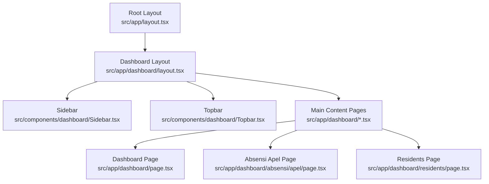
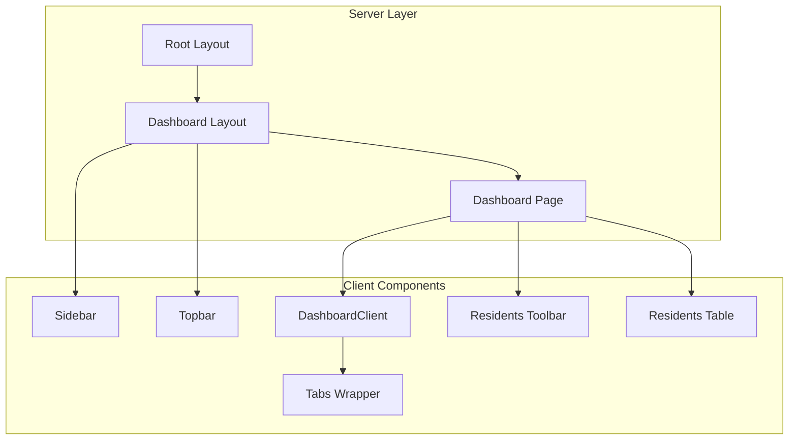
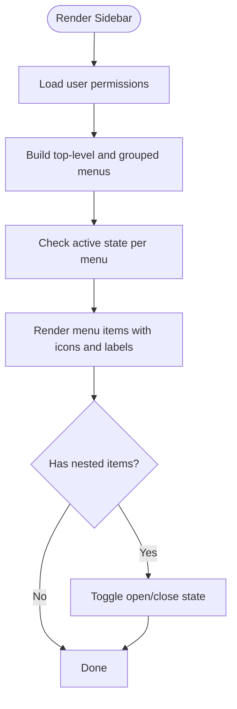
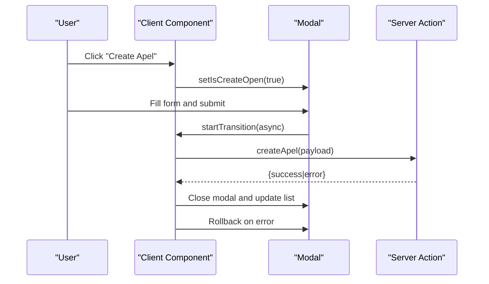
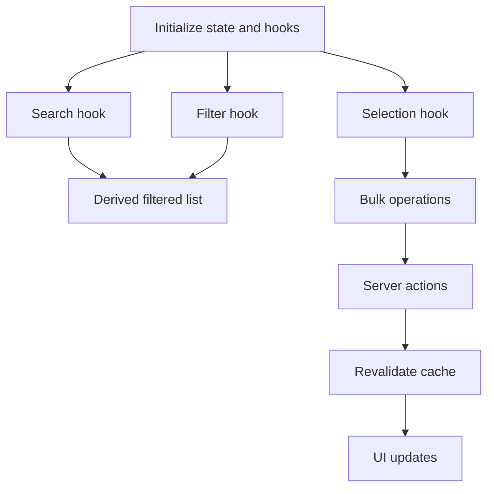
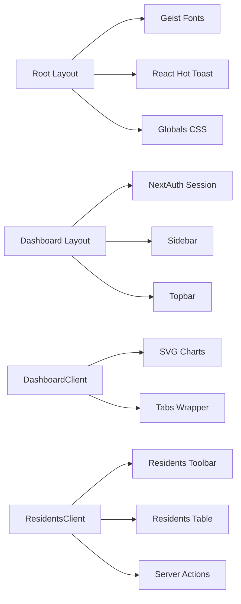

# UI Architecture & Component Design

<cite>
**Referenced Files in This Document**
- [src/app/layout.tsx](file://src/app/layout.tsx)
- [src/app/globals.css](file://src/app/globals.css)
- [public/theme.js](file://public/theme.js)
- [src/app/dashboard/layout.tsx](file://src/app/dashboard/layout.tsx)
- [src/components/dashboard/Sidebar.tsx](file://src/components/dashboard/Sidebar.tsx)
- [src/components/dashboard/Topbar.tsx](file://src/components/dashboard/Topbar.tsx)
- [src/components/ui/tabs.tsx](file://src/components/ui/tabs.tsx)
- [src/lib/utils.ts](file://src/lib/utils.ts)
- [src/app/dashboard/page.tsx](file://src/app/dashboard/page.tsx)
- [src/components/dashboard/DashboardClient.tsx](file://src/components/dashboard/DashboardClient.tsx)
- [src/components/dashboard/AbsensiApelClient.tsx](file://src/components/dashboard/AbsensiApelClient.tsx)
- [src/components/dashboard/ResidentsClient.tsx](file://src/components/dashboard/ResidentsClient.tsx)
- [src/components/dashboard/residents/ResidentsTable.tsx](file://src/components/dashboard/residents/ResidentsTable.tsx)
- [src/components/dashboard/residents/ResidentsToolbar.tsx](file://src/components/dashboard/residents/ResidentsToolbar.tsx)
- [src/app/actions/residents.ts](file://src/app/actions/residents.ts)
</cite>

## Table of Contents
1. [Introduction](#introduction)
2. [Project Structure](#project-structure)
3. [Core Components](#core-components)
4. [Architecture Overview](#architecture-overview)
5. [Detailed Component Analysis](#detailed-component-analysis)
6. [Dependency Analysis](#dependency-analysis)
7. [Performance Considerations](#performance-considerations)
8. [Troubleshooting Guide](#troubleshooting-guide)
9. [Conclusion](#conclusion)

## Introduction
This document describes the frontend UI architecture and component design of ApsAsrama’s Next.js App Router-based application. It covers the page-based architecture, dashboard layout system, sidebar navigation, responsive design, component library patterns, styling with Tailwind CSS, tab system, modal patterns, form handling, theming and dark mode, accessibility considerations, component lifecycle management, state management patterns, and performance optimization strategies.

## Project Structure
The application follows Next.js App Router conventions with a strict separation between server-side layouts and client-side components. The root layout defines global fonts, theme script injection, toast notifications, and base styles. The dashboard layout enforces authentication and composes the sidebar, topbar, and main content area. Page routes under `/dashboard/*` render page-level components that delegate to client-side components for interactivity.

**Diagram sources**
- [src/app/layout.tsx:1-42](file://src/app/layout.tsx#L1-L42)
- [src/app/dashboard/layout.tsx:1-37](file://src/app/dashboard/layout.tsx#L1-L37)
- [src/components/dashboard/Sidebar.tsx:1-404](file://src/components/dashboard/Sidebar.tsx#L1-L404)
- [src/components/dashboard/Topbar.tsx:1-96](file://src/components/dashboard/Topbar.tsx#L1-L96)
- [src/app/dashboard/page.tsx:1-144](file://src/app/dashboard/page.tsx#L1-L144)

**Section sources**
- [src/app/layout.tsx:1-42](file://src/app/layout.tsx#L1-L42)
- [src/app/globals.css:1-41](file://src/app/globals.css#L1-L41)
- [src/app/dashboard/layout.tsx:1-37](file://src/app/dashboard/layout.tsx#L1-L37)

## Core Components
- Root layout and global styles: Sets fonts, theme script, toast provider, and base dark/light variants.
- Dashboard layout: Enforces authentication, renders sidebar and topbar, and hosts page content.
- Sidebar: Permission-driven navigation with collapsible dropdowns and active-state highlighting.
- Topbar: Responsive header with theme toggle, search, notifications, and user profile.
- Dashboard client: Renders statistics cards, charts, recent activity, and quick actions.
- Tab system: Radix UI-based tabs wrapper for consistent tab behavior.
- Utility helpers: Tailwind class merging utility for robust component composition.

Key implementation patterns:
- Dark mode via HTML class toggling synchronized with local storage and server hydration.
- Permission-based visibility of menu items and submenus.
- Client-side state for UI interactions while server-side rendering handles SSR and ISR.

**Section sources**
- [src/app/layout.tsx:1-42](file://src/app/layout.tsx#L1-L42)
- [src/app/globals.css:1-41](file://src/app/globals.css#L1-L41)
- [public/theme.js:1-9](file://public/theme.js#L1-L9)
- [src/app/dashboard/layout.tsx:1-37](file://src/app/dashboard/layout.tsx#L1-L37)
- [src/components/dashboard/Sidebar.tsx:1-404](file://src/components/dashboard/Sidebar.tsx#L1-L404)
- [src/components/dashboard/Topbar.tsx:1-96](file://src/components/dashboard/Topbar.tsx#L1-L96)
- [src/components/dashboard/DashboardClient.tsx:1-402](file://src/components/dashboard/DashboardClient.tsx#L1-L402)
- [src/components/ui/tabs.tsx:1-55](file://src/components/ui/tabs.tsx#L1-L55)
- [src/lib/utils.ts:1-7](file://src/lib/utils.ts#L1-L7)

## Architecture Overview
The UI architecture centers around:
- App Router pages for server-rendered content and authentication gating.
- Client components for interactive dashboards, modals, forms, and data tables.
- Shared UI primitives (tabs, buttons, inputs) built with Tailwind and Radix UI.
- Theming and accessibility handled at the root and component level.

**Diagram sources**
- [src/app/layout.tsx:1-42](file://src/app/layout.tsx#L1-L42)
- [src/app/dashboard/layout.tsx:1-37](file://src/app/dashboard/layout.tsx#L1-L37)
- [src/app/dashboard/page.tsx:1-144](file://src/app/dashboard/page.tsx#L1-L144)
- [src/components/dashboard/Sidebar.tsx:1-404](file://src/components/dashboard/Sidebar.tsx#L1-L404)
- [src/components/dashboard/Topbar.tsx:1-96](file://src/components/dashboard/Topbar.tsx#L1-L96)
- [src/components/dashboard/DashboardClient.tsx:1-402](file://src/components/dashboard/DashboardClient.tsx#L1-L402)
- [src/components/ui/tabs.tsx:1-55](file://src/components/ui/tabs.tsx#L1-L55)
- [src/components/dashboard/residents/ResidentsToolbar.tsx:1-102](file://src/components/dashboard/residents/ResidentsToolbar.tsx#L1-L102)
- [src/components/dashboard/residents/ResidentsTable.tsx:1-112](file://src/components/dashboard/residents/ResidentsTable.tsx#L1-L112)

## Detailed Component Analysis

### Dashboard Layout System
The dashboard layout composes three primary areas:
- Sidebar: Desktop-only navigation with permission-aware menus and nested dropdowns.
- Topbar: Responsive header with theme toggle, search, notifications, and user info.
- Main content: Scrollable content area with radial gradient background and padding.

Responsiveness:
- Sidebar collapses to mobile-friendly menu on small screens.
- Topbar search and actions adapt to screen size.

Authentication:
- Server-side session check redirects unauthenticated users to login.

**Section sources**
- [src/app/dashboard/layout.tsx:1-37](file://src/app/dashboard/layout.tsx#L1-L37)
- [src/components/dashboard/Sidebar.tsx:1-404](file://src/components/dashboard/Sidebar.tsx#L1-L404)
- [src/components/dashboard/Topbar.tsx:1-96](file://src/components/dashboard/Topbar.tsx#L1-L96)

### Sidebar Navigation
The sidebar builds dynamic menus from user permissions and current path:
- Top-level links: Home and Forms.
- Data Master: Santri and Muallim.
- Unit Penugasan: Assignments and Monitoring.
- Absensi: Muallim, Kegiatan, and Apel.
- Referensi: Administrative regions, Areas, Akademik, KBM, Roles, Satkers.
- Audit Logs and Settings.
- Bottom logout action.

Behavior:
- Active item highlighting based on current pathname.
- Collapsible dropdowns with smooth transitions.
- Conditional rendering based on permission checks.

**Diagram sources**
- [src/components/dashboard/Sidebar.tsx:1-404](file://src/components/dashboard/Sidebar.tsx#L1-L404)

**Section sources**
- [src/components/dashboard/Sidebar.tsx:1-404](file://src/components/dashboard/Sidebar.tsx#L1-L404)

### Topbar and Theming
The topbar provides:
- Mobile hamburger menu for sidebar toggle.
- Search input with focus styles.
- Theme toggle button with persistent state in local storage.
- Notifications bell and user profile area.

Dark mode implementation:
- Hydration-safe theme detection and persistence.
- HTML class toggling for Tailwind dark variant.
- Initial theme sync via a lightweight client script.

Accessibility:
- Proper focus management and keyboard operability.
- Semantic icons with appropriate titles.

**Section sources**
- [src/components/dashboard/Topbar.tsx:1-96](file://src/components/dashboard/Topbar.tsx#L1-L96)
- [public/theme.js:1-9](file://public/theme.js#L1-L9)
- [src/app/globals.css:1-41](file://src/app/globals.css#L1-L41)

### Dashboard Client and Charts
The dashboard client renders:
- Welcome banner with real-time clock and Hijri/Gregorian dates.
- Statistics cards for total residents, available rooms, occupancy rate.
- SVG-based ring chart for room status distribution.
- Bar chart for per-room occupancy with tooltips.
- Recent activity feed with time-ago formatting.
- Quick action shortcuts.

State and lifecycle:
- Real-time clock updates via interval in useEffect.
- SVG chart calculations based on computed percentages.

**Section sources**
- [src/components/dashboard/DashboardClient.tsx:1-402](file://src/components/dashboard/DashboardClient.tsx#L1-L402)

### Tab System Implementation
A thin wrapper around Radix UI Tabs ensures consistent styling and behavior:
- Tabs, TabsList, TabsTrigger, TabsContent with Tailwind classes.
- Utility class merging for flexible composition.

Usage pattern:
- Apply TabsRoot with orientation and activation mode.
- Use TabsList for horizontal tab bar.
- Use TabsTrigger for individual tab controls.
- Use TabsContent for associated panels.

**Section sources**
- [src/components/ui/tabs.tsx:1-55](file://src/components/ui/tabs.tsx#L1-L55)
- [src/lib/utils.ts:1-7](file://src/lib/utils.ts#L1-L7)

### Modal Patterns and Forms
Multiple modal patterns are used across components:
- Absensi Apel: Create/Edit modals with validation and optimistic updates.
- Residents: Move room modal with cascading selects and bulk operations.
- Wizard-style forms: Santri wizard integrated inside a modal overlay.

Patterns:
- Backdrop click-to-close with absolute overlay.
- Controlled open/close state via React state.
- Form submission with pending states and error messaging.
- Optimistic UI updates with rollback on failure.

**Diagram sources**
- [src/components/dashboard/AbsensiApelClient.tsx:1-657](file://src/components/dashboard/AbsensiApelClient.tsx#L1-L657)
- [src/app/actions/residents.ts:1-666](file://src/app/actions/residents.ts#L1-L666)

**Section sources**
- [src/components/dashboard/AbsensiApelClient.tsx:1-657](file://src/components/dashboard/AbsensiApelClient.tsx#L1-L657)
- [src/components/dashboard/ResidentsClient.tsx:1-327](file://src/components/dashboard/ResidentsClient.tsx#L1-L327)
- [src/app/actions/residents.ts:1-666](file://src/app/actions/residents.ts#L1-L666)

### Form Handling Architecture
Residents page demonstrates a comprehensive form handling approach:
- Search and filter hooks manage query state and derived filters.
- Selection mode supports bulk operations (move, delete).
- Import/export/print utilities integrate with external libraries.
- Validation and normalization helpers in server actions.

**Diagram sources**
- [src/components/dashboard/ResidentsClient.tsx:1-327](file://src/components/dashboard/ResidentsClient.tsx#L1-L327)
- [src/app/actions/residents.ts:1-666](file://src/app/actions/residents.ts#L1-L666)

**Section sources**
- [src/components/dashboard/ResidentsClient.tsx:1-327](file://src/components/dashboard/ResidentsClient.tsx#L1-L327)
- [src/components/dashboard/residents/ResidentsToolbar.tsx:1-102](file://src/components/dashboard/residents/ResidentsToolbar.tsx#L1-L102)
- [src/components/dashboard/residents/ResidentsTable.tsx:1-112](file://src/components/dashboard/residents/ResidentsTable.tsx#L1-L112)
- [src/app/actions/residents.ts:1-666](file://src/app/actions/residents.ts#L1-L666)

### Component Composition and Styling
Styling architecture:
- Global CSS with Tailwind directives and custom variants.
- Glass effect utility class for frosted panels.
- Theme tokens defined in CSS custom properties.
- Utility function for merging Tailwind classes safely.

Composition patterns:
- Reusable UI primitives (buttons, inputs, badges).
- Card-based layouts with rounded corners and borders.
- Responsive grids and flex utilities.

**Section sources**
- [src/app/globals.css:1-41](file://src/app/globals.css#L1-L41)
- [src/lib/utils.ts:1-7](file://src/lib/utils.ts#L1-L7)

## Dependency Analysis
High-level dependencies:
- Root layout depends on fonts, script injection, and toast provider.
- Dashboard layout depends on authentication guards and sidebar/topbar.
- Client components depend on shared UI primitives and server actions.
- Modals depend on controlled state and server action results.

**Diagram sources**
- [src/app/layout.tsx:1-42](file://src/app/layout.tsx#L1-L42)
- [src/app/dashboard/layout.tsx:1-37](file://src/app/dashboard/layout.tsx#L1-L37)
- [src/components/dashboard/DashboardClient.tsx:1-402](file://src/components/dashboard/DashboardClient.tsx#L1-L402)
- [src/components/dashboard/ResidentsClient.tsx:1-327](file://src/components/dashboard/ResidentsClient.tsx#L1-L327)
- [src/components/ui/tabs.tsx:1-55](file://src/components/ui/tabs.tsx#L1-L55)
- [src/app/actions/residents.ts:1-666](file://src/app/actions/residents.ts#L1-L666)

**Section sources**
- [src/app/layout.tsx:1-42](file://src/app/layout.tsx#L1-L42)
- [src/app/dashboard/layout.tsx:1-37](file://src/app/dashboard/layout.tsx#L1-L37)
- [src/components/dashboard/DashboardClient.tsx:1-402](file://src/components/dashboard/DashboardClient.tsx#L1-L402)
- [src/components/dashboard/ResidentsClient.tsx:1-327](file://src/components/dashboard/ResidentsClient.tsx#L1-L327)
- [src/components/ui/tabs.tsx:1-55](file://src/components/ui/tabs.tsx#L1-L55)
- [src/app/actions/residents.ts:1-666](file://src/app/actions/residents.ts#L1-L666)

## Performance Considerations
- Server-side rendering and incremental static regeneration for dashboard metrics.
- Client-side state and transitions for interactive modals and forms.
- Optimistic UI updates with rollback on errors to reduce perceived latency.
- Efficient SVG rendering for charts with precomputed stroke offsets.
- Memoization and derived state via custom hooks to minimize re-renders.
- Lazy initialization of heavy modals and wizards to improve initial load.

## Troubleshooting Guide
Common issues and resolutions:
- Hydration mismatches: Ensure theme toggle is only rendered client-side and use hydration-safe utilities.
- Permission-based menu visibility: Verify permission arrays and casing; confirm server-side session includes permissions.
- Modal state synchronization: Keep controlled state and close modals on successful server action results.
- Form validation errors: Display server action errors in modals and prevent invalid submissions.
- Dark mode persistence: Confirm local storage keys and initial theme detection logic.

**Section sources**
- [src/components/dashboard/Topbar.tsx:1-96](file://src/components/dashboard/Topbar.tsx#L1-L96)
- [public/theme.js:1-9](file://public/theme.js#L1-L9)
- [src/components/dashboard/Sidebar.tsx:1-404](file://src/components/dashboard/Sidebar.tsx#L1-L404)
- [src/components/dashboard/AbsensiApelClient.tsx:1-657](file://src/components/dashboard/AbsensiApelClient.tsx#L1-L657)
- [src/app/actions/residents.ts:1-666](file://src/app/actions/residents.ts#L1-L666)

## Conclusion
ApsAsrama’s UI architecture leverages Next.js App Router for structured routing and authentication, with a cohesive client-side component model that emphasizes composability, accessibility, and performance. The dashboard layout, sidebar navigation, and responsive design work together to deliver a consistent user experience, while the tab system, modal patterns, and form handling provide robust interaction paradigms. The theming system and Tailwind-based styling enable rapid iteration and maintainability across light and dark modes.