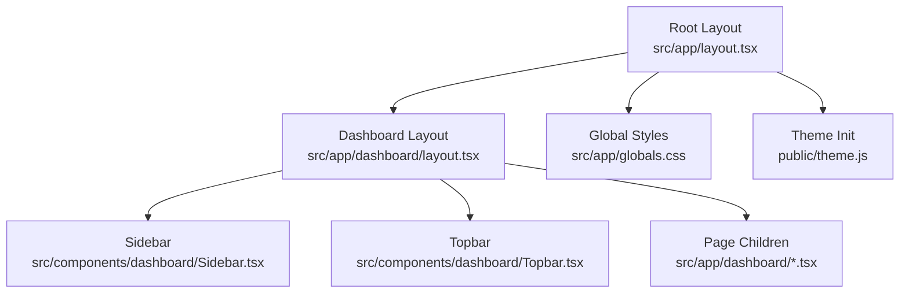
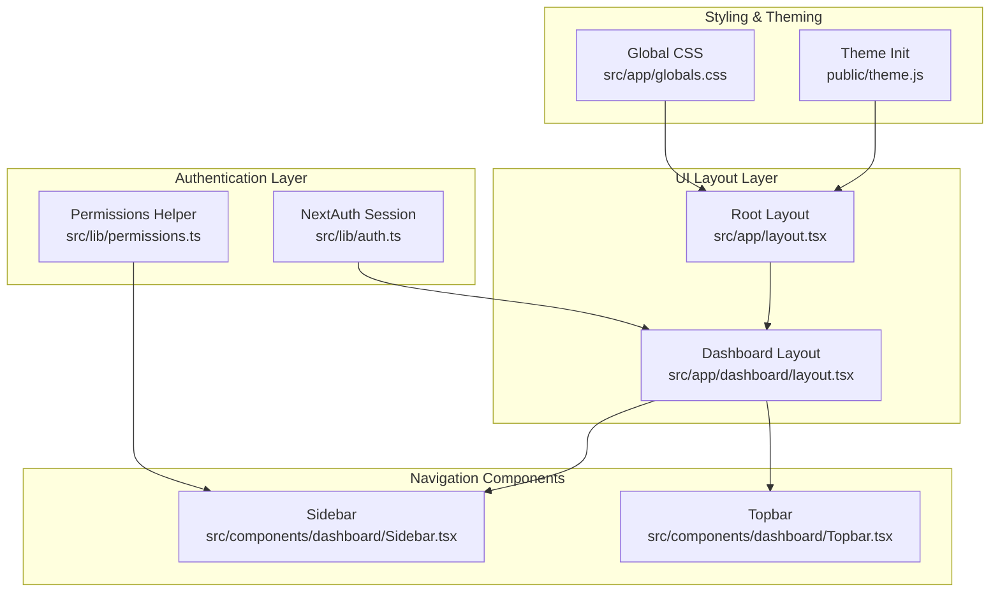
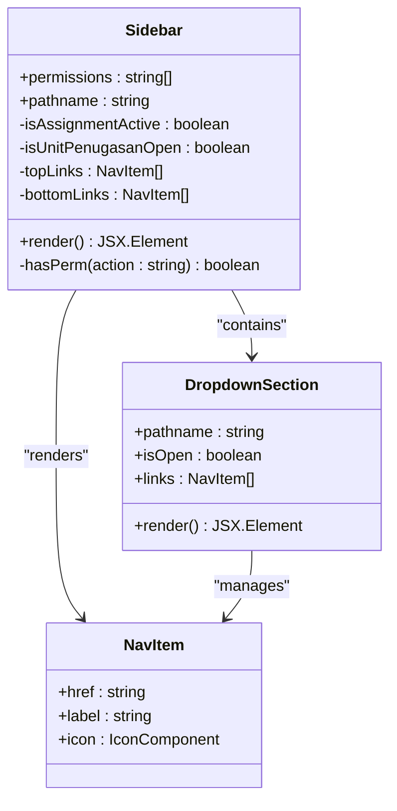
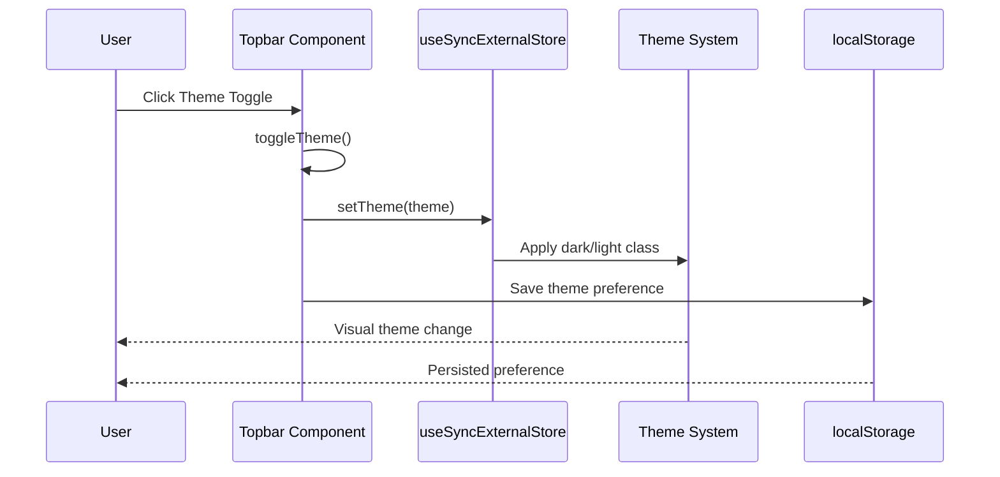
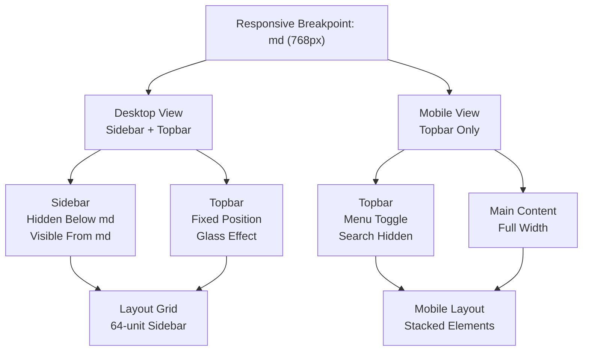
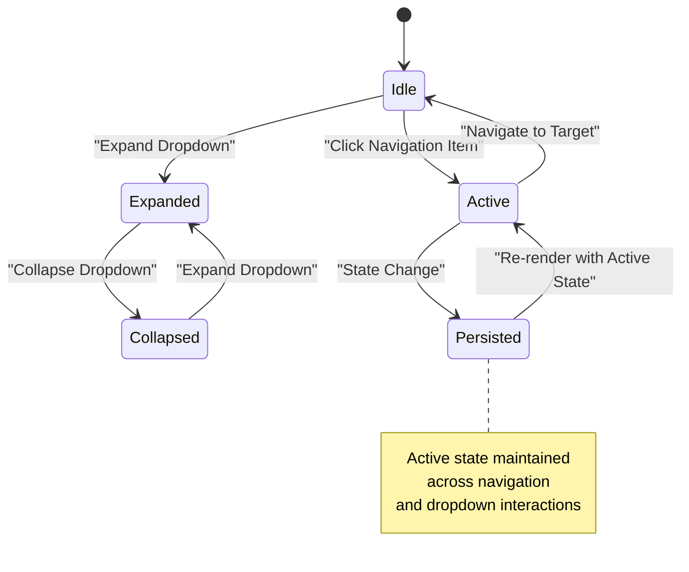
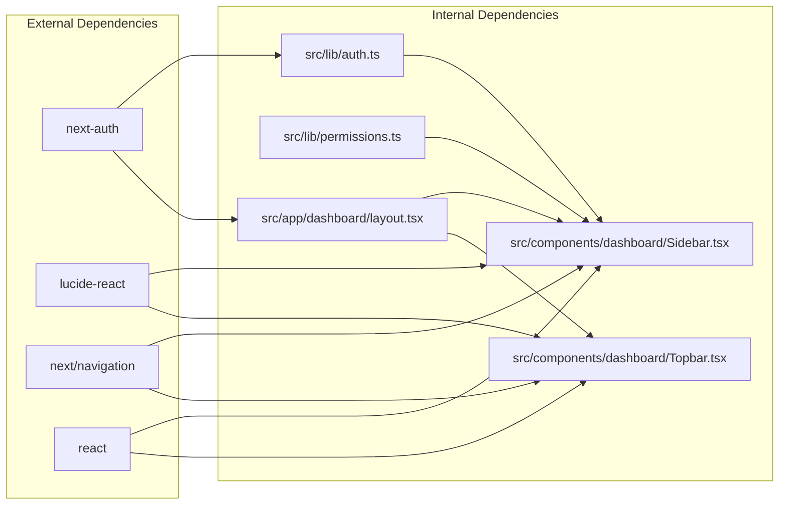

# Dashboard Layout & Navigation

<cite>
**Referenced Files in This Document**
- [layout.tsx](file://src/app/layout.tsx)
- [dashboard/layout.tsx](file://src/app/dashboard/layout.tsx)
- [Sidebar.tsx](file://src/components/dashboard/Sidebar.tsx)
- [Topbar.tsx](file://src/components/dashboard/Topbar.tsx)
- [auth.ts](file://src/lib/auth.ts)
- [permissions.ts](file://src/lib/permissions.ts)
- [globals.css](file://src/app/globals.css)
- [theme.js](file://public/theme.js)
- [dashboard/page.tsx](file://src/app/dashboard/page.tsx)
</cite>

## Table of Contents
1. [Introduction](#introduction)
2. [Project Structure](#project-structure)
3. [Core Components](#core-components)
4. [Architecture Overview](#architecture-overview)
5. [Detailed Component Analysis](#detailed-component-analysis)
6. [Dependency Analysis](#dependency-analysis)
7. [Performance Considerations](#performance-considerations)
8. [Troubleshooting Guide](#troubleshooting-guide)
9. [Conclusion](#conclusion)

## Introduction
This document provides comprehensive documentation for the dashboard layout system and navigation components in the ApsAsrama project. It covers the main layout structure, sidebar navigation implementation, topbar functionality, and responsive design patterns. The documentation also details component props, state management, integration with Next.js App Router, customization options for menu items, user profile integration, mobile-responsive behavior, layout breakpoints, navigation state persistence, and accessibility considerations.

## Project Structure
The dashboard layout system is organized around three primary layers:
- Root layout: Provides global HTML and body setup, fonts, and global styles.
- Dashboard layout: Manages the main layout grid with sidebar and topbar, and integrates authentication.
- Navigation components: Sidebar and Topbar provide navigation and user controls.

**Diagram sources**
- [layout.tsx:1-42](file://src/app/layout.tsx#L1-L42)
- [dashboard/layout.tsx:1-37](file://src/app/dashboard/layout.tsx#L1-L37)
- [Sidebar.tsx:1-404](file://src/components/dashboard/Sidebar.tsx#L1-L404)
- [Topbar.tsx:1-96](file://src/components/dashboard/Topbar.tsx#L1-L96)
- [globals.css:1-41](file://src/app/globals.css#L1-L41)
- [theme.js:1-9](file://public/theme.js#L1-L9)

**Section sources**
- [layout.tsx:1-42](file://src/app/layout.tsx#L1-L42)
- [dashboard/layout.tsx:1-37](file://src/app/dashboard/layout.tsx#L1-L37)

## Core Components
This section documents the key components that form the dashboard layout and navigation system.

### Sidebar Component
The Sidebar component renders the main navigation menu with collapsible dropdowns and dynamic visibility based on user permissions. It supports:
- Permission-driven visibility for menu items
- Collapsible dropdowns for grouped sections
- Active state highlighting based on current path
- Sign out integration via NextAuth

Key props:
- permissions: string[] (optional) - User permissions array used to determine visible menu items

Behavior highlights:
- Uses Next.js usePathname hook to detect active navigation state
- Maintains internal state for dropdown open/closed states
- Applies Tailwind classes for active/inactive states and transitions
- Integrates Lucide icons for visual indicators

**Section sources**
- [Sidebar.tsx:1-404](file://src/components/dashboard/Sidebar.tsx#L1-L404)

### Topbar Component
The Topbar component provides the header bar with:
- Mobile-friendly menu toggle button
- Search input field
- Theme toggle with persistent storage
- Notification indicator
- User profile display with role badge
- Responsive breakpoint at md (768px)

Key props:
- user: { name?: string | null; role?: string } (optional) - User information for display

Behavior highlights:
- Hydration-safe theme toggle using useSyncExternalStore
- Local storage persistence for theme preference
- Conditional rendering for desktop/mobile layouts
- Dynamic accessibility attributes based on mounted state

**Section sources**
- [Topbar.tsx:1-96](file://src/components/dashboard/Topbar.tsx#L1-L96)

### Dashboard Layout
The Dashboard Layout orchestrates the overall page structure:
- Authentication guard using NextAuth sessions
- Responsive sidebar/desktop split
- Sticky topbar with z-index management
- Glass effect styling for sidebar and topbar
- Radial gradient background for main content

Integration points:
- Receives user session data from server-side auth
- Passes user permissions to Sidebar
- Renders page children within main content area

**Section sources**
- [dashboard/layout.tsx:1-37](file://src/app/dashboard/layout.tsx#L1-L37)

## Architecture Overview
The dashboard layout follows a layered architecture with clear separation of concerns:

**Diagram sources**
- [auth.ts:1-81](file://src/lib/auth.ts#L1-L81)
- [permissions.ts:1-21](file://src/lib/permissions.ts#L1-L21)
- [layout.tsx:1-42](file://src/app/layout.tsx#L1-L42)
- [dashboard/layout.tsx:1-37](file://src/app/dashboard/layout.tsx#L1-L37)
- [Sidebar.tsx:1-404](file://src/components/dashboard/Sidebar.tsx#L1-L404)
- [Topbar.tsx:1-96](file://src/components/dashboard/Topbar.tsx#L1-L96)
- [globals.css:1-41](file://src/app/globals.css#L1-L41)
- [theme.js:1-9](file://public/theme.js#L1-L9)

## Detailed Component Analysis

### Sidebar Navigation Implementation
The Sidebar implements a hierarchical navigation system with permission-based visibility and collapsible sections.

**Diagram sources**
- [Sidebar.tsx:223-250](file://src/components/dashboard/Sidebar.tsx#L223-L250)
- [Sidebar.tsx:53-106](file://src/components/dashboard/Sidebar.tsx#L53-L106)
- [Sidebar.tsx:110-163](file://src/components/dashboard/Sidebar.tsx#L110-L163)
- [Sidebar.tsx:165-221](file://src/components/dashboard/Sidebar.tsx#L165-L221)

Key implementation patterns:
- Permission filtering using hasPerm helper
- Dynamic link generation with spread operators
- State management for dropdown expansion
- Active state detection via pathname comparison
- Conditional rendering based on permission checks

**Section sources**
- [Sidebar.tsx:223-250](file://src/components/dashboard/Sidebar.tsx#L223-L250)
- [Sidebar.tsx:53-106](file://src/components/dashboard/Sidebar.tsx#L53-L106)
- [Sidebar.tsx:110-163](file://src/components/dashboard/Sidebar.tsx#L110-L163)
- [Sidebar.tsx:165-221](file://src/components/dashboard/Sidebar.tsx#L165-L221)

### Topbar Functionality and State Management
The Topbar implements a hybrid state management approach combining local state with external store synchronization.

**Diagram sources**
- [Topbar.tsx:16-40](file://src/components/dashboard/Topbar.tsx#L16-L40)

State management characteristics:
- Hydration-safe mounting detection using useSyncExternalStore
- Local state for immediate UI feedback
- Persistent storage for theme preferences
- Dynamic accessibility attributes based on mounted state

**Section sources**
- [Topbar.tsx:16-40](file://src/components/dashboard/Topbar.tsx#L16-L40)

### Responsive Design Patterns
The layout implements a comprehensive responsive design strategy:

**Diagram sources**
- [dashboard/layout.tsx:19-23](file://src/app/dashboard/layout.tsx#L19-L23)
- [Topbar.tsx:42-57](file://src/components/dashboard/Topbar.tsx#L42-L57)

Responsive behavior highlights:
- Sidebar visibility controlled by md breakpoint
- Mobile menu toggle button for navigation
- Adaptive search input placement
- Flexible main content area
- Glass effect styling with backdrop blur

**Section sources**
- [dashboard/layout.tsx:19-23](file://src/app/dashboard/layout.tsx#L19-L23)
- [Topbar.tsx:42-57](file://src/components/dashboard/Topbar.tsx#L42-L57)

### Navigation State Persistence
The navigation system maintains state persistence across user interactions:

**Diagram sources**
- [Sidebar.tsx:53-106](file://src/components/dashboard/Sidebar.tsx#L53-L106)
- [Sidebar.tsx:110-163](file://src/components/dashboard/Sidebar.tsx#L110-L163)
- [Sidebar.tsx:165-221](file://src/components/dashboard/Sidebar.tsx#L165-L221)

Persistence mechanisms:
- Pathname-based active state detection
- Internal component state for dropdown expansion
- Browser history integration via Next.js router
- Session-based permission caching

**Section sources**
- [Sidebar.tsx:53-106](file://src/components/dashboard/Sidebar.tsx#L53-L106)
- [Sidebar.tsx:110-163](file://src/components/dashboard/Sidebar.tsx#L110-L163)
- [Sidebar.tsx:165-221](file://src/components/dashboard/Sidebar.tsx#L165-L221)

## Dependency Analysis
The dashboard layout system exhibits clean dependency relationships with clear separation of concerns.

**Diagram sources**
- [auth.ts:1-81](file://src/lib/auth.ts#L1-L81)
- [permissions.ts:1-21](file://src/lib/permissions.ts#L1-L21)
- [Sidebar.tsx:1-26](file://src/components/dashboard/Sidebar.tsx#L1-L26)
- [Topbar.tsx:1-5](file://src/components/dashboard/Topbar.tsx#L1-L5)
- [dashboard/layout.tsx:1-6](file://src/app/dashboard/layout.tsx#L1-L6)

Dependency characteristics:
- Loose coupling between components and external libraries
- Centralized authentication logic in auth.ts
- Permission utilities in permissions.ts
- Clear import boundaries between UI and business logic

**Section sources**
- [auth.ts:1-81](file://src/lib/auth.ts#L1-L81)
- [permissions.ts:1-21](file://src/lib/permissions.ts#L1-L21)
- [Sidebar.tsx:1-26](file://src/components/dashboard/Sidebar.tsx#L1-L26)
- [Topbar.tsx:1-5](file://src/components/dashboard/Topbar.tsx#L1-L5)
- [dashboard/layout.tsx:1-6](file://src/app/dashboard/layout.tsx#L1-L6)

## Performance Considerations
The dashboard layout system incorporates several performance optimization strategies:

- Efficient permission checking using Set-like operations
- Minimal re-renders through targeted state updates
- CSS-based animations for smooth transitions
- Lazy loading of images via Next.js Image component
- Optimized Tailwind CSS utility classes
- Server-side session validation reducing client-side work
- Hydration-safe components preventing unnecessary re-renders

## Troubleshooting Guide
Common issues and their resolutions:

### Hydration Mismatch Issues
Problem: Theme toggle appears briefly or causes hydration warnings
Solution: The component uses useSyncExternalStore to detect mounted state and conditionally renders theme icons

### Permission-Based Menu Visibility
Problem: Menu items not appearing for authorized users
Solution: Verify that user permissions are correctly passed to Sidebar component and match expected permission codes

### Mobile Navigation Issues
Problem: Sidebar overlaps content on small screens
Solution: Ensure responsive breakpoints are properly configured and Tailwind CSS utilities are correctly applied

### Authentication Redirect Loops
Problem: Users redirected to login despite being authenticated
Solution: Check NextAuth configuration and session storage for proper JWT handling

**Section sources**
- [Topbar.tsx:16-18](file://src/components/dashboard/Topbar.tsx#L16-L18)
- [auth.ts:53-71](file://src/lib/auth.ts#L53-L71)
- [dashboard/layout.tsx:12-16](file://src/app/dashboard/layout.tsx#L12-L16)

## Conclusion
The dashboard layout system in ApsAsrama demonstrates a well-architected solution for navigation and layout management. The implementation successfully balances flexibility with maintainability through:

- Clean separation of concerns between authentication, layout, and navigation components
- Comprehensive responsive design supporting both desktop and mobile experiences
- Robust permission-based access control integrated throughout the navigation system
- Thoughtful state management ensuring smooth user interactions
- Performance optimizations leveraging Next.js App Router capabilities

The system provides a solid foundation for extending navigation functionality while maintaining accessibility and responsive behavior across different device sizes.