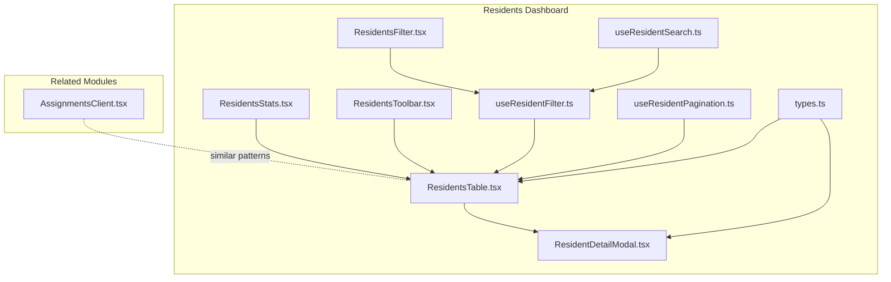
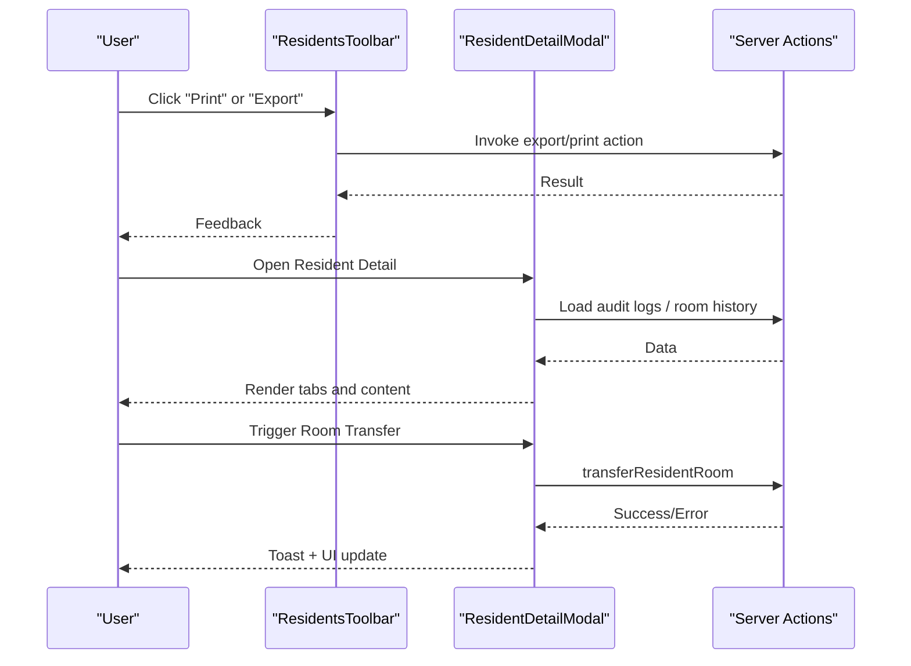
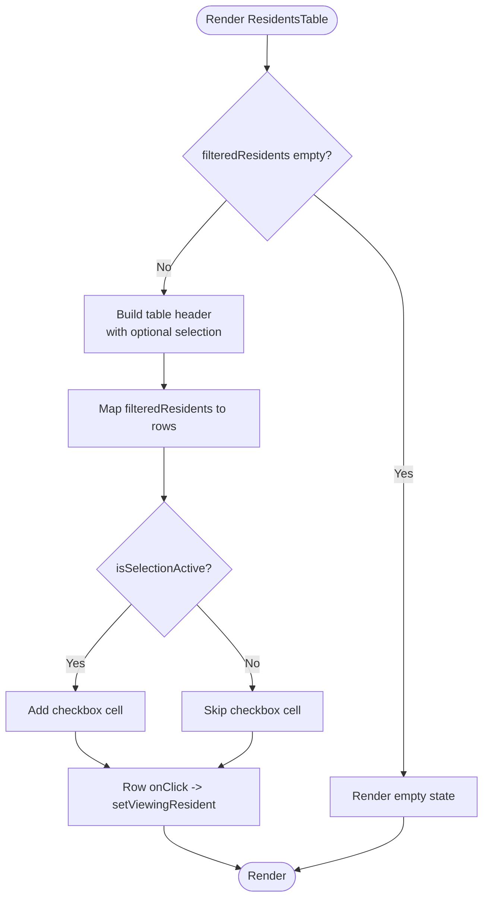
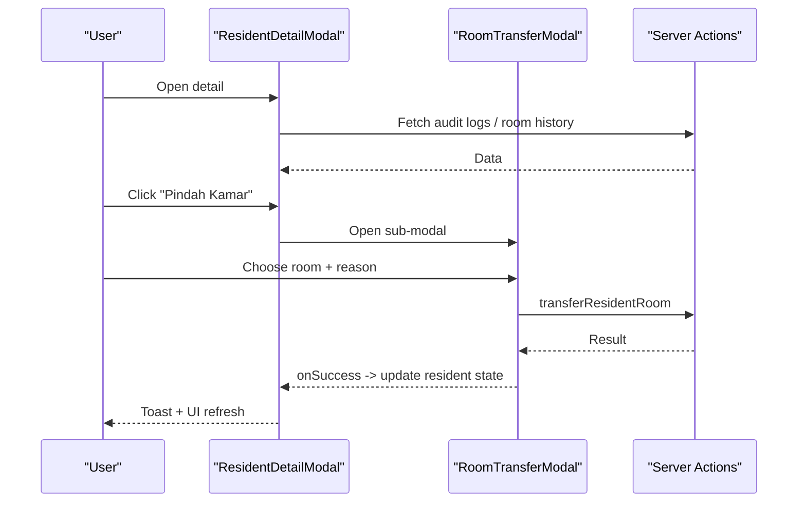
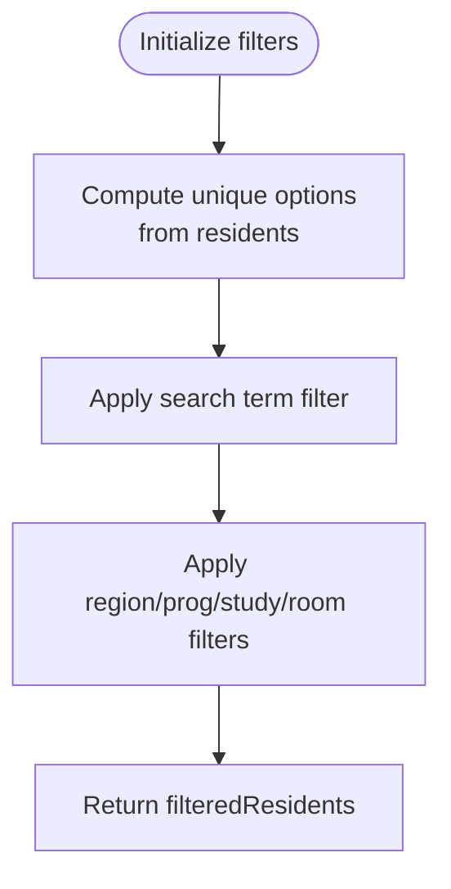
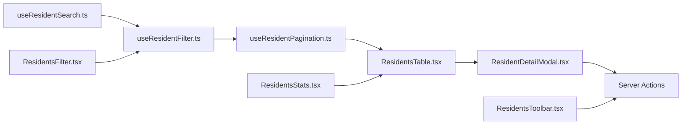

# Data Display Components

<cite>
**Referenced Files in This Document**
- [ResidentsTable.tsx](file://src/components/dashboard/residents/ResidentsTable.tsx)
- [ResidentsStats.tsx](file://src/components/dashboard/residents/ResidentsStats.tsx)
- [ResidentsToolbar.tsx](file://src/components/dashboard/residents/ResidentsToolbar.tsx)
- [ResidentDetailModal.tsx](file://src/components/dashboard/ResidentDetailModal.tsx)
- [types.ts](file://src/components/dashboard/residents/types.ts)
- [useResidentFilter.ts](file://src/components/dashboard/residents/useResidentFilter.ts)
- [useResidentSearch.ts](file://src/components/dashboard/residents/useResidentSearch.ts)
- [useResidentPagination.ts](file://src/components/dashboard/residents/useResidentPagination.ts)
- [ResidentsFilter.tsx](file://src/components/dashboard/residents/ResidentsFilter.tsx)
- [AssignmentsClient.tsx](file://src/components/dashboard/AssignmentsClient.tsx)
</cite>

## Table of Contents
1. [Introduction](#introduction)
2. [Project Structure](#project-structure)
3. [Core Components](#core-components)
4. [Architecture Overview](#architecture-overview)
5. [Detailed Component Analysis](#detailed-component-analysis)
6. [Dependency Analysis](#dependency-analysis)
7. [Performance Considerations](#performance-considerations)
8. [Troubleshooting Guide](#troubleshooting-guide)
9. [Conclusion](#conclusion)

## Introduction
This document explains the data display components used across the application’s dashboard, focusing on:
- Table components with selection, sorting, and pagination
- Statistics cards for quick insights
- Toolbar controls for bulk actions and data import/export/print
- Modal systems for viewing details, managing room transfers, and printing

It covers data binding patterns, filtering and search mechanisms, pagination implementation, responsive behavior, component props and events, integration with server actions, performance optimization for large datasets, accessibility considerations, and customization options.

## Project Structure
The data display components are primarily located under the residents dashboard module and complemented by related assignment management UI.

**Diagram sources**
- [ResidentsStats.tsx:1-57](file://src/components/dashboard/residents/ResidentsStats.tsx#L1-L57)
- [ResidentsToolbar.tsx:1-102](file://src/components/dashboard/residents/ResidentsToolbar.tsx#L1-L102)
- [ResidentsFilter.tsx:1-72](file://src/components/dashboard/residents/ResidentsFilter.tsx#L1-L72)
- [useResidentSearch.ts:1-11](file://src/components/dashboard/residents/useResidentSearch.ts#L1-L11)
- [useResidentFilter.ts:1-73](file://src/components/dashboard/residents/useResidentFilter.ts#L1-L73)
- [useResidentPagination.ts:1-48](file://src/components/dashboard/residents/useResidentPagination.ts#L1-L48)
- [ResidentsTable.tsx:1-112](file://src/components/dashboard/residents/ResidentsTable.tsx#L1-L112)
- [ResidentDetailModal.tsx:1-759](file://src/components/dashboard/ResidentDetailModal.tsx#L1-L759)
- [types.ts:1-46](file://src/components/dashboard/residents/types.ts#L1-L46)
- [AssignmentsClient.tsx:1-866](file://src/components/dashboard/AssignmentsClient.tsx#L1-L866)

**Section sources**
- [ResidentsTable.tsx:1-112](file://src/components/dashboard/residents/ResidentsTable.tsx#L1-L112)
- [ResidentsStats.tsx:1-57](file://src/components/dashboard/residents/ResidentsStats.tsx#L1-L57)
- [ResidentsToolbar.tsx:1-102](file://src/components/dashboard/residents/ResidentsToolbar.tsx#L1-L102)
- [ResidentDetailModal.tsx:1-759](file://src/components/dashboard/ResidentDetailModal.tsx#L1-L759)
- [types.ts:1-46](file://src/components/dashboard/residents/types.ts#L1-L46)
- [useResidentFilter.ts:1-73](file://src/components/dashboard/residents/useResidentFilter.ts#L1-L73)
- [useResidentSearch.ts:1-11](file://src/components/dashboard/residents/useResidentSearch.ts#L1-L11)
- [useResidentPagination.ts:1-48](file://src/components/dashboard/residents/useResidentPagination.ts#L1-L48)
- [ResidentsFilter.tsx:1-72](file://src/components/dashboard/residents/ResidentsFilter.tsx#L1-L72)
- [AssignmentsClient.tsx:1-866](file://src/components/dashboard/AssignmentsClient.tsx#L1-L866)

## Core Components
- ResidentsTable: Renders a responsive table of residents with optional selection, row click to view details, and visual indicators for room and status.
- ResidentsStats: Displays summary cards for total, active, and inactive residents.
- ResidentsToolbar: Provides import/export/print actions, selection mode toggle, and bulk actions (move room, delete).
- ResidentDetailModal: Comprehensive modal with tabs for profile, history, assignments, address, education, and audit logs; supports room transfer and printing.
- ResidentsFilter + useResidentFilter: Filter UI and hook for region, program study, cohort, and room filters with dynamic option lists.
- useResidentSearch: Hook to manage global search term.
- useResidentPagination: Hook to compute pages, current page, and slice data for pagination.
- AssignmentsClient: Similar data display patterns for assignments and work units (Satker), including stats, search, and modals.

**Section sources**
- [ResidentsTable.tsx:5-112](file://src/components/dashboard/residents/ResidentsTable.tsx#L5-L112)
- [ResidentsStats.tsx:3-57](file://src/components/dashboard/residents/ResidentsStats.tsx#L3-L57)
- [ResidentsToolbar.tsx:3-102](file://src/components/dashboard/residents/ResidentsToolbar.tsx#L3-L102)
- [ResidentDetailModal.tsx:35-759](file://src/components/dashboard/ResidentDetailModal.tsx#L35-L759)
- [ResidentsFilter.tsx:1-72](file://src/components/dashboard/residents/ResidentsFilter.tsx#L1-L72)
- [useResidentFilter.ts:9-73](file://src/components/dashboard/residents/useResidentFilter.ts#L9-L73)
- [useResidentSearch.ts:3-11](file://src/components/dashboard/residents/useResidentSearch.ts#L3-L11)
- [useResidentPagination.ts:9-48](file://src/components/dashboard/residents/useResidentPagination.ts#L9-L48)
- [AssignmentsClient.tsx:66-866](file://src/components/dashboard/AssignmentsClient.tsx#L66-L866)

## Architecture Overview
The residents data display follows a composition pattern:
- State hooks (search, filters, pagination) live in the parent client component.
- UI components receive computed props (filtered/paginated data, handlers).
- Server actions are invoked via modal and toolbar handlers to perform mutations and refresh local state.

**Diagram sources**
- [ResidentsToolbar.tsx:17-102](file://src/components/dashboard/residents/ResidentsToolbar.tsx#L17-L102)
- [ResidentDetailModal.tsx:307-759](file://src/components/dashboard/ResidentDetailModal.tsx#L307-L759)

## Detailed Component Analysis

### ResidentsTable
- Purpose: Render a responsive table of residents with optional selection mode, row click to open detail, and visual cues for room and status.
- Props:
  - filteredResidents: array of residents after search/filter/pagination
  - isSelectionActive: boolean flag to enable selection column
  - selectedIds: Set of selected resident IDs
  - handleSelectAll: handler to select/deselect all visible rows
  - handleSelectToggle: handler to toggle single row selection
  - setViewingResident: handler to open detail modal
- Behavior:
  - Empty state renders a centered message.
  - Optional checkbox column appears when selection is active.
  - Row click opens detail; inner checkbox click stops propagation to avoid triggering row click.
  - Selection highlights rows with accent border and background.
- Accessibility:
  - Uses semantic table markup and proper contrast classes.
  - Tooltips/title attributes for icons.
- Responsive:
  - Horizontal scrolling container for narrow screens.
  - Dark mode variants via Tailwind classes.

**Diagram sources**
- [ResidentsTable.tsx:14-112](file://src/components/dashboard/residents/ResidentsTable.tsx#L14-L112)

**Section sources**
- [ResidentsTable.tsx:5-112](file://src/components/dashboard/residents/ResidentsTable.tsx#L5-L112)

### ResidentsStats
- Purpose: Present three summary cards: total residents, active residents, inactive alumni.
- Props:
  - totalResidents, activeResidents, inactiveResidents
- Design:
  - Grid layout adapts to screen size.
  - Each card includes an icon, label, and value with color-coded accents.

**Section sources**
- [ResidentsStats.tsx:3-57](file://src/components/dashboard/residents/ResidentsStats.tsx#L3-L57)

### ResidentsToolbar
- Purpose: Provide actionable controls for data import/export/print, selection mode toggle, and bulk actions.
- Props:
  - fileInputRef: ref to hidden file input
  - handleFileUpload: handler for Excel uploads
  - importing: loading state during import
  - downloadTemplate, exportToCSV, printPDF: callbacks
  - isSelectionActive, toggleSelectionMode: selection mode control
  - selectedIds: Set of selected IDs
  - onOpenMoveModal, handleBulkDelete: bulk actions
- UX:
  - Conditional rendering of bulk action buttons when selection is active.
  - Disabled states during import.
  - Clear affordances for each action.

**Section sources**
- [ResidentsToolbar.tsx:3-102](file://src/components/dashboard/residents/ResidentsToolbar.tsx#L3-L102)

### ResidentDetailModal
- Purpose: Comprehensive detail view with tabs, audit logs, room history, and actions.
- Props:
  - isOpen, onClose, resident, onEdit, permissions
- Features:
  - Tabs: Biodata, History, Assignments, Address, Education, Audit Log (conditional)
  - Status badge with mapped labels
  - Copy identifiers to clipboard with feedback
  - Room transfer sub-modal with available rooms picker and reason
  - Print functionality with embedded QR and PDF generation
  - Audit log tab with field change diff visualization
- Integration:
  - Uses server actions for audit logs, room history, and room transfer.
  - Uses React state transitions to prevent UI jank during async operations.

**Diagram sources**
- [ResidentDetailModal.tsx:307-759](file://src/components/dashboard/ResidentDetailModal.tsx#L307-L759)
- [ResidentDetailModal.tsx:59-190](file://src/components/dashboard/ResidentDetailModal.tsx#L59-L190)

**Section sources**
- [ResidentDetailModal.tsx:35-759](file://src/components/dashboard/ResidentDetailModal.tsx#L35-L759)

### Filtering and Search
- useResidentSearch: Centralized search term state.
- useResidentFilter:
  - Computes unique filter options from resident dataset.
  - Applies multi-criteria filter: search term across name/NIM/NIUP and selected filters.
  - Exposes toggles/reset for filter panel and returns filtered results.
- ResidentsFilter: UI for selecting filters with dynamic options.

**Diagram sources**
- [useResidentFilter.ts:9-73](file://src/components/dashboard/residents/useResidentFilter.ts#L9-L73)
- [useResidentSearch.ts:3-11](file://src/components/dashboard/residents/useResidentSearch.ts#L3-L11)
- [ResidentsFilter.tsx:16-72](file://src/components/dashboard/residents/ResidentsFilter.tsx#L16-L72)

**Section sources**
- [useResidentFilter.ts:9-73](file://src/components/dashboard/residents/useResidentFilter.ts#L9-L73)
- [useResidentSearch.ts:3-11](file://src/components/dashboard/residents/useResidentSearch.ts#L3-L11)
- [ResidentsFilter.tsx:1-72](file://src/components/dashboard/residents/ResidentsFilter.tsx#L1-L72)

### Pagination
- useResidentPagination:
  - Manages current page, page size, total pages, and slices data.
  - Safe navigation to last page if current exceeds bounds.
  - Exposes navigation helpers: nextPage, prevPage, goToPage, setPageSize.

**Section sources**
- [useResidentPagination.ts:9-48](file://src/components/dashboard/residents/useResidentPagination.ts#L9-L48)

### Data Models
- types.ts defines Resident, Room, and related structures used across components.

**Section sources**
- [types.ts:13-42](file://src/components/dashboard/residents/types.ts#L13-L42)

### Related Patterns in AssignmentsClient
- Demonstrates similar patterns: stats cards, search bar, filterable lists, modals, and server action integration.

**Section sources**
- [AssignmentsClient.tsx:66-866](file://src/components/dashboard/AssignmentsClient.tsx#L66-L866)

## Dependency Analysis
- Component coupling:
  - ResidentsTable depends on props from higher-order hooks (filters/search/pagination).
  - ResidentDetailModal composes RoomTransferModal and integrates server actions.
- Data flow:
  - Hooks compute derived state; components render presentational UI.
  - Server actions mutate data and return results consumed by modals.
- External integrations:
  - Next.js image components for avatar placeholders.
  - Lucide icons for UI affordances.
  - HTML-to-PDF library for print/export.

**Diagram sources**
- [useResidentSearch.ts:3-11](file://src/components/dashboard/residents/useResidentSearch.ts#L3-L11)
- [useResidentFilter.ts:9-73](file://src/components/dashboard/residents/useResidentFilter.ts#L9-L73)
- [useResidentPagination.ts:9-48](file://src/components/dashboard/residents/useResidentPagination.ts#L9-L48)
- [ResidentsTable.tsx:14-112](file://src/components/dashboard/residents/ResidentsTable.tsx#L14-L112)
- [ResidentDetailModal.tsx:307-759](file://src/components/dashboard/ResidentDetailModal.tsx#L307-L759)
- [ResidentsFilter.tsx:16-72](file://src/components/dashboard/residents/ResidentsFilter.tsx#L16-L72)
- [ResidentsStats.tsx:9-57](file://src/components/dashboard/residents/ResidentsStats.tsx#L9-L57)
- [ResidentsToolbar.tsx:17-102](file://src/components/dashboard/residents/ResidentsToolbar.tsx#L17-L102)

**Section sources**
- [ResidentsTable.tsx:14-112](file://src/components/dashboard/residents/ResidentsTable.tsx#L14-L112)
- [ResidentDetailModal.tsx:307-759](file://src/components/dashboard/ResidentDetailModal.tsx#L307-L759)
- [ResidentsFilter.tsx:16-72](file://src/components/dashboard/residents/ResidentsFilter.tsx#L16-L72)
- [useResidentFilter.ts:9-73](file://src/components/dashboard/residents/useResidentFilter.ts#L9-L73)
- [useResidentPagination.ts:9-48](file://src/components/dashboard/residents/useResidentPagination.ts#L9-L48)
- [ResidentsToolbar.tsx:17-102](file://src/components/dashboard/residents/ResidentsToolbar.tsx#L17-L102)
- [ResidentsStats.tsx:9-57](file://src/components/dashboard/residents/ResidentsStats.tsx#L9-L57)

## Performance Considerations
- Virtualization:
  - For very large datasets, consider virtualizing table rows to reduce DOM nodes.
- Efficient filtering:
  - Keep filter computations memoized; avoid re-computation on unrelated updates.
- Debounced search:
  - Debounce search input to limit frequent recomputations.
- Pagination:
  - Use server-side pagination for extremely large datasets; client-side slicing is sufficient for moderate sizes.
- Rendering:
  - Lazy-load images and defer heavy computations until modal opens.
- State updates:
  - Batch state updates and avoid unnecessary re-renders by passing stable callbacks and memoized values.

## Troubleshooting Guide
- Empty table:
  - Verify filteredResidents length and ensure search/filter hooks are wired correctly.
- Selection not working:
  - Confirm isSelectionActive prop and selectedIds Set are synchronized with table handlers.
- Bulk actions disabled:
  - Check selectedIds size and isSelectionActive state.
- Room transfer errors:
  - Inspect server action response and toast messages; ensure required fields are provided.
- Print/PDF issues:
  - Confirm external libraries are loaded and modal content is rendered before invoking print/download.

**Section sources**
- [ResidentsTable.tsx:14-112](file://src/components/dashboard/residents/ResidentsTable.tsx#L14-L112)
- [ResidentDetailModal.tsx:307-759](file://src/components/dashboard/ResidentDetailModal.tsx#L307-L759)
- [ResidentsToolbar.tsx:17-102](file://src/components/dashboard/residents/ResidentsToolbar.tsx#L17-L102)

## Conclusion
The data display components implement a clean separation of concerns: hooks manage state and derived data, while presentational components render tables, stats, and modals. Filtering, search, and pagination are modular and reusable. The modal system integrates tightly with server actions to support room transfers and reporting. With targeted performance enhancements (debouncing, virtualization, server-side pagination), these components scale effectively for larger datasets while maintaining usability and accessibility.