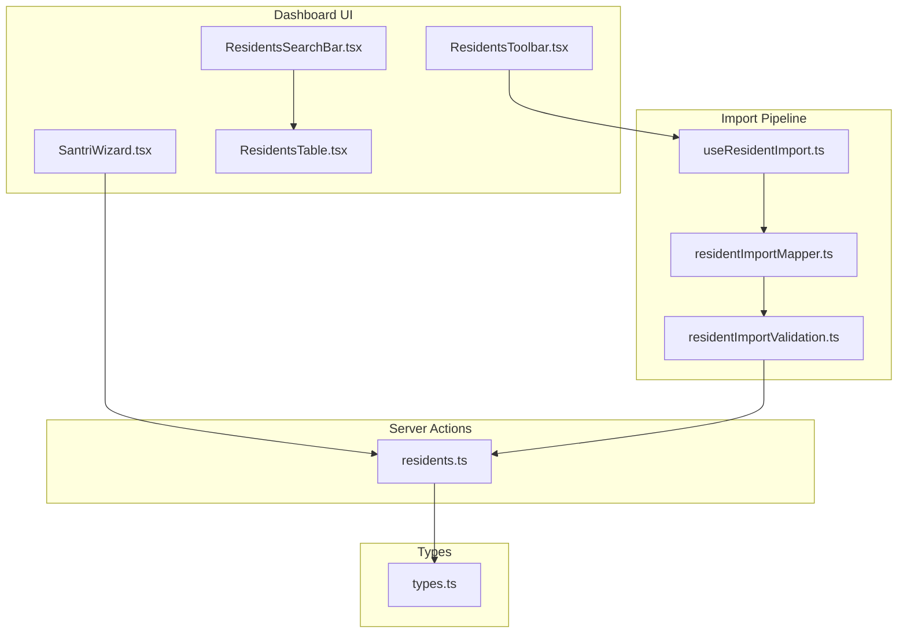
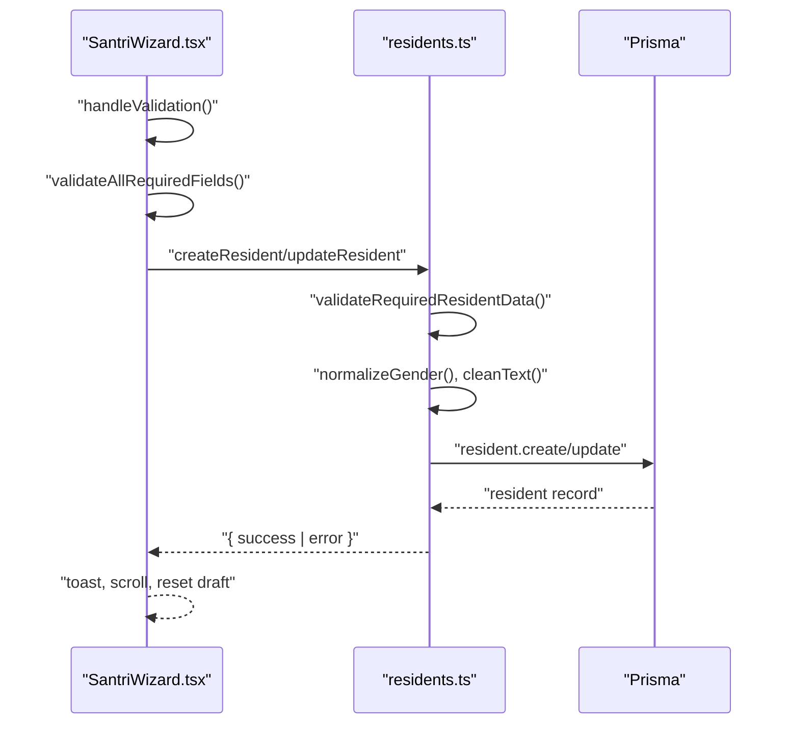
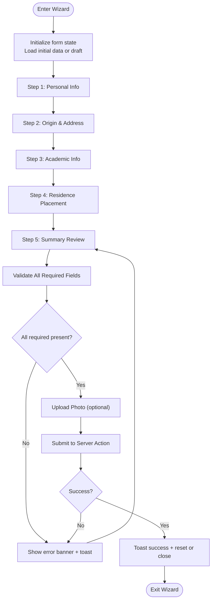
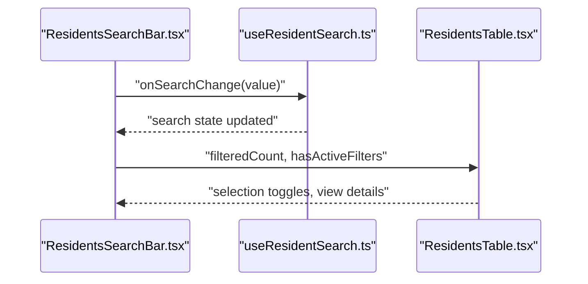
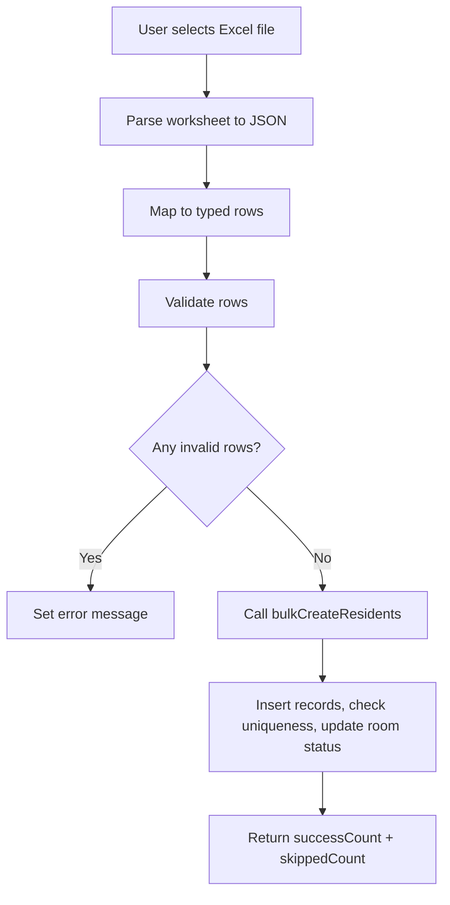
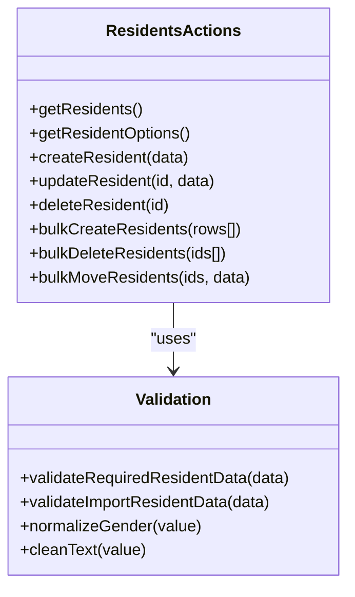
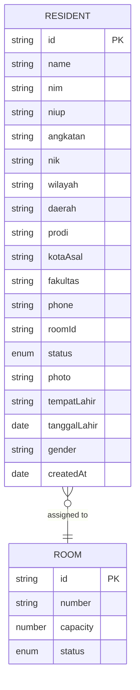
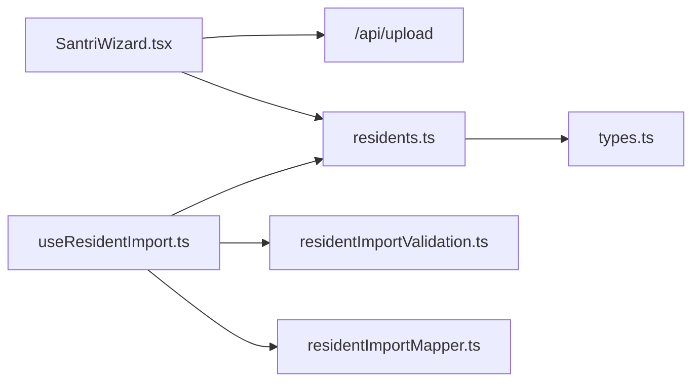

# Form Components & Validation

<cite>
**Referenced Files in This Document**
- [SantriWizard.tsx](file://src/components/dashboard/santri/wizard/SantriWizard.tsx)
- [ResidentsSearchBar.tsx](file://src/components/dashboard/residents/ResidentsSearchBar.tsx)
- [useResidentSearch.ts](file://src/components/dashboard/residents/useResidentSearch.ts)
- [useResidentImport.ts](file://src/components/dashboard/residents/import/useResidentImport.ts)
- [residentImportMapper.ts](file://src/components/dashboard/residents/import/residentImportMapper.ts)
- [residentImportValidation.ts](file://src/components/dashboard/residents/import/residentImportValidation.ts)
- [ResidentsTable.tsx](file://src/components/dashboard/residents/ResidentsTable.tsx)
- [ResidentsToolbar.tsx](file://src/components/dashboard/residents/ResidentsToolbar.tsx)
- [types.ts](file://src/components/dashboard/residents/types.ts)
- [residents.ts](file://src/app/actions/residents.ts)
</cite>

## Table of Contents
1. [Introduction](#introduction)
2. [Project Structure](#project-structure)
3. [Core Components](#core-components)
4. [Architecture Overview](#architecture-overview)
5. [Detailed Component Analysis](#detailed-component-analysis)
6. [Dependency Analysis](#dependency-analysis)
7. [Performance Considerations](#performance-considerations)
8. [Troubleshooting Guide](#troubleshooting-guide)
9. [Conclusion](#conclusion)

## Introduction
This document explains the form components and validation systems used for managing resident records, including a five-step wizard, search and filtering UI, and batch import functionality. It covers step-by-step wizards, conditional field rendering, real-time validation, error handling, form state management, data transformation, server-side validation, accessibility considerations, input sanitization, and user experience optimization.

## Project Structure
The form-related features are organized around:
- Wizard component for creating/editing residents
- Search toolbar and table for browsing residents
- Import pipeline for Excel uploads
- Server actions for validation and persistence

**Diagram sources**
- [SantriWizard.tsx:1-773](file://src/components/dashboard/santri/wizard/SantriWizard.tsx#L1-L773)
- [ResidentsSearchBar.tsx:1-60](file://src/components/dashboard/residents/ResidentsSearchBar.tsx#L1-L60)
- [ResidentsTable.tsx:1-112](file://src/components/dashboard/residents/ResidentsTable.tsx#L1-L112)
- [ResidentsToolbar.tsx:1-102](file://src/components/dashboard/residents/ResidentsToolbar.tsx#L1-L102)
- [useResidentImport.ts:1-66](file://src/components/dashboard/residents/import/useResidentImport.ts#L1-L66)
- [residentImportMapper.ts:1-83](file://src/components/dashboard/residents/import/residentImportMapper.ts#L1-L83)
- [residentImportValidation.ts:1-37](file://src/components/dashboard/residents/import/residentImportValidation.ts#L1-L37)
- [residents.ts:1-666](file://src/app/actions/residents.ts#L1-L666)
- [types.ts:1-46](file://src/components/dashboard/residents/types.ts#L1-L46)

**Section sources**
- [SantriWizard.tsx:1-773](file://src/components/dashboard/santri/wizard/SantriWizard.tsx#L1-L773)
- [ResidentsSearchBar.tsx:1-60](file://src/components/dashboard/residents/ResidentsSearchBar.tsx#L1-L60)
- [ResidentsTable.tsx:1-112](file://src/components/dashboard/residents/ResidentsTable.tsx#L1-L112)
- [ResidentsToolbar.tsx:1-102](file://src/components/dashboard/residents/ResidentsToolbar.tsx#L1-L102)
- [useResidentImport.ts:1-66](file://src/components/dashboard/residents/import/useResidentImport.ts#L1-L66)
- [residentImportMapper.ts:1-83](file://src/components/dashboard/residents/import/residentImportMapper.ts#L1-L83)
- [residentImportValidation.ts:1-37](file://src/components/dashboard/residents/import/residentImportValidation.ts#L1-L37)
- [residents.ts:1-666](file://src/app/actions/residents.ts#L1-L666)
- [types.ts:1-46](file://src/components/dashboard/residents/types.ts#L1-L46)

## Core Components
- Five-step wizard for resident registration/editing with step navigation, conditional rendering, and summary review
- Search bar with filter toggle and reset controls
- Import hook orchestrating Excel parsing, mapping, validation, and bulk creation
- Server actions for sanitization, validation, and persistence
- Types for strongly-typed form data and domain entities

**Section sources**
- [SantriWizard.tsx:35-41](file://src/components/dashboard/santri/wizard/SantriWizard.tsx#L35-L41)
- [ResidentsSearchBar.tsx:3-11](file://src/components/dashboard/residents/ResidentsSearchBar.tsx#L3-L11)
- [useResidentImport.ts:7-65](file://src/components/dashboard/residents/import/useResidentImport.ts#L7-L65)
- [residents.ts:9-51](file://src/app/actions/residents.ts#L9-L51)
- [types.ts:1-46](file://src/components/dashboard/residents/types.ts#L1-L46)

## Architecture Overview
End-to-end flow for wizard submission and import:

**Diagram sources**
- [SantriWizard.tsx:163-267](file://src/components/dashboard/santri/wizard/SantriWizard.tsx#L163-L267)
- [residents.ts:20-51](file://src/app/actions/residents.ts#L20-L51)
- [residents.ts:113-244](file://src/app/actions/residents.ts#L113-L244)

## Detailed Component Analysis

### Wizard: Step-by-Step Forms and Conditional Rendering
- Steps: Personal info, Origin, Academic info, Residence placement, Summary
- State management: Local state for form data, photo file, unsaved changes, exit confirm dialog
- Conditional rendering: Steps render only the current step; dependent selects cascade region choices and academic program/department/term options
- Real-time validation: Step-specific checks on Next; global required fields check on Submit
- Error handling: Toast notifications and banner messages; scroll to top on errors
- Accessibility: Required indicators, keyboard-friendly navigation, labels, and focus styles
- Data transformation: Date normalization, gender normalization, trimming, and optional fields handling

**Diagram sources**
- [SantriWizard.tsx:75-138](file://src/components/dashboard/santri/wizard/SantriWizard.tsx#L75-L138)
- [SantriWizard.tsx:163-185](file://src/components/dashboard/santri/wizard/SantriWizard.tsx#L163-L185)
- [SantriWizard.tsx:199-267](file://src/components/dashboard/santri/wizard/SantriWizard.tsx#L199-L267)

**Section sources**
- [SantriWizard.tsx:35-41](file://src/components/dashboard/santri/wizard/SantriWizard.tsx#L35-L41)
- [SantriWizard.tsx:75-152](file://src/components/dashboard/santri/wizard/SantriWizard.tsx#L75-L152)
- [SantriWizard.tsx:163-185](file://src/components/dashboard/santri/wizard/SantriWizard.tsx#L163-L185)
- [SantriWizard.tsx:199-267](file://src/components/dashboard/santri/wizard/SantriWizard.tsx#L199-L267)

### Search Bar and Results Table
- Search bar exposes controlled props for search term, filter visibility, counts, and callbacks
- Table renders a paginated, sortable dataset with selection support and photo preview
- UX: Clear filter button appears when filters are active; empty state messaging

**Diagram sources**
- [ResidentsSearchBar.tsx:13-21](file://src/components/dashboard/residents/ResidentsSearchBar.tsx#L13-L21)
- [useResidentSearch.ts:3-10](file://src/components/dashboard/residents/useResidentSearch.ts#L3-L10)
- [ResidentsTable.tsx:14-21](file://src/components/dashboard/residents/ResidentsTable.tsx#L14-L21)

**Section sources**
- [ResidentsSearchBar.tsx:3-11](file://src/components/dashboard/residents/ResidentsSearchBar.tsx#L3-L11)
- [useResidentSearch.ts:3-10](file://src/components/dashboard/residents/useResidentSearch.ts#L3-L10)
- [ResidentsTable.tsx:14-21](file://src/components/dashboard/residents/ResidentsTable.tsx#L14-L21)

### Import Functionality: Excel Parsing, Mapping, Validation, and Bulk Creation
- Excel parsing: Uses SheetJS to convert worksheet to JSON
- Column aliasing: Robust column detection supporting multiple aliases and normalization
- Mapping: Transforms rows to typed import rows
- Validation: Ensures presence of required fields; returns user-facing error messages
- Bulk creation: Validates uniqueness and room availability; updates room occupancy; returns counts

**Diagram sources**
- [useResidentImport.ts:13-56](file://src/components/dashboard/residents/import/useResidentImport.ts#L13-L56)
- [residentImportMapper.ts:54-82](file://src/components/dashboard/residents/import/residentImportMapper.ts#L54-L82)
- [residentImportValidation.ts:30-36](file://src/components/dashboard/residents/import/residentImportValidation.ts#L30-L36)
- [residents.ts:477-578](file://src/app/actions/residents.ts#L477-L578)

**Section sources**
- [useResidentImport.ts:7-65](file://src/components/dashboard/residents/import/useResidentImport.ts#L7-L65)
- [residentImportMapper.ts:8-32](file://src/components/dashboard/residents/import/residentImportMapper.ts#L8-L32)
- [residentImportMapper.ts:54-82](file://src/components/dashboard/residents/import/residentImportMapper.ts#L54-L82)
- [residentImportValidation.ts:23-36](file://src/components/dashboard/residents/import/residentImportValidation.ts#L23-L36)
- [residents.ts:477-578](file://src/app/actions/residents.ts#L477-L578)

### Server Actions: Validation, Sanitization, and Persistence
- Sanitization: Trim whitespace, normalize gender variants, coerce dates
- Validation: Required fields, date format, gender values, uniqueness of NIM/NIUP, room capacity/maintenance
- Persistence: Create/update/delete resident, bulk operations, room status transitions, audit logging on edits
- Caching: Path revalidation after mutations

**Diagram sources**
- [residents.ts:76-111](file://src/app/actions/residents.ts#L76-L111)
- [residents.ts:113-244](file://src/app/actions/residents.ts#L113-L244)
- [residents.ts:246-442](file://src/app/actions/residents.ts#L246-L442)
- [residents.ts:444-475](file://src/app/actions/residents.ts#L444-L475)
- [residents.ts:477-578](file://src/app/actions/residents.ts#L477-L578)
- [residents.ts:580-665](file://src/app/actions/residents.ts#L580-L665)
- [residents.ts:9-51](file://src/app/actions/residents.ts#L9-L51)

**Section sources**
- [residents.ts:9-18](file://src/app/actions/residents.ts#L9-L18)
- [residents.ts:20-51](file://src/app/actions/residents.ts#L20-L51)
- [residents.ts:113-244](file://src/app/actions/residents.ts#L113-L244)
- [residents.ts:246-442](file://src/app/actions/residents.ts#L246-L442)
- [residents.ts:477-578](file://src/app/actions/residents.ts#L477-L578)

### Types and Data Contracts
- Strongly-typed resident entity and room structures
- Wizard form data shape and initial data mapping
- Domain enums for statuses

**Diagram sources**
- [types.ts:13-42](file://src/components/dashboard/residents/types.ts#L13-L42)

**Section sources**
- [types.ts:1-46](file://src/components/dashboard/residents/types.ts#L1-L46)

## Dependency Analysis
- Wizard depends on server actions for create/update and on image upload endpoint for photos
- Import pipeline depends on SheetJS and server actions for bulk creation
- UI components depend on shared types and hooks for state and search

**Diagram sources**
- [SantriWizard.tsx:4-6](file://src/components/dashboard/santri/wizard/SantriWizard.tsx#L4-L6)
- [useResidentImport.ts:2-5](file://src/components/dashboard/residents/import/useResidentImport.ts#L2-L5)
- [residentImportMapper.ts:1-6](file://src/components/dashboard/residents/import/residentImportMapper.ts#L1-L6)
- [residentImportValidation.ts:1-6](file://src/components/dashboard/residents/import/residentImportValidation.ts#L1-L6)
- [residents.ts:1-8](file://src/app/actions/residents.ts#L1-L8)
- [types.ts:1-3](file://src/components/dashboard/residents/types.ts#L1-L3)

**Section sources**
- [SantriWizard.tsx:4-6](file://src/components/dashboard/santri/wizard/SantriWizard.tsx#L4-L6)
- [useResidentImport.ts:2-5](file://src/components/dashboard/residents/import/useResidentImport.ts#L2-L5)
- [residentImportMapper.ts:1-6](file://src/components/dashboard/residents/import/residentImportMapper.ts#L1-L6)
- [residentImportValidation.ts:1-6](file://src/components/dashboard/residents/import/residentImportValidation.ts#L1-L6)
- [residents.ts:1-8](file://src/app/actions/residents.ts#L1-L8)
- [types.ts:1-3](file://src/components/dashboard/residents/types.ts#L1-L3)

## Performance Considerations
- UseTransition for long-running submissions to keep UI responsive
- Debounce or throttle search input in higher-level containers if needed
- Batch operations for imports minimize round trips
- Memoize derived options (e.g., filtered programs/years) to avoid recomputation
- Lazy load heavy assets (e.g., images) via optimized components

## Troubleshooting Guide
Common issues and resolutions:
- Validation failures on submit: Ensure required fields are filled and formatted correctly; check date format and gender normalization
- Duplicate NIM/NIUP: Server prevents duplicates; adjust inputs or remove conflicting entries
- Room capacity/maintenance: Ensure target room exists, is available, and not under maintenance
- Import errors: Verify Excel structure, required columns, and data types; check skipped rows count
- Unsaved changes warning: Save or confirm exit to proceed

**Section sources**
- [residents.ts:144-188](file://src/app/actions/residents.ts#L144-L188)
- [residents.ts:278-336](file://src/app/actions/residents.ts#L278-L336)
- [residents.ts:508-525](file://src/app/actions/residents.ts#L508-L525)
- [useResidentImport.ts:31-42](file://src/components/dashboard/residents/import/useResidentImport.ts#L31-L42)

## Conclusion
The form system combines a guided wizard, robust search/filter UI, and a reliable import pipeline. Server actions enforce strong validation and sanitization, while the UI provides immediate feedback and preserves user progress. Together, these components deliver a secure, accessible, and efficient experience for managing resident data.