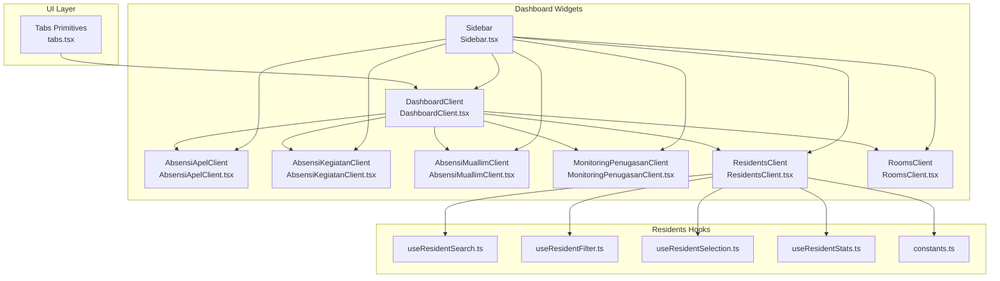
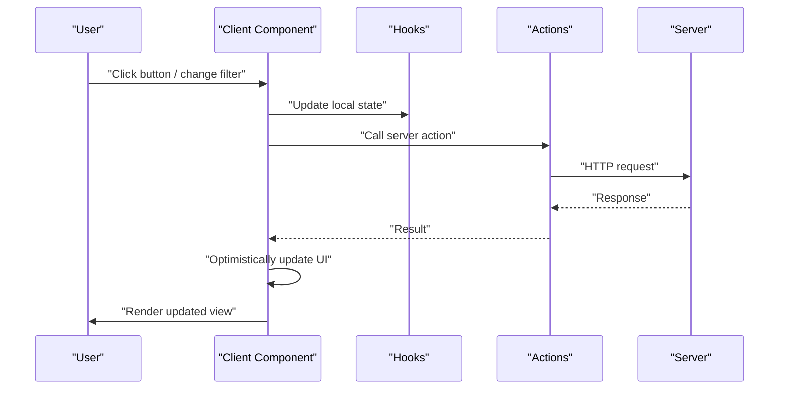
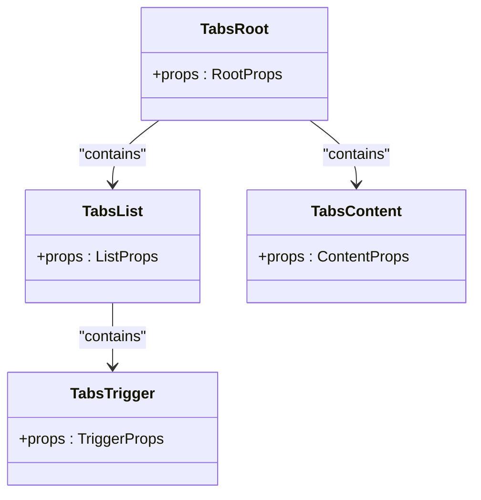
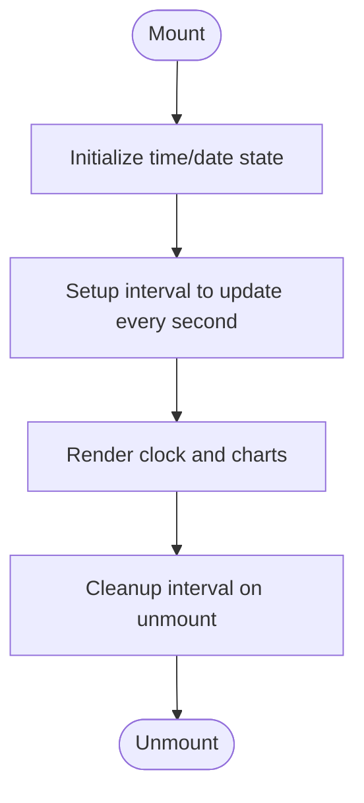
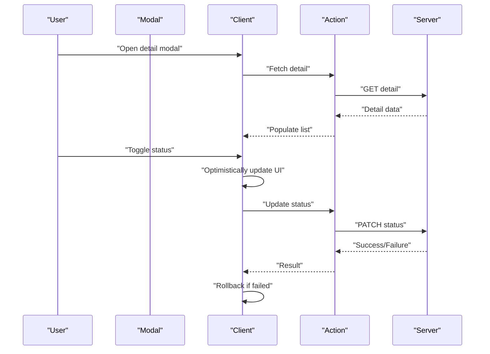
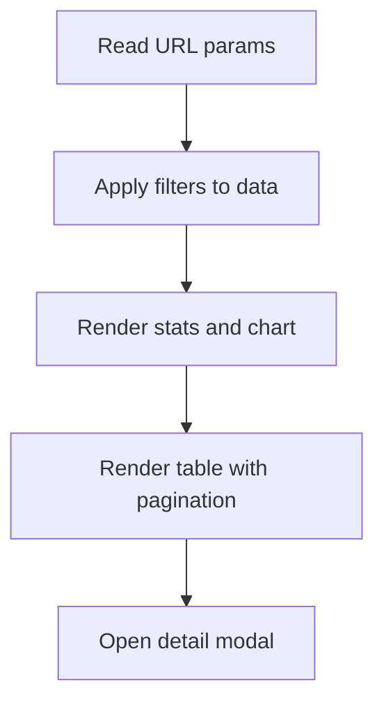
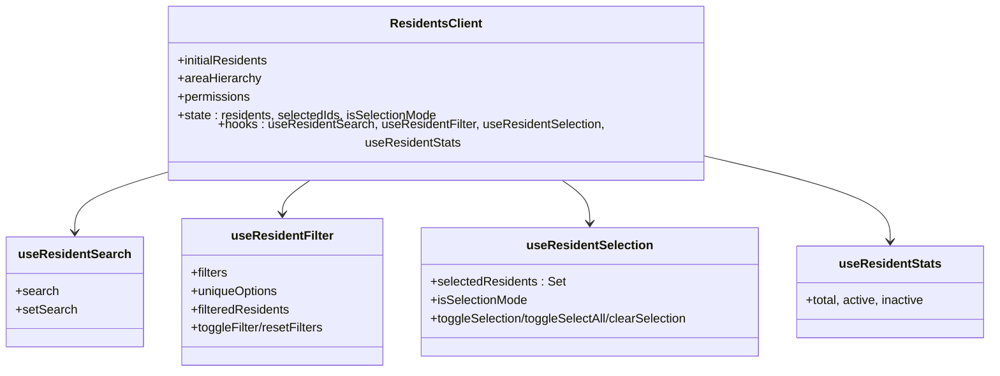
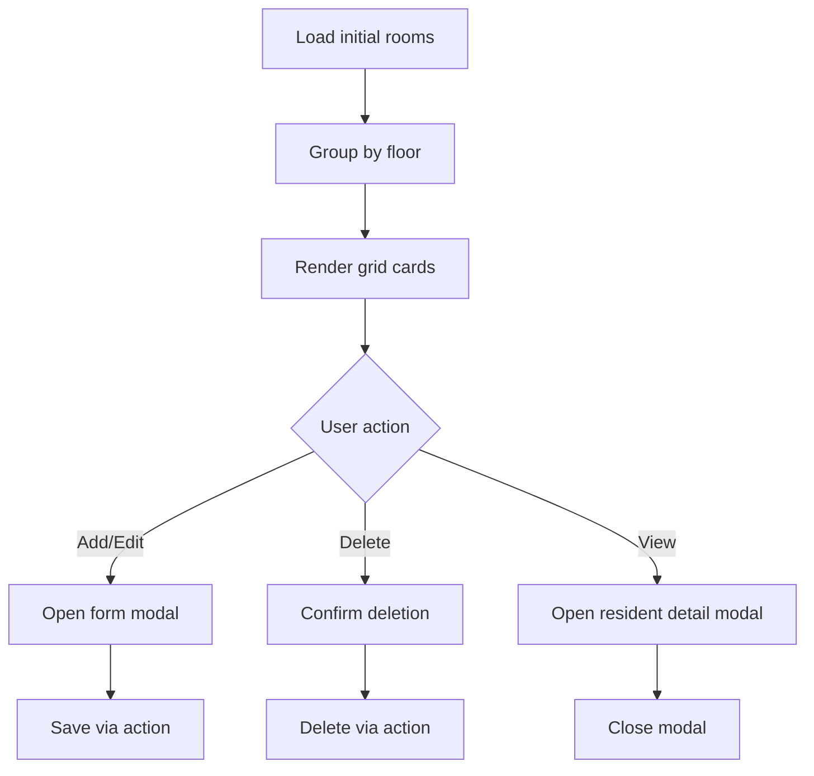
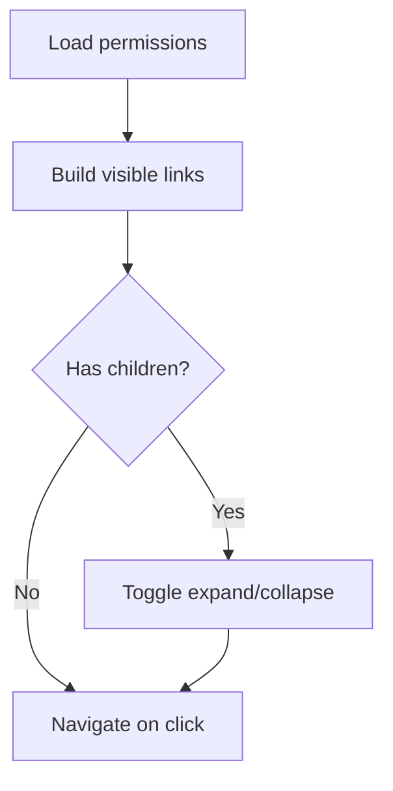
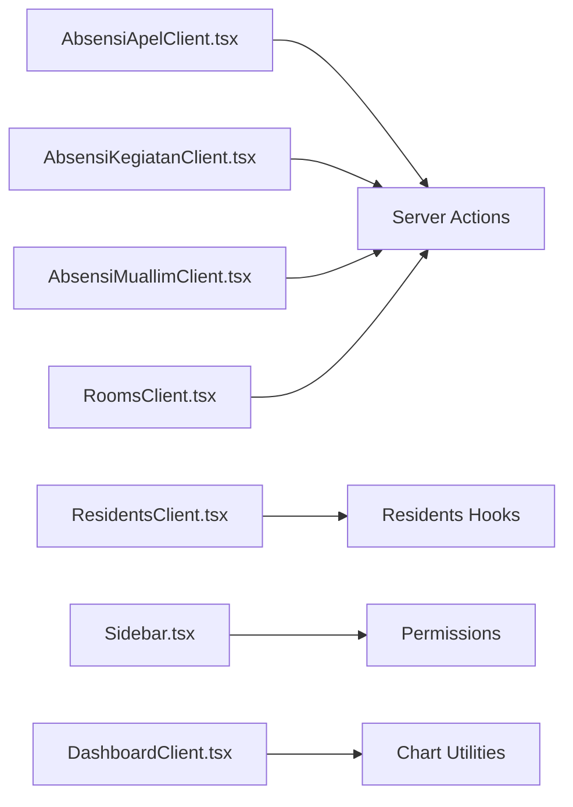

# Interactive & Utility Components

<cite>
**Referenced Files in This Document**
- [tabs.tsx](file://src/components/ui/tabs.tsx)
- [DashboardClient.tsx](file://src/components/dashboard/DashboardClient.tsx)
- [AbsensiApelClient.tsx](file://src/components/dashboard/AbsensiApelClient.tsx)
- [AbsensiKegiatanClient.tsx](file://src/components/dashboard/AbsensiKegiatanClient.tsx)
- [AbsensiMuallimClient.tsx](file://src/components/dashboard/AbsensiMuallimClient.tsx)
- [MonitoringPenugasanClient.tsx](file://src/components/dashboard/MonitoringPenugasanClient.tsx)
- [ResidentsClient.tsx](file://src/components/dashboard/ResidentsClient.tsx)
- [RoomsClient.tsx](file://src/components/dashboard/RoomsClient.tsx)
- [Sidebar.tsx](file://src/components/dashboard/Sidebar.tsx)
- [useResidentSearch.ts](file://src/components/dashboard/residents/useResidentSearch.ts)
- [useResidentFilter.ts](file://src/components/dashboard/residents/useResidentFilter.ts)
- [useResidentSelection.ts](file://src/components/dashboard/residents/useResidentSelection.ts)
- [useResidentStats.ts](file://src/components/dashboard/residents/useResidentStats.ts)
- [constants.ts](file://src/components/dashboard/residents/constants.ts)
</cite>

## Table of Contents
1. [Introduction](#introduction)
2. [Project Structure](#project-structure)
3. [Core Components](#core-components)
4. [Architecture Overview](#architecture-overview)
5. [Detailed Component Analysis](#detailed-component-analysis)
6. [Dependency Analysis](#dependency-analysis)
7. [Performance Considerations](#performance-considerations)
8. [Troubleshooting Guide](#troubleshooting-guide)
9. [Conclusion](#conclusion)

## Introduction
This document focuses on interactive and utility components within the dashboard ecosystem, covering tab systems, client-side data handlers, monitoring displays, and dashboard widgets. It explains component lifecycle, state management, real-time updates, and user interaction patterns. It also covers event handling, data fetching strategies, component composition patterns, performance optimization, memory management, and integration with the broader dashboard ecosystem.

## Project Structure
The interactive components are primarily located under:
- `src/components/ui/tabs.tsx`: Reusable tab primitives
- `src/components/dashboard/`: Dashboard-specific interactive widgets and clients
- `src/components/dashboard/residents/`: Composable hooks for residents management

**Diagram sources**
- [tabs.tsx:1-55](file://src/components/ui/tabs.tsx#L1-L55)
- [DashboardClient.tsx:1-402](file://src/components/dashboard/DashboardClient.tsx#L1-L402)
- [AbsensiApelClient.tsx:1-657](file://src/components/dashboard/AbsensiApelClient.tsx#L1-L657)
- [AbsensiKegiatanClient.tsx:1-756](file://src/components/dashboard/AbsensiKegiatanClient.tsx#L1-L756)
- [AbsensiMuallimClient.tsx:1-439](file://src/components/dashboard/AbsensiMuallimClient.tsx#L1-L439)
- [MonitoringPenugasanClient.tsx:1-540](file://src/components/dashboard/MonitoringPenugasanClient.tsx#L1-L540)
- [ResidentsClient.tsx:1-327](file://src/components/dashboard/ResidentsClient.tsx#L1-L327)
- [RoomsClient.tsx:1-433](file://src/components/dashboard/RoomsClient.tsx#L1-L433)
- [Sidebar.tsx:1-404](file://src/components/dashboard/Sidebar.tsx#L1-L404)
- [useResidentSearch.ts:1-11](file://src/components/dashboard/residents/useResidentSearch.ts#L1-L11)
- [useResidentFilter.ts:1-73](file://src/components/dashboard/residents/useResidentFilter.ts#L1-L73)
- [useResidentSelection.ts:1-57](file://src/components/dashboard/residents/useResidentSelection.ts#L1-L57)
- [useResidentStats.ts:1-15](file://src/components/dashboard/residents/useResidentStats.ts#L1-L15)
- [constants.ts:1-41](file://src/components/dashboard/residents/constants.ts#L1-L41)

**Section sources**
- [tabs.tsx:1-55](file://src/components/ui/tabs.tsx#L1-L55)
- [DashboardClient.tsx:1-402](file://src/components/dashboard/DashboardClient.tsx#L1-L402)
- [ResidentsClient.tsx:1-327](file://src/components/dashboard/ResidentsClient.tsx#L1-L327)

## Core Components
- Tab system: A reusable, accessible tab primitive built on Radix UI for consistent tabbed experiences across pages.
- Dashboard widget: A real-time clock and analytics dashboard with SVG charts, recent activity feed, and quick action shortcuts.
- Absensi widgets: Three specialized clients for managing attendance records with modal dialogs, optimistic updates, and batch operations.
- Monitoring widget: A filtering and visualization client for assignment monitoring with SVG donut charts and pagination.
- Residents manager: A comprehensive client with advanced filters, selection modes, bulk operations, and wizard-driven forms.
- Rooms manager: A room catalog with floor grouping, status indicators, and CSV export.
- Sidebar navigation: A dynamic sidebar with collapsible menus, permission-aware visibility, and active-state highlighting.

**Section sources**
- [tabs.tsx:1-55](file://src/components/ui/tabs.tsx#L1-L55)
- [DashboardClient.tsx:1-402](file://src/components/dashboard/DashboardClient.tsx#L1-L402)
- [AbsensiApelClient.tsx:1-657](file://src/components/dashboard/AbsensiApelClient.tsx#L1-L657)
- [AbsensiKegiatanClient.tsx:1-756](file://src/components/dashboard/AbsensiKegiatanClient.tsx#L1-L756)
- [AbsensiMuallimClient.tsx:1-439](file://src/components/dashboard/AbsensiMuallimClient.tsx#L1-L439)
- [MonitoringPenugasanClient.tsx:1-540](file://src/components/dashboard/MonitoringPenugasanClient.tsx#L1-L540)
- [ResidentsClient.tsx:1-327](file://src/components/dashboard/ResidentsClient.tsx#L1-L327)
- [RoomsClient.tsx:1-433](file://src/components/dashboard/RoomsClient.tsx#L1-L433)
- [Sidebar.tsx:1-404](file://src/components/dashboard/Sidebar.tsx#L1-L404)

## Architecture Overview
The interactive components follow a consistent pattern:
- Client-side state via React hooks
- Optimistic UI updates with rollback on failure
- Modal-based CRUD flows
- Export/print utilities
- Permission-aware navigation and visibility
- Composable hooks for filtering, selection, and statistics

**Diagram sources**
- [AbsensiApelClient.tsx:300-328](file://src/components/dashboard/AbsensiApelClient.tsx#L300-L328)
- [AbsensiKegiatanClient.tsx:331-359](file://src/components/dashboard/AbsensiKegiatanClient.tsx#L331-L359)
- [AbsensiMuallimClient.tsx:73-93](file://src/components/dashboard/AbsensiMuallimClient.tsx#L73-L93)
- [ResidentsClient.tsx:77-110](file://src/components/dashboard/ResidentsClient.tsx#L77-L110)

## Detailed Component Analysis

### Tab System (Reusable UI Primitive)
The tab system provides accessible, styled tab lists and triggers backed by Radix UI. It encapsulates styling and accessibility while delegating behavior to the framework primitives.

**Diagram sources**
- [tabs.tsx:7-54](file://src/components/ui/tabs.tsx#L7-L54)

**Section sources**
- [tabs.tsx:1-55](file://src/components/ui/tabs.tsx#L1-L55)

### Dashboard Widget (Real-time Analytics)
The dashboard widget renders:
- Real-time clock and Hijri date banner
- Summary cards for key metrics
- SVG donut and bar charts
- Recent activity feed with time-ago formatting
- Quick action shortcuts

Lifecycle and state:
- Uses `useState` for time/date and effect for periodic updates
- Calculates SVG chart metrics from props
- Formats timestamps for human-readable relative time

**Diagram sources**
- [DashboardClient.tsx:34-73](file://src/components/dashboard/DashboardClient.tsx#L34-L73)

**Section sources**
- [DashboardClient.tsx:1-402](file://src/components/dashboard/DashboardClient.tsx#L1-L402)

### Attendance Clients (Modal-driven CRUD)
Each attendance client manages a collection with:
- Filtering by date range and keyword
- Modal dialogs for create/edit/detail
- Optimistic status toggles with rollback
- Batch export/print capabilities

Patterns:
- Local state for filters and modals
- Optimistic UI updates followed by server calls
- Rollback on error to maintain consistency
- Export/print via external libraries

**Diagram sources**
- [AbsensiApelClient.tsx:272-287](file://src/components/dashboard/AbsensiApelClient.tsx#L272-L287)
- [AbsensiApelClient.tsx:301-328](file://src/components/dashboard/AbsensiApelClient.tsx#L301-L328)
- [AbsensiKegiatanClient.tsx:301-317](file://src/components/dashboard/AbsensiKegiatanClient.tsx#L301-L317)
- [AbsensiKegiatanClient.tsx:331-359](file://src/components/dashboard/AbsensiKegiatanClient.tsx#L331-L359)
- [AbsensiMuallimClient.tsx:73-93](file://src/components/dashboard/AbsensiMuallimClient.tsx#L73-L93)

**Section sources**
- [AbsensiApelClient.tsx:1-657](file://src/components/dashboard/AbsensiApelClient.tsx#L1-L657)
- [AbsensiKegiatanClient.tsx:1-756](file://src/components/dashboard/AbsensiKegiatanClient.tsx#L1-L756)
- [AbsensiMuallimClient.tsx:1-439](file://src/components/dashboard/AbsensiMuallimClient.tsx#L1-L439)

### Monitoring Widget (Filtering & Visualization)
The monitoring client:
- Applies URL-searchParam-based filters
- Renders summary cards and a donut chart
- Displays paginated data tables
- Integrates a detail modal for deeper inspection

**Diagram sources**
- [MonitoringPenugasanClient.tsx:56-75](file://src/components/dashboard/MonitoringPenugasanClient.tsx#L56-L75)
- [MonitoringPenugasanClient.tsx:434-527](file://src/components/dashboard/MonitoringPenugasanClient.tsx#L434-L527)

**Section sources**
- [MonitoringPenugasanClient.tsx:1-540](file://src/components/dashboard/MonitoringPenugasanClient.tsx#L1-L540)

### Residents Manager (Advanced Filtering & Selection)
The residents client composes multiple hooks:
- Search: simple text input state
- Filter: multi-dimensional filters with unique option derivation
- Selection: toggle/select-all/clear with Set-based state
- Stats: computed counts from resident array

**Diagram sources**
- [ResidentsClient.tsx:21-35](file://src/components/dashboard/ResidentsClient.tsx#L21-L35)
- [useResidentSearch.ts:1-11](file://src/components/dashboard/residents/useResidentSearch.ts#L1-L11)
- [useResidentFilter.ts:1-73](file://src/components/dashboard/residents/useResidentFilter.ts#L1-L73)
- [useResidentSelection.ts:1-57](file://src/components/dashboard/residents/useResidentSelection.ts#L1-L57)
- [useResidentStats.ts:1-15](file://src/components/dashboard/residents/useResidentStats.ts#L1-L15)

**Section sources**
- [ResidentsClient.tsx:1-327](file://src/components/dashboard/ResidentsClient.tsx#L1-L327)
- [useResidentSearch.ts:1-11](file://src/components/dashboard/residents/useResidentSearch.ts#L1-L11)
- [useResidentFilter.ts:1-73](file://src/components/dashboard/residents/useResidentFilter.ts#L1-L73)
- [useResidentSelection.ts:1-57](file://src/components/dashboard/residents/useResidentSelection.ts#L1-L57)
- [useResidentStats.ts:1-15](file://src/components/dashboard/residents/useResidentStats.ts#L1-L15)
- [constants.ts:1-41](file://src/components/dashboard/residents/constants.ts#L1-L41)

### Rooms Manager (Catalog & Status)
The rooms client:
- Groups rooms by floor
- Provides add/edit/delete flows via modal
- Exports CSV with UTF-8 BOM for Excel compatibility
- Shows resident details in a modal

**Diagram sources**
- [RoomsClient.tsx:23-57](file://src/components/dashboard/RoomsClient.tsx#L23-L57)
- [RoomsClient.tsx:59-121](file://src/components/dashboard/RoomsClient.tsx#L59-L121)
- [RoomsClient.tsx:123-144](file://src/components/dashboard/RoomsClient.tsx#L123-L144)

**Section sources**
- [RoomsClient.tsx:1-433](file://src/components/dashboard/RoomsClient.tsx#L1-L433)

### Sidebar Navigation (Permission-aware)
The sidebar dynamically builds menu entries based on user permissions, supports collapsible dropdowns, and highlights active routes.

**Diagram sources**
- [Sidebar.tsx:223-236](file://src/components/dashboard/Sidebar.tsx#L223-L236)
- [Sidebar.tsx:53-106](file://src/components/dashboard/Sidebar.tsx#L53-L106)
- [Sidebar.tsx:110-163](file://src/components/dashboard/Sidebar.tsx#L110-L163)
- [Sidebar.tsx:165-221](file://src/components/dashboard/Sidebar.tsx#L165-L221)

**Section sources**
- [Sidebar.tsx:1-404](file://src/components/dashboard/Sidebar.tsx#L1-L404)

## Dependency Analysis
- Components depend on shared hooks for filtering, selection, and statistics to reduce duplication and improve consistency.
- Modal flows share common patterns across attendance clients and residents/rooms managers.
- Export/print utilities are centralized in individual components with minimal cross-dependencies.
- Sidebar depends on permissions to conditionally render menu items.

**Diagram sources**
- [AbsensiApelClient.tsx:1-657](file://src/components/dashboard/AbsensiApelClient.tsx#L1-L657)
- [AbsensiKegiatanClient.tsx:1-756](file://src/components/dashboard/AbsensiKegiatanClient.tsx#L1-L756)
- [AbsensiMuallimClient.tsx:1-439](file://src/components/dashboard/AbsensiMuallimClient.tsx#L1-L439)
- [ResidentsClient.tsx:1-327](file://src/components/dashboard/ResidentsClient.tsx#L1-L327)
- [RoomsClient.tsx:1-433](file://src/components/dashboard/RoomsClient.tsx#L1-L433)
- [Sidebar.tsx:1-404](file://src/components/dashboard/Sidebar.tsx#L1-L404)
- [DashboardClient.tsx:1-402](file://src/components/dashboard/DashboardClient.tsx#L1-L402)

**Section sources**
- [ResidentsClient.tsx:1-327](file://src/components/dashboard/ResidentsClient.tsx#L1-L327)
- [Sidebar.tsx:1-404](file://src/components/dashboard/Sidebar.tsx#L1-L404)

## Performance Considerations
- Optimize rendering by:
  - Using memoized computations for chart metrics and derived data
  - Limiting re-renders with local state and controlled modals
  - Debouncing heavy filters where appropriate
- Memory management:
  - Clear intervals and timers on unmount
  - Avoid retaining large datasets in state; derive on demand
- UX responsiveness:
  - Use optimistic updates with rollback for immediate feedback
  - Defer heavy operations (exports/print) to background threads
- Accessibility:
  - Ensure keyboard navigation and screen reader support in tab components
  - Provide clear focus states and ARIA attributes in modals and dropdowns

## Troubleshooting Guide
Common issues and resolutions:
- Modal not closing after save:
  - Verify state transitions and ensure the modal flag is reset after successful action
- Optimistic update rollback not working:
  - Confirm error handling path reverts state and that server errors are surfaced
- Export/print failing silently:
  - Check browser console for blocked pop-ups or unsupported APIs
- Sidebar menu missing entries:
  - Validate permission flags and ensure they are passed to the sidebar component
- Chart not updating:
  - Ensure props are updated and state reflects new metrics

**Section sources**
- [AbsensiApelClient.tsx:310-318](file://src/components/dashboard/AbsensiApelClient.tsx#L310-L318)
- [AbsensiKegiatanClient.tsx:341-349](file://src/components/dashboard/AbsensiKegiatanClient.tsx#L341-L349)
- [RoomsClient.tsx:113-121](file://src/components/dashboard/RoomsClient.tsx#L113-L121)
- [Sidebar.tsx:223-236](file://src/components/dashboard/Sidebar.tsx#L223-L236)
- [DashboardClient.tsx:90-102](file://src/components/dashboard/DashboardClient.tsx#L90-L102)

## Conclusion
The interactive and utility components form a cohesive dashboard ecosystem emphasizing:
- Consistent, accessible UI primitives
- Client-side state management with optimistic updates
- Modular, composable hooks for filtering and selection
- Real-time displays with efficient rendering
- Permission-aware navigation and robust error handling

These patterns enable scalable development, improved user experience, and maintainable code across the dashboard.