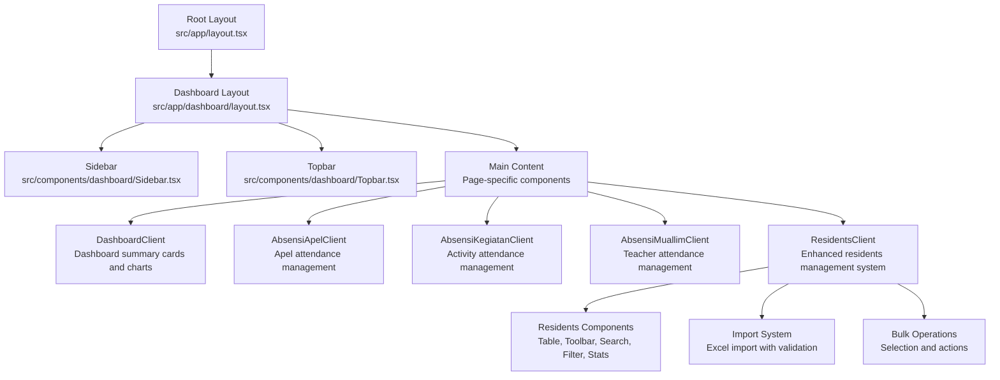
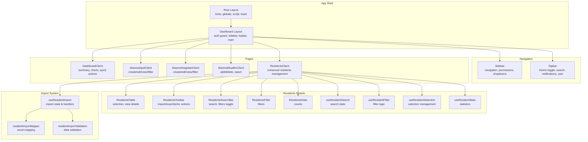
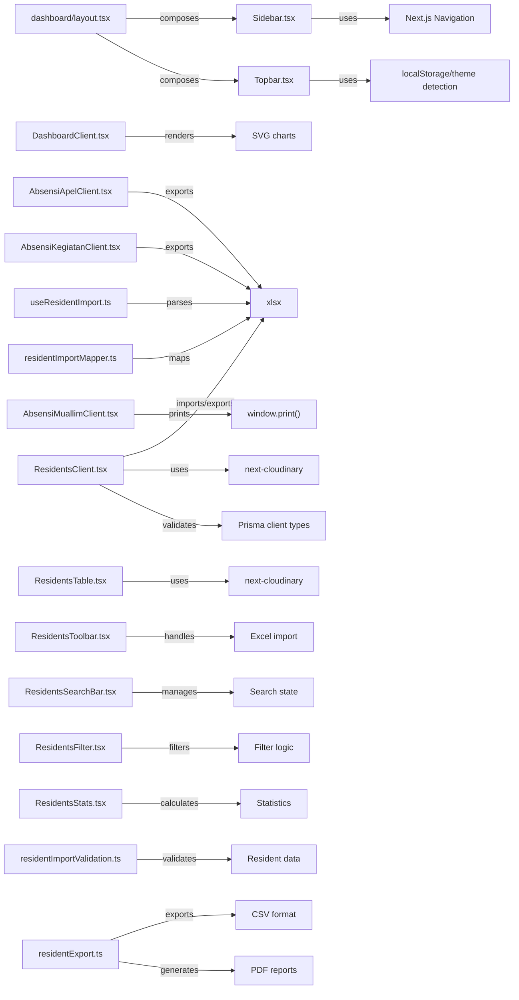

# UI Components & Dashboard

<cite>
**Referenced Files in This Document**
- [layout.tsx](file://src/app/layout.tsx)
- [globals.css](file://src/app/globals.css)
- [dashboard/layout.tsx](file://src/app/dashboard/layout.tsx)
- [Sidebar.tsx](file://src/components/dashboard/Sidebar.tsx)
- [Topbar.tsx](file://src/components/dashboard/Topbar.tsx)
- [DashboardClient.tsx](file://src/components/dashboard/DashboardClient.tsx)
- [AbsensiApelClient.tsx](file://src/components/dashboard/AbsensiApelClient.tsx)
- [AbsensiKegiatanClient.tsx](file://src/components/dashboard/AbsensiKegiatanClient.tsx)
- [AbsensiMuallimClient.tsx](file://src/components/dashboard/AbsensiMuallimClient.tsx)
- [ResidentsClient.tsx](file://src/components/dashboard/ResidentsClient.tsx)
- [ResidentsTable.tsx](file://src/components/dashboard/residents/ResidentsTable.tsx)
- [ResidentsToolbar.tsx](file://src/components/dashboard/residents/ResidentsToolbar.tsx)
- [ResidentsSearchBar.tsx](file://src/components/dashboard/residents/ResidentsSearchBar.tsx)
- [ResidentsFilter.tsx](file://src/components/dashboard/residents/ResidentsFilter.tsx)
- [ResidentsStats.tsx](file://src/components/dashboard/residents/ResidentsStats.tsx)
- [types.ts](file://src/components/dashboard/residents/types.ts)
- [constants.ts](file://src/components/dashboard/residents/constants.ts)
- [useResidentSearch.ts](file://src/components/dashboard/residents/useResidentSearch.ts)
- [useResidentFilter.ts](file://src/components/dashboard/residents/useResidentFilter.ts)
- [useResidentSelection.ts](file://src/components/dashboard/residents/useResidentSelection.ts)
- [useResidentStats.ts](file://src/components/dashboard/residents/useResidentStats.ts)
- [useResidentImport.ts](file://src/components/dashboard/residents/import/useResidentImport.ts)
- [residentImportMapper.ts](file://src/components/dashboard/residents/import/residentImportMapper.ts)
- [residentImportValidation.ts](file://src/components/dashboard/residents/import/residentImportValidation.ts)
- [residentExport.ts](file://src/utils/residentExport.ts)
</cite>

## Update Summary
**Changes Made**
- Enhanced residents dashboard architecture with modular component structure
- Added comprehensive import system with validation and mapping capabilities
- Implemented advanced filtering and search functionality
- Introduced selection management and bulk operation capabilities
- Added statistics dashboard with real-time metrics
- Enhanced modal systems for detailed views and bulk operations

## Table of Contents
1. [Introduction](#introduction)
2. [Project Structure](#project-structure)
3. [Core Components](#core-components)
4. [Architecture Overview](#architecture-overview)
5. [Detailed Component Analysis](#detailed-component-analysis)
6. [Modular Residents System](#modular-residents-system)
7. [Import and Export System](#import-and-export-system)
8. [Dependency Analysis](#dependency-analysis)
9. [Performance Considerations](#performance-considerations)
10. [Accessibility Compliance](#accessibility-compliance)
11. [Cross-Browser Compatibility](#cross-browser-compatibility)
12. [Troubleshooting Guide](#troubleshooting-guide)
13. [Conclusion](#conclusion)

## Introduction
This document describes the user interface components and dashboard system of the dormitory management application. It covers the component architecture, reusable UI elements, dashboard layouts, sidebar navigation, topbar functionality, and responsive design patterns. The system now features an enhanced modular approach to residents management with comprehensive import/export capabilities, advanced filtering, and bulk operation support. It details form components, data display components, modal systems, and interactive elements, including component props, customization options, integration patterns, accessibility compliance, performance optimization, and cross-browser compatibility.

## Project Structure
The UI is built with Next.js App Router, using a shared dashboard layout that composes a persistent sidebar and topbar with page-specific content. The residents management system follows a modular architecture with dedicated components for search, filtering, selection, and data display. Global styles define theme tokens and variants, while individual components encapsulate presentation and behavior for dashboards, forms, and data grids.

**Diagram sources**
- [layout.tsx:1-42](file://src/app/layout.tsx#L1-L42)
- [dashboard/layout.tsx:1-37](file://src/app/dashboard/layout.tsx#L1-L37)
- [Sidebar.tsx:1-404](file://src/components/dashboard/Sidebar.tsx#L1-L404)
- [Topbar.tsx:1-96](file://src/components/dashboard/Topbar.tsx#L1-L96)
- [DashboardClient.tsx:1-402](file://src/components/dashboard/DashboardClient.tsx#L1-L402)
- [AbsensiApelClient.tsx:1-657](file://src/components/dashboard/AbsensiApelClient.tsx#L1-L657)
- [AbsensiKegiatanClient.tsx:1-756](file://src/components/dashboard/AbsensiKegiatanClient.tsx#L1-L756)
- [AbsensiMuallimClient.tsx:1-439](file://src/components/dashboard/AbsensiMuallimClient.tsx#L1-L439)
- [ResidentsClient.tsx:1-327](file://src/components/dashboard/ResidentsClient.tsx#L1-L327)

**Section sources**
- [layout.tsx:1-42](file://src/app/layout.tsx#L1-L42)
- [globals.css:1-41](file://src/app/globals.css#L1-L41)
- [dashboard/layout.tsx:1-37](file://src/app/dashboard/layout.tsx#L1-L37)

## Core Components
- Dashboard layout: Provides a two-pane layout with a fixed sidebar and a scrollable main content area, integrating the topbar and page content.
- Sidebar: Renders hierarchical navigation with collapsible dropdowns, permission-aware visibility, and active-state highlighting.
- Topbar: Implements responsive header with theme toggle, search input, notifications, and user profile.
- DashboardClient: Presents summary statistics, real-time clock, occupancy visuals, and quick action shortcuts.
- Attendance clients: Manage creation, editing, filtering, and bulk operations for apel, activity, and teacher attendance.
- ResidentsClient: Enhanced residents management system with modular components for search, filtering, selection, and data display.
- Import system: Comprehensive Excel import functionality with validation, mapping, and error handling.
- Bulk operations: Selection management and bulk actions for residents data.

**Section sources**
- [dashboard/layout.tsx:1-37](file://src/app/dashboard/layout.tsx#L1-L37)
- [Sidebar.tsx:1-404](file://src/components/dashboard/Sidebar.tsx#L1-L404)
- [Topbar.tsx:1-96](file://src/components/dashboard/Topbar.tsx#L1-L96)
- [DashboardClient.tsx:1-402](file://src/components/dashboard/DashboardClient.tsx#L1-L402)
- [AbsensiApelClient.tsx:1-657](file://src/components/dashboard/AbsensiApelClient.tsx#L1-L657)
- [AbsensiKegiatanClient.tsx:1-756](file://src/components/dashboard/AbsensiKegiatanClient.tsx#L1-L756)
- [AbsensiMuallimClient.tsx:1-439](file://src/components/dashboard/AbsensiMuallimClient.tsx#L1-L439)
- [ResidentsClient.tsx:1-327](file://src/components/dashboard/ResidentsClient.tsx#L1-L327)

## Architecture Overview
The dashboard architecture follows a composition pattern with enhanced modular design:
- Root layout initializes fonts, global CSS, theme script, and toast provider.
- Dashboard layout enforces authentication, renders sidebar and topbar, and hosts page content.
- Page components import and render domain-specific clients and UI modules.
- Residents system uses a modular approach with dedicated hooks for search, filter, selection, and stats.
- Import system provides comprehensive Excel processing with validation and error handling.

**Diagram sources**
- [layout.tsx:1-42](file://src/app/layout.tsx#L1-L42)
- [dashboard/layout.tsx:1-37](file://src/app/dashboard/layout.tsx#L1-L37)
- [Sidebar.tsx:1-404](file://src/components/dashboard/Sidebar.tsx#L1-L404)
- [Topbar.tsx:1-96](file://src/components/dashboard/Topbar.tsx#L1-L96)
- [DashboardClient.tsx:1-402](file://src/components/dashboard/DashboardClient.tsx#L1-L402)
- [AbsensiApelClient.tsx:1-657](file://src/components/dashboard/AbsensiApelClient.tsx#L1-L657)
- [AbsensiKegiatanClient.tsx:1-756](file://src/components/dashboard/AbsensiKegiatanClient.tsx#L1-L756)
- [AbsensiMuallimClient.tsx:1-439](file://src/components/dashboard/AbsensiMuallimClient.tsx#L1-L439)
- [ResidentsClient.tsx:1-327](file://src/components/dashboard/ResidentsClient.tsx#L1-L327)
- [ResidentsTable.tsx:1-112](file://src/components/dashboard/residents/ResidentsTable.tsx#L1-L112)
- [ResidentsToolbar.tsx:1-102](file://src/components/dashboard/residents/ResidentsToolbar.tsx#L1-L102)
- [ResidentsSearchBar.tsx:1-60](file://src/components/dashboard/residents/ResidentsSearchBar.tsx#L1-L60)
- [ResidentsFilter.tsx:1-72](file://src/components/dashboard/residents/ResidentsFilter.tsx#L1-L72)
- [ResidentsStats.tsx:1-57](file://src/components/dashboard/residents/ResidentsStats.tsx#L1-L57)
- [useResidentSearch.ts:1-11](file://src/components/dashboard/residents/useResidentSearch.ts#L1-L11)
- [useResidentFilter.ts:1-73](file://src/components/dashboard/residents/useResidentFilter.ts#L1-L73)
- [useResidentSelection.ts:1-57](file://src/components/dashboard/residents/useResidentSelection.ts#L1-L57)
- [useResidentStats.ts:1-15](file://src/components/dashboard/residents/useResidentStats.ts#L1-L15)
- [useResidentImport.ts:1-66](file://src/components/dashboard/residents/import/useResidentImport.ts#L1-L66)
- [residentImportMapper.ts:1-83](file://src/components/dashboard/residents/import/residentImportMapper.ts#L1-L83)
- [residentImportValidation.ts:1-37](file://src/components/dashboard/residents/import/residentImportValidation.ts#L1-L37)

## Detailed Component Analysis

### Sidebar Navigation
The sidebar renders permission-aware navigation with collapsible groups and active-state indicators. It supports:
- Conditional rendering based on user permissions.
- Collapsible dropdowns for nested menus (e.g., Data Master, Unit Penugasan, Absensi, Referensi).
- Active link highlighting matching the current route.
- Sign out integration via NextAuth.

Key behaviors:
- Uses pathname to compute active states.
- Maintains local state for expanded dropdowns.
- Applies Tailwind utility classes for consistent spacing, borders, and transitions.

Customization options:
- Add/remove menu items by extending the permission checks and link arrays.
- Adjust icons and labels per feature.
- Control grouping and ordering by modifying the render order.

**Section sources**
- [Sidebar.tsx:1-404](file://src/components/dashboard/Sidebar.tsx#L1-L404)
- [dashboard/layout.tsx:1-37](file://src/app/dashboard/layout.tsx#L1-L37)

### Topbar Functionality
The topbar provides:
- Responsive mobile menu trigger.
- Search input with icon.
- Theme toggle synchronized with localStorage and prefers-color-scheme.
- Notification badge.
- User profile area with role and avatar.

Implementation highlights:
- Hydration-safe theme toggle using a sync store hook.
- Local storage persistence for theme preference.
- Glass effect and backdrop blur for modern overlay styling.

Customization options:
- Extend user menu with additional actions.
- Add notification panel or quick actions.
- Integrate real-time notification updates.

**Section sources**
- [Topbar.tsx:1-96](file://src/components/dashboard/Topbar.tsx#L1-L96)
- [globals.css:1-41](file://src/app/globals.css#L1-L41)

### DashboardClient
DashboardClient presents:
- Real-time clock and Hijri date banner.
- Summary cards for key metrics.
- SVG-based donut chart for room occupancy.
- Bar chart for per-floor occupancy.
- Recent activity feed with time-ago formatting.
- Quick action shortcuts.

Interactive elements:
- Live updating clock and dates.
- Hover tooltips on bar chart bars.
- Link navigation to resident directory.

Customization options:
- Modify metric shapes and thresholds.
- Replace or extend chart visuals.
- Add new quick actions or integrate external widgets.

**Section sources**
- [DashboardClient.tsx:1-402](file://src/components/dashboard/DashboardClient.tsx#L1-L402)

### AbsensiApelClient
AbsensiApelClient manages:
- Creation of apel sessions with automatic registration of active residents.
- Editing of apel date and notes.
- Filtering by date range.
- Detail modal with checklist-style status toggling.
- Export to Excel and print to PDF.

Modal system:
- Create modal with validation and optimistic updates.
- Edit modal with controlled inputs.
- Detail modal with search and batch status cycling.

Customization options:
- Add new status values or modify status cycle.
- Extend export formats or add new report templates.
- Integrate comments or attachments per attendance item.

**Section sources**
- [AbsensiApelClient.tsx:1-657](file://src/components/dashboard/AbsensiApelClient.tsx#L1-L657)

### AbsensiKegiatanClient
AbsensiKegiatanClient manages:
- Creation of activity sessions with predefined KBM options.
- Editing of activity details.
- Multi-criteria filtering (name dropdown, free text, date range).
- Detail modal with searchable checklist and multi-state status cycling.
- Export to Excel and print to PDF.

Modal system:
- Create modal with select-based KBM assignment.
- Edit modal mirroring create form.
- Detail modal with advanced search and status badges.

Customization options:
- Add new activity types or statuses.
- Extend filters or add new metadata.
- Customize report generation and export formats.

**Section sources**
- [AbsensiKegiatanClient.tsx:1-756](file://src/components/dashboard/AbsensiKegiatanClient.tsx#L1-L756)

### AbsensiMuallimClient
AbsensiMuallimClient manages:
- Adding single attendance entries for teachers.
- Deleting entries.
- CSV export and PDF printing.
- Search across teacher name, subject, and day.

Form interactions:
- Auto-populates day-of-week from selected date.
- Select-based teacher and subject assignment.
- Status selection with optional notes.

Customization options:
- Add new status categories or reasons.
- Extend export formats or add filters.
- Integrate teacher subject mapping or scheduling.

**Section sources**
- [AbsensiMuallimClient.tsx:1-439](file://src/components/dashboard/AbsensiMuallimClient.tsx#L1-L439)

## Modular Residents System

### Enhanced ResidentsClient Architecture
The ResidentsClient serves as the central orchestrator for the enhanced residents management system, implementing a modular component structure with dedicated hooks for state management and business logic.

Key features:
- Centralized state management for residents data
- Modular component composition for search, filter, selection, and display
- Integration with import/export utilities
- Bulk operation support with selection management
- Real-time statistics calculation

Component composition:
- Header section with title and toolbar
- Statistics cards for key metrics
- Search and filter interface
- Data table with selection capabilities
- Modal systems for detailed views and bulk operations

**Section sources**
- [ResidentsClient.tsx:1-327](file://src/components/dashboard/ResidentsClient.tsx#L1-L327)

### ResidentsTable Component
The ResidentsTable provides a comprehensive data display interface with selection capabilities and responsive design.

Core functionality:
- Tabular display of resident information
- Selection mode with checkbox controls
- Photo placeholders with Cloudinary integration
- Room assignment visualization
- Click-to-view detail functionality

Interactive elements:
- Row selection with visual feedback
- Hover effects and selection highlighting
- Click-to-open detail modal
- Bulk selection controls

Customization options:
- Column configuration and ordering
- Selection mode activation
- Custom row rendering
- Integration with external data sources

**Section sources**
- [ResidentsTable.tsx:1-112](file://src/components/dashboard/residents/ResidentsTable.tsx#L1-L112)

### ResidentsToolbar Component
The ResidentsToolbar implements a comprehensive action bar for residents management operations.

Features:
- Import/export functionality with Excel support
- Print capabilities with PDF generation
- Selection mode toggle
- Bulk operation controls
- File input handling for imports

Action capabilities:
- Download import template
- Upload and process Excel files
- Export to CSV format
- Print resident reports
- Toggle selection mode
- Bulk delete operations
- Room transfer operations

**Section sources**
- [ResidentsToolbar.tsx:1-102](file://src/components/dashboard/residents/ResidentsToolbar.tsx#L1-L102)

### ResidentsSearchBar Component
The ResidentsSearchBar provides an intelligent search interface with filter toggle functionality.

Capabilities:
- Real-time search with debounced updates
- Filter panel toggle
- Results counter with reset option
- Active filter indicator
- Responsive design for mobile devices

Integration:
- Connects to search state management
- Controls filter panel visibility
- Displays filtered results count
- Provides filter reset functionality

**Section sources**
- [ResidentsSearchBar.tsx:1-60](file://src/components/dashboard/residents/ResidentsSearchBar.tsx#L1-L60)

### ResidentsFilter Component
The ResidentsFilter offers advanced filtering capabilities with cascading options and dynamic data population.

Features:
- Multi-dimensional filtering (region, program, cohort, room)
- Dynamic option generation from resident data
- Grid-based responsive layout
- Reset filters functionality
- Real-time filtering updates

Filter dimensions:
- Region (wilayah) filtering
- Program study (prodi) filtering
- Academic cohort (angkatan) filtering
- Room assignment (kamar) filtering

**Section sources**
- [ResidentsFilter.tsx:1-72](file://src/components/dashboard/residents/ResidentsFilter.tsx#L1-L72)

### ResidentsStats Component
The ResidentsStats component displays key metrics and statistics for the residents database.

Statistics presented:
- Total resident count
- Active resident count
- Inactive/alumni count
- Visual indicators with appropriate coloring
- Responsive grid layout

Design elements:
- Glass morphism styling
- Color-coded metrics
- Icon integration
- Responsive typography

**Section sources**
- [ResidentsStats.tsx:1-57](file://src/components/dashboard/residents/ResidentsStats.tsx#L1-L57)

## Import and Export System

### Comprehensive Import System
The import system provides robust Excel processing capabilities with validation, mapping, and error handling.

#### useResidentImport Hook
Manages import state and handles file processing:
- File input management with ref handling
- Excel parsing with XLSX library
- Validation pipeline execution
- Error state management
- Async processing with transition support

Processing workflow:
1. File selection and validation
2. Excel worksheet parsing
3. Data mapping and formatting
4. Validation error checking
5. Bulk creation API integration
6. Success/error state handling

#### residentImportMapper Module
Handles Excel column mapping and data transformation:
- Flexible column aliasing system
- Case-insensitive column matching
- Data normalization and cleaning
- Type conversion and formatting
- Required field validation

Mapping capabilities:
- Multiple column name variations
- Optional and required field handling
- Data type conversion
- Default value assignment

#### residentImportValidation Module
Provides comprehensive data validation:
- Required field validation
- Data format verification
- Duplicate detection prevention
- Business rule enforcement
- Error message generation

Validation rules:
- Name field requirement
- Unique identifier constraints
- Format validation for dates and numbers
- Relationship validation between fields

### Export System
The export system provides multiple output formats with customizable data presentation.

#### CSV Export Functionality
- Comprehensive data export with all resident information
- Proper UTF-8 encoding with BOM support
- Configurable column selection
- Status mapping for readable output
- Automatic filename generation

#### PDF Export Functionality
- Professional PDF report generation
- Customizable report templates
- Print-friendly styling
- Automatic print triggering
- Footer and header information

#### Template Generation
- Excel template creation for import guidance
- Sample data inclusion
- Column header specification
- Format demonstration

**Section sources**
- [useResidentImport.ts:1-66](file://src/components/dashboard/residents/import/useResidentImport.ts#L1-L66)
- [residentImportMapper.ts:1-83](file://src/components/dashboard/residents/import/residentImportMapper.ts#L1-L83)
- [residentImportValidation.ts:1-37](file://src/components/dashboard/residents/import/residentImportValidation.ts#L1-L37)
- [residentExport.ts:1-123](file://src/utils/residentExport.ts#L1-L123)

## Dependency Analysis
The UI layer depends on:
- Next.js runtime for routing, navigation, and SSR/SSG.
- Tailwind CSS for styling and responsive utilities.
- Lucide icons for consistent iconography.
- Next Cloudinary image component for avatar rendering.
- react-hot-toast for toast notifications.
- xlsx for Excel exports and imports in residents system.
- Prisma client for type definitions and status enums.

**Diagram sources**
- [Sidebar.tsx:1-404](file://src/components/dashboard/Sidebar.tsx#L1-L404)
- [Topbar.tsx:1-96](file://src/components/dashboard/Topbar.tsx#L1-L96)
- [DashboardClient.tsx:1-402](file://src/components/dashboard/DashboardClient.tsx#L1-L402)
- [AbsensiApelClient.tsx:1-657](file://src/components/dashboard/AbsensiApelClient.tsx#L1-L657)
- [AbsensiKegiatanClient.tsx:1-756](file://src/components/dashboard/AbsensiKegiatanClient.tsx#L1-L756)
- [AbsensiMuallimClient.tsx:1-439](file://src/components/dashboard/AbsensiMuallimClient.tsx#L1-L439)
- [ResidentsClient.tsx:1-327](file://src/components/dashboard/ResidentsClient.tsx#L1-L327)
- [ResidentsTable.tsx:1-112](file://src/components/dashboard/residents/ResidentsTable.tsx#L1-L112)
- [ResidentsToolbar.tsx:1-102](file://src/components/dashboard/residents/ResidentsToolbar.tsx#L1-L102)
- [ResidentsSearchBar.tsx:1-60](file://src/components/dashboard/residents/ResidentsSearchBar.tsx#L1-L60)
- [ResidentsFilter.tsx:1-72](file://src/components/dashboard/residents/ResidentsFilter.tsx#L1-L72)
- [ResidentsStats.tsx:1-57](file://src/components/dashboard/residents/ResidentsStats.tsx#L1-L57)
- [useResidentImport.ts:1-66](file://src/components/dashboard/residents/import/useResidentImport.ts#L1-L66)
- [residentImportMapper.ts:1-83](file://src/components/dashboard/residents/import/residentImportMapper.ts#L1-L83)
- [residentImportValidation.ts:1-37](file://src/components/dashboard/residents/import/residentImportValidation.ts#L1-L37)
- [residentExport.ts:1-123](file://src/utils/residentExport.ts#L1-L123)

**Section sources**
- [AbsensiApelClient.tsx:1-657](file://src/components/dashboard/AbsensiApelClient.tsx#L1-L657)
- [AbsensiKegiatanClient.tsx:1-756](file://src/components/dashboard/AbsensiKegiatanClient.tsx#L1-L756)
- [AbsensiMuallimClient.tsx:1-439](file://src/components/dashboard/AbsensiMuallimClient.tsx#L1-L439)
- [ResidentsClient.tsx:1-327](file://src/components/dashboard/ResidentsClient.tsx#L1-L327)

## Performance Considerations
- Prefer client-side interactivity only where necessary; keep heavy computations on the server or memoize aggressively.
- Use virtualized lists or pagination for large datasets (e.g., residents table).
- Debounce search inputs to reduce re-renders.
- Lazy-load images (already using a cloudinary component) and defer non-critical assets.
- Minimize reflows by avoiding frequent DOM mutations; leverage CSS transforms for animations.
- Use CSS containment and isolation for complex modals and charts.
- Optimize SVG rendering by reducing paths and reusing gradients.
- Implement efficient filtering algorithms with proper indexing.
- Use React.memo for stable component props to prevent unnecessary re-renders.
- Leverage useTransition for long-running operations to maintain UI responsiveness.
- Cache frequently accessed data and computed values.
- Implement proper error boundaries for import/export operations.

## Accessibility Compliance
- Ensure sufficient color contrast for text and interactive elements against backgrounds.
- Provide keyboard navigation support for all interactive controls (dropdowns, modals, tables).
- Use semantic HTML (tables, buttons, labels) and ARIA attributes where appropriate.
- Offer focus management for modals (trap focus, close on Escape).
- Include alt text for decorative icons and meaningful descriptions for data icons.
- Respect reduced motion preferences by allowing users to disable animations.
- Implement proper form labeling for all input fields.
- Ensure screen reader compatibility for table data and status indicators.
- Provide visual indicators for selection states and active filters.
- Support keyboard shortcuts for common operations.

## Cross-Browser Compatibility
- Use Tailwind's default utilities and CSS custom properties to maintain consistent rendering across browsers.
- Test print dialogs and PDF generation across major browsers; adjust print media queries if needed.
- Validate icon rendering and SVG behavior in older browsers.
- Verify localStorage availability and fallbacks for theme persistence.
- Test Excel import functionality across different browser versions.
- Validate modal positioning and z-index stacking across browsers.
- Ensure proper handling of file input elements in various browser contexts.
- Test responsive breakpoints and grid layouts on different viewport sizes.

## Troubleshooting Guide
Common issues and resolutions:
- Hydration mismatch with theme toggle: resolved by deferring client-only rendering until mounted.
- Permission-based visibility: verify permission arrays and action keys align with backend.
- Modal overlays not closing: ensure event propagation is stopped and state resets on close.
- Print/PDF generation failures: confirm window open permissions and HTML content validity.
- Large dataset rendering lag: implement virtualization or pagination; debounce search handlers.
- Excel import errors: validate file format, check required columns, ensure proper encoding.
- Filter not working: verify filter state synchronization and data type matching.
- Selection state issues: ensure proper Set usage and state immutability.
- Bulk operation failures: implement proper error handling and user feedback.
- Image loading failures: use Cloudinary fallbacks and proper error handling.

**Section sources**
- [Topbar.tsx:16-40](file://src/components/dashboard/Topbar.tsx#L16-L40)
- [ResidentsClient.tsx:77-110](file://src/components/dashboard/ResidentsClient.tsx#L77-L110)
- [useResidentImport.ts:13-56](file://src/components/dashboard/residents/import/useResidentImport.ts#L13-L56)
- [residentImportValidation.ts:30-36](file://src/components/dashboard/residents/import/residentImportValidation.ts#L30-L36)

## Conclusion
The UI system combines a robust layout with modular, permission-aware components and an enhanced residents management system. The sidebar and topbar establish consistent navigation and branding, while specialized clients deliver rich, interactive experiences for attendance and resident management. The new modular approach to residents management provides comprehensive functionality including advanced filtering, selection management, bulk operations, and robust import/export capabilities. With thoughtful customization hooks, performance optimizations, and adherence to accessibility and compatibility guidelines, the system scales effectively across features and user roles while maintaining excellent user experience.