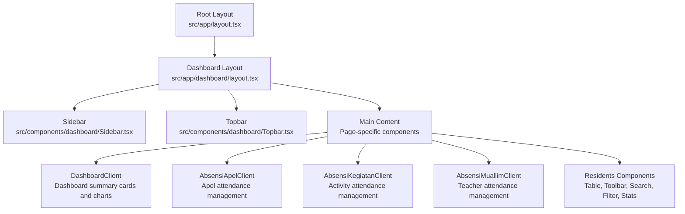
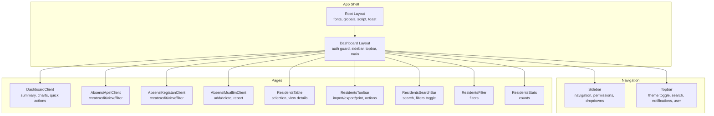
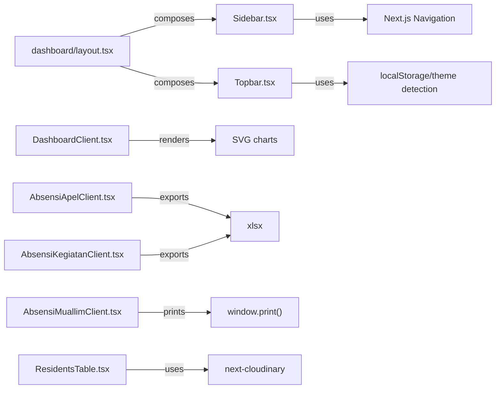

# UI Components & Dashboard

<cite>
**Referenced Files in This Document**
- [layout.tsx](file://src/app/layout.tsx)
- [globals.css](file://src/app/globals.css)
- [dashboard/layout.tsx](file://src/app/dashboard/layout.tsx)
- [Sidebar.tsx](file://src/components/dashboard/Sidebar.tsx)
- [Topbar.tsx](file://src/components/dashboard/Topbar.tsx)
- [DashboardClient.tsx](file://src/components/dashboard/DashboardClient.tsx)
- [AbsensiApelClient.tsx](file://src/components/dashboard/AbsensiApelClient.tsx)
- [AbsensiKegiatanClient.tsx](file://src/components/dashboard/AbsensiKegiatanClient.tsx)
- [AbsensiMuallimClient.tsx](file://src/components/dashboard/AbsensiMuallimClient.tsx)
- [ResidentsTable.tsx](file://src/components/dashboard/residents/ResidentsTable.tsx)
- [ResidentsToolbar.tsx](file://src/components/dashboard/residents/ResidentsToolbar.tsx)
- [ResidentsSearchBar.tsx](file://src/components/dashboard/residents/ResidentsSearchBar.tsx)
- [ResidentsFilter.tsx](file://src/components/dashboard/residents/ResidentsFilter.tsx)
- [ResidentsStats.tsx](file://src/components/dashboard/residents/ResidentsStats.tsx)
</cite>

## Table of Contents
1. [Introduction](#introduction)
2. [Project Structure](#project-structure)
3. [Core Components](#core-components)
4. [Architecture Overview](#architecture-overview)
5. [Detailed Component Analysis](#detailed-component-analysis)
6. [Dependency Analysis](#dependency-analysis)
7. [Performance Considerations](#performance-considerations)
8. [Accessibility Compliance](#accessibility-compliance)
9. [Cross-Browser Compatibility](#cross-browser-compatibility)
10. [Troubleshooting Guide](#troubleshooting-guide)
11. [Conclusion](#conclusion)

## Introduction
This document describes the user interface components and dashboard system of the dormitory management application. It covers the component architecture, reusable UI elements, dashboard layouts, sidebar navigation, topbar functionality, and responsive design patterns. It also details form components, data display components, modal systems, and interactive elements, including component props, customization options, integration patterns, accessibility compliance, performance optimization, and cross-browser compatibility.

## Project Structure
The UI is built with Next.js App Router, using a shared dashboard layout that composes a persistent sidebar and topbar with page-specific content. Global styles define theme tokens and variants, while individual components encapsulate presentation and behavior for dashboards, forms, and data grids.

**Diagram sources**
- [layout.tsx:1-42](file://src/app/layout.tsx#L1-L42)
- [dashboard/layout.tsx:1-37](file://src/app/dashboard/layout.tsx#L1-L37)
- [Sidebar.tsx:1-404](file://src/components/dashboard/Sidebar.tsx#L1-L404)
- [Topbar.tsx:1-96](file://src/components/dashboard/Topbar.tsx#L1-L96)
- [DashboardClient.tsx:1-402](file://src/components/dashboard/DashboardClient.tsx#L1-L402)
- [AbsensiApelClient.tsx:1-657](file://src/components/dashboard/AbsensiApelClient.tsx#L1-L657)
- [AbsensiKegiatanClient.tsx:1-756](file://src/components/dashboard/AbsensiKegiatanClient.tsx#L1-L756)
- [AbsensiMuallimClient.tsx:1-439](file://src/components/dashboard/AbsensiMuallimClient.tsx#L1-L439)
- [ResidentsTable.tsx:1-112](file://src/components/dashboard/residents/ResidentsTable.tsx#L1-L112)
- [ResidentsToolbar.tsx:1-102](file://src/components/dashboard/residents/ResidentsToolbar.tsx#L1-L102)
- [ResidentsSearchBar.tsx:1-60](file://src/components/dashboard/residents/ResidentsSearchBar.tsx#L1-L60)
- [ResidentsFilter.tsx:1-72](file://src/components/dashboard/residents/ResidentsFilter.tsx#L1-L72)
- [ResidentsStats.tsx:1-57](file://src/components/dashboard/residents/ResidentsStats.tsx#L1-L57)

**Section sources**
- [layout.tsx:1-42](file://src/app/layout.tsx#L1-L42)
- [globals.css:1-41](file://src/app/globals.css#L1-L41)
- [dashboard/layout.tsx:1-37](file://src/app/dashboard/layout.tsx#L1-L37)

## Core Components
- Dashboard layout: Provides a two-pane layout with a fixed sidebar and a scrollable main content area, integrating the topbar and page content.
- Sidebar: Renders hierarchical navigation with collapsible dropdowns, permission-aware visibility, and active-state highlighting.
- Topbar: Implements responsive header with theme toggle, search input, notifications, and user profile.
- DashboardClient: Presents summary statistics, real-time clock, occupancy visuals, and quick action shortcuts.
- Attendance clients: Manage creation, editing, filtering, and bulk operations for apel, activity, and teacher attendance.
- Residents components: Provide search, filtering, selection, toolbar actions, and tabular display for resident records.

**Section sources**
- [dashboard/layout.tsx:1-37](file://src/app/dashboard/layout.tsx#L1-L37)
- [Sidebar.tsx:1-404](file://src/components/dashboard/Sidebar.tsx#L1-L404)
- [Topbar.tsx:1-96](file://src/components/dashboard/Topbar.tsx#L1-L96)
- [DashboardClient.tsx:1-402](file://src/components/dashboard/DashboardClient.tsx#L1-L402)
- [AbsensiApelClient.tsx:1-657](file://src/components/dashboard/AbsensiApelClient.tsx#L1-L657)
- [AbsensiKegiatanClient.tsx:1-756](file://src/components/dashboard/AbsensiKegiatanClient.tsx#L1-L756)
- [AbsensiMuallimClient.tsx:1-439](file://src/components/dashboard/AbsensiMuallimClient.tsx#L1-L439)
- [ResidentsTable.tsx:1-112](file://src/components/dashboard/residents/ResidentsTable.tsx#L1-L112)
- [ResidentsToolbar.tsx:1-102](file://src/components/dashboard/residents/ResidentsToolbar.tsx#L1-L102)
- [ResidentsSearchBar.tsx:1-60](file://src/components/dashboard/residents/ResidentsSearchBar.tsx#L1-L60)
- [ResidentsFilter.tsx:1-72](file://src/components/dashboard/residents/ResidentsFilter.tsx#L1-L72)
- [ResidentsStats.tsx:1-57](file://src/components/dashboard/residents/ResidentsStats.tsx#L1-L57)

## Architecture Overview
The dashboard architecture follows a composition pattern:
- Root layout initializes fonts, global CSS, theme script, and toast provider.
- Dashboard layout enforces authentication, renders sidebar and topbar, and hosts page content.
- Page components import and render domain-specific clients and UI modules.

**Diagram sources**
- [layout.tsx:1-42](file://src/app/layout.tsx#L1-L42)
- [dashboard/layout.tsx:1-37](file://src/app/dashboard/layout.tsx#L1-L37)
- [Sidebar.tsx:1-404](file://src/components/dashboard/Sidebar.tsx#L1-L404)
- [Topbar.tsx:1-96](file://src/components/dashboard/Topbar.tsx#L1-L96)
- [DashboardClient.tsx:1-402](file://src/components/dashboard/DashboardClient.tsx#L1-L402)
- [AbsensiApelClient.tsx:1-657](file://src/components/dashboard/AbsensiApelClient.tsx#L1-L657)
- [AbsensiKegiatanClient.tsx:1-756](file://src/components/dashboard/AbsensiKegiatanClient.tsx#L1-L756)
- [AbsensiMuallimClient.tsx:1-439](file://src/components/dashboard/AbsensiMuallimClient.tsx#L1-L439)
- [ResidentsTable.tsx:1-112](file://src/components/dashboard/residents/ResidentsTable.tsx#L1-L112)
- [ResidentsToolbar.tsx:1-102](file://src/components/dashboard/residents/ResidentsToolbar.tsx#L1-L102)
- [ResidentsSearchBar.tsx:1-60](file://src/components/dashboard/residents/ResidentsSearchBar.tsx#L1-L60)
- [ResidentsFilter.tsx:1-72](file://src/components/dashboard/residents/ResidentsFilter.tsx#L1-L72)
- [ResidentsStats.tsx:1-57](file://src/components/dashboard/residents/ResidentsStats.tsx#L1-L57)

## Detailed Component Analysis

### Sidebar Navigation
The sidebar renders permission-aware navigation with collapsible groups and active-state indicators. It supports:
- Conditional rendering based on user permissions.
- Collapsible dropdowns for nested menus (e.g., Data Master, Unit Penugasan, Absensi, Referensi).
- Active link highlighting matching the current route.
- Sign out integration via NextAuth.

Key behaviors:
- Uses pathname to compute active states.
- Maintains local state for expanded dropdowns.
- Applies Tailwind utility classes for consistent spacing, borders, and transitions.

Customization options:
- Add/remove menu items by extending the permission checks and link arrays.
- Adjust icons and labels per feature.
- Control grouping and ordering by modifying the render order.

**Section sources**
- [Sidebar.tsx:1-404](file://src/components/dashboard/Sidebar.tsx#L1-L404)
- [dashboard/layout.tsx:1-37](file://src/app/dashboard/layout.tsx#L1-L37)

### Topbar Functionality
The topbar provides:
- Responsive mobile menu trigger.
- Search input with icon.
- Theme toggle synchronized with localStorage and prefers-color-scheme.
- Notification badge.
- User profile area with role and avatar.

Implementation highlights:
- Hydration-safe theme toggle using a sync store hook.
- Local storage persistence for theme preference.
- Glass effect and backdrop blur for modern overlay styling.

Customization options:
- Extend user menu with additional actions.
- Add notification panel or quick actions.
- Integrate real-time notification updates.

**Section sources**
- [Topbar.tsx:1-96](file://src/components/dashboard/Topbar.tsx#L1-L96)
- [globals.css:1-41](file://src/app/globals.css#L1-L41)

### DashboardClient
DashboardClient presents:
- Real-time clock and Hijri date banner.
- Summary cards for key metrics.
- SVG-based donut chart for room occupancy.
- Bar chart for per-floor occupancy.
- Recent activity feed with time-ago formatting.
- Quick action shortcuts.

Interactive elements:
- Live updating clock and dates.
- Hover tooltips on bar chart bars.
- Link navigation to resident directory.

Customization options:
- Modify metric shapes and thresholds.
- Replace or extend chart visuals.
- Add new quick actions or integrate external widgets.

**Section sources**
- [DashboardClient.tsx:1-402](file://src/components/dashboard/DashboardClient.tsx#L1-L402)

### AbsensiApelClient
AbsensiApelClient manages:
- Creation of apel sessions with automatic registration of active residents.
- Editing of apel date and notes.
- Filtering by date range.
- Detail modal with checklist-style status toggling.
- Export to Excel and print to PDF.

Modal system:
- Create modal with validation and optimistic updates.
- Edit modal with controlled inputs.
- Detail modal with search and batch status cycling.

Customization options:
- Add new status values or modify status cycle.
- Extend export formats or add new report templates.
- Integrate comments or attachments per attendance item.

**Section sources**
- [AbsensiApelClient.tsx:1-657](file://src/components/dashboard/AbsensiApelClient.tsx#L1-L657)

### AbsensiKegiatanClient
AbsensiKegiatanClient manages:
- Creation of activity sessions with predefined KBM options.
- Editing of activity details.
- Multi-criteria filtering (name dropdown, free text, date range).
- Detail modal with searchable checklist and multi-state status cycling.
- Export to Excel and print to PDF.

Modal system:
- Create modal with select-based KBM assignment.
- Edit modal mirroring create form.
- Detail modal with advanced search and status badges.

Customization options:
- Add new activity types or statuses.
- Extend filters or add new metadata.
- Customize report generation and export formats.

**Section sources**
- [AbsensiKegiatanClient.tsx:1-756](file://src/components/dashboard/AbsensiKegiatanClient.tsx#L1-L756)

### AbsensiMuallimClient
AbsensiMuallimClient manages:
- Adding single attendance entries for teachers.
- Deleting entries.
- CSV export and PDF printing.
- Search across teacher name, subject, and day.

Form interactions:
- Auto-populates day-of-week from selected date.
- Select-based teacher and subject assignment.
- Status selection with optional notes.

Customization options:
- Add new status categories or reasons.
- Extend export formats or add filters.
- Integrate teacher subject mapping or scheduling.

**Section sources**
- [AbsensiMuallimClient.tsx:1-439](file://src/components/dashboard/AbsensiMuallimClient.tsx#L1-L439)

### Residents Components
Residents components provide a cohesive data management experience:
- Search bar with live count and reset filters.
- Filter panel with region, program, cohort, and room selectors.
- Toolbar with import/export/print actions, selection mode toggle, and bulk actions.
- Table with selectable rows, photo placeholders, and room badges.
- Stats cards for totals and statuses.

Interaction patterns:
- Selection mode enables move and delete actions.
- Clicking a row opens a detail view modal.
- Bulk operations apply to selected IDs.

Customization options:
- Add new filter dimensions or computed columns.
- Extend toolbar actions or integrate with external systems.
- Enhance detail modal with additional tabs or forms.

**Section sources**
- [ResidentsTable.tsx:1-112](file://src/components/dashboard/residents/ResidentsTable.tsx#L1-L112)
- [ResidentsToolbar.tsx:1-102](file://src/components/dashboard/residents/ResidentsToolbar.tsx#L1-L102)
- [ResidentsSearchBar.tsx:1-60](file://src/components/dashboard/residents/ResidentsSearchBar.tsx#L1-L60)
- [ResidentsFilter.tsx:1-72](file://src/components/dashboard/residents/ResidentsFilter.tsx#L1-L72)
- [ResidentsStats.tsx:1-57](file://src/components/dashboard/residents/ResidentsStats.tsx#L1-L57)

## Dependency Analysis
The UI layer depends on:
- Next.js runtime for routing, navigation, and SSR/SSG.
- Tailwind CSS for styling and responsive utilities.
- Lucide icons for consistent iconography.
- Next Cloudinary image component for avatar rendering.
- react-hot-toast for toast notifications.
- xlsx for Excel exports in attendance clients.

**Diagram sources**
- [Sidebar.tsx:1-404](file://src/components/dashboard/Sidebar.tsx#L1-L404)
- [Topbar.tsx:1-96](file://src/components/dashboard/Topbar.tsx#L1-L96)
- [DashboardClient.tsx:1-402](file://src/components/dashboard/DashboardClient.tsx#L1-L402)
- [AbsensiApelClient.tsx:1-657](file://src/components/dashboard/AbsensiApelClient.tsx#L1-L657)
- [AbsensiKegiatanClient.tsx:1-756](file://src/components/dashboard/AbsensiKegiatanClient.tsx#L1-L756)
- [AbsensiMuallimClient.tsx:1-439](file://src/components/dashboard/AbsensiMuallimClient.tsx#L1-L439)
- [ResidentsTable.tsx:1-112](file://src/components/dashboard/residents/ResidentsTable.tsx#L1-L112)
- [dashboard/layout.tsx:1-37](file://src/app/dashboard/layout.tsx#L1-L37)

**Section sources**
- [AbsensiApelClient.tsx:1-657](file://src/components/dashboard/AbsensiApelClient.tsx#L1-L657)
- [AbsensiKegiatanClient.tsx:1-756](file://src/components/dashboard/AbsensiKegiatanClient.tsx#L1-L756)
- [AbsensiMuallimClient.tsx:1-439](file://src/components/dashboard/AbsensiMuallimClient.tsx#L1-L439)
- [ResidentsTable.tsx:1-112](file://src/components/dashboard/residents/ResidentsTable.tsx#L1-L112)

## Performance Considerations
- Prefer client-side interactivity only where necessary; keep heavy computations on the server or memoize aggressively.
- Use virtualized lists or pagination for large datasets (e.g., residents table).
- Debounce search inputs to reduce re-renders.
- Lazy-load images (already using a cloudinary component) and defer non-critical assets.
- Minimize reflows by avoiding frequent DOM mutations; leverage CSS transforms for animations.
- Use CSS containment and isolation for complex modals and charts.
- Optimize SVG rendering by reducing paths and reusing gradients.

## Accessibility Compliance
- Ensure sufficient color contrast for text and interactive elements against backgrounds.
- Provide keyboard navigation support for all interactive controls (dropdowns, modals, tables).
- Use semantic HTML (tables, buttons, labels) and ARIA attributes where appropriate.
- Offer focus management for modals (trap focus, close on Escape).
- Include alt text for decorative icons and meaningful descriptions for data icons.
- Respect reduced motion preferences by allowing users to disable animations.

## Cross-Browser Compatibility
- Use Tailwind’s default utilities and CSS custom properties to maintain consistent rendering across browsers.
- Test print dialogs and PDF generation across major browsers; adjust print media queries if needed.
- Validate icon rendering and SVG behavior in older browsers.
- Verify localStorage availability and fallbacks for theme persistence.

## Troubleshooting Guide
Common issues and resolutions:
- Hydration mismatch with theme toggle: resolved by deferring client-only rendering until mounted.
- Permission-based visibility: verify permission arrays and action keys align with backend.
- Modal overlays not closing: ensure event propagation is stopped and state resets on close.
- Print/PDF generation failures: confirm window open permissions and HTML content validity.
- Large dataset rendering lag: implement virtualization or pagination; debounce search handlers.

**Section sources**
- [Topbar.tsx:16-40](file://src/components/dashboard/Topbar.tsx#L16-L40)
- [AbsensiApelClient.tsx:272-287](file://src/components/dashboard/AbsensiApelClient.tsx#L272-L287)
- [AbsensiKegiatanClient.tsx:301-317](file://src/components/dashboard/AbsensiKegiatanClient.tsx#L301-L317)
- [AbsensiMuallimClient.tsx:131-205](file://src/components/dashboard/AbsensiMuallimClient.tsx#L131-L205)

## Conclusion
The UI system combines a robust layout with modular, permission-aware components. The sidebar and topbar establish consistent navigation and branding, while specialized clients deliver rich, interactive experiences for attendance and resident management. With thoughtful customization hooks, performance optimizations, and adherence to accessibility and compatibility guidelines, the system scales effectively across features and user roles.